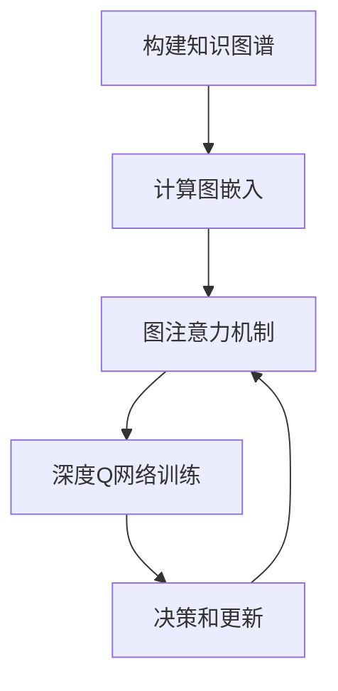
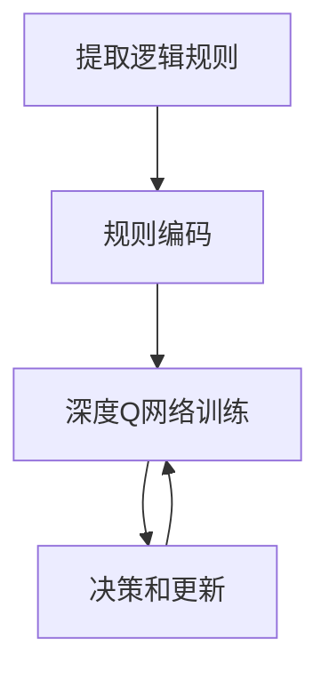

# 一切皆是映射：深度Q网络（DQN）与知识图谱的融合研究

## 1.背景介绍

### 1.1 深度强化学习与知识图谱概述

在人工智能领域中,深度强化学习和知识图谱是两个备受关注的热门话题。深度强化学习旨在让智能体通过与环境的交互来学习采取最优策略,以获得最大的累积奖励。而知识图谱则是一种结构化的知识表示形式,能够有效地组织和存储大规模的实体及其之间的关系。

#### 1.1.1 深度强化学习简介

深度强化学习将深度学习与强化学习相结合,使用神经网络来近似智能体的价值函数或策略函数。其中,深度Q网络(Deep Q-Network, DQN)是一种里程碑式的深度强化学习算法,可以直接从原始像素输入中学习控制策略,在许多任务中取得了出色的表现。

#### 1.1.2 知识图谱简介  

知识图谱通过图数据结构来表示实体之间的关系,可以有效地捕捉和推理复杂的语义信息。知识图谱广泛应用于自然语言处理、推理系统和问答系统等领域。著名的知识图谱包括谷歌的Knowledge Graph、微软的Satori以及开源的DBpedia等。

### 1.2 融合的必要性与挑战

虽然深度强化学习和知识图谱各自取得了长足的进展,但将两者相结合仍然是一个具有挑战性的研究课题。融合这两种技术可以带来以下潜在的好处:

1. **提高决策质量**:知识图谱中丰富的结构化知识可以为深度强化学习提供有价值的先验知识,从而提高智能体的决策质量和学习效率。

2. **增强泛化能力**:通过利用知识图谱中的关系和规则,智能体可以更好地理解环境中的规律,从而提高其在新环境中的泛化能力。

3. **解释性和可解释性**:知识图谱的结构化形式有助于解释深度强化学习模型的决策过程,提高模型的可解释性。

然而,将深度强化学习与知识图谱相融合也面临着一些挑战:

1. **知识表示**:如何将结构化的知识图谱信息高效地编码到深度神经网络中,是一个值得探索的问题。

2. **知识选择**:在庞大的知识图谱中,如何选择与当前任务相关的知识子集,避免引入无关甚至噪声信息,也是一个需要解决的挑战。

3. **知识更新**:在强化学习过程中,如何根据新获得的经验来动态更新和完善知识图谱,是一个有趣的研究方向。

4. **模型复杂度**:融合两种技术会增加模型的复杂性,需要权衡模型的表现力和计算效率。

综上所述,深度Q网络与知识图谱的融合研究不仅具有重要的理论意义,也有广阔的应用前景。本文将深入探讨这一领域的最新进展、核心概念、算法原理和实践经验,为读者提供一个全面的认识。

## 2.核心概念与联系

在深入探讨深度Q网络与知识图谱融合的细节之前,我们先介绍一些核心概念,为后续内容做好铺垫。

### 2.1 深度Q网络(DQN)

深度Q网络是一种结合深度学习和Q学习的强化学习算法,它使用深度神经网络来近似Q函数,从而学习在各种状态下采取最优行动。DQN的核心思想是使用经验回放(Experience Replay)和目标网络(Target Network)来提高训练的稳定性和效率。

#### 2.1.1 Q学习

Q学习是一种基于时间差分的强化学习算法,它试图直接学习一个行动价值函数Q(s,a),该函数表示在状态s下采取行动a之后可获得的期望累积奖励。通过迭代更新Q值,智能体可以逐步找到最优策略。Q学习的更新规则如下:

$$Q(s_t, a_t) \leftarrow Q(s_t, a_t) + \alpha \big[r_t + \gamma \max_{a}Q(s_{t+1}, a) - Q(s_t, a_t)\big]$$

其中,$\alpha$是学习率,$\gamma$是折扣因子,用于平衡当前奖励和未来奖励的权重。

#### 2.1.2 深度神经网络近似Q函数

在传统的Q学习中,Q值通常存储在表格中,但这种方式在状态和行动空间很大时会变得低效。DQN使用深度神经网络来近似Q函数,可以处理高维的连续状态空间,并通过网络权重的更新来逐步改善Q值的估计。

#### 2.1.3 经验回放(Experience Replay)

在训练过程中,DQN将智能体与环境的交互过程存储在经验回放池中。每次训练时,从经验回放池中随机采样一批数据进行训练,而不是直接使用最新的交互数据。这种方式可以打破数据之间的相关性,提高训练的稳定性和数据利用效率。

#### 2.1.4 目标网络(Target Network)

为了进一步提高训练的稳定性,DQN引入了目标网络的概念。目标网络是Q网络的一个副本,用于计算Q值的目标值。目标网络的权重会定期从Q网络复制过来,但在两次复制之间保持不变。这种方式可以减少Q值目标的变化,使训练更加平滑。

### 2.2 知识图谱

知识图谱是一种结构化的知识表示形式,它将实体及其关系组织成一个多关系图。在知识图谱中,节点表示实体,边表示实体之间的关系。知识图谱不仅可以存储大量的事实知识,还能够通过推理发现隐含的知识。

#### 2.2.1 实体(Entity)和关系(Relation)

实体是知识图谱中的基本单元,可以是具体的物体、人物、地点或抽象的概念。每个实体都有一个唯一的标识符。关系则描述实体之间的语义联系,通常用谓词来表示。例如,"张三"和"北京"之间可能存在"出生地"这种关系。

#### 2.2.2 三元组(Triple)

知识图谱中的知识以三元组(头实体、关系、尾实体)的形式存储,例如(张三,出生地,北京)。三元组是知识图谱的基本构建单元,可以有效地表示结构化的事实知识。

#### 2.2.3 图结构和推理

知识图谱的图结构使其能够捕捉实体之间复杂的关系网络。通过图遍历和图算法,可以在知识图谱中进行各种推理,如链接预测、实体分类和关系推理等。这种推理能力使知识图谱成为一种强大的知识表示和推理工具。

### 2.3 深度Q网络与知识图谱的联系

深度Q网络和知识图谱看似是两个不同的领域,但它们之间存在一些内在的联系:

1. **结构化知识表示**:知识图谱提供了一种结构化的知识表示形式,而深度Q网络则需要将环境状态编码为结构化的输入,以便神经网络进行处理。因此,将知识图谱的结构化知识融入深度Q网络,可以为智能体提供有价值的先验知识。

2. **关系推理**:深度Q网络需要从环境中推断出隐含的规律和关系,以便做出正确的决策。而知识图谱擅长捕捉和推理实体之间的关系,可以为深度Q网络提供有力的支持。

3. **可解释性**:深度Q网络的决策过程通常是一个黑箱,缺乏可解释性。而知识图谱的结构化形式可以帮助解释智能体的决策依据,提高模型的可解释性。

4. **泛化能力**:深度Q网络在新环境中的泛化能力往往受到限制。而知识图谱中的通用知识可以帮助智能体更好地理解新环境,提高其泛化能力。

综上所述,深度Q网络与知识图谱的融合不仅可以相互弥补彼此的不足,还能产生协同效应,推动强化学习和知识表示领域的发展。

## 3.核心算法原理具体操作步骤

在了解了深度Q网络和知识图谱的核心概念之后,我们将探讨如何将两者有机地结合起来。本节将介绍几种主要的融合方法及其具体操作步骤。

### 3.1 基于图注意力的DQN

#### 3.1.1 算法思路

基于图注意力的DQN旨在利用知识图谱中的结构化知识来增强深度Q网络的表现。该方法的核心思想是将知识图谱编码为一个图嵌入,然后通过图注意力机制将相关知识选择性地融入深度Q网络。

具体来说,算法分为以下几个步骤:

1. 构建知识图谱:根据任务需求,从知识库中提取相关的实体和关系,构建一个任务相关的知识图谱子图。

2. 计算图嵌入:使用图神经网络(GNN)对知识图谱进行编码,得到每个实体的节点嵌入向量。

3. 图注意力机制:在深度Q网络的输入层,将环境状态和图嵌入进行融合。通过注意力机制,智能体可以选择性地关注与当前状态相关的知识。

4. 深度Q网络训练:使用融合了知识图谱信息的状态作为输入,训练深度Q网络,学习最优的行动策略。

5. 决策和更新:智能体根据训练好的Q网络做出行动决策,并根据获得的奖励更新Q值和图嵌入。

#### 3.1.2 算法流程图

该算法的优点是可以灵活地融入不同领域的知识图谱,并通过注意力机制动态地选择相关知识。但是,它也面临着知识图谱构建和图嵌入计算的挑战,尤其是在大规模知识图谱的情况下。

### 3.2 基于逻辑规则的DQN

#### 3.2.1 算法思路

基于逻辑规则的DQN旨在将知识图谱中的规则知识融入深度Q网络,以指导智能体的决策过程。该方法的核心思想是从知识图谱中提取一系列逻辑规则,并将这些规则作为辅助奖励引入到深度Q网络的训练过程中。

具体来说,算法分为以下几个步骤:

1. 提取逻辑规则:从知识图谱中提取一系列与任务相关的逻辑规则,例如"如果A和B相连,那么不能同时选择A和B"。

2. 规则编码:将提取的逻辑规则编码为一个规则奖励函数,用于计算智能体行动与规则的一致性程度。

3. 深度Q网络训练:在传统的深度Q网络训练过程中,引入规则奖励作为辅助奖励,对总的奖励进行修正。

4. 决策和更新:智能体根据训练好的Q网络做出行动决策,并根据获得的奖励(包括环境奖励和规则奖励)更新Q值。

#### 3.2.2 算法流程图

该算法的优点是可以显式地将知识图谱中的规则知识融入深度Q网络,为智能体提供额外的指导。但是,它也面临着规则提取和编码的挑战,尤其是在复杂的知识图谱中。另外,规则奖励的设计也需要谨慎,以避免过度约束智能体的探索行为。

### 3.3 基于记忆的DQN

#### 3.3.1 算法思路

基于记忆的DQN旨在利用知识图谱构建一个外部记忆模块,为深度Q网络提供长期的记忆和知识存储。该方法的核心思想是将知