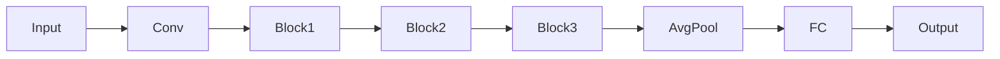
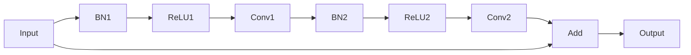

# 从零开始大模型开发与微调：ResNet实战：CIFAR-10数据集分类

## 1.背景介绍

### 1.1 计算机视觉与图像分类任务

计算机视觉是人工智能领域的一个重要分支,旨在使计算机能够从数字图像或视频中获取有意义的信息。图像分类是计算机视觉中最基本和广泛应用的任务之一,它的目标是根据图像的内容对其进行正确分类。

随着深度学习技术的快速发展,基于卷积神经网络(Convolutional Neural Networks, CNN)的图像分类模型取得了令人瞩目的成绩,在多个公开数据集上超过了人类水平。这些突破不仅推动了计算机视觉技术的进步,也为其他领域的智能应用铺平了道路。

### 1.2 CIFAR-10数据集

CIFAR-10是一个广为人知的小型图像分类数据集,由60,000张32x32像素的彩色图像组成,涵盖10个类别:飞机、汽车、鸟类、猫、鹿、狗、青蛙、马、船和卡车。该数据集由加拿大人Alex Krizhevsky构建,旨在作为机器学习课程和计算机视觉研究的入门级数据集。

尽管CIFAR-10数据集的图像分辨率较低,但由于其多样性和复杂性,它已成为评估图像分类算法性能的热门基准。许多知名的深度学习模型,如AlexNet、VGGNet、GoogLeNet和ResNet等,都在CIFAR-10上进行了测试和对比。

### 1.3 ResNet及其重要性

ResNet(Residual Network)是2015年由微软研究院的何恺明等人提出的一种革命性的深度卷积神经网络架构。它通过引入残差连接(Residual Connection)的设计,成功解决了很深网络的梯度消失问题,使得训练更加高效,网络可以变得更深。

ResNet在2015年的ImageNet大赛上一举夺冠,将前一年的错误率从6.7%降低到3.6%,创造了新的里程碑。自此,残差网络成为了卷积神经网络发展的重要里程碑,也推动了深度学习在计算机视觉等领域的飞速发展。

本文将详细介绍如何从零开始,使用PyTorch框架构建和训练ResNet模型,并将其应用于CIFAR-10数据集的图像分类任务。我们将一步步解析ResNet的核心原理、关键组件和训练技巧,帮助读者掌握开发大型深度学习模型的实践技能。

## 2.核心概念与联系

在深入研究ResNet之前,我们需要先了解一些基本概念,为后续内容做好铺垫。

### 2.1 卷积神经网络简介

卷积神经网络(Convolutional Neural Network, CNN)是一种前馈神经网络,它的人工神经元可以响应一部分覆盖范围内的周围神经元,对于大型图像处理有出色表现。CNN由多个卷积层和池化层组成,最后接上全连接层进行分类或回归。

CNN的关键优势在于它能够有效地捕获图像的空间和时间相关性,从而学习出图像的层次模式和局部特征。这使得CNN在图像分类、目标检测、语义分割等计算机视觉任务上表现出色。

### 2.2 深度学习中的梯度消失问题

在训练深度神经网络时,往往会遇到梯度消失或梯度爆炸的问题。梯度消失是指,在反向传播过程中,梯度会由于链式法则的影响而呈指数级衰减,导致靠近输入层的权重更新非常缓慢,模型难以收敛。

梯度消失的根本原因是深层网络中存在过多的乘法运算,使得梯度在反向传播时被不断缩小。这会阻碍模型对底层特征的学习,从而限制了模型的表达能力。

### 2.3 ResNet的残差连接

为了解决深度网络中的梯度消失问题,ResNet引入了残差连接(Residual Connection)的设计。残差连接是一种显式的跳跃连接,它将前一层的输出直接传递给后面的层,并与该层的输出相加。这种设计可以有效地缓解梯度消失,因为梯度可以直接通过残差连接传播,而不必经过多层非线性变换。

残差连接的数学表达式如下:

$$y = F(x, \{W_i\}) + x$$

其中,x是输入,F(x,{Wi})是卷积、批量归一化和激活函数等一系列变换,Wi是这些变换的可学习参数。y是最终的输出,它是输入x和变换F(x,{Wi})的残差之和。

通过这种设计,即使F(x,{Wi})=0,也可以保证x的信息能够被直接传递到后面的层,从而有效缓解梯度消失问题。

### 2.4 ResNet架构概览

ResNet将整个网络分为多个残差块(Residual Block),每个残差块包含几个批量归一化、激活和卷积层。每个残差块的输出都会与输入相加,形成残差连接。通过这种设计,梯度可以更容易地反向传播,使得训练更加高效。

ResNet的整体架构如下所示:



其中,Conv表示初始卷积层,Block1/2/3表示多个残差块,AvgPool为平均池化层,FC为全连接层。

残差块的内部结构如下:



残差块中包含两个卷积层,每个卷积层之前都有批量归一化(BN)和ReLU激活层。最后将输入x与Conv2的输出相加,形成残差连接。

通过这种模块化的设计,ResNet可以轻松构建非常深的网络,并且避免了梯度消失的问题,从而获得更强的表达能力。

## 3.核心算法原理具体操作步骤 

在上一节中,我们介绍了ResNet的核心概念和基本架构。现在,我们将详细阐述ResNet的实现细节和训练过程。

### 3.1 ResNet模块实现

我们首先定义基本的残差块(BasicBlock)和瓶颈残差块(BottleneckBlock)。BasicBlock由两个3x3的卷积层组成,而BottleneckBlock则包含一个1x1卷积层、一个3x3卷积层和一个1x1卷积层,用于减少计算复杂度。

```python
import torch.nn as nn

class BasicBlock(nn.Module):
    def __init__(self, in_channels, out_channels, stride=1):
        super(BasicBlock, self).__init__()
        self.conv1 = nn.Conv2d(in_channels, out_channels, kernel_size=3, stride=stride, padding=1, bias=False)
        self.bn1 = nn.BatchNorm2d(out_channels)
        self.conv2 = nn.Conv2d(out_channels, out_channels, kernel_size=3, stride=1, padding=1, bias=False)
        self.bn2 = nn.BatchNorm2d(out_channels)
        self.shortcut = nn.Sequential()
        if stride != 1 or in_channels != out_channels:
            self.shortcut = nn.Sequential(
                nn.Conv2d(in_channels, out_channels, kernel_size=1, stride=stride, bias=False),
                nn.BatchNorm2d(out_channels)
            )

    def forward(self, x):
        out = nn.ReLU(inplace=True)(self.bn1(self.conv1(x)))
        out = self.bn2(self.conv2(out))
        out += self.shortcut(x)
        out = nn.ReLU(inplace=True)(out)
        return out

class BottleneckBlock(nn.Module):
    def __init__(self, in_channels, out_channels, stride=1):
        super(BottleneckBlock, self).__init__()
        self.conv1 = nn.Conv2d(in_channels, out_channels//4, kernel_size=1, bias=False)
        self.bn1 = nn.BatchNorm2d(out_channels//4)
        self.conv2 = nn.Conv2d(out_channels//4, out_channels//4, kernel_size=3, stride=stride, padding=1, bias=False)
        self.bn2 = nn.BatchNorm2d(out_channels//4)
        self.conv3 = nn.Conv2d(out_channels//4, out_channels, kernel_size=1, bias=False)
        self.bn3 = nn.BatchNorm2d(out_channels)
        self.shortcut = nn.Sequential()
        if stride != 1 or in_channels != out_channels:
            self.shortcut = nn.Sequential(
                nn.Conv2d(in_channels, out_channels, kernel_size=1, stride=stride, bias=False),
                nn.BatchNorm2d(out_channels)
            )

    def forward(self, x):
        out = nn.ReLU(inplace=True)(self.bn1(self.conv1(x)))
        out = nn.ReLU(inplace=True)(self.bn2(self.conv2(out)))
        out = self.bn3(self.conv3(out))
        out += self.shortcut(x)
        out = nn.ReLU(inplace=True)(out)
        return out
```

接下来,我们定义ResNet模型的主体部分。我们可以通过指定块类型(BasicBlock或BottleneckBlock)、层数和初始通道数来构建不同深度和复杂度的ResNet模型。

```python
class ResNet(nn.Module):
    def __init__(self, block, layers, num_classes=10):
        super(ResNet, self).__init__()
        self.in_channels = 64
        self.conv1 = nn.Conv2d(3, 64, kernel_size=3, stride=1, padding=1, bias=False)
        self.bn1 = nn.BatchNorm2d(64)
        self.layer1 = self._make_layer(block, 64, layers[0])
        self.layer2 = self._make_layer(block, 128, layers[1], stride=2)
        self.layer3 = self._make_layer(block, 256, layers[2], stride=2)
        self.layer4 = self._make_layer(block, 512, layers[3], stride=2)
        self.avg_pool = nn.AdaptiveAvgPool2d((1, 1))
        self.fc = nn.Linear(512 * block.expansion, num_classes)

    def _make_layer(self, block, out_channels, blocks, stride=1):
        layers = []
        layers.append(block(self.in_channels, out_channels, stride))
        self.in_channels = out_channels * block.expansion
        for i in range(1, blocks):
            layers.append(block(self.in_channels, out_channels))
        return nn.Sequential(*layers)

    def forward(self, x):
        out = nn.ReLU(inplace=True)(self.bn1(self.conv1(x)))
        out = self.layer1(out)
        out = self.layer2(out)
        out = self.layer3(out)
        out = self.layer4(out)
        out = self.avg_pool(out)
        out = out.view(out.size(0), -1)
        out = self.fc(out)
        return out
```

在`_make_layer`函数中,我们构建了一个由多个残差块组成的层。第一个残差块的步长可以设置为2,以实现特征图的下采样。后续的残差块则保持通道数不变。

最后,我们定义一个函数来创建ResNet模型实例:

```python
def resnet(depth, num_classes=10):
    if depth == 18:
        return ResNet(BasicBlock, [2, 2, 2, 2], num_classes=num_classes)
    elif depth == 34:
        return ResNet(BasicBlock, [3, 4, 6, 3], num_classes=num_classes)
    elif depth == 50:
        return ResNet(BottleneckBlock, [3, 4, 6, 3], num_classes=num_classes)
    elif depth == 101:
        return ResNet(BottleneckBlock, [3, 4, 23, 3], num_classes=num_classes)
    elif depth == 152:
        return ResNet(BottleneckBlock, [3, 8, 36, 3], num_classes=num_classes)
    else:
        raise ValueError('Invalid depth: {}'.format(depth))
```

通过指定深度和类别数量,我们可以轻松地创建不同配置的ResNet模型。

### 3.2 数据预处理

在训练ResNet之前,我们需要对CIFAR-10数据集进行预处理。PyTorch提供了`torchvision.datasets`模块,可以方便地加载常用的数据集。

```python
import torchvision.transforms as transforms

transform_train = transforms.Compose([
    transforms.RandomCrop(32, padding=4),
    transforms.RandomHorizontalFlip(),
    transforms.ToTensor(),
    transforms.Normalize((0.4914, 0.4822, 0.4465), (0.2023, 0.1994, 0.2010)),
])

transform_test = transforms.Compose([
    transforms.ToTensor(),