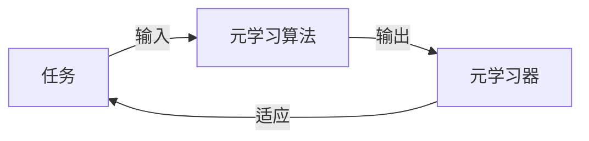
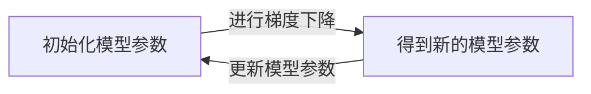

## 1. 背景介绍

元学习，也被称为"学习如何学习"，是近年来人工智能研究的热点之一。它的目标是设计和实现可以快速适应新任务的模型，即使这些新任务的数据非常有限。这个领域的研究有助于我们理解和改进机器学习和人工智能的核心问题——学习。

## 2. 核心概念与联系

元学习的核心概念包括任务、元学习算法和元学习器。任务是一个具有特定目标的问题，例如图像分类或语音识别。元学习算法是一种算法，它可以从一组任务中学习，然后用于新任务的快速适应。元学习器是元学习算法的实现，它可以在新任务上进行快速优化。

这三个概念的关系可以用以下的Mermaid流程图来表示：



## 3. 核心算法原理具体操作步骤

元学习的核心算法包括模型无关的元学习（MAML）和优化器无关的元学习（OML）。在这里，我们以MAML为例，详细介绍其操作步骤。

MAML的操作步骤如下：

1. 初始化一个模型的参数。
2. 对于每一个任务，使用当前的模型参数进行一步或几步梯度下降，得到新的模型参数。
3. 使用所有任务的新模型参数，更新原始的模型参数。

这个过程可以用以下的Mermaid流程图来表示：



## 4. 数学模型和公式详细讲解举例说明

我们以MAML为例，详细讲解其数学模型和公式。MAML的目标是找到一个好的模型参数初始化，使得模型可以用少量的梯度更新步骤和少量的新任务数据进行快速适应。

假设我们有一个模型$f$，其参数为$\theta$。对于一个任务$i$，我们有其数据集$D_i$，并从中采样一些数据作为支持集$S_i$，剩余的数据作为查询集$Q_i$。我们用一步梯度更新，得到新的参数$\theta_i'$：

$$
\theta_i' = \theta - \alpha \nabla_{\theta} L_{S_i}(f_{\theta})
$$

其中，$L_{S_i}(f_{\theta})$是模型在支持集上的损失，$\alpha$是学习率。然后，我们用新的参数在查询集上计算损失，并对所有任务取平均：

$$
L_{meta} = \frac{1}{N} \sum_{i=1}^{N} L_{Q_i}(f_{\theta_i'})
$$

我们的目标是最小化$L_{meta}$，即我们希望找到一个好的参数初始化，使得模型可以用一步梯度更新和少量的新任务数据进行快速适应。

## 5. 项目实践：代码实例和详细解释说明

在这个部分，我们将展示如何使用Python和PyTorch实现MAML。我们以一个简单的回归问题为例。在这个问题中，每个任务是学习一个具有不同斜率和截距的线性函数。

首先，我们定义一个简单的线性模型：

```python
class LinearModel(nn.Module):
    def __init__(self):
        super(LinearModel, self).__init__()
        self.linear = nn.Linear(1, 1)

    def forward(self, x):
        return self.linear(x)
```

然后，我们定义MAML算法：

```python
class MAML:
    def __init__(self, model, alpha, beta):
        self.model = model
        self.alpha = alpha
        self.beta = beta

    def step(self, tasks):
        task_losses = []
        for task in tasks:
            support_set, query_set = task
            model_prime = copy.deepcopy(self.model)
            optimizer = torch.optim.SGD(model_prime.parameters(), lr=self.alpha)

            # Step 1: Use support set to update model_prime parameters
            support_loss = F.mse_loss(model_prime(support_set[0]), support_set[1])
            optimizer.zero_grad()
            support_loss.backward()
            optimizer.step()

            # Step 2: Use query set to calculate loss
            query_loss = F.mse_loss(model_prime(query_set[0]), query_set[1])
            task_losses.append(query_loss)

        # Step 3: Update original model parameters
        self.model.zero_grad()
        meta_loss = sum(task_losses) / len(task_losses)
        meta_loss.backward()
        for param in self.model.parameters():
            param.data -= self.beta * param.grad.data
```

在这个代码中，我们首先对每个任务进行一步梯度更新，然后用所有任务的损失来更新原始的模型参数。

## 6. 实际应用场景

元学习在许多实际应用中都有广泛的使用，例如：

- **少样本学习**：在许多实际问题中，我们只有少量的标注数据。元学习可以用于这些问题，因为它可以从少量的数据中进行快速学习。
- **领域自适应**：当我们需要将一个模型从一个领域迁移到另一个领域时，元学习可以用于快速适应新的领域。
- **强化学习**：在强化学习中，我们需要让一个智能体在多个任务中进行学习。元学习可以用于让智能体快速适应新的任务。

## 7. 工具和资源推荐

在元学习的研究和实践中，有许多优秀的工具和资源可以使用，例如：

- **PyTorch**：PyTorch是一个强大的深度学习框架，它有清晰的接口和强大的自动微分功能，非常适合用于元学习的研究和实践。
- **learn2learn**：learn2learn是一个专门用于元学习的PyTorch库，它提供了许多元学习算法的实现，以及用于元学习的数据集和工具。

## 8. 总结：未来发展趋势与挑战

元学习是一个非常有前景的研究领域，它的目标是让模型能够快速适应新的任务和环境。然而，元学习也面临着许多挑战，例如如何设计更好的元学习算法，如何理解元学习的理论性质，以及如何将元学习应用到更广泛的问题上。

## 9. 附录：常见问题与解答

- **问题1：元学习和传统的机器学习有什么区别？**
  - 答：传统的机器学习是在一个特定的任务上进行学习，而元学习是在多个任务上进行学习，目标是能够快速适应新的任务。

- **问题2：元学习适用于哪些问题？**
  - 答：元学习适用于许多问题，例如少样本学习、领域自适应和强化学习。

- **问题3：如何在实践中使用元学习？**
  - 答：在实践中，我们可以使用深度学习框架（如PyTorch）和元学习库（如learn2learn）来实现元学习算法。