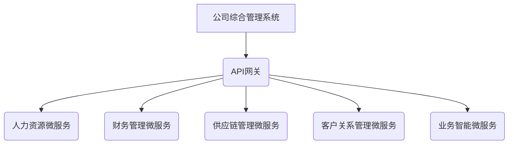
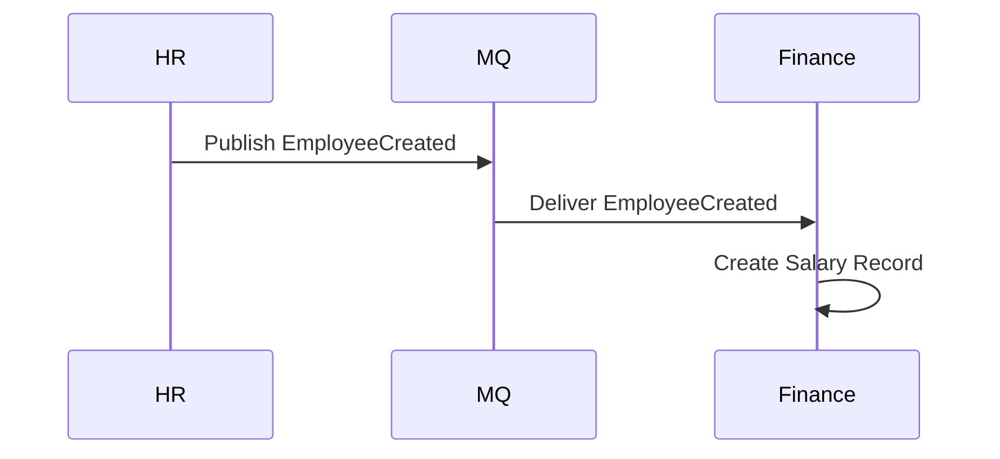

# 公司综合管理系统详细设计与具体代码实现

## 1. 背景介绍

### 1.1 公司管理系统的重要性

在当今快节奏的商业环境中，高效的公司管理系统对于确保企业的顺利运营至关重要。随着公司规模的扩大和业务复杂性的增加,传统的手工管理方式已经无法满足现代企业的需求。因此,开发一个全面、集成的公司综合管理系统(Corporate Management System, CMS)成为了当务之急。

一个优秀的CMS系统可以帮助公司:

- 集中管理公司各个部门和流程的数据
- 提高工作效率,减少重复劳动
- 实现信息共享和协同办公
- 提升决策质量和响应速度
- 降低运营成本,提高竞争力

### 1.2 系统开发挑战

尽管CMS系统的重要性不言而喻,但开发一个功能完备、性能卓越的系统并非易事。主要挑战包括:

- 需求复杂多变,涉及多个部门和流程
- 数据量大,需要高效的数据存储和检索机制
- 系统需要具备良好的扩展性和可维护性
- 确保系统的安全性和数据隐私保护
- 实现系统各模块之间的无缝集成

## 2. 核心概念与联系

### 2.1 系统架构概览

为了应对上述挑战,我们采用了基于微服务的分布式系统架构。整个CMS系统被划分为多个相对独立的微服务,每个微服务负责特定的业务功能。微服务之间通过RESTful API进行通信和数据交换。



这种架构具有以下优势:

- 高内聚,低耦合,每个微服务只关注单一业务领域
- 技术栈可以根据需求自由选择,不同微服务可使用不同语言和框架
- 容错性好,单个微服务故障不会影响整个系统
- 扩展性强,新功能可以通过添加新微服务实现
- 敏捷开发,每个微服务团队可独立工作和部署

### 2.2 核心组件介绍

CMS系统的核心组件包括:

**API网关**: 作为系统的统一入口,负责请求路由、负载均衡、认证授权等。

**服务注册与发现**:  基于Consul/Zookeeper/Eureka等实现服务自动注册和发现。

**配置中心**: 使用统一的配置管理中心(Spring Cloud Config)集中管理系统配置。

**链路追踪**: 通过Zipkin/Jaeger等工具实现分布式链路追踪,监控和诊断系统。

**消息队列**: 使用RabbitMQ/Kafka等消息队列实现异步通信和应用程序解耦。

**数据库**: 采用传统关系型数据库(MySQL)和NoSQL数据库(MongoDB)的混合方案。

**缓存**: 使用Redis作为分布式缓存,提高系统响应速度。

**对象存储**: 使用对象存储服务(如AWS S3)存储大文件和静态资源。

## 3. 核心算法原理和具体操作步骤

### 3.1 数据建模

在CMS系统中,数据建模是一个关键的基础工作。我们采用了领域驱动设计(DDD)的方法,将系统划分为多个限界上下文(Bounded Context),每个限界上下文包含一组相关的领域对象。

例如,在人力资源(HR)限界上下文中,我们定义了以下领域对象:

- 员工(Employee)
- 部门(Department)
- 职位(Position)
- 工资(Salary)
- 绩效考核(PerformanceReview)

这些对象通过聚合根(Aggregate Root)建立关联关系。以员工为例,其聚合根包括:

- 员工基本信息
- 所属部门
- 工资记录
- 绩效考核记录

通过对领域模型的持续探索和重构,我们得到了一个清晰、内聚的领域模型,为后续的系统设计和开发奠定了坚实的基础。

### 3.2 RESTful API设计

作为微服务架构的通信机制,RESTful API的设计质量直接影响到整个系统的可用性和可维护性。我们遵循了REST设计原则和最佳实践,例如:

- 将API资源按照业务领域和限界上下文进行分组
- 使用复数形式的名词作为资源名称
- 使用标准HTTP方法(GET/POST/PUT/DELETE)对资源进行操作
- 使用嵌套URL表示资源之间的关系
- 在响应中返回资源链接(HATEOAS),促进API的自描述性

以人力资源微服务为例,我们设计了以下API端点:

```
GET /employees                 # 获取所有员工列表
GET /employees/{id}            # 获取指定员工详情
POST /employees                # 创建新员工
PUT /employees/{id}            # 更新员工信息
DELETE /employees/{id}         # 删除员工

GET /departments               # 获取所有部门列表
GET /departments/{id}          # 获取指定部门详情
POST /departments              # 创建新部门
# ... 其他API端点
```

通过编写自动化测试,我们确保API的正确性和健壮性。同时,我们也提供了完善的API文档,方便其他开发人员和客户端集成。

### 3.3 事件驱动架构

为了实现系统内部模块之间的解耦,提高系统的可扩展性,我们引入了事件驱动架构(Event-Driven Architecture, EDA)。在这种架构中,模块之间不再直接调用彼此的API,而是通过发布和订阅事件进行通信。

例如,当HR微服务创建一个新员工时,它会发布一个"EmployeeCreated"事件到消息队列中。财务管理微服务订阅了这个事件,因此可以在员工创建后自动为其创建工资记录。



通过事件驱动架构,我们实现了模块间的松散耦合,提高了系统的灵活性和可维护性。同时,它也为构建基于事件源(Event Sourcing)的系统奠定了基础。

### 3.4 数据同步和事务一致性

在分布式系统中,确保数据的一致性是一个巨大的挑战。我们采用了多种策略来解决这个问题:

1. **两阶段提交协议(2PC)**: 对于需要跨多个服务的分布式事务,我们使用了基于2PC的分布式事务管理器(如Bytom)。

2. **事件源(Event Sourcing)**: 通过将状态变更以事件形式持久化,并基于事件重建系统状态,我们可以确保数据的最终一致性。

3. **最终一致性(Eventual Consistency)**: 对于一些允许短暂不一致的场景,我们采用了基于消息队列的最终一致性模式。

4. **缓存同步**: 我们使用了分布式缓存(Redis)和消息队列相结合的方式,确保缓存数据与数据库保持同步。

5. **定期校对**: 针对一些重要的业务数据,我们会定期进行校对和修复,确保数据的准确性。

通过综合运用以上多种策略,我们最大限度地确保了系统数据的一致性和完整性,为业务决策提供了可靠的数据支持。

## 4. 数学模型和公式详细讲解举例说明

在公司综合管理系统中,有许多场景需要使用数学模型和公式进行计算和优化。以下是一些典型的例子:

### 4.1 人力资源规划模型

人力资源规划是公司管理的一个重要环节,它需要根据公司的业务发展规划,合理预测未来的人力需求,并制定相应的招聘和培训计划。

我们使用了马尔可夫决策过程(Markov Decision Process, MDP)模型来解决这个问题。MDP模型可以用下面的公式表示:

$$
V(s) = \max_a \sum_{s'} P(s'|s,a)[R(s,a,s') + \gamma V(s')]
$$

其中:

- $s$表示当前的人力资源状态(包括现有员工数量、技能分布等)
- $a$表示可选的行动(招聘、培训等)
- $P(s'|s,a)$表示在状态$s$下采取行动$a$后,转移到状态$s'$的概率
- $R(s,a,s')$表示在状态$s$下采取行动$a$并转移到$s'$的即时回报(如招聘成本、培训收益等)
- $\gamma$是折现因子,用于平衡即时回报和长期回报
- $V(s)$是在状态$s$下的最大期望回报

通过构建合适的状态转移概率矩阵和回报函数,我们可以使用动态规划或强化学习算法求解最优策略,从而实现人力资源的精细化管理。

### 4.2 供应链优化模型

供应链管理是公司运营中的另一个关键环节。我们需要在满足客户需求的同时,最小化库存成本和运输成本。这可以通过线性规划模型来实现:

$$
\begin{aligned}
\text{minimize} \quad & \sum_i c_i x_i + \sum_{i,j} t_{ij} y_{ij} \\
\text{subject to} \quad & \sum_i x_i \geq D \\
& \sum_j y_{ij} - \sum_j y_{ji} = x_i \quad \forall i \\
& x_i, y_{ij} \geq 0
\end{aligned}
$$

其中:

- $x_i$表示从供应商$i$订购的数量
- $c_i$表示供应商$i$的单位成本
- $y_{ij}$表示从供应商$i$运输到仓库$j$的数量
- $t_{ij}$表示从供应商$i$到仓库$j$的单位运输成本
- $D$表示客户总需求量

通过求解这个线性规划问题,我们可以得到最优的订购和运输策略,从而最小化总成本。

### 4.3 客户价值分析模型

在客户关系管理中,我们需要对客户的价值进行评估和分类,以制定差异化的营销策略。常用的客户价值模型是RFM模型,它基于客户的最近一次购买时间(Recency)、购买频率(Frequency)和购买金额(Monetary)对客户进行打分和排序。

具体来说,对于每个客户,我们计算以下三个分数:

$$
R = \alpha_R \times (1 - \frac{\text{最近购买时间}}{\text{最大购买时间间隔}})
$$

$$
F = \alpha_F \times \frac{\text{购买频率}}{\text{最大购买频率}}
$$

$$
M = \alpha_M \times \frac{\text{累计购买金额}}{\text{最大购买金额}}
$$

其中$\alpha_R$、$\alpha_F$、$\alpha_M$是权重系数,用于调节三个指标的相对重要性。

最终的客户价值分数为三个分数的加权和:

$$
\text{Customer Value} = w_R \times R + w_F \times F + w_M \times M
$$

根据客户价值分数的高低,我们可以将客户划分为不同的层级,并针对每个层级制定相应的营销策略和服务政策。

通过上述数学模型的应用,我们可以更好地管理公司的人力资源、供应链和客户关系,提高公司的运营效率和盈利能力。

## 5. 项目实践:代码实例和详细解释说明

在本节中,我们将通过一些具体的代码示例,展示如何在实际项目中实现上述核心概念和算法。

### 5.1 领域建模示例

以人力资源模块为例,我们使用Java和Spring Boot框架进行开发。下面是`Employee`聚合根的代码示例:

```java
@Entity
@Table(name = "employees")
public class Employee {

    @Id
    @GeneratedValue(strategy = GenerationType.IDENTITY)
    private Long id;

    private String name;
    private String email;
    
    @ManyToOne
    @JoinColumn(name = "department_id")
    private Department department;

    @OneToMany(mappedBy = "employee", cascade = CascadeType.ALL,