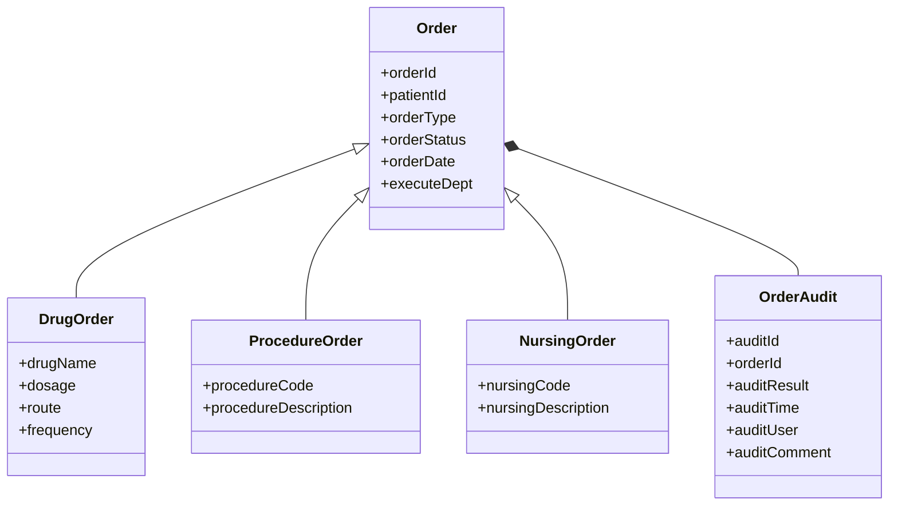

# 医嘱管理系统详细设计与具体代码实现

## 1.背景介绍

### 1.1 医嘱管理系统的重要性

在医疗保健领域中,医嘱管理系统扮演着至关重要的角色。它是整个医疗流程的核心,确保医生的医嘱能够准确、高效地传递和执行。一个优秀的医嘱管理系统不仅能提高医疗质量,还能降低医疗风险,提升工作效率。

### 1.2 传统医嘱管理存在的问题

传统的医嘱管理通常采用手写或简单电子系统的方式,存在着一些明显的缺陷:

- 手写医嘱存在字迹潦草、易遗漏等问题
- 纸质医嘱传递效率低下,易丢失
- 缺乏有效的审核和监控机制
- 无法及时获取病人的最新医嘱信息
- 数据整合和统计分析能力有限

这些问题不仅影响医疗质量,也增加了医疗风险。

### 1.3 现代医嘱管理系统的优势

借助现代信息技术,医嘱管理系统得到了长足发展,能够有效解决传统模式的弊端:

- 电子化医嘱,规范统一格式
- 实现医嘱在线审核、执行和监控
- 集成病历、检查等信息,提供全面视图
- 支持移动端随时查看和下达医嘱
- 强大的数据分析和决策支持能力

现代医嘱管理系统成为医院信息化建设的重点,对提高医疗质量、控制医疗风险、降低运营成本意义重大。

## 2.核心概念与联系

### 2.1 医嘱的定义和类型

医嘱是医生为病人开具的各种医疗指令,包括诊断、检查、用药、手术、护理等,是指导病人诊疗的纲领性文件。根据执行对象的不同,医嘱可分为:

- 诊疗医嘱:检查、用药、手术等针对病人的医嘱
- 护理医嘱:饮食、活动、健康教育等护理指导
- 医技医嘱:检验、放射、输血等医技执行的医嘱

### 2.2 医嘱生命周期

医嘱在医疗活动中经历一个完整的生命周期:

1. **开立医嘱**:医生根据病情开具医嘱
2. **医嘱审核**:医嘱经过临床、药学、护理等多方审核
3. **医嘱下达**:审核通过的医嘱下达到执行部门
4. **医嘱执行**:各科室按医嘱指令执行相应操作
5. **医嘱反馈**:执行情况反馈并记录在病历中
6. **医嘱停止**:医嘱目标达成或出现新情况停止执行

### 2.3 医嘱管理的核心任务

一个完整的医嘱管理系统需要围绕医嘱生命周期的各个环节提供全流程支持,主要包括:

- 标准化医嘱开立界面,支持移动端开立
- 多维度审核规则配置,自动审核提示
- 高效医嘱下达和执行监控机制  
- 及时医嘱执行反馈和病历记录
- 医嘱质量分析和决策支持能力

只有将这些核心任务有机结合,才能构建一个高效、安全的医嘱管理体系。

## 3.核心算法原理具体操作步骤  

### 3.1 医嘱数据模型设计

合理的数据模型设计是医嘱系统的基础。典型的医嘱数据模型包括:



这样的模型能较好地支持不同类型医嘱的表示,同时记录审核历史。

### 3.2 医嘱开立算法

医嘱开立是整个流程的起点,需要提供标准化、人性化的开立界面,减少出错几率。算法思路:

1. 根据医生身份和科室加载可开立医嘱模板
2. 通过模糊搜索或树形结构选择医嘱类型
3. 填写医嘱具体内容(药品、剂量、频次等)
4. 复核无误后提交医嘱到待审核状态

此外,还需支持临时保存、历史快速复制等辅助功能。

### 3.3 医嘱审核算法

审核是医嘱流程的关键环节,需要多方面审核规则:

1. **临床审核**:剂量、频次、禁忌等临床合理性
2. **用药审核**:药品相互作用、超剂量、年龄限制等
3. **保险审核**:是否属于保险目录范围
4. **护理审核**:护理医嘱是否合理可行

算法通过知识库匹配和规则引擎实现,审核过程中自动标记风险级别,高风险项需人工复核。

### 3.4 医嘱执行监控算法

为确保医嘱能够按时正确执行,需要算法持续监控:

1. 实时检测待执行医嘱,推送执行提醒
2. 对已过期未执行医嘱触发预警
3. 对长期未反馈的医嘱持续跟踪
4. 自动判断医嘱是否按计划正常完成

如果发现异常情况,系统将自动通知相关人员处理。

### 3.5 医嘱质量分析算法

通过分析历史医嘱数据,可以持续改进医嘱管理质量:

1. 分析医嘱的审核拒绝率和原因分布
2. 检测医嘱开立和执行的时间效率
3. 发现医嘱执行的常见错误和风险点
4. 评估不同科室的医嘱管理绩效

基于分析结果,系统可以优化审核规则、完善执行流程、加强培训等。

## 4.数学模型和公式详细讲解举例说明

在医嘱管理系统中,数学模型可以用于评估和优化医嘱审核、执行等环节的效率和质量。

### 4.1 医嘱审核优化模型

设有n个医嘱$O=\{o_1,o_2,...,o_n\}$需要经过m个审核规则$R=\{r_1,r_2,...,r_m\}$审核。定义:

- $t_{ij}$表示医嘱$o_i$通过规则$r_j$的审核时间
- $c_{ij}$表示规则$r_j$审核医嘱$o_i$的代价(复杂度)
- $x_{ij}$是0-1变量,表示是否将$o_i$分配给$r_j$审核

目标是最小化医嘱的总审核时间:

$$\min \sum_{i=1}^n\sum_{j=1}^m t_{ij}x_{ij}$$

同时需要满足约束条件:

- 每个医嘱都需要审核:$\sum_{j=1}^m x_{ij}=1,\forall i$
- 审核资源有限:$\sum_{i=1}^n c_{ij}x_{ij}\leq C_j,\forall j$

这是一个整数线性规划模型,可通过求解获得最优的医嘱审核分配方案。

### 4.2 医嘱执行监控模型

设有n个医嘱$O=\{o_1,o_2,...,o_n\}$,每个医嘱$o_i$有计划执行时间$d_i$和优先级$p_i$。定义:

- $s_i$表示医嘱$o_i$的实际开始执行时间
- $f_i$表示医嘱$o_i$的实际完成时间
- $w_i$表示医嘱$o_i$的权重(考虑优先级等因素)

我们希望最小化所有医嘱的加权延迟时间:

$$\min \sum_{i=1}^n w_i\max(0,s_i-d_i)$$

同时需要满足约束条件:

- 执行时间连续:$f_i \geq s_i+\delta_i,\forall i$
- 资源限制:$\sum_{i\in S(t)}r_i\leq R(t),\forall t$

其中$\delta_i$是医嘱$o_i$的执行时长,$S(t)$是时间$t$正在执行的医嘱集合,$R(t)$是时间$t$的可用资源量。

这是一个作业调度问题,可通过近似算法等求解。

## 4.项目实践:代码实例和详细解释说明

以下是一个基于Spring Boot的医嘱管理系统后端代码示例:

### 4.1 医嘱模型定义

```java
@Entity
@Inheritance(strategy = InheritanceType.SINGLE_TABLE)
@DiscriminatorColumn(name = "order_type")
public abstract class Order {
    @Id
    @GeneratedValue(strategy = GenerationType.IDENTITY)
    private Long orderId;
    
    private Long patientId;
    
    @Enumerated(EnumType.STRING)
    private OrderStatus orderStatus;
    
    private LocalDateTime orderDate;
    
    private String executeDept;
    
    // 其他属性和方法...
}

@Entity
@DiscriminatorValue("DRUG")
public class DrugOrder extends Order {
    private String drugName;
    private String dosage;
    private String route;
    private String frequency;
    
    // 其他属性和方法...
}

// 其他医嘱类型...
```

使用继承映射不同医嘱类型,方便管理和扩展。

### 4.2 医嘱开立

```java
@RestController
@RequestMapping("/orders")
public class OrderController {

    @Autowired
    private OrderService orderService;

    @PostMapping
    public ResponseEntity<Order> createOrder(@RequestBody OrderRequest request) {
        Order order = orderService.createOrder(request);
        return ResponseEntity.ok(order);
    }
}
```

前端通过HTTP POST请求发送医嘱数据,后端服务将其持久化到数据库。

### 4.3 医嘱审核

```java
@Service
public class OrderAuditService {

    @Autowired
    private RuleEngine ruleEngine;

    public void auditOrder(Order order) {
        List<AuditResult> auditResults = ruleEngine.executeRules(order);
        
        // 处理审核结果,保存到数据库
        ...
    }
}
```

使用规则引擎框架(如Drools)执行审核规则,并将结果保存。

### 4.4 医嘱执行监控

```java
@Scheduled(fixedRate = 60000) // 每分钟执行一次
public void monitorOrderExecution() {
    List<Order> pendingOrders = orderRepository.findByStatusAndDueDateBefore(
        OrderStatus.PENDING, LocalDateTime.now());
    
    for (Order order : pendingOrders) {
        // 检查是否超时,发送提醒或预警
        ...
    }
}
```

使用Spring的scheduled任务,定期检查待执行医嘱,监控超时情况。

### 4.5 医嘱质量分析

```java
@RestController
@RequestMapping("/analytics")
public class AnalyticsController {

    @Autowired
    private AnalyticsService analyticsService;

    @GetMapping("/audit-reject-rate")
    public ResponseEntity<Map<String, Double>> getAuditRejectRateByDept() {
        Map<String, Double> rejectRateByDept = analyticsService.getAuditRejectRateByDept();
        return ResponseEntity.ok(rejectRateByDept);
    }

    // 其他分析API...
}
```

提供RESTful API获取各类医嘱质量分析数据,前端可视化展示。

以上代码只是简单示例,实际项目需要更多模块的集成和功能扩展。

## 5.实际应用场景

医嘱管理系统在医疗机构的应用非常广泛,涵盖门诊、住院、急诊、手术等各种诊疗场景。

### 5.1 门诊医嘱管理

门诊是医嘱量最大的场景,医生需要快速开立检查、检验、用药等多种医嘱。系统应具备:

- 快速开立常用医嘱的模板功能
- 移动端开立和查看医嘱的能力
- 审核流程自动化,