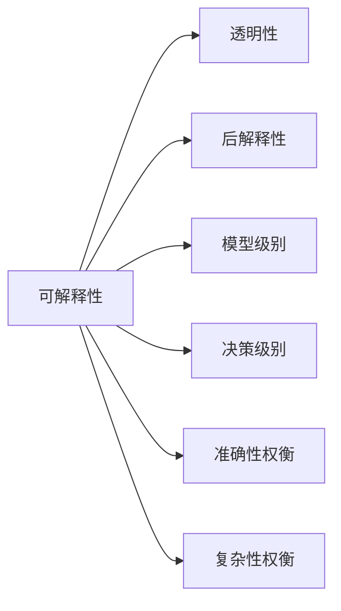
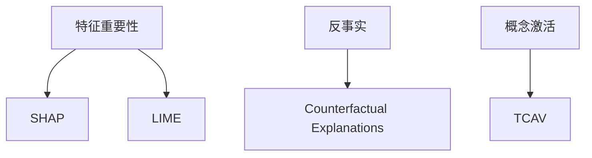

# 可解释的人工智能 (Explainable AI) 原理与代码实例讲解

作者：禅与计算机程序设计艺术

## 1. 背景介绍

### 1.1 人工智能的黑盒问题

人工智能技术在过去几十年取得了长足的进步,尤其是深度学习等方法在计算机视觉、自然语言处理等领域取得了突破性的成果。然而,随着AI系统变得日益复杂,它们的决策过程对于人类来说变得越来越难以理解和解释。这就是所谓的AI"黑盒"问题。

### 1.2 可解释性的重要性

AI系统的决策会对人们的生活产生重大影响,比如自动驾驶、医疗诊断、金融风控等。因此,我们必须确保AI系统的决策是可以解释和信任的。可解释性有助于增强用户对AI的信任,发现潜在的偏差和错误,避免灾难性后果。同时,可解释性在一些强监管的行业也是法律法规的硬性要求。

### 1.3 可解释人工智能的定义

可解释人工智能(Explainable AI,简称XAI)是一个新兴的研究领域,旨在开发能够解释其决策和行为的AI系统。XAI 的目标是用人类可以理解的术语来描述 AI 系统的内部工作原理,阐明其决策背后的推理过程。这样,人类就可以理解、信任并有效管理 AI 系统。

## 2. 核心概念与联系

### 2.1 可解释性的分类

可解释性可以分为两大类:

- 透明性(Transparency):直接检查模型内部工作原理,比如查看神经网络的权重和结构。适用于相对简单的模型。
- 后解释性(Post-hoc Explainability):在不直接检查内部的情况下解释模型的行为,主要关注模型的输入输出关系。适用于复杂的黑盒模型。

### 2.2 可解释性的粒度

可解释性可以在不同的粒度级别上进行:

- 模型级别:解释整个模型的工作原理,如神经网络的整体结构。
- 决策级别:解释单个决策背后的推理,如影响分类结果的关键特征。

### 2.3 可解释性与其他属性的权衡

提高可解释性通常会带来性能或复杂性方面的权衡:

- 可解释性 vs 准确性:高度可解释的模型(如决策树)的性能通常不如黑盒模型(如深度神经网络)。需要在二者间平衡。  
- 可解释性 vs 复杂性:为复杂系统构建解释会带来计算和工程上的挑战。

下图展示了可解释性的分类、粒度以及与其他属性间的权衡关系:



## 3. 核心算法原理与操作步骤

### 3.1 基于特征重要性的解释

#### 3.1.1 SHAP (SHapley Additive exPlanations) 

- 基本原理:基于博弈论中的Shapley值,将特征的贡献分配到各个特征。
- 主要步骤:
    1. 定义解释问题为特征贡献分配问题
    2. 枚举所有可能的特征子集
    3. 计算每个特征的边际贡献
    4. 对边际贡献求加权平均得到Shapley值

#### 3.1.2 LIME (Local Interpretable Model-agnostic Explanations)

- 基本原理:通过在待解释样本附近的局部区域拟合一个可解释的简单模型来近似黑盒模型。
- 主要步骤:  
    1. 在待解释样本附近采样扰动数据
    2. 用黑盒模型对扰动数据打分
    3. 用可解释模型(如线性模型)拟合打分结果
    4. 提取可解释模型的权重作为解释
  
### 3.2 基于反事实的解释

#### 3.2.1 Counterfactual Explanations

- 基本原理:通过寻找反事实样本(即将模型预测结果改变的最小扰动)来解释模型行为。
- 主要步骤:
    1. 定义反事实解释目标
    2. 构建优化问题
    3. 求解优化问题得到反事实样本
    4. 用反事实样本解释原始预测

### 3.3 基于概念激活向量的解释

#### 3.3.1 TCAV (Testing with Concept Activation Vectors)

- 基本原理:通过人类可解释的高层概念(如条纹、毛茸茸)在神经网络中的激活向量来解释模型行为。  
- 主要步骤:
    1. 定义人类可解释的概念
    2. 收集概念样本并用神经网络提取激活向量
    3. 在激活向量上训练线性分类器
    4. 用分类器权重解释模型关注的概念

下图展示了以上三类算法的基本原理:



## 4. 数学模型与公式详解

### 4.1 SHAP的Shapley值计算

在博弈论中,Shapley值用来衡量每个玩家对联盟总收益的贡献。将其应用于特征重要性解释中,特征就是"玩家",模型预测就是"总收益"。

对于特征 $i$,其Shapley值 $\phi_i$ 定义为:

$$\phi_i=\sum_{S\subseteq F \setminus \{i\}} \frac{|S|!(|F|-|S|-1)!}{|F|!} [f_S(S\cup \{i\})-f_S(S)]$$

其中:
- $F$ 是所有特征的集合  
- $S$ 是不包含特征 $i$ 的所有特征子集
- $f_S$ 是在特征子集 $S$ 上训练的模型
- $f_S(S\cup \{i\})-f_S(S)$ 是特征 $i$ 的边际贡献

直观地说,Shapley值衡量了特征 $i$ 在所有可能的特征子集上的平均边际贡献。

### 4.2 LIME的局部线性近似

LIME的核心思想是在待解释样本 $x$ 附近的局部区域拟合一个可解释的线性模型 $g$,用 $g$ 来近似黑盒模型 $f$ 的行为。

$$g(z')=w_g \cdot z'$$

其中:
- $z'$ 是 $x$ 附近的扰动样本
- $w_g$ 是线性模型 $g$ 的权重向量

LIME通过最小化局部加权平方损失来求解最优的 $w_g$:

$$w_g^*=\arg\min_{w_g} \mathcal{L}(f,g,\pi_{x})+\Omega(g)$$

其中:
- $\mathcal{L}$ 是 $f$ 和 $g$ 在 $x$ 附近的局部加权平方损失  
- $\pi_{x}$ 是以 $x$ 为中心的局部权重分布
- $\Omega(g)$ 是 $g$ 的复杂度正则项

求解得到的 $w_g^*$ 就是LIME对 $f$ 在 $x$ 处行为的局部解释。

### 4.3 TCAV的概念激活向量

TCAV利用人类可解释的高层概念在神经网络某一层的激活向量来解释网络行为。

给定概念 $C$,在神经网络第 $l$ 层定义其概念激活向量 $\vec{v}_C^l$:

$$\vec{v}_C^l=\vec{w}_{C,l}$$

其中 $\vec{w}_{C,l}$ 是在网络第 $l$ 层激活向量上训练的线性概念分类器的权重向量。

对于输入样本 $x$,其在第 $l$ 层的概念敏感度 $SC_C^l(x)$ 定义为:  

$$SC_C^l(x)=\vec{v}_C^l \cdot \vec{a}_l(x)$$

其中 $\vec{a}_l(x)$ 是 $x$ 在网络第 $l$ 层的激活向量。

$SC_C^l(x)$ 衡量了概念 $C$ 对网络在 $x$ 上的预测结果的影响。TCAV 通过比较不同概念的敏感度来解释网络行为。

## 5. 项目实践:代码实例与详解

下面我们用Python实现并演示几个核心算法。

### 5.1 SHAP

使用SHAP库,我们可以方便地计算各种模型的Shapley值特征重要性。

```python
import shap
from sklearn.ensemble import RandomForestClassifier

# 训练随机森林分类器
X,y = shap.datasets.adult()
model = RandomForestClassifier(n_estimators=100).fit(X, y)

# 用KernelSHAP计算Shapley值
explainer = shap.KernelExplainer(model.predict_proba, X)
shap_values = explainer.shap_values(X[:100])

# 可视化
shap.summary_plot(shap_values[1], X[:100])
```

其中的关键步骤是:
1. 用训练数据`X`初始化`KernelExplainer`,它会在背景数据上采样并计算边际贡献。`model.predict_proba`是待解释的模型函数。
2. 调用`explainer.shap_values`计算测试样本`X[:100]`的Shapley值。
3. 用`shap.summary_plot`可视化Shapley值,直观展示每个特征的重要性。

### 5.2 LIME

使用LIME库,我们可以解释文本分类器的预测结果。

```python
from lime.lime_text import LimeTextExplainer

# 假设我们有一个训练好的文本分类器
classifier = train_text_classifier()

# 初始化LIME解释器
explainer = LimeTextExplainer(class_names=class_names)

# 对测试样本进行解释
text_instance = test_texts[0]
exp = explainer.explain_instance(text_instance, classifier.predict_proba, num_features=6)

# 可视化解释结果
exp.show_in_notebook(text=True)
```

其中的关键步骤是:
1. 初始化`LimeTextExplainer`,指定类别名称`class_names`。
2. 调用`explain_instance`对测试样本`text_instance`进行解释,`classifier.predict_proba`是待解释的分类器概率输出函数,`num_features`限定展示的重要特征数量。
3. 调用`exp.show_in_notebook`可视化解释结果,直观展示影响分类的关键词。

### 5.3 TCAV

使用TCAV库,我们可以分析图像分类器使用的高层语义概念。

```python
import tcav.activation_generator as act_gen
import tcav.model  as model
import tcav.tcav as tcav
import tcav.utils as utils

# 加载训练好的图像分类器
sess, model = load_image_classifier()

# 定义概念并收集样本
concepts = ['striped', 'random_500']  
bottlenecks = ['mixed4c']
act_generator = act_gen.ImageActivationGenerator(model, source_dir, activation_dir, max_examples=100)

# 在概念上训练线性分类器
train_tcav_concepts(concepts, bottlenecks, act_generator)

# TCAV度量
results = tcav.run_tcav(sess, target, concepts, bottlenecks, act_generator)
results.plot_results()  
```

其中的关键步骤是:
1. 用`ImageActivationGenerator`从原始图像生成激活向量。
2. 调用`train_tcav_concepts`在激活向量上训练概念分类器。
3. 用`tcav.run_tcav`计算TCAV分数,衡量目标类别对各概念的敏感度。
4. 用`results.plot_results()`可视化TCAV分数,直观展示分类器关注的语义概念。

## 6. 实际应用场景

可解释AI在许多领域都有重要应用,比如:

- 医疗诊断:解释AI诊断系统的决策过程,增强医生和患者的信任。
- 金融风控:解释AI信用评分和欺诈检测的结果,符合监管要求。  
- 自动驾驶:解释自动驾驶系统的行为决策,事故责任判定和防止事故发生。
- 犯罪预测:解释AI预测犯罪风险的依据,防止偏见和不公。

## 7. 工具和资源推荐

- [SHAP](https://github.com/slundberg/shap):