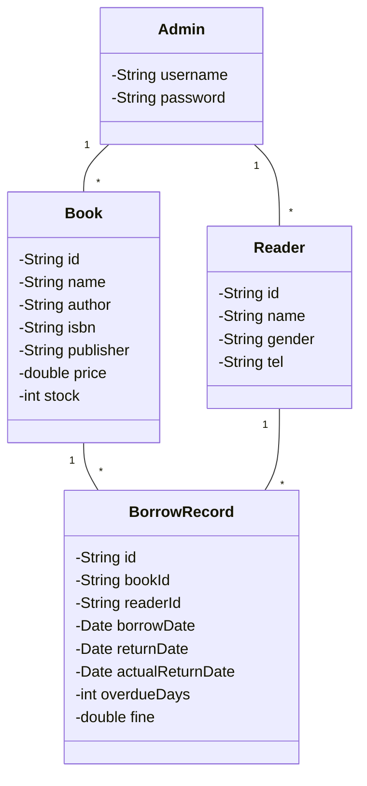

# 图书库存管理系统详细设计与具体代码实现

作者：禅与计算机程序设计艺术

## 1.背景介绍
### 1.1 图书库存管理的重要性
图书馆是知识的宝库,是人类文明的重要载体。高效、准确的图书库存管理是现代图书馆运营的关键。传统的人工管理方式效率低下,容易出错,已经无法满足现代图书馆的需求。因此,开发一套功能完善、易于使用的图书库存管理系统势在必行。

### 1.2 系统目标
本文旨在设计并实现一个基于Java的图书库存管理系统。该系统能够实现图书的录入、查询、借阅、归还等基本功能,并能够生成各类统计报表,为图书馆管理人员提供决策支持。同时,系统还应具备良好的可扩展性,以适应未来业务需求的变化。

### 1.3 系统架构
本系统采用经典的三层架构设计,即表示层、业务逻辑层和数据访问层。表示层负责与用户的交互,业务逻辑层负责业务规则的实现,数据访问层负责与数据库的交互。三层之间通过接口实现松耦合,便于系统的维护和扩展。

## 2.核心概念与联系
### 2.1 图书 Book
图书是系统的核心实体,包含书名、作者、ISBN、出版社、价格、库存量等属性。每本图书都有唯一的编号,便于识别和管理。

### 2.2 读者 Reader
读者是图书的借阅者,包含姓名、性别、联系方式、借阅记录等属性。每个读者都有唯一的借书证号。

### 2.3 管理员 Admin
管理员是系统的操作者,拥有图书录入、读者管理、借阅管理等权限。管理员通过用户名和密码登录系统。

### 2.4 借阅记录 BorrowRecord
借阅记录是读者借阅图书的记录,包含借阅的图书、借阅日期、应还日期、实际归还日期、逾期天数、罚金等信息。

### 2.5 实体关系图
下图展示了图书、读者、管理员、借阅记录四个核心实体之间的关系:



## 3.核心算法原理具体操作步骤
### 3.1 图书查询算法
#### 3.1.1 顺序查找
顺序查找是最简单的查找算法,适用于图书数量较少的情况。其基本思想是从头到尾遍历图书列表,逐个比较,直到找到目标图书或遍历完整个列表。

具体步骤如下:
1. 从图书列表的第一个元素开始,取出其关键字(如书名)
2. 将该关键字与目标关键字比较,如果相等,则查找成功,返回该图书;否则继续下一步
3. 取出下一个图书,重复步骤2,直到找到目标图书或遍历完整个列表
4. 如果遍历完整个列表还没有找到目标图书,则查找失败,返回空值

#### 3.1.2 二分查找
二分查找是一种高效的查找算法,适用于图书数量较多且已经按关键字排序的情况。其基本思想是将目标关键字与中间元素的关键字比较,如果相等则查找成功;如果大于,则在后半部分继续查找;如果小于,则在前半部分继续查找。

具体步骤如下:
1. 确定查找范围的起点low和终点high
2. 取中间位置mid = (low + high) / 2
3. 将目标关键字与mid位置的关键字比较
    - 如果相等,则查找成功,返回该图书
    - 如果大于,则low = mid + 1,继续步骤2
    - 如果小于,则high = mid - 1,继续步骤2
4. 重复步骤2~3,直到low > high,表示查找失败,返回空值

### 3.2 借阅算法
借阅算法的基本流程如下:
1. 读者提交借阅请求,包含读者ID和图书ID
2. 系统检查该读者是否有超期未还的图书,如果有则拒绝借阅请求
3. 系统检查该图书的库存量是否大于0,如果不大于0则拒绝借阅请求
4. 系统生成借阅记录,记录借阅时间、应还时间等信息
5. 系统将该图书的库存量减1
6. 系统返回借阅成功的消息

### 3.3 归还算法
归还算法的基本流程如下:
1. 读者提交归还请求,包含读者ID和图书ID
2. 系统根据读者ID和图书ID查询对应的借阅记录
3. 系统记录实际归还时间,并计算借阅天数
4. 如果借阅天数超过应还时间,则计算逾期天数和罚金
5. 系统将该图书的库存量加1
6. 系统更新借阅记录的归还信息
7. 系统返回归还成功的消息

## 4.数学模型和公式详细讲解举例说明
### 4.1 逾期罚金模型
假设逾期罚金的计算公式为:
$$
Fine = OverdueDays × BaseFine × (1 + FineRate)^{OverdueDays - 1}
$$

其中:
- $Fine$表示逾期罚金
- $OverdueDays$表示逾期天数
- $BaseFine$表示基础罚金,即逾期一天的罚金
- $FineRate$表示罚金增长率,即每多逾期一天,罚金增长的比例

举例说明:假设某读者借阅图书,应还日期为2023年5月1日,实际归还日期为2023年5月11日,则逾期天数为10天。如果基础罚金为1元/天,罚金增长率为0.05,则逾期罚金为:
$$
Fine = 10 × 1 × (1 + 0.05)^{10 - 1} ≈ 16.29 元
$$

### 4.2 图书推荐模型
图书推荐可以使用协同过滤算法,其基本思想是利用其他读者的借阅记录来预测当前读者可能感兴趣的图书。

假设有$m$个读者和$n$本图书,借阅记录可以表示为一个$m×n$的矩阵$R$,其中$R_{ij}$表示读者$i$对图书$j$的借阅次数。

则读者$i$和读者$j$的相似度可以用余弦相似度计算:
$$
sim(i,j) = \frac{\sum_{k=1}^n R_{ik}R_{jk}}{\sqrt{\sum_{k=1}^n R_{ik}^2}\sqrt{\sum_{k=1}^n R_{jk}^2}}
$$

其中$sim(i,j)$的取值范围为$[0,1]$,值越大表示两个读者的借阅兴趣越相似。

对于读者$i$,可以找到与其最相似的$k$个读者,然后根据这$k$个读者的借阅记录,预测读者$i$对图书$j$的借阅次数:
$$
P_{ij} = \frac{\sum_{u∈S(i,k)} sim(i,u)R_{uj}}{\sum_{u∈S(i,k)} sim(i,u)}
$$

其中$S(i,k)$表示与读者$i$最相似的$k$个读者的集合。

最后,可以根据预测的借阅次数,为读者$i$推荐借阅次数最高的几本图书。

## 5.项目实践：代码实例和详细解释说明
下面以Java语言为例,展示图书库存管理系统的部分核心代码。

### 5.1 图书类 Book.java
```java
public class Book {
    private String id;
    private String name;
    private String author;
    private String isbn;
    private String publisher;
    private double price;
    private int stock;
    
    // 构造函数、getter和setter方法省略
}
```

Book类表示图书实体,包含图书的基本信息如ID、书名、作者、ISBN、出版社、价格、库存量等。

### 5.2 读者类 Reader.java 
```java
public class Reader {
    private String id;
    private String name;
    private String gender;
    private String tel;
    
    // 构造函数、getter和setter方法省略
}
```

Reader类表示读者实体,包含读者的基本信息如ID、姓名、性别、联系方式等。

### 5.3 借阅记录类 BorrowRecord.java
```java
public class BorrowRecord {
    private String id;
    private String bookId;
    private String readerId;
    private Date borrowDate;
    private Date returnDate;
    private Date actualReturnDate;
    private int overdueDays;
    private double fine;
    
    // 构造函数、getter和setter方法省略
}
```

BorrowRecord类表示借阅记录实体,包含借阅的图书ID、读者ID、借阅日期、应还日期、实际归还日期、逾期天数、罚金等信息。

### 5.4 图书查询接口 BookDAO.java
```java
public interface BookDAO {
    List<Book> getAllBooks();
    Book getBookById(String id);
    List<Book> getBooksByName(String name);
    void addBook(Book book);
    void updateBook(Book book);
    void deleteBook(String id);
}
```

BookDAO接口定义了对图书的基本操作,如查询所有图书、按ID查询图书、按书名模糊查询图书、添加图书、更新图书、删除图书等。

### 5.5 图书查询实现类 BookDAOImpl.java
```java
public class BookDAOImpl implements BookDAO {
    
    private List<Book> books = new ArrayList<>();
    
    @Override
    public List<Book> getAllBooks() {
        return books;
    }
    
    @Override
    public Book getBookById(String id) {
        for (Book book : books) {
            if (book.getId().equals(id)) {
                return book;
            }
        }
        return null;
    }
    
    @Override
    public List<Book> getBooksByName(String name) {
        List<Book> result = new ArrayList<>();
        for (Book book : books) {
            if (book.getName().contains(name)) {
                result.add(book);
            }
        }
        return result;
    }
    
    @Override
    public void addBook(Book book) {
        books.add(book);
    }
    
    @Override
    public void updateBook(Book book) {
        for (int i = 0; i < books.size(); i++) {
            if (books.get(i).getId().equals(book.getId())) {
                books.set(i, book);
                break;
            }
        }
    }
    
    @Override
    public void deleteBook(String id) {
        books.removeIf(book -> book.getId().equals(id));
    }
}
```

BookDAOImpl类实现了BookDAO接口,提供了对图书的具体操作。为了简单起见,这里使用内存中的List来存储图书数据,实际项目中通常会使用数据库。

### 5.6 借阅服务类 BorrowService.java
```java
public class BorrowService {
    
    private BookDAO bookDAO = new BookDAOImpl();
    private ReaderDAO readerDAO = new ReaderDAOImpl();
    private BorrowRecordDAO borrowRecordDAO = new BorrowRecordDAOImpl();
    
    public void borrowBook(String bookId, String readerId) {
        Book book = bookDAO.getBookById(bookId);
        Reader reader = readerDAO.getReaderById(readerId);
        
        if (book != null && reader != null && book.getStock() > 0) {
            BorrowRecord record = new BorrowRecord();
            record.setId(UUID.randomUUID().toString());
            record.setBookId(bookId);
            record.setReaderId(readerId);
            record.setBorrowDate(new Date());
            record.setReturnDate(addDays(new Date(), 30));
            
            borrowRecordDAO.addBorrowRecord(record);
            
            book.setStock(book.getStock() - 1);
            bookDAO.updateBook(book);
            
            System.out.println("借阅成功!");
        } else {
            System.out.println("借阅失败!");
        }
    }
    
    private Date addDays(Date date, int days) {
        Calendar calendar = Calendar.getInstance();
        calendar.setTime(date);
        calendar.add(Calendar.DAY_OF_MONTH, days);
        return calendar.getTime();
    }
}
```

BorrowService类提供了借阅图书的服务。借阅的基