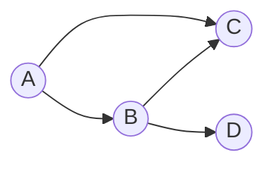

# 图卷积网络(GCN)原理与代码实战案例讲解

## 1.背景介绍

### 1.1 图数据的重要性

在现实世界中,存在着大量的数据具有复杂的拓扑结构和非欧几里德特征,这种数据通常被称为图数据。图数据广泛存在于社交网络、交通网络、生物网络、知识图谱等领域。传统的机器学习算法通常针对的是欧几里得数据,如结构化数据和网格数据,但对于具有复杂拓扑结构的图数据,传统方法往往表现不佳。

### 1.2 图神经网络的兴起

为了更好地处理图数据,近年来图神经网络(Graph Neural Networks, GNNs)应运而生并得到了迅速发展。图神经网络是一种将神经网络与图数据相结合的新型深度学习架构,它能够直接对图数据进行端到端的学习,捕捉图数据中的拓扑结构和节点特征信息。图神经网络已经在节点分类、链接预测、图分类等任务中取得了优异的性能。

### 1.3 图卷积网络(GCN)概述

图卷积网络(Graph Convolutional Networks, GCNs)是图神经网络中最具代表性和影响力的一种模型,由托马斯·N·基普夫(Thomas N. Kipf)和马克斯·维林(Max Welling)于2017年提出。GCN通过在图数据上进行卷积操作,将节点的特征信息与拓扑结构信息相结合,从而实现对图数据的高效编码和表示学习。GCN模型简洁高效,在半监督节点分类任务上取得了出色的性能,并催生了图神经网络的研究热潮。

## 2.核心概念与联系

### 2.1 图的表示

在介绍GCN之前,我们首先需要了解如何在计算机中表示一个图。通常情况下,一个无向图 $\mathcal{G}$ 可以用一个三元组 $\mathcal{G} = (\mathcal{V}, \mathcal{E}, \mathbf{X})$ 来表示,其中:

- $\mathcal{V}$ 是节点集合,包含图中所有的节点,即 $\mathcal{V} = \{v_1, v_2, \dots, v_N\}$,其中 $N$ 是节点的总数。
- $\mathcal{E}$ 是边集合,包含图中所有的边,即 $\mathcal{E} = \{(v_i, v_j)\}$,其中 $(v_i, v_j)$ 表示节点 $v_i$ 和节点 $v_j$ 之间存在一条边。
- $\mathbf{X} \in \mathbb{R}^{N \times D}$ 是节点特征矩阵,其中 $\mathbf{X}_{i,:}$ 表示节点 $v_i$ 的 $D$ 维特征向量。

### 2.2 图卷积的核心思想

传统的卷积神经网络(CNN)是在欧几里得数据(如图像)上进行卷积操作的,而图卷积网络(GCN)则是在非欧几里得数据(图数据)上进行卷积操作。图卷积的核心思想是:通过聚合每个节点的邻居节点的特征信息,来更新该节点的特征表示。具体来说,对于一个节点 $v_i$,我们可以将其特征表示 $\mathbf{h}_i$ 更新为:

$$\mathbf{h}_i^{(l+1)} = \sigma\left(\mathbf{W}^{(l)} \cdot \mathrm{AGG}\left(\left\{\mathbf{h}_j^{(l)}, \forall j \in \mathcal{N}(i)\right\}\right)\right)$$

其中:

- $\mathbf{h}_i^{(l)}$ 和 $\mathbf{h}_i^{(l+1)}$ 分别表示节点 $v_i$ 在第 $l$ 层和第 $l+1$ 层的特征表示。
- $\mathcal{N}(i)$ 表示节点 $v_i$ 的邻居节点集合。
- $\mathrm{AGG}$ 是一个可微分的聚合函数,用于将邻居节点的特征信息聚合成一个统一的表示。
- $\mathbf{W}^{(l)}$ 是第 $l$ 层的可训练权重矩阵,用于对聚合后的特征进行线性变换。
- $\sigma$ 是一个非线性激活函数,如 ReLU。

通过上述公式,我们可以看出,图卷积网络通过聚合邻居节点的特征信息,并与当前节点的特征信息相结合,从而实现了对图数据的编码和表示学习。

### 2.3 GCN 层的前向传播

在 GCN 中,每一层的前向传播过程可以表示为:

$$\mathbf{H}^{(l+1)} = \sigma\left(\hat{\mathbf{D}}^{-\frac{1}{2}} \hat{\mathbf{A}} \hat{\mathbf{D}}^{-\frac{1}{2}} \mathbf{H}^{(l)} \mathbf{W}^{(l)}\right)$$

其中:

- $\mathbf{H}^{(l)}$ 和 $\mathbf{H}^{(l+1)}$ 分别表示第 $l$ 层和第 $l+1$ 层的节点特征矩阵,其中每一行对应一个节点的特征向量。
- $\hat{\mathbf{A}} = \mathbf{A} + \mathbf{I}_N$ 是加入了自循环(self-loop)的邻接矩阵,其中 $\mathbf{A}$ 是原始邻接矩阵,而 $\mathbf{I}_N$ 是 $N \times N$ 的单位矩阵。
- $\hat{\mathbf{D}}_{ii} = \sum_j \hat{\mathbf{A}}_{ij}$ 是一个度矩阵(degree matrix),用于对邻接矩阵进行归一化。
- $\mathbf{W}^{(l)}$ 是第 $l$ 层的可训练权重矩阵。
- $\sigma$ 是一个非线性激活函数,如 ReLU。

通过上述公式,我们可以看出,GCN 层的前向传播过程包括三个主要步骤:

1. 对邻接矩阵进行归一化,以解决不同节点度数不同的问题。
2. 将归一化后的邻接矩阵与当前层的节点特征矩阵相乘,实现对邻居节点特征的聚合。
3. 对聚合后的特征进行线性变换,并应用非线性激活函数。

通过上述步骤,GCN 层能够有效地捕捉图数据中的拓扑结构信息和节点特征信息,并对它们进行融合和编码。

## 3.核心算法原理具体操作步骤 

### 3.1 GCN 模型架构

一个典型的 GCN 模型通常包含以下几个主要组成部分:

1. **输入层**: 接收原始节点特征矩阵 $\mathbf{X}$ 作为输入。

2. **GCN 层**: 多个 GCN 层按顺序堆叠,每一层的输出作为下一层的输入。第 $l$ 层的输出可以表示为:

   $$\mathbf{H}^{(l+1)} = \sigma\left(\hat{\mathbf{D}}^{-\frac{1}{2}} \hat{\mathbf{A}} \hat{\mathbf{D}}^{-\frac{1}{2}} \mathbf{H}^{(l)} \mathbf{W}^{(l)}\right)$$

3. **池化层(可选)**: 在 GCN 层之后,可以添加池化层(如全局池化层)来进一步聚合节点特征。

4. **预测层**: 根据具体任务,添加预测层(如全连接层或softmax层)来生成最终的输出。

5. **损失函数**: 定义合适的损失函数,如交叉熵损失函数或均方误差损失函数。

6. **优化器**: 使用优化算法(如Adam或SGD)来优化模型参数,最小化损失函数。

### 3.2 GCN 模型训练过程

GCN 模型的训练过程可以概括为以下步骤:

1. **数据准备**: 将图数据转换为适当的表示形式,包括邻接矩阵 $\mathbf{A}$ 和节点特征矩阵 $\mathbf{X}$。

2. **模型初始化**: 初始化 GCN 模型的参数,包括各层的权重矩阵 $\mathbf{W}^{(l)}$。

3. **前向传播**: 将输入数据 $\mathbf{X}$ 传递给 GCN 模型,计算每一层的输出,直到得到最终的预测结果。

4. **计算损失**: 根据预测结果和真实标签,计算损失函数的值。

5. **反向传播**: 通过反向传播算法,计算每个参数的梯度。

6. **参数更新**: 使用优化算法(如Adam或SGD)根据梯度更新模型参数。

7. **重复训练**: 重复步骤3-6,直到模型收敛或达到预设的迭代次数。

在训练过程中,通常会使用一些正则化技术(如dropout或L2正则化)来防止过拟合,并采用小批量梯度下降等优化策略来加速训练过程。

### 3.3 GCN 模型推理过程

在训练完成后,我们可以使用训练好的 GCN 模型进行推理和预测。推理过程通常包括以下步骤:

1. **数据准备**: 将需要预测的图数据转换为适当的表示形式,包括邻接矩阵 $\mathbf{A}$ 和节点特征矩阵 $\mathbf{X}$。

2. **前向传播**: 将输入数据 $\mathbf{X}$ 传递给训练好的 GCN 模型,计算每一层的输出,直到得到最终的预测结果。

3. **结果解释**: 根据具体任务,对预测结果进行解释和后处理,得到最终的输出。

需要注意的是,在推理过程中,模型参数是固定的,不需要进行反向传播和参数更新。

## 4.数学模型和公式详细讲解举例说明

在上一节中,我们已经介绍了 GCN 模型的核心算法原理和操作步骤。在这一节中,我们将更深入地探讨 GCN 模型中涉及的数学模型和公式,并通过具体的例子进行详细的讲解和说明。

### 4.1 图卷积操作

在 GCN 模型中,图卷积操作是最核心的部分,它实现了对图数据的编码和表示学习。我们首先回顾一下图卷积操作的基本公式:

$$\mathbf{H}^{(l+1)} = \sigma\left(\hat{\mathbf{D}}^{-\frac{1}{2}} \hat{\mathbf{A}} \hat{\mathbf{D}}^{-\frac{1}{2}} \mathbf{H}^{(l)} \mathbf{W}^{(l)}\right)$$

其中:

- $\hat{\mathbf{A}} = \mathbf{A} + \mathbf{I}_N$ 是加入了自循环的邻接矩阵。
- $\hat{\mathbf{D}}_{ii} = \sum_j \hat{\mathbf{A}}_{ij}$ 是一个度矩阵,用于对邻接矩阵进行归一化。
- $\mathbf{H}^{(l)}$ 和 $\mathbf{H}^{(l+1)}$ 分别表示第 $l$ 层和第 $l+1$ 层的节点特征矩阵。
- $\mathbf{W}^{(l)}$ 是第 $l$ 层的可训练权重矩阵。
- $\sigma$ 是一个非线性激活函数,如 ReLU。

让我们通过一个具体的例子来更好地理解图卷积操作。假设我们有一个简单的无向图,如下所示:

该图共有 4 个节点,分别为 A、B、C 和 D。我们假设每个节点都有一个 2 维的特征向量,即 $\mathbf{X} \in \mathbb{R}^{4 \times 2}$。现在,我们将计算第 0 层到第 1 层的图卷积操作。

首先,我们需要构建邻接矩阵 $\mathbf{A}$ 和度矩阵 $\hat{\mathbf{D}}$:

$$
\mathbf{A} = \begin{bmatrix}
0 & 1 &