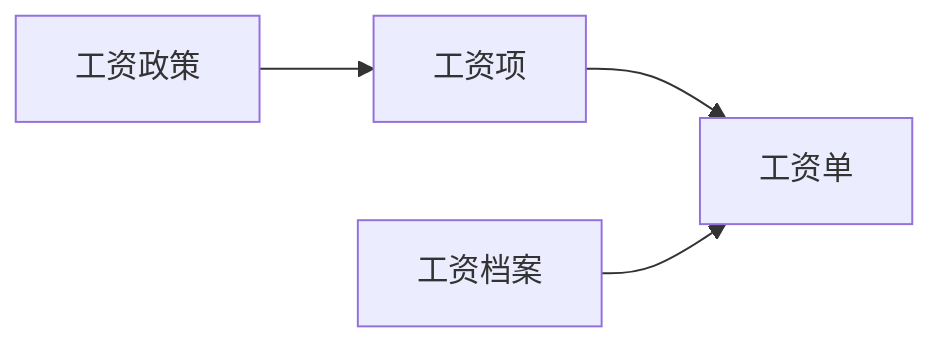
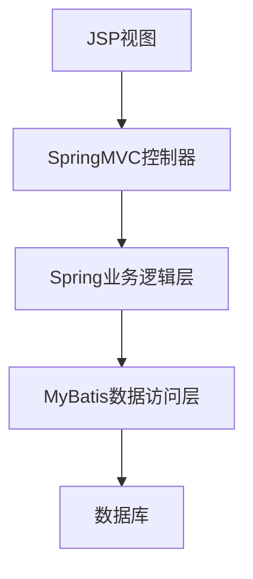

# 基于SSM的企业工资管理系统

## 1. 背景介绍

### 1.1 企业工资管理系统的重要性

在现代企业管理中,工资管理是一项关键且复杂的任务。准确计算和发放员工工资不仅关系到企业的正常运营,还直接影响员工的薪酬福利和工作积极性。传统的手工计算和管理方式不仅效率低下,而且容易出现人为错误,无法满足企业日益增长的需求。因此,开发一套高效、安全、可靠的企业工资管理系统变得迫在眉睫。

### 1.2 工资管理系统面临的挑战

企业工资管理涉及多个部门和复杂的计算规则,面临着诸多挑战:

1. **多样化的薪酬结构**:不同岗位、级别的员工工资构成存在差异,需要灵活处理。
2. **动态的薪酬政策**:企业根据发展需求和外部环境变化,会调整薪酬政策。
3. **准确性和合规性**:工资计算必须准确无误,并符合国家和地方的法律法规。
4. **数据安全和隐私保护**:员工薪酬信息属于敏感数据,需要采取有效措施保护数据安全。
5. **系统集成和扩展性**:工资系统需要与企业其他系统(如人力资源、财务等)集成,并具备良好的扩展性。

### 1.3 基于SSM架构的工资管理系统

为解决上述挑战,本文提出一种基于SSM(Spring、SpringMVC、MyBatis)架构的企业工资管理系统。SSM架构源于经典的SSH(Spring、Struts、Hibernate),是目前流行的轻量级JavaEE企业应用开发架构之一。该架构具有组件精简、开发高效、性能优异等优点,非常适合构建工资管理系统这类中小型企业应用。

## 2. 核心概念与联系

在深入探讨系统架构和实现细节之前,我们先介绍工资管理系统的几个核心概念:

### 2.1 工资项

工资项是构成员工工资的基本单元,包括基本工资、绩效工资、加班工资、补贴等。每个工资项都有对应的计算规则。

### 2.2 工资单

工资单是记录某个员工某个月份的所有工资项及总工资的载体,是工资管理的核心数据对象。

### 2.3 工资政策

工资政策定义了工资项的计算规则,如基本工资的计算公式、加班工资的计算标准等。工资政策会随企业发展和外部环境的变化而调整。

### 2.4 工资档案

工资档案记录了员工的工资相关信息,如岗位、级别、入职时间等,这些信息将影响工资的计算结果。

上述概念相互关联、环环相扣,构成了工资管理系统的核心数据模型,如下图所示:



## 3. 核心算法原理具体操作步骤

工资管理系统的核心算法是根据工资政策、工资档案等数据计算每个员工的工资单。我们将这一过程分解为以下步骤:

### 3.1 获取工资政策

首先,系统需要获取当前有效的工资政策,作为工资计算的依据。工资政策可以存储在数据库中,也可以从配置文件中读取。

### 3.2 获取员工工资档案

接下来,系统需要获取所有员工的工资档案信息,如岗位、级别、入职时间等。这些信息将影响工资的具体计算结果。

### 3.3 遍历工资项

根据工资政策,系统需要遍历每个工资项,并针对每个员工计算该工资项的值。

1. 对于基本工资等固定工资项,可以直接从工资档案中读取相应的值。
2. 对于绩效工资、加班工资等浮动工资项,需要根据工资政策中定义的计算规则进行计算。

### 3.4 生成工资单

在计算完所有工资项后,系统将这些工资项的值汇总,生成每个员工的工资单。工资单中还需要包含一些其他信息,如员工姓名、部门、应纳税金额等。

### 3.5 持久化工资单

最后,系统需要将生成的工资单持久化存储,以便后续查询和审计。工资单可以存储在关系数据库或NoSQL数据库中。

上述算法的伪代码如下:

```python
# 获取工资政策
salary_policy = get_salary_policy()

# 获取所有员工工资档案
employee_payrolls = get_employee_payrolls()

# 遍历每个员工
for employee in employee_payrolls:
    salary_items = []
    # 遍历每个工资项
    for item in salary_policy.items:
        # 计算工资项值
        item_value = calculate_item_value(item, employee)
        salary_items.append((item.name, item_value))
    
    # 生成工资单
    payslip = generate_payslip(employee, salary_items)
    
    # 持久化工资单
    persist_payslip(payslip)
```

在实际实现中,我们还需要考虑异常处理、多线程计算、性能优化等问题,以确保系统的健壮性和高效性。

## 4. 数学模型和公式详细讲解举例说明

在工资管理系统中,某些工资项的计算需要使用数学模型和公式。下面我们将详细讲解其中的一些典型案例。

### 4.1 基本工资

基本工资通常是员工固定工资的主要部分,计算公式如下:

$$
基本工资 = 岗位工资系数 \times 员工级别工资基数
$$

其中:

- 岗位工资系数是与岗位相关的系数,反映了不同岗位的薪酬水平。
- 员工级别工资基数是与员工级别相关的基数,反映了不同级别的薪酬差异。

例如,某员工的岗位工资系数为1.5,级别工资基数为8000元,则其基本工资为:

$$
基本工资 = 1.5 \times 8000 = 12000 (元)
$$

### 4.2 绩效工资

绩效工资是根据员工的工作绩效计算的浮动工资,计算公式如下:

$$
绩效工资 = 基本工资 \times 绩效系数
$$

其中,绩效系数是根据员工的绩效考核结果确定的,通常在0到2之间浮动。

假设上例员工的绩效系数为1.2,则其绩效工资为:

$$
绩效工资 = 12000 \times 1.2 = 14400 (元)
$$

### 4.3 加班工资

加班工资是对员工加班时间的补偿,计算公式如下:

$$
加班工资 = \sum_{i=1}^{n}加班时长_i \times 加班工资标准
$$

其中:

- $n$是加班天数
- $加班时长_i$是第$i$天的加班时长(小时)
- $加班工资标准$是每小时加班工资的标准,通常高于正常工资水平

假设上例员工本月加班4天,分别加班2小时、3小时、1.5小时和4小时,加班工资标准为80元/小时,则其加班工资为:

$$
\begin{aligned}
加班工资 &= 2 \times 80 + 3 \times 80 + 1.5 \times 80 + 4 \times 80 \\
        &= 160 + 240 + 120 + 320 \\
        &= 840 (元)
\end{aligned}
$$

通过上述例子,我们可以看到,数学模型和公式在工资管理系统中扮演着重要角色,确保了工资计算的准确性和规范性。

## 5. 项目实践:代码实例和详细解释说明

在上一节中,我们介绍了工资管理系统的核心算法原理。现在,我们将通过实际代码示例,演示如何使用SSM架构实现一个简单的工资管理系统。

### 5.1 系统架构

我们的工资管理系统采用经典的三层架构,包括:

1. **表现层(View)**:使用JSP和SpringMVC实现,负责接收用户请求并显示结果。
2. **业务逻辑层(Controller)**:使用Spring实现,负责处理业务逻辑和工资计算。
3. **数据访问层(Model)**:使用MyBatis实现,负责与数据库交互,持久化工资数据。



### 5.2 数据模型

我们首先定义工资管理系统的核心数据模型:

```java
// 工资项
public class SalaryItem {
    private String name;
    private double value;
    // getter和setter方法
}

// 工资单
public class Payslip {
    private Employee employee; // 员工信息
    private List<SalaryItem> salaryItems; // 工资项列表
    private double totalSalary; // 总工资
    // getter和setter方法
}

// 员工
public class Employee {
    private String name;
    private String position; // 岗位
    private int level; // 级别
    // getter和setter方法
}
```

### 5.3 业务逻辑层

在业务逻辑层,我们实现了工资计算的核心逻辑:

```java
@Service
public class PayrollService {
    
    @Autowired
    private EmployeeMapper employeeMapper; // 注入MyBatis映射器
    
    @Autowired
    private SalaryPolicy salaryPolicy; // 注入工资政策
    
    public List<Payslip> calculatePayrolls() {
        List<Payslip> payslips = new ArrayList<>();
        
        // 获取所有员工
        List<Employee> employees = employeeMapper.getAllEmployees();
        
        // 遍历每个员工,计算工资单
        for (Employee employee : employees) {
            Payslip payslip = calculatePayslip(employee);
            payslips.add(payslip);
        }
        
        return payslips;
    }
    
    private Payslip calculatePayslip(Employee employee) {
        Payslip payslip = new Payslip();
        payslip.setEmployee(employee);
        List<SalaryItem> salaryItems = new ArrayList<>();
        
        // 计算基本工资
        double baseSalary = salaryPolicy.calculateBaseSalary(employee);
        salaryItems.add(new SalaryItem("基本工资", baseSalary));
        
        // 计算绩效工资
        double performanceSalary = salaryPolicy.calculatePerformanceSalary(employee, baseSalary);
        salaryItems.add(new SalaryItem("绩效工资", performanceSalary));
        
        // 计算加班工资
        double overtimeSalary = salaryPolicy.calculateOvertimeSalary(employee);
        salaryItems.add(new SalaryItem("加班工资", overtimeSalary));
        
        // 计算总工资
        double totalSalary = baseSalary + performanceSalary + overtimeSalary;
        payslip.setSalaryItems(salaryItems);
        payslip.setTotalSalary(totalSalary);
        
        return payslip;
    }
}
```

在`calculatePayrolls`方法中,我们首先获取所有员工信息,然后遍历每个员工,调用`calculatePayslip`方法计算其工资单。

`calculatePayslip`方法则根据工资政策,计算每个员工的基本工资、绩效工资和加班工资,最后将它们汇总得到总工资。

### 5.4 数据访问层

在数据访问层,我们使用MyBatis与数据库进行交互:

```java
@Mapper
public interface EmployeeMapper {
    
    @Select("SELECT * FROM employees")
    List<Employee> getAllEmployees();
    
    @Insert("INSERT INTO payslips (employee_id, salary_items, total_salary) VALUES (#{employee.id}, #{salaryItems}, #{totalSalary})")
    void savePayslip(Payslip payslip);
}
```

`EmployeeMapper`接口定义了两个方法:

1. `getAllEmployees`方法从`employees`表中获取所有员工信息。
2. `savePayslip`方法将计算出的工资单保存到`payslips`表中。

### 5.5 表现层

最后,在表现层,我们使用SpringMVC控制器处理用户请求并调用业务逻辑:

```java
@Controller
public class PayrollController {
    
    @Autowired
    private PayrollService payrollService;
    
    @GetMapping("/payrolls")
    public String viewPayrolls(Model model) {
        List<Payslip> payslips = payrollService.calculatePayrolls();
        model.addAttribute("payslips", payslips);
        return "payrolls";
    }
}