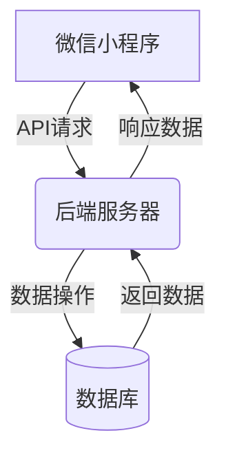

# 基于微信小程序的校园二手物品交易平台的设计与实现

## 1.背景介绍

### 1.1 校园二手物品交易的需求

在校园生活中,学生们经常会遇到一些闲置物品需要出售或者需要购买的情况。传统的校园二手物品交易方式存在诸多不便,比如信息不对称、交易渠道单一、安全性和可信度较低等问题。随着移动互联网的快速发展,基于微信小程序的校园二手物品交易平台应运而生,为校园师生提供了一个高效、便捷、安全的二手物品交易渠道。

### 1.2 微信小程序的优势

微信小程序是一种全新的连接用户与服务的技术体验方式,它可以在微信内被便捷地获取和传播。相比传统的APP,微信小程序具有无需安装、即用即走、体积小巧、无需频繁更新等优势。微信庞大的用户群体也为小程序的推广提供了有利条件。因此,基于微信小程序开发校园二手物品交易平台,可以充分利用微信生态系统的优势,为用户提供无缝的使用体验。

## 2.核心概念与联系

### 2.1 系统架构概览

基于微信小程序的校园二手物品交易平台通常采用前端(微信小程序)、后端(服务器)、数据库的典型三层架构。前端负责界面展示和交互逻辑,后端负责处理业务逻辑和数据操作,数据库用于持久化存储数据。前后端通过API进行通信,实现数据交互。



### 2.2 系统核心功能模块

1. **用户模块**:实现用户注册、登录、个人信息管理等基本功能。
2. **商品模块**:包括商品发布、浏览、搜索、下单、支付、评价等功能。
3. **订单模块**:管理订单生命周期,包括下单、付款、发货、收货、评价等流程。
4. **消息模块**:实现用户间的即时通讯,方便买家和卖家进行沟通交流。
5. **后台管理模块**:提供管理员对系统进行监控、审核、维护等管理功能。

## 3.核心算法原理具体操作步骤

### 3.1 商品推荐算法

为了提高用户体验,系统需要为用户推荐感兴趣的商品。常用的推荐算法包括:

1. **基于内容的推荐算法**:根据商品内容(标题、描述等)与用户历史浏览记录的相似度进行推荐。
2. **协同过滤推荐算法**:基于用户对商品的评分数据,找到与目标用户有相似兴趣爱好的其他用户,并推荐这些用户喜欢的商品。

算法步骤如下:

1. 数据预处理:对商品内容和用户评分数据进行清洗、标准化等预处理。
2. 构建用户/商品特征向量:将用户历史行为和商品内容映射为特征向量。
3. 计算相似度:基于特征向量,计算商品间、用户间的相似度。
4. 生成推荐列表:根据相似度排序,推荐最相关的商品。
5. 评估反馈:收集用户反馈,不断优化算法模型。

### 3.2 商品搜索算法

为了提高搜索效率,系统需要对商品标题、描述等文本数据建立倒排索引。搜索算法步骤如下:

1. 分词:将查询关键词和商品文本进行分词,得到词项集合。
2. 构建倒排索引:遍历文档集,对每个词项构建一个记录了该词项所在文档的倒排索引。
3. 计算相关度分数:根据词项在文档中的位置、频率等,计算查询和文档之间的相关度分数。
4. 排序输出:根据相关度分数对结果进行排序,返回最相关的商品列表。

## 4.数学模型和公式详细讲解举例说明

### 4.1 商品相似度计算

在推荐系统中,计算商品相似度是一个关键环节。常用的相似度计算方法是**余弦相似度**:

$$sim(i,j)=\cos(\\vec{i},\\vec{j})=\frac{\vec{i}\cdot\vec{j}}{\|\vec{i}\|\|\vec{j}\|}=\frac{\sum_{k=1}^{n}i_k\times j_k}{\sqrt{\sum_{k=1}^{n}(i_k)^2}\sqrt{\sum_{k=1}^{n}(j_k)^2}}$$

其中$\vec{i}$和$\vec{j}$分别表示商品$i$和商品$j$的特征向量。

例如,有两个商品的特征向量为:

$$\vec{i}=(2,3,5,4)$$
$$\vec{j}=(5,1,3,2)$$

则它们的余弦相似度为:

$$sim(i,j)=\frac{2\times 5+3\times 1+5\times 3+4\times 2}{\sqrt{2^2+3^2+5^2+4^2}\sqrt{5^2+1^2+3^2+2^2}}=\frac{37}{\sqrt{38}\sqrt{38}}\\approx0.62$$

### 4.2 个性化排序策略

对于不同的用户,可以根据其历史行为数据,给出个性化的排序策略,提高推荐效果。

设用户$u$对商品$i$的感兴趣程度为$\hat{r}_{ui}$,则我们的目标是最大化用户对推荐列表的总体感兴趣程度:

$$\max\sum_{i\in L}\hat{r}_{ui}$$

其中$L$表示推荐列表,通常由多个目标函数构成,如商品相关度、曝光公平度、多样性等,形成一个线性加权模型:

$$\hat{r}_{ui}=\sum_{k}w_kf_k(u,i)$$

$f_k$为第$k$个目标函数,$w_k$为对应权重。通过机器学习的方法,可以学习最优参数$w_k$,平衡各目标函数的影响。

## 4.项目实践:代码实例和详细解释说明

### 4.1 商品发布功能

以下是一个简化的商品发布功能代码示例:

```javascript
// 商品模型
const db = wx.cloud.database()
const products = db.collection('products')

// 发布商品
async function publishProduct(product) {
  try {
    await products.add({
      data: {
        title: product.title,
        description: product.description,
        images: product.images,
        price: product.price,
        category: product.category,
        userId: getApp().getUserId()
      }
    })
  } catch (e) {
    console.error(e)
  }
}

// 上传图片
async function uploadImages(images) {
  const uploadTasks = images.map(image => wx.cloud.uploadFile({
    cloudPath: `products/${Date.now()}-${Math.floor(Math.random()*1000)}.png`,
    filePath: image
  }))
  
  return (await Promise.all(uploadTasks)).map(res => res.fileID)
}

// 页面事件绑定
Page({
  data: {
    // 表单数据
  },
  
  publishProduct() {
    const product = this.data.form
    
    uploadImages(product.images)
      .then(imageIds => {
        product.images = imageIds
        return publishProduct(product)
      })
      .then(console.log('发布成功'))
      .catch(console.error)
  }
})
```

解释:

1. 引入云开发数据库实例,创建商品集合引用。
2. `publishProduct`函数将商品数据插入数据库。
3. `uploadImages`函数上传本地图片到云存储,返回文件ID列表。
4. 在页面的`publishProduct`方法中,先上传图片获取文件ID,再调用`publishProduct`发布商品。

### 4.2 商品列表渲染

```xml
<!-- 商品列表渲染 -->
<view class="product-list">
  <view class="product-item" wx:for="{{products}}" wx:key="index">
    <image class="product-image" src="{{item.images[0]}}" mode="aspectFill"></image>
    <view class="product-info">
      <view class="product-title">{{item.title}}</view>
      <view class="product-price">¥ {{item.price}}</view>
    </view>
  </view>
</view>
```

```javascript
// 页面加载
onLoad() {
  this.getProducts()
},

// 获取商品列表
async getProducts() {
  try {
    const products = await db.collection('products')
      .where({ // 查询条件
        // ...
      })
      .get()
    
    this.setData({
      products: products.data
    })
  } catch (e) {
    console.error(e)
  }
}
```

解释:

1. 使用`wx:for`指令遍历渲染商品列表。
2. 在`onLoad`生命周期获取商品数据,可以添加查询条件如分类、关键词等。
3. 将查询结果设置到`products`数据字段,自动渲染到视图层。

## 5.实际应用场景

校园二手物品交易平台可以广泛应用于各类场景,满足师生的多样化需求:

1. **校园生活用品交易**:如书籍、文具、数码产品、运动用品等。
2. **毕业生交易**:毕业季节,毕业生可出售自己的生活用品、学习资料等。
3. **社团活动物品交易**:各类社团活动所需的物资,可以在平台上进行交易。
4. **实习就业用品交易**:应届毕业生可以在平台上出售自己的职业装等。
5. **课程用品交易**:一些专业课程所需的实验器材、样品等,可以在平台上流通。
6. **租赁服务**:除了交易,平台还可以提供生活用品的租赁服务。

## 6.工具和资源推荐

1. **微信开发者工具**: https://developers.weixin.qq.com/miniprogram/dev/devtools/devtools.html
2. **云开发文档**: https://developers.weixin.qq.com/miniprogram/dev/wxcloud/basis/getting-started.html
3. **ColorUI组件库**: https://github.com/weilanwl/ColorUI
4. **Vant Weapp组件库**: https://youzan.github.io/vant-weapp
5. **Lin UI组件库**: https://github.com/TaleLin/lin-ui
6. **微信公众平台**: https://mp.weixin.qq.com

## 7.总结:未来发展趋势与挑战

### 7.1 发展趋势

1. **智能化**:利用大数据和人工智能技术,实现个性化推荐、智能定价等功能,提升用户体验。
2. **多场景覆盖**:除了校园场景,可拓展到更广阔的二手交易领域,如社区、城市等。
3. **生态融合**:与更多线上线下服务相融合,如同城配送、线下体验店等,打造全场景服务。
4. **增值服务**:提供更多增值服务,如鉴定、养护、回收等,延伸商业价值链。

### 7.2 面临挑战

1. **数据安全**:如何保护用户隐私和交易安全,是平台面临的重大挑战之一。
2. **恶意行为**:需要建立完善的审核机制,防止虚假信息、欺诈行为等。
3. **用户体验**:如何在移动端实现良好的用户体验,需要持续优化和创新。
4. **商业模式**:寻求合理的盈利模式,实现平台可持续发展。

## 8.附录:常见问题与解答

1. **如何保证交易安全?**
   
   平台将引入第三方支付、线下核验、信用评级等机制,确保买卖双方的权益。同时,管理员会对发布的商品信息和交易行为进行审核,发现违规行为将被处理。

2. **支持哪些支付方式?**

   可支持微信支付、银行卡支付等多种方式。未来将根据用户需求持续扩展支持更多支付渠道。

3. **能否发布虚拟商品?**

   是的,除了实物商品,平台也支持发布各类虚拟商品和服务,如课程资料、技能服务等。

4. **如何进行商品筛选?**

   用户可以根据分类、价格区间、上架时间等多种条件进行商品筛选,快速找到自己需要的商品。

5. **如何评价买家或卖家?**

   交易完成后,买家可以对卖家的商品描述和服务态度进行评价;卖家也可以对