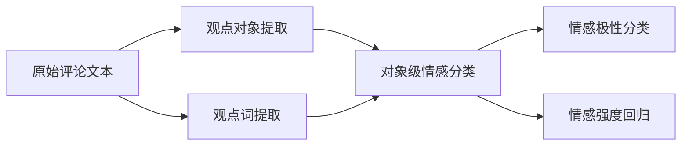

# 基于机器学习的中文情感识别研究

作者：禅与计算机程序设计艺术

## 1. 背景介绍

随着社交媒体的迅速发展,每天都有海量的用户生成内容(User Generated Content,UGC)产生。这些UGC蕴含着丰富的情感信息,对这些信息进行情感分析具有重要的商业价值和社会意义。情感分析可以帮助企业洞察用户对其产品和服务的情感倾向,也可以帮助政府部门及时发现负面舆情,从而更好地做出决策。

### 1.1 中文情感分析的挑战

与英文等西方语言相比,中文情感分析面临更多挑战:

1. 中文词语的多义性更强,同一个词在不同语境下可能表达完全不同的情感倾向。
2. 中文用户经常使用口语化、不规范的表达方式,增加了情感识别的难度。 
3. 中文缺乏大规模、高质量的情感标注语料库,限制了基于机器学习的情感分析方法的发展。

### 1.2 机器学习在情感分析中的应用

传统的情感分析方法主要基于情感词典,存在覆盖面不足、无法处理复杂语义等问题。近年来,随着深度学习的兴起,基于机器学习尤其是深度学习的情感分析方法取得了长足进展。与词典法相比,机器学习方法具有以下优势:

1. 通过从大规模语料中自动学习特征,克服了词典覆盖不足的问题。
2. 能够建模词语和句子的上下文语义信息,处理复杂的语义组合问题。
3. 端到端的学习方式,减少了人工特征工程,提高了模型的泛化能力。

本文将重点探讨如何利用机器学习技术,尤其是深度学习方法,来构建高效、准确的中文情感识别模型。

## 2. 核心概念与关系

在介绍具体的情感识别方法之前,我们首先需要明确几个核心概念:

### 2.1 情感极性分类

情感极性分类(Sentiment Polarity Classification)是情感分析的基本任务,目标是判断一段文本的情感倾向是积极(Positive)、消极(Negative)还是中性(Neutral)。它是一个典型的文本分类问题。

### 2.2 情感强度回归

在实际应用中,我们往往不仅需要判断情感倾向的类别,还需要知道情感倾向的程度或强度。情感强度回归就是要预测一段文本的情感强度值,通常用-1到1之间的实数表示,数值越大表示越积极。

### 2.3 观点对象提取

实际的评论文本通常包含多个评价对象(aspect),以及针对每个对象的情感倾向。观点对象提取(Opinion Target Extraction)就是从评论文本中识别出各个评价对象,是细粒度情感分析的基础。

### 2.4 观点词提取

除了评价对象,评论文本中还包含表达主观情感倾向的词语,即观点词(Opinion Word)。观点词提取的目标是从文本中识别出这些词语,它对情感倾向的判断至关重要。

上述几个任务之间存在密切联系,其关系如下图所示:



可以看出,观点对象提取和观点词提取是细粒度情感分析的基础任务,在此基础上可以进一步进行对象级的情感极性分类和强度回归。而如果不区分不同的评价对象,则可以直接进行整体的文本级别情感分类。

## 3. 核心算法原理与步骤

本节将重点介绍几种主流的机器学习方法在情感分析任务中的应用,包括:

### 3.1 基于词典的方法

1. 构建情感词典,包括积极、消极两类词。
2. 对文本进行分词。
3. 计算文本中积极词和消极词的比例,据此判断文本的情感倾向。

优点是简单直观,缺点是覆盖面受限,且无法处理复杂语义。

### 3.2 机器学习分类方法

1. 将文本表示为特征向量,常见的特征有:
   - 词袋(Bag-of-words)
   - TF-IDF
   - 主题模型如LDA
   - 词向量如Word2Vec、GloVe等
2. 选择合适的分类器并训练,常见的有:
   - 朴素贝叶斯
   - 逻辑回归
   - 支持向量机(SVM)
3. 用训练好的分类器预测新文本的情感倾向。

优点是特征丰富,泛化能力强,缺点是依赖人工特征,忽略了词序信息。

### 3.3 基于深度学习的方法

与传统机器学习方法相比,深度学习可以自动学习层次化的文本表示,更好地挖掘语义信息。主要模型包括:

#### 3.3.1 CNN

1. 将词向量组成文本矩阵。
2. 用多个不同尺寸的卷积核对文本矩阵进行卷积,提取局部特征。
3. 对卷积结果进行最大池化(max-pooling),得到文本的整体表示。
4. 将文本表示输入全连接层进行分类。

优点是能够提取局部特征,捕捉关键词组合信息。

#### 3.3.2 RNN

1. 将文本看作词向量序列$(x_1,x_2,...,x_T)$。
2. 用RNN依次处理各个词向量,在每个时刻$t$产生隐藏状态$h_t$:
$$h_t=f(Ux_t+Wh_{t-1}+b)$$
其中$f$通常选择双曲正切函数tanh或门控单元如LSTM、GRU等。
3. 将最后时刻的隐藏状态$h_T$或各时刻隐藏状态的均值作为文本表示,输入分类器。

优点是能够建模文本的序列依赖关系,更好地理解语义。

#### 3.3.3 Attention机制

Attention机制与RNN结合,可以自动学习分配给不同词的注意力权重,突出关键词的作用。主要步骤为:

1. 计算每个隐藏状态$h_t$的注意力权重:
$$\alpha_t=\frac{exp(h_t^TW)}{\sum_t exp(h_t^TW)}$$
其中$W$是可学习的参数矩阵。
2. 将各时刻隐藏状态$h_t$加权求和,得到文本表示$v$:
$$v=\sum_t \alpha_t h_t$$
3. 将$v$输入分类器。

Attention机制可以帮助模型更好地聚焦于情感倾向的关键线索。

## 4. 数学模型与公式推导

本节以逻辑回归模型为例,介绍情感分类的数学原理。逻辑回归是处理二分类问题的常用模型,其核心思想是:将输入特征通过Sigmoid函数映射为0到1之间的概率值,再根据概率值进行分类。

### 4.1 逻辑回归模型

设输入特征向量为$\boldsymbol{x} \in \mathbb{R}^n$,模型参数为$\boldsymbol{w} \in \mathbb{R}^n$和$b \in \mathbb{R}$。逻辑回归模型假设样本为正类(标签$y=1$)的概率为:

$$P(y=1|\boldsymbol{x})=\frac{1}{1+e^{-(\boldsymbol{w}^T\boldsymbol{x}+b)}}=\sigma(\boldsymbol{w}^T\boldsymbol{x}+b)$$

其中$\sigma(x)=\frac{1}{1+e^{-x}}$为Sigmoid函数。相应地,样本为负类(标签$y=0$)的概率为:

$$P(y=0|\boldsymbol{x})=1-P(y=1|\boldsymbol{x})=1-\sigma(\boldsymbol{w}^T\boldsymbol{x}+b)$$

### 4.2 参数估计

给定训练集$\{(\boldsymbol{x}_1,y_1),(\boldsymbol{x}_2,y_2),...,(\boldsymbol{x}_m,y_m)\}$,其中$y_i \in \{0,1\}$,可以应用极大似然估计来估计模型参数$\boldsymbol{w}$和$b$。似然函数为:

$$L(\boldsymbol{w},b)=\prod_{i=1}^m P(y_i|\boldsymbol{x}_i)=\prod_{i=1}^m [\sigma(\boldsymbol{w}^T\boldsymbol{x}_i+b)]^{y_i}[1-\sigma(\boldsymbol{w}^T\boldsymbol{x}_i+b)]^{1-y_i}$$

为了便于求解,通常对似然函数取对数,得到对数似然函数:

$$\begin{aligned}
l(\boldsymbol{w},b)&=\log L(\boldsymbol{w},b)=\sum_{i=1}^m [y_i\log\sigma(\boldsymbol{w}^T\boldsymbol{x}_i+b)+(1-y_i)\log(1-\sigma(\boldsymbol{w}^T\boldsymbol{x}_i+b))]\\
&=\sum_{i=1}^m [y_i(\boldsymbol{w}^T\boldsymbol{x}_i+b)-\log(1+e^{\boldsymbol{w}^T\boldsymbol{x}_i+b})]
\end{aligned}$$

目标是找到参数$\boldsymbol{w}$和$b$以最大化$l(\boldsymbol{w},b)$。这可以通过梯度上升法实现,其迭代公式为:

$$\begin{aligned}
\boldsymbol{w} &:= \boldsymbol{w} + \eta \sum_{i=1}^m (\sigma(\boldsymbol{w}^T\boldsymbol{x}_i+b)-y_i)\boldsymbol{x}_i\\
b &:= b + \eta \sum_{i=1}^m (\sigma(\boldsymbol{w}^T\boldsymbol{x}_i+b)-y_i)
\end{aligned}$$

其中$\eta$为学习率。在实践中,通常采用随机梯度上升,即每次迭代随机选择一个样本$(x_i,y_i)$来更新参数。

### 4.3 多分类逻辑回归

二分类逻辑回归可以推广到多分类情况。设类别数为$K$,对于类别$k$,引入参数$\boldsymbol{w}_k$和$b_k$,定义

$$z_k=\boldsymbol{w}_k^T\boldsymbol{x}+b_k,\quad k=1,2,...,K$$

再应用Softmax函数将$z_k$转化为概率:

$$P(y=k|\boldsymbol{x})=\frac{e^{z_k}}{\sum_{j=1}^K e^{z_j}}$$

模型的训练方法与二分类情况类似,这里不再赘述。

## 5. 项目实践

下面我们以Python和Keras库为例,演示如何构建一个基于LSTM的中文情感分类模型。

### 5.1 数据准备

首先导入所需的库:

```python
import numpy as np 
import pandas as pd
from sklearn.model_selection import train_test_split
from keras.preprocessing.text import Tokenizer
from keras.preprocessing.sequence import pad_sequences
from keras.models import Sequential
from keras.layers import Dense, Embedding, LSTM
```

然后读取数据集:

```python
data = pd.read_csv('data/weibo_senti_100k.csv')
X = data['review'].values
y = data['label'].values
```

这里使用了一个包含10万条微博评论的数据集,每条评论都标注了情感倾向(0表示消极,1表示积极)。接下来将数据划分为训练集和测试集:

```python
X_train, X_test, y_train, y_test = train_test_split(X, y, test_size=0.2, random_state=42)
```

### 5.2 文本预处理

接下来对文本数据进行分词和序列化。首先初始化一个分词器:

```python
tokenizer = Tokenizer(num_words=5000)
tokenizer.fit_on_texts(X_train)
```

这里限定词表大小为5000,即只保留频率最高的5000个词。然后将训练集和测试集文本转化为整数序列:

```python
X_train_seq = tokenizer.texts_to_sequences(X_train)
X_test_seq = tokenizer.texts_to_sequences(X_test)
```

接着对序列进行填充,使其长度一致:

```python
maxlen