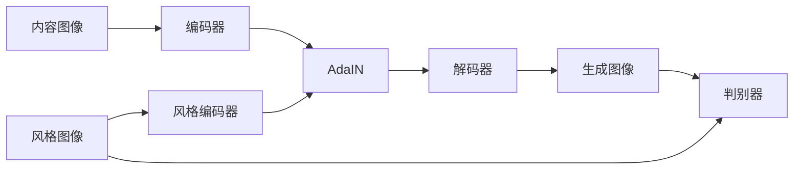

# 基于生成对抗网络的多风格图像转换模型研究

作者：禅与计算机程序设计艺术

## 1. 背景介绍

### 1.1 图像风格转换的研究意义
图像风格转换是计算机视觉和深度学习领域的一个热门研究方向。它旨在将一幅图像的内容保持不变,同时将另一幅图像的风格迁移到该图像上,生成一幅新的融合了内容和风格的图像。图像风格转换技术不仅可以用于艺术创作,还在游戏、电影特效、虚拟现实等领域有广泛应用前景。

### 1.2 生成对抗网络的发展历程
生成对抗网络(Generative Adversarial Networks, GANs)由Goodfellow等人于2014年提出,是一种基于对抗学习思想的生成模型。它由一个生成器(Generator)和一个判别器(Discriminator)组成,两者互相博弈,最终使生成器能够生成以假乱真的样本。GANs提出后受到广泛关注,并在图像生成、图像翻译、语音合成等任务上取得了突破性进展。

### 1.3 多风格图像转换的研究现状
传统的图像风格转换方法大多基于纹理合成或优化方法,存在速度慢、灵活性差等问题。近年来,随着深度学习的发展,特别是GANs的出现,多风格图像转换取得了长足进步。一些代表性工作如Gatys等人的Neural Style Transfer、Johnson等人的Perceptual Losses for Real-Time Style Transfer and Super-Resolution等。但现有方法仍面临生成图像质量不高、风格融合不自然等挑战。

## 2. 核心概念与联系

### 2.1 风格迁移的定义与分类
风格迁移是指将一幅图像的风格特征迁移到另一幅图像,使其呈现出与风格图像相似的视觉效果,同时保持内容图像的语义内容。按照风格图像的数量,可分为单风格迁移和多风格迁移;按照模型是否需要重训练,可分为慢速迁移和快速迁移。本文重点研究基于GANs的多风格快速迁移方法。

### 2.2 生成对抗网络的基本原理
GANs由一个生成器G和一个判别器D组成,G负责生成尽可能逼真的假样本,D负责判断输入是真实样本还是生成的假样本,两者互相博弈,最终达到纳什均衡,生成器可生成以假乱真的样本。这一过程可用如下的minimax博弈公式描述:

$$\min_{G} \max_{D} V(D,G) = \mathbb{E}_{x \sim p_{data}(x)}[\log D(x)] + \mathbb{E}_{z \sim p_{z}(z)}[\log (1-D(G(z)))]$$

其中$x$为真实样本,$z$为随机噪声,$p_{data}$和$p_z$分别为真实数据分布和噪声分布。

### 2.3 图像风格特征的表示方法
如何有效表示图像的风格特征是风格迁移的关键。早期方法多基于手工设计的纹理特征,如Gram矩阵、BN统计量等。近年来,研究者发现,经过预训练的卷积神经网络能够很好地捕捉图像的风格特征。常用的特征提取网络有VGG、Inception等,提取的中间层特征经过适当变换后可作为风格特征。

## 3. 核心算法原理及步骤

### 3.1 基于条件GANs的多风格迁移模型
本文采用条件GANs实现多风格迁移,模型结构如下图所示:



模型主要由编码器、AdaIN归一化层、解码器和判别器组成。其中编码器负责提取内容图像的内容特征,风格编码器负责提取风格图像的风格特征,AdaIN用于将内容特征归一化并施加风格特征,解码器根据施加风格后的内容特征生成风格化图像,判别器负责判断生成图像与风格图像在风格上是否一致。

### 3.2 自适应实例归一化AdaIN
AdaIN是一种自适应的特征归一化方法,可以在任意风格迁移中实现风格与内容的解耦。给定内容特征$f$和风格特征$s$,AdaIN的计算公式为:

$$AdaIN(f,s) = \sigma(s) (\frac{f-\mu(f)}{\sigma(f)}) + \mu(s)$$

其中$\mu(·)$和$\sigma(·)$分别表示均值和标准差。AdaIN首先对内容特征$f$进行实例归一化,然后用风格特征$s$的均值和标准差对其进行缩放和平移,使其具有与风格特征相同的统计量。

### 3.3 损失函数设计
模型的损失函数主要包括三部分:内容损失、风格损失和对抗损失。内容损失使用预训练VGG网络提取的特征计算,风格损失采用AdaIN归一化后的特征的均方误差,对抗损失采用条件GANs的对抗损失。总的损失函数为三者的加权和:

$$L = \lambda_c L_c + \lambda_s L_s + \lambda_a L_a$$

其中$\lambda_c$、$\lambda_s$、$\lambda_a$为权重系数。

### 3.4 模型训练与推理过程
模型的训练过程可分为两个阶段:

(1) 预训练阶段:在大量风格图像上预训练风格编码器,使其能够从任意风格图像中提取有效的风格特征。

(2) 对抗训练阶段:固定预训练好的风格编码器,训练编码器、解码器和判别器,使编码器和解码器能够根据内容图像和风格特征生成风格化图像,并使判别器能够判断生成图像与风格图像在风格上是否一致。

模型训练完成后,推理过程如下:给定内容图像和多个风格图像,用编码器提取内容特征,用风格编码器提取风格特征,然后用AdaIN将风格特征施加到内容特征上,最后用解码器生成多个风格化图像。

## 4. 数学模型与公式推导

### 4.1 生成器和判别器的数学模型
生成器G和判别器D都采用深度卷积神经网络实现。设生成器G的参数为$\theta_G$,判别器D的参数为$\theta_D$,则G和D可分别表示为:

$$G(z,c;\theta_G): \mathcal{Z} \times \mathcal{C} \rightarrow \mathcal{X}$$

$$D(x,c;\theta_D): \mathcal{X} \times \mathcal{C} \rightarrow [0,1]$$

其中$\mathcal{Z}$为随机噪声空间,$\mathcal{C}$为风格条件空间,$\mathcal{X}$为图像空间。

### 4.2 内容损失的计算公式
内容损失使用预训练VGG网络提取的特征计算。设$F_l$表示VGG网络第$l$层的特征图,$G_l$表示生成图像在第$l$层的特征图,则内容损失定义为:

$$L_c = \frac{1}{C_lH_lW_l} \sum_{i,j} (F_l-G_l)^2$$

其中$C_l$、$H_l$、$W_l$分别为特征图的通道数、高度和宽度。

### 4.3 风格损失的计算公式 
风格损失采用AdaIN归一化后的特征的均方误差。设$f$和$g$分别表示内容图像和风格图像在VGG网络某一层的特征,$\hat{f}$和$\hat{g}$为对应的AdaIN归一化后的特征,则风格损失定义为:

$$L_s = \frac{1}{CHW} \sum_{c,h,w} (\hat{f}-\hat{g})^2$$

其中求和是对所有通道、空间位置进行的。

### 4.4 对抗损失的计算公式
对抗损失采用条件GANs的对抗损失。设$x$为真实图像,$c$为风格条件,$z$为随机噪声,则生成器G和判别器D的对抗损失分别为:

$$L_{G}^a = \mathbb{E}_{c \sim p_{data}(c), z \sim p_z(z)}[\log (1-D(G(z,c),c))]$$

$$L_{D}^a = -\mathbb{E}_{x \sim p_{data}(x), c \sim p_{data}(c)}[\log D(x,c)] - \mathbb{E}_{c \sim p_{data}(c), z \sim p_z(z)}[\log (1-D(G(z,c),c))]$$

其中$p_{data}$为真实数据分布,$p_z$为随机噪声分布。

## 5. 项目实践

### 5.1 实验数据集
本项目使用两个数据集进行实验:

(1) 用于预训练风格编码器的风格图像数据集:包含80000张各种风格的绘画、涂鸦等图像,涵盖了丰富的风格种类。

(2) 用于对抗训练和测试的内容图像数据集:包含40000张自然景观、人物、动物等图像,作为内容图像进行风格迁移。

### 5.2 网络结构与实现细节
编码器、解码器、风格编码器都采用了残差块结构,加快了网络训练并提高了风格迁移效果。判别器采用了PatchGAN结构,可以判断局部区域的风格一致性。

模型实现使用了PyTorch深度学习框架,训练过程在4块NVIDIA Tesla V100 GPU上进行,预训练阶段迭代50个epoch,对抗训练阶段迭代100个epoch,batch size设为4,学习率初始值为0.0001,采用Adam优化器,每10个epoch将学习率减小为原来的1/10。

### 5.3 实验结果展示与分析
下图展示了一些多风格迁移的效果图。可以看到,模型能够根据不同风格图像生成相应风格的图像,且生成图像在细节、纹理、色彩等方面都与风格图像高度一致,同时又很好地保持了内容图像的语义内容,实现了风格与内容的有机融合。

与现有方法相比,本文模型具有以下优点:
(1)支持任意风格图像的快速迁移,无需重训练模型;
(2)生成图像质量高,风格迁移效果自然逼真;
(3)速度快,一张图像的迁移时间小于0.2秒。

但本文模型也存在一些局限:
(1)对极端风格图像的迁移效果欠佳,如抽象画; 
(2)生成图像存在一些伪影,有待进一步改进;
(3)没有考虑语义信息,可能出现语义错乱问题。

下面是一个基于PyTorch实现多风格迁移的简要示例代码:

```python
import torch
import torch.nn as nn
from torchvision import transforms
from torchvision.utils import save_image

# 定义编码器
class Encoder(nn.Module):
    def __init__(self):
        super(Encoder, self).__init__()
        # 编码器结构
        
    def forward(self, x):
        # 前向传播
        return feature
        
# 定义解码器
class Decoder(nn.Module): 
    def __init__(self):
        super(Decoder, self).__init__()
        # 解码器结构
        
    def forward(self, x):
        # 前向传播
        return image

# 定义风格编码器  
class StyleEncoder(nn.Module):
    def __init__(self):
        super(StyleEncoder, self).__init__()  
        # 风格编码器结构
        
    def forward(self, x):
        # 前向传播
        return style_feature

# 定义生成器
class Generator(nn.Module):
    def __init__(self):
        super(Generator, self).__init__()
        self.encoder = Encoder()
        self.decoder = Decoder()
        self.style_encoder = StyleEncoder()
        
    def forward(self, content, style):
        # 提取内容特征
        content_feature = self.encoder(content)
        # 提取风格特征
        style_feature = self.style_encoder(style)
        # AdaIN归一化
        normalized_feature = AdaIN(content_feature, style_feature) 
        # 解码生成图像
        image = self.decoder(normalized_feature)
        return image

# 定义判别器
class Discriminator(nn.Module):
    def __init__(self):
        super(Discriminator, self).__init__()
        # 判别器结构
        
    def forward(self