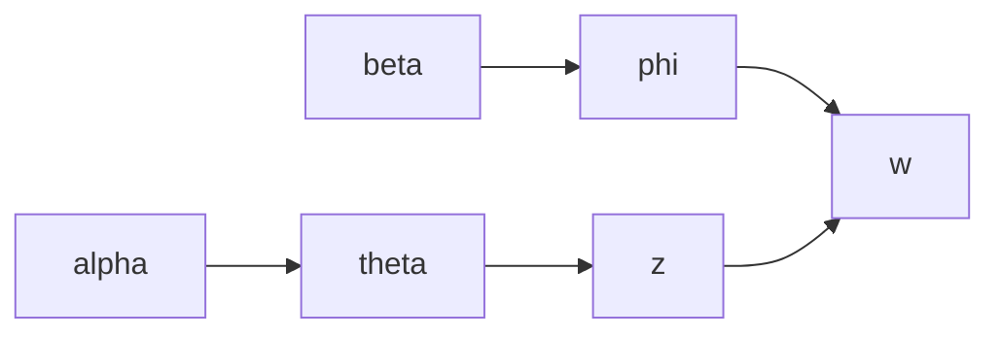

# 基于用户评价体系改善餐饮业经营的分析与应用研究

## 1.背景介绍

### 1.1 餐饮业的重要性

餐饮业是一个古老而又充满活力的行业,它不仅为人们提供了美味佳肴,也成为了社交和文化交流的重要场所。在当今快节奏的生活方式中,外食已经成为了许多人的常态。根据统计数据,餐饮业在全球范围内的市场规模已经超过了3万亿美元,并且仍在持续增长。

### 1.2 餐饮业面临的挑战

尽管餐饮业蓬勃发展,但它也面临着诸多挑战。首先,消费者期望不断提高,他们对餐厅的环境、服务质量和食物品质有更高的要求。其次,市场竞争日益激烈,新兴餐饮概念层出不穷,传统餐厅难以立足。此外,餐饮业的利润率通常较低,经营成本如人力、原材料等不断上涨,给经营者带来压力。

### 1.3 用户评价的重要性

在这种背景下,收集和分析用户评价对于餐饮业的发展至关重要。用户评价不仅能够反映消费者的真实需求和体验,还能帮助餐厅发现问题并持续改进。通过建立有效的用户评价体系,餐饮企业可以提高客户满意度,增强品牌忠诚度,从而获得持续的竞争优势。

## 2.核心概念与联系

### 2.1 用户评价体系的定义

用户评价体系是指通过系统化的方式收集、分析和利用用户评价数据,以支持餐饮企业的决策和改进。它包括以下几个关键要素:

1. 评价渠道:包括线上渠道(如在线评论平台、社交媒体)和线下渠道(如现场反馈卡、访谈等)。
2. 评价指标:涵盖餐厅各个方面,如食物质量、服务态度、环境氛围等。
3. 数据采集:通过自动化工具或人工方式收集用户评价数据。
4. 数据分析:运用数据挖掘、自然语言处理等技术对评价数据进行深入分析。
5. 反馈机制:将分析结果反馈给相关部门,并制定改进措施。

### 2.2 用户评价体系与餐饮业的关系

用户评价体系对于餐饮业的发展有着深远的影响:

1. 提高客户满意度:通过收集和分析用户评价,可以及时发现问题并加以改正,从而提升用户体验。
2. 优化经营决策:评价数据可以为餐厅的营销策略、菜品设计、服务流程等提供宝贵的参考。
3. 增强品牌形象:良好的用户评价能够提升餐厅的知名度和美誉度,从而吸引更多消费者。
4. 促进持续改进:用户评价体系将形成一个闭环,推动餐厅不断学习和进步。

## 3.核心算法原理具体操作步骤  

### 3.1 数据采集

用户评价数据的采集是整个分析过程的基础。常见的数据采集方式包括:

1. **网络爬虫**:通过编写程序自动采集主流在线评论平台(如大众点评、饿了么等)上的评论数据。
2. **API接口**:一些评论平台提供了开放API,可以直接调用获取评论数据。
3. **人工收集**:对于线下反馈渠道(如反馈卡、访谈等),需要人工将数据录入系统。

在采集过程中,需要注意数据的完整性、准确性和隐私合规性。可以设置过滤规则去除无效评论,并对敏感信息(如用户姓名、联系方式等)进行脱敏处理。

### 3.2 数据预处理

由于原始评价数据通常是非结构化的文本,需要进行预处理以便后续分析:

1. **分词**:将评论文本按照语义单位(如词语、短语等)进行分割。
2. **去停用词**:移除语气词、虚词等对分析无意义的词语。
3. **词性标注**:识别每个词语的词性(如名词、动词等),有助于提取关键信息。
4. **情感分析**:判断评论的情感倾向(如正面、负面或中性)。

常用的自然语言处理工具包括jieba(中文)、NLTK(英文)等。

### 3.3 特征提取

从预处理后的数据中提取有价值的特征,作为后续分析的输入。常见的特征包括:

1. **词频**:统计每个词语在所有评论中出现的频率,词频高的词语通常较为重要。
2. **词共现**:分析两个词语同时出现的频率,可以发现潜在的关联关系。
3. **主题模型**:通过无监督学习算法(如LDA)自动发现评论文本中的潜在主题。
4. **情感词典**:构建包含情感极性的词典,用于情感分析。

特征提取的目的是将非结构化数据转化为结构化的数值向量,以便后续的机器学习算法处理。

### 3.4 模型构建与评估

基于提取的特征,可以构建各种机器学习模型来分析用户评价数据:

1. **分类模型**:将评论分为正面、负面等类别,常用的算法有逻辑回归、支持向量机等。
2. **主题模型**:发现评论文本中的潜在主题及其分布,如LDA主题模型。
3. **聚类模型**:根据评论的相似性将其划分为若干簇,如K-Means聚类。
4. **关联规则挖掘**:发现评论中存在的关联模式,如"服务态度差"往往伴随"环境嘈杂"。

在模型构建过程中,需要进行参数调优、交叉验证等,以提高模型的泛化能力。常用的评估指标包括准确率、F1分数、Silhouette系数等。

### 3.5 可视化与报告

将分析结果以直观的形式呈现,有助于决策者快速获取洞见。常见的可视化方式包括:

1. **词云**:以可视化的方式展示高频词汇。
2. **情感分布**:统计正面、负面评论的比例。
3. **主题分布**:展示不同主题及其权重。
4. **聚类结果**:将相似评论归为同一簇并标示特征词。
5. **关联规则**:以网络图等形式呈现评论间的关联关系。

此外,还需要定期生成分析报告,总结发现的问题、改进建议等,并呈现给相关决策者。

## 4.数学模型和公式详细讲解举例说明

用户评价分析过程中涉及到多种数学模型和算法,下面将详细介绍其中的几种核心模型。

### 4.1 TF-IDF

TF-IDF(Term Frequency-Inverse Document Frequency)是一种常用的文本特征向量化方法,能够较好地表征词语对文本的重要程度。对于词语$t$和文档$d$,TF-IDF的计算公式为:

$$\mathrm{tfidf}(t,d)=\mathrm{tf}(t,d)\times\mathrm{idf}(t)$$

其中,$\mathrm{tf}(t,d)$表示词语$t$在文档$d$中出现的频率,$\mathrm{idf}(t)$表示词语$t$的逆文档频率,用于衡量该词语的区分能力。具体计算方式如下:

$$\mathrm{tf}(t,d)=\frac{n_{t,d}}{\sum_{t'\in d}n_{t',d}}$$

$$\mathrm{idf}(t)=\log\frac{|D|}{|\{d\in D:t\in d\}|}$$

其中,$n_{t,d}$表示词语$t$在文档$d$中出现的次数,$|D|$表示语料库中文档的总数,$|\{d\in D:t\in d\}|$表示包含词语$t$的文档数量。

TF-IDF能够很好地平衡词语的频率和区分能力,常用于文本分类、聚类等任务中。

### 4.2 LDA主题模型

LDA(Latent Dirichlet Allocation)是一种常用的主题模型,能够从文档集合中自动发现潜在的语义主题。LDA的基本思想是:每个文档是由若干个主题构成的,而每个主题又是由若干个词语混合而成的。

LDA模型的生成过程可以用下图表示:



其中:
- $\alpha$是文档-主题分布的先验Dirichlet分布参数
- $\theta$是文档$d$的主题分布,服从Dirichlet分布
- $\beta$是主题-词语分布的先验Dirichlet分布参数  
- $\phi$是主题$k$的词语分布,服从Dirichlet分布
- $z$是词语$w$的主题分配,服从$\theta$分布
- $w$是观测到的词语,服从$\phi$分布

在给定文档集合$D$的情况下,LDA模型的目标是求解最大化$P(w|D,\alpha,\beta)$的$\theta$和$\phi$参数,这是一个困难的概率计算问题。常用的求解算法包括吉布斯采样、变分推断等。

LDA模型能够自动发现语料库中的主题分布,并给出每个词语属于各个主题的概率,在文本挖掘领域有广泛应用。

### 4.3 情感分析

情感分析旨在自动识别文本中所蕴含的情感倾向,如正面、负面或中性。常用的方法是基于情感词典和机器学习模型相结合。

一种简单的基于词典的方法是,构建一个情感词典(如正面词典和负面词典),然后统计评论文本中正负面词语的数量,根据它们的差值判断情感倾向。更精确的做法是,给每个词语赋予一个情感强度分数(通常在[-1,1]区间内),然后对评论文本中所有词语的情感分数求和,得到整体情感值。

除了词典方法,也可以将情感分析建模为一个分类问题,利用机器学习算法(如朴素贝叶斯、支持向量机等)从训练数据中学习情感模型。此时需要构建情感标注语料作为训练集,并从文本中提取特征(如词袋模型、n-gram等)作为模型输入。

情感分析不仅可以判断整体情感倾向,还能对不同的情感维度(如积极、消极、愤怒、期望等)进行细分,从而更好地理解用户情绪。此外,结合主题模型等技术,还可以分析不同主题下的情感分布。

## 5. 项目实践:代码实例和详细解释说明

为了更好地理解用户评价分析的实现过程,我们将通过一个基于Python的实例项目来演示。该项目旨在从大众点评网上爬取某餐厅的评论数据,并对其进行情感分析、主题发现等处理,最终生成可视化报告。

### 5.1 数据采集

我们首先使用requests库和正则表达式从大众点评网上抓取评论数据,并将其存储为CSV文件。

```python
import requests
import re
import csv

# 餐厅ID
rest_id = '77384677'

# 构造URL
base_url = 'http://www.dianping.com/shop/{}/review_all'.format(rest_id)
headers = {
    'User-Agent': 'Mozilla/5.0 (Windows NT 10.0; Win64; x64) AppleWebKit/537.36 (KHTML, like Gecko) Chrome/58.0.3029.110 Safari/537.3'
}

# 爬取并解析评论数据
reviews = []
for i in range(10):  # 爬取10页评论
    params = {
        'pageno': i + 1
    }
    response = requests.get(base_url, headers=headers, params=params)
    html = response.text
    review_list = re.findall(r'<div class="review-words">(.+?)</div>', html, re.DOTALL)
    reviews.extend(review_list)

# 存储为CSV文件
with open('reviews.csv', 'w', newline='', encoding='utf-8') as f:
    writer = csv.writer(f)
    writer.writerow(['review'])
    writer.writerows([[review] for review in reviews])
```

上述代码将爬取到的评论数据存储在reviews.csv文件中,每行对应一条评论。