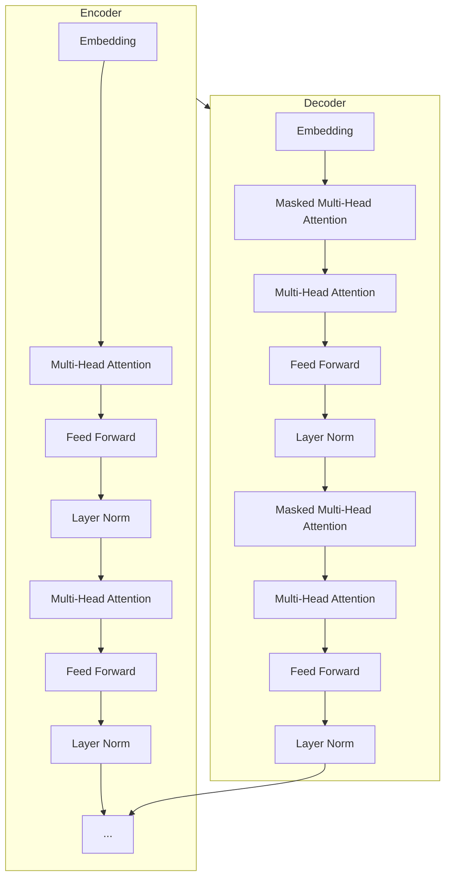

# 多模态大模型：技术原理与实战 思维链方法

## 1.背景介绍

### 1.1 人工智能的发展历程

人工智能(Artificial Intelligence, AI)是当代科技领域最具颠覆性和革命性的技术之一。自20世纪50年代诞生以来,AI经历了几个重要的发展阶段:

- 早期阶段(1950s-1960s):专家系统、博弈树搜索等传统符号主义方法。
- 知识驱动阶段(1970s-1980s):知识表示、推理引擎等专家系统技术。
- 统计学习阶段(1990s-2010s):机器学习、深度学习、神经网络等数据驱动方法。
- 大模型时代(2010s-至今):基于海量数据和算力,训练出通用型大规模预训练模型。

### 1.2 大模型的兴起及重要性

近年来,benefitting from the rapid growth of computing power, the availability of large-scale datasets, and algorithmic breakthroughs, large pre-trained models have emerged as a transformative force in the field of artificial intelligence. These models, often referred to as "foundation models" or "big models," are trained on vast amounts of data using self-supervised learning techniques, enabling them to acquire broad knowledge and capabilities.

大模型的出现彻底改变了人工智能的发展格局,展现出前所未有的能力和潜力。它们可以在自然语言处理、计算机视觉、多模态任务等广泛领域发挥作用,为各行业带来革命性的变革。然而,大模型也面临着诸多挑战和局限性,如数据质量、能源消耗、公平性和可解释性等问题。因此,全面理解大模型的技术原理、训练方法、应用场景以及潜在风险,对于充分发挥其价值至关重要。

### 1.3 多模态大模型的概念

多模态大模型(Multimodal Large Models)是指能够同时处理多种模态输入(如文本、图像、视频、音频等)并产生相应模态输出的大规模预训练模型。相比于单一模态模型,多模态模型具有更强的泛化能力和表现力,可以更好地理解和表达复杂的多模态信息。

多模态大模型的核心思想是在预训练阶段同时利用多源异构数据(如图文数据、视频字幕等),使模型能够学习不同模态之间的相关性和联系。在下游任务中,模型可以灵活地融合多模态信息,提高预测和生成的质量和准确性。

## 2.核心概念与联系  

### 2.1 自注意力机制(Self-Attention)

自注意力机制是构建大型transformer模型的关键技术,它允许模型动态捕捉输入序列中不同位置元素之间的长程依赖关系。相比传统的RNN和CNN,自注意力机制具有并行计算和长程依赖建模的优势。

在自注意力计算中,每个输入元素会与其他所有元素计算注意力权重,然后将加权后的值进行聚合,作为该元素的新表示。数学上可以表示为:

$$\mathrm{Attention}(Q, K, V) = \mathrm{softmax}(\frac{QK^T}{\sqrt{d_k}})V$$

其中 $Q$ 为查询(Query)向量, $K$ 为键(Key)向量, $V$ 为值(Value)向量。 $d_k$ 为缩放因子,用于防止较深层次的值被推入softmax函数的较小梯度区域。

自注意力机制赋予了模型捕捉长程依赖和并行计算的能力,是构建大型transformer模型的基石。

### 2.2 transformer编码器-解码器架构

Transformer是一种全新的基于注意力机制的序列到序列(Seq2Seq)模型,包括编码器(Encoder)和解码器(Decoder)两个主要部分。

**编码器**将输入序列(如文本)映射为连续的向量表示,通过多层self-attention和前馈网络对输入进行编码。

**解码器**则将编码器的输出与解码器的输入(如前一步的输出token)进行注意力计算,生成最终的输出序列。解码器同样采用self-attention来捕捉输出序列中元素的内部依赖关系。

编码器-解码器架构使Transformer能够高效地并行计算,有效建模长程依赖关系,成为构建大型语言模型和多模态模型的主流框架。

### 2.3 预训练与微调(Pre-training & Fine-tuning)

大型预训练模型通常采用两阶段的训练策略:

1. **预训练(Pre-training)**: 在海量unlabeled数据上进行自监督训练,学习通用的知识表示。常见的预训练目标包括:
   - 蒙版语言模型(Masked Language Modeling)
   - 下一句预测(Next Sentence Prediction) 
   - 对比学习(Contrastive Learning)

2. **微调(Fine-tuning)**: 将预训练模型的参数作为初始化,在特定的有标注任务数据上进行进一步的监督训练,使模型适应特定的下游任务。

这种预训练-微调的策略使大模型能够高效地从海量数据中学习通用知识,并快速迁移到新的下游任务,显著提高了训练效率和泛化能力。

### 2.4 多模态融合

多模态大模型的核心挑战是如何有效融合来自不同模态的信息。常见的多模态融合方法包括:

1. **特征级融合**: 将不同模态的特征向量拼接或融合,输入到下游任务模型。
2. **注意力融合**: 使用跨模态注意力机制捕捉不同模态之间的相关性。
3. **融合编码**: 使用统一的编码器对所有模态的输入进行联合编码。
4. **双流融合**: 使用两个单模态编码器分别编码不同模态,再将编码后的特征进行融合。

合理的多模态融合策略对于充分利用多模态信息、提高模型表现至关重要。

### 2.5 思维链(Thought Chain)

思维链是一种用于指导大模型有条理、多步骤地解决复杂问题的范式。它将问题分解为一系列的中间步骤,模型逐步思考和回答每个步骤,最终得到最终结果。

在思维链中,每个步骤都可以是:
- 基于当前信息提出子问题
- 回答子问题
- 做出中间推理和决策
- 总结当前状态

通过将复杂问题分解为易于处理的子步骤,思维链可以提高大模型的解释性、可控性和鲁棒性,使其能够更好地应对具有挑战性的任务。

## 3.核心算法原理具体操作步骤

### 3.1 Transformer模型架构

Transformer模型的核心架构包括编码器(Encoder)和解码器(Decoder)两个主要部分,如下图所示:

**编码器(Encoder)**的主要步骤:

1. 将输入序列(如文本)通过Embedding层映射为连续向量表示
2. 使用多头自注意力(Multi-Head Self-Attention)捕捉输入序列中元素的内部依赖关系
3. 通过前馈网络(Feed Forward)对注意力输出进行非线性变换
4. 使用残差连接(Residual Connection)和层归一化(Layer Normalization)增强模型稳定性

**解码器(Decoder)**除了类似的自注意力和前馈网络外,还引入了:

1. 遮挡自注意力(Masked Self-Attention),确保每个位置的单词只能关注之前的单词
2. 编码器-解码器注意力(Encoder-Decoder Attention),捕捉输入和输出序列之间的关系

通过堆叠多个编码器/解码器层,Transformer可以高效地建模长程依赖关系,并行计算,成为构建大型语言模型和多模态模型的主流框架。

### 3.2 预训练任务

大型预训练模型通常在大规模无标注数据上进行自监督训练,以获取通用的知识表示。常见的预训练任务包括:

1. **蒙版语言模型(Masked Language Modeling, MLM)**

   MLM任务随机将输入序列中的部分token用特殊的[MASK]标记替换,模型需要基于上下文预测被遮蔽的token。MLM可以增强模型对上下文语义的理解能力。

2. **下一句预测(Next Sentence Prediction, NSP)** 

   NSP任务判断两个输入句子是否为连续的句子对。该任务可以增强模型对长程语义关系的建模能力。

3. **对比学习(Contrastive Learning)**

   对比学习旨在学习数据的紧密程度或相似性。常见的方法是最大化正样本之间的相似度,最小化正样本与负样本之间的相似度。

4. **多模态对比学习(Multimodal Contrastive Learning)**

   针对多模态数据,通过最大化不同模态正样本之间的相似度,最小化正样本与负样本之间的相似度,从而学习模态间的关联性。

5. **生成式预训练(Generative Pre-training)**

   生成式预训练任务要求模型基于输入生成与之相关的序列,如图像描述生成、视频字幕生成等。

通过在大规模数据上进行自监督训练,预训练模型可以学习丰富的语义和知识表示,为下游任务奠定基础。

### 3.3 微调策略 

微调(Fine-tuning)是将预训练模型转移到特定下游任务的关键步骤。常用的微调策略包括:

1. **全模型微调(Full Model Fine-tuning)**

   在下游任务数据上对整个预训练模型(包括编码器和解码器)进行端到端的监督微调。适用于大多数情况,但计算代价较高。

2. **编码器微调(Encoder Fine-tuning)** 

   仅微调预训练模型的编码器部分,解码器从头开始训练。适用于生成类任务,如机器翻译、文本摘要等。

3. **预测头微调(Prediction Head Fine-tuning)**

   保持预训练模型主体不变,只在预训练模型的输出上添加一个小的任务特定的预测头(如分类器或回归器)进行微调。适用于计算资源有限的情况。

4. **混合微调(Mixed Fine-tuning)**

   结合上述多种策略,对不同部分采用不同的微调策略。例如对编码器进行全模型微调,而对解码器采用从头训练等。

5. **提示微调(Prompt-based Fine-tuning)**

   不直接对预训练模型进行微调,而是将下游任务构造为一个提示(Prompt),模型基于提示生成相应的输出。

选择合适的微调策略可以在性能和效率之间取得平衡,充分利用预训练模型的知识。

### 3.4 多模态融合方法

多模态大模型需要合理地融合来自不同模态(如文本、图像、视频等)的信息。常见的多模态融合方法包括:

1. **特征级融合**

   将不同模态的特征向量拼接或融合后,输入到下游任务模型。这种方法简单直接,但无法充分捕捉模态间的相关性。

2. **注意力融合**

   使用跨模态注意力机制(Cross-Modality Attention)捕捉不同模态之间的相关性。模型可以自适应地为每个模态分配注意力权重。

   注意力融合可以表示为:

   $$\mathrm{CrossAttention}(Q, K, V) = \mathrm{softmax}(\frac{QK^T}{\sqrt{d_k}})V$$

   其中 $Q$ 为查询模态, $K$ 和 $V$ 为键模态和值模态。

3. **融合编码**

   使用统一的Transformer编码器对所有模态的输入进行联合编码,捕捉模态间的相互作用。编码输出可用于