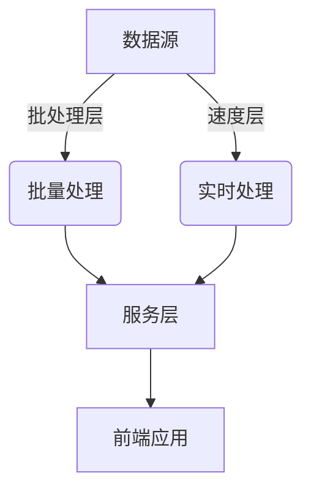

# 大数据背景下的银行个人征信体系研究

## 1.背景介绍

### 1.1 个人征信的重要性

在当今社会中,个人征信体系对于维护金融秩序、促进社会信用建设发挥着至关重要的作用。银行作为主要的信贷机构,对个人征信体系的建立和完善尤为重视。良好的个人征信记录不仅有利于个人获得贷款、信用卡等金融服务,也为银行控制风险、降低不良资产提供了有力保障。

### 1.2 大数据时代的机遇与挑战

随着信息技术的飞速发展,大数据时代已然来临。海量的结构化和非结构化数据为个人征信体系带来了新的机遇,但同时也对其提出了更高的要求。如何利用大数据技术提高个人征信体系的精准性、高效性和可扩展性,成为亟待解决的问题。

## 2.核心概念与联系

### 2.1 个人征信

个人征信是指记录和反映个人信用状况的制度,主要包括个人身份信息、信贷交易记录、还款情况等内容。它是评估个人信用水平的重要依据,在贷款审批、限额管理等方面发挥着关键作用。

### 2.2 大数据

大数据指无法使用传统数据库软件工具进行捕获、管理和处理的海量、高增长率和多样化的信息资产。它具有4V特征:Volume(大量)、Velocity(高速)、Variety(多样)和Value(价值)。

### 2.3 大数据与个人征信的关系

大数据技术为个人征信体系带来了新的发展契机:

1. 数据来源更加丰富,包括网络行为、社交媒体、位置信息等非结构化数据。
2. 数据处理能力更强,能够快速处理海量异构数据。
3. 分析模型更加精准,可以挖掘深层次的数据模式和价值。

通过将大数据技术与个人征信相结合,可以建立更加全面、动态和智能化的个人信用评估体系。

## 3.核心算法原理具体操作步骤  

### 3.1 大数据征信体系架构

基于大数据的个人征信体系通常采用Lambda架构,如下图所示:



1. **数据源**:包括结构化数据(如银行交易记录)和非结构化数据(如网络行为、社交媒体等)。
2. **批处理层**:使用大数据计算框架(如Apache Hadoop)对海量历史数据进行离线处理和分析,构建模型。
3. **速度层**:使用流式计算框架(如Apache Storm/Spark Streaming)对实时数据进行在线处理,更新模型。
4. **服务层**:将批处理和实时处理的结果进行融合,为上层应用提供统一的服务接口。
5. **前端应用**:包括贷款审批、风险预警、营销策略等系统,利用个人征信数据进行决策。

### 3.2 数据处理流程

1. **数据采集**:从各种渠道收集结构化和非结构化数据,包括银行内部数据、第三方数据等。
2. **数据清洗**:对原始数据进行去重、格式转换、缺失值处理等预处理,提高数据质量。
3. **数据存储**:将处理后的数据存储到分布式文件系统(如HDFS)或NoSQL数据库中,方便后续计算。
4. **数据分析**:利用机器学习、数据挖掘等算法对数据进行建模和分析,生成个人信用评分模型。
5. **模型更新**:根据新增数据,定期或实时更新评分模型,提高模型的准确性和时效性。
6. **应用决策**:将个人信用评分模型应用于贷款审批、授信额度、营销策略等场景,辅助决策。

### 3.3 关键算法

在个人征信体系中,常用的机器学习算法包括:

1. **逻辑回归**(Logistic Regression):二分类模型,可用于预测个人违约风险。
2. **决策树**(Decision Tree):分类与回归树,可自动学习数据特征权重。
3. **随机森林**(Random Forest):集成多个决策树,提高模型准确性和鲁棒性。
4. **梯度提升树**(Gradient Boosting Decision Tree):迭代式集成算法,具有高精度。
5. **神经网络**(Neural Network):深度学习模型,可挖掘复杂的非线性关系。

此外,还可以使用关联规则挖掘、聚类分析等无监督学习算法,发现数据中潜在的模式和规律。

## 4.数学模型和公式详细讲解举例说明

在个人征信建模过程中,常用的数学模型包括线性模型、树模型、生存分析模型等。下面以逻辑回归模型为例,介绍其数学原理。

### 4.1 逻辑回归模型

逻辑回归模型是一种广泛应用的概率统计分类模型,常用于预测二分类问题,如个人是否违约。其数学表达式为:

$$
P(Y=1|X) = \frac{1}{1 + e^{-(\beta_0 + \beta_1X_1 + \beta_2X_2 + \cdots + \beta_nX_n)}}
$$

其中:
- $Y$是二值目标变量(0或1)
- $X_i$是自变量(特征)
- $\beta_i$是对应的回归系数

目标是求解最大似然估计 $\hat{\beta}$,使得在给定的训练数据集下,观察结果的概率最大。

对数似然函数为:

$$
l(\beta) = \sum_{i=1}^N [y_i\log(\pi(x_i;\beta)) + (1-y_i)\log(1-\pi(x_i;\beta))]
$$

其中 $\pi(x_i;\beta) = P(Y=1|X=x_i)$。

通过梯度下降等优化算法,可以求解使对数似然函数最大化的 $\hat{\beta}$ 值。得到模型后,即可对新数据进行违约风险预测:

$$
\hat{P}(Y=1|X=x) = \frac{1}{1+e^{-(\hat{\beta}_0 + \hat{\beta}_1x_1 + \hat{\beta}_2x_2 + \cdots + \hat{\beta}_nx_n)}}
$$

### 4.2 模型评估

常用的二分类模型评估指标包括:

- 准确率(Accuracy): $\frac{TP+TN}{TP+TN+FP+FN}$
- 精确率(Precision): $\frac{TP}{TP+FP}$ 
- 召回率(Recall): $\frac{TP}{TP+FN}$
- F1分数: $\frac{2*Precision*Recall}{Precision+Recall}$
- 受试者工作特征曲线(ROC)和曲线下面积(AUC)

其中TP、TN、FP、FN分别表示真正例、真反例、假正例、假反例的个数。

在个人征信场景下,我们更关注的是模型的召回率,即能够精准识别出所有潜在的违约风险个体。

## 4.项目实践:代码实例和详细解释说明

下面给出一个使用Python和Scikit-Learn库构建逻辑回归个人违约风险预测模型的代码示例:

```python
# 导入相关库
import pandas as pd
from sklearn.linear_model import LogisticRegression
from sklearn.model_selection import train_test_split
from sklearn.metrics import accuracy_score, precision_score, recall_score, f1_score, roc_auc_score

# 加载数据
data = pd.read_csv('credit_data.csv')
X = data.drop('default', axis=1)
y = data['default']

# 拆分训练集和测试集
X_train, X_test, y_train, y_test = train_test_split(X, y, test_size=0.2, random_state=42)

# 创建逻辑回归模型
logreg = LogisticRegression()

# 训练模型
logreg.fit(X_train, y_train)

# 预测测试集
y_pred = logreg.predict(X_test)

# 评估模型
print('Accuracy:', accuracy_score(y_test, y_pred))
print('Precision:', precision_score(y_test, y_pred))
print('Recall:', recall_score(y_test, y_pred))
print('F1-score:', f1_score(y_test, y_pred))
print('AUC:', roc_auc_score(y_test, logreg.predict_proba(X_test)[:, 1]))
```

代码解释:

1. 导入相关的Python库,包括Pandas用于数据处理,Scikit-Learn用于机器学习建模。
2. 加载数据集,其中包含个人信息和是否违约的标签。
3. 将数据集拆分为训练集和测试集。
4. 创建逻辑回归模型对象。
5. 使用训练集训练模型。
6. 在测试集上进行预测。
7. 使用accuracy_score、precision_score、recall_score、f1_score和roc_auc_score等函数评估模型性能。

需要注意的是,在实际应用中,我们还需要进行特征工程、模型调参、集成学习等步骤,以获得更好的模型性能。

## 5.实际应用场景

基于大数据的个人征信体系在银行业务中有广泛的应用场景:

### 5.1 贷款审批

通过对个人的信用评分,银行可以更好地评估贷款申请人的还款能力和违约风险,从而做出审批或拒绝的决策。

### 5.2 授信额度管理

根据个人的信用评级,银行可以动态调整其授信额度,既能满足客户的融资需求,又能控制风险在可控范围内。

### 5.3 风险预警

利用个人征信数据,银行可以建立风险预警模型,提前发现潜在的违约风险,并采取相应的风控措施。

### 5.4 精准营销

通过分析个人的信用状况、消费习惯等数据,银行可以为其推荐个性化的金融产品和服务,提高营销转化率。

### 5.5 反欺诈

个人征信体系还可以用于识别欺诈行为,如身份伪造、信息造假等,保障银行业务的合规性和安全性。

## 6.工具和资源推荐

在构建大数据个人征信体系的过程中,可以使用以下工具和资源:

### 6.1 大数据计算框架

- Apache Hadoop: 分布式存储和计算框架
- Apache Spark: 内存计算框架,支持批处理、流计算、机器学习等
- Apache Flink: 流式数据处理框架

### 6.2 机器学习库

- Scikit-Learn: Python机器学习库,支持多种算法
- TensorFlow: Google开源的深度学习框架
- PyTorch: Facebook开源的深度学习框架

### 6.3 数据可视化工具

- Matplotlib: Python数据可视化库
- Tableau: 商业数据可视化工具
- D3.js: JavaScript数据可视化库

### 6.4 在线学习资源

- Coursera机器学习课程
- edX数据科学课程
- Kaggle数据科学竞赛
- GitHub上的开源项目

## 7.总结:未来发展趋势与挑战

### 7.1 发展趋势

1. **人工智能技术融合**:未来的个人征信体系将更多地融合深度学习、自然语言处理等人工智能技术,提高数据分析和决策能力。

2. **多源数据整合**:除了传统的银行内部数据,还将融合来自互联网、物联网等领域的多源异构数据,构建更全面的个人信用画像。

3. **实时在线决策**:借助流式计算和实时数据处理技术,个人征信体系将能够实现实时在线决策,提高响应速度和时效性。

4. **隐私保护与合规性**:随着监管要求的不断提高,个人征信体系需要加强隐私保护和合规性管理,确保数据安全。

5. **开放生态系统**:未来的个人征信体系将更加开放,与其他金融机构、第三方数据源形成良性互动,实现数据共享和协同决策。

### 7.2 面临的挑战

1. **数据质量**:如何保证海量异构数据的准确性、完整性和及时性,是个人征信体系面临的一大挑战。

2. **模型偏差**:由于训练数据的局限性或算法本身的缺陷,模型可能存在