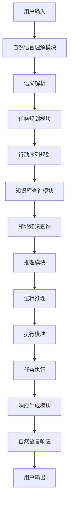

# 大语言模型应用指南：Generative Agents

## 1. 背景介绍

### 1.1 人工智能的发展历程

人工智能(Artificial Intelligence, AI)是当代最具颠覆性的技术之一,它的发展历程可以追溯到上世纪50年代。在过去的几十年里,AI技术取得了长足的进步,从早期的专家系统和机器学习算法,发展到近年来的深度学习和大规模神经网络模型。

### 1.2 大语言模型的兴起

近年来,大规模的语言模型成为AI领域的一股新兴力量。这些模型通过在大量文本数据上进行训练,学习语言的模式和语义关系,从而获得出色的自然语言理解和生成能力。著名的大语言模型包括GPT(Generative Pre-trained Transformer)、BERT(Bidirectional Encoder Representations from Transformers)、XLNet等。

### 1.3 Generative Agents的概念

Generative Agents是一种新型的AI系统,它结合了大语言模型的语言生成能力和传统AI系统的任务执行能力。这种系统不仅能够理解和生成自然语言,还能够根据用户的指令执行各种任务,如数据分析、编程、问答等。Generative Agents有望成为未来人机交互的主要形式之一。

## 2. 核心概念与联系

### 2.1 大语言模型

大语言模型是Generative Agents的核心组成部分。它们通过在海量文本数据上进行预训练,学习语言的语法、语义和上下文关系,从而获得出色的自然语言理解和生成能力。常见的大语言模型包括:

- **GPT(Generative Pre-trained Transformer)**: 由OpenAI开发,是一种基于Transformer架构的自回归语言模型,擅长于文本生成任务。
- **BERT(Bidirectional Encoder Representations from Transformers)**: 由Google开发,是一种双向编码器模型,擅长于自然语言理解任务,如文本分类、问答等。
- **XLNet**: 由Carnegie Mellon University和Google Brain开发,是一种通用自回归语言表示模型,在多项自然语言处理任务上表现出色。

### 2.2 任务执行系统

除了语言理解和生成能力,Generative Agents还需要具备执行各种任务的能力。这通常需要将大语言模型与其他AI组件(如规划、推理、知识库等)相结合。常见的任务执行系统包括:

- **规划系统**: 根据用户的指令,生成一系列行动步骤来完成任务。
- **推理系统**: 利用知识库和推理规则,对用户的查询进行逻辑推理并给出答复。
- **知识库**: 存储结构化的领域知识,为任务执行提供支持。

### 2.3 人机交互

Generative Agents的最终目标是实现自然、高效的人机交互。这需要将语言理解、任务执行和响应生成等多个模块无缝集成。常见的人机交互形式包括:

- **对话系统**: 用户通过自然语言与AI进行对话,提出问题或发出指令。
- **智能助理**: AI助理可以理解用户的需求,执行相应的任务,并以自然语言形式作出响应。
- **协作系统**: 人和AI在特定领域内协作完成复杂任务,相互补充优势。

## 3. 核心算法原理具体操作步骤

### 3.1 大语言模型的训练

大语言模型的训练过程通常包括以下步骤:

1. **数据预处理**: 从互联网、书籍、文章等来源收集大量文本数据,进行清洗、标记和切分等预处理。
2. **模型初始化**: 初始化一个基于Transformer架构的大型神经网络模型,包括编码器、解码器和注意力机制等模块。
3. **预训练**: 在预处理后的海量文本数据上,采用自监督学习的方式对模型进行预训练,目标是最大化语言模型的似然函数。常用的预训练目标包括掩码语言模型(Masked Language Model)和下一句预测(Next Sentence Prediction)等。
4. **微调**: 将预训练的大语言模型在特定的下游任务数据集上进行微调,以适应该任务的特征。

下面以GPT模型为例,展示其核心算法原理:

```python
import torch
import torch.nn as nn
from transformers import GPT2LMHeadModel, GPT2Tokenizer

# 加载预训练模型和分词器
model = GPT2LMHeadModel.from_pretrained('gpt2')
tokenizer = GPT2Tokenizer.from_pretrained('gpt2')

# 文本生成函数
def generate_text(prompt, max_length=100, top_k=50, top_p=0.95, num_return_sequences=1):
    input_ids = tokenizer.encode(prompt, return_tensors='pt')
    
    output = model.generate(input_ids,
                            max_length=max_length,
                            do_sample=True,
                            top_k=top_k,
                            top_p=top_p,
                            num_return_sequences=num_return_sequences)
    
    generated_text = tokenizer.batch_decode(output, skip_special_tokens=True)
    return generated_text

# 示例用法
prompt = "写一篇关于人工智能的文章:"
generated_texts = generate_text(prompt, max_length=200)
print(generated_texts)
```

在上述示例中,我们首先加载了预训练的GPT-2模型和分词器。`generate_text`函数利用了GPT-2的文本生成能力,给定一个提示文本(`prompt`)和一些生成参数,它会生成一段连贯的文本作为响应。

核心步骤包括:

1. 使用分词器将提示文本(`prompt`)转换为模型可以理解的输入表示(`input_ids`)。
2. 调用模型的`generate`方法,传入`input_ids`和其他生成参数,如最大长度、采样策略等。
3. 模型根据输入和参数生成新的token序列(`output`)。
4. 使用分词器将生成的token序列解码为可读的文本。

通过对大量数据的预训练,GPT-2及其他大语言模型学习了语言的模式和语义关系,因此能够生成连贯、相关的文本响应。

### 3.2 任务执行系统

任务执行系统的核心是将用户的自然语言指令转换为可执行的计算机程序或操作序列。这通常需要自然语言理解、规划、推理和知识库等多个模块的协同工作。以下是一个典型的任务执行系统流程:



1. **自然语言理解模块**:将用户的自然语言输入转换为结构化的语义表示,例如依存关系树或逻辑形式。
2. **任务规划模块**:根据语义表示,规划出一系列行动步骤来完成任务。
3. **知识库查询模块**:查询领域知识库,获取任务执行所需的信息和规则。
4. **推理模块**:利用知识库和规则,对任务执行过程中的逻辑问题进行推理。
5. **执行模块**:执行规划好的行动序列,完成实际的任务。
6. **响应生成模块**:将任务执行的结果转换为自然语言形式,作为对用户的响应。

通过上述模块的协同工作,任务执行系统能够将用户的自然语言指令转换为具体的操作,并生成自然语言响应,实现人机交互。

## 4. 数学模型和公式详细讲解举例说明

大语言模型和Generative Agents中涉及了多种数学模型和公式,包括神经网络、注意力机制、transformer等。下面我们重点介绍Transformer模型及其自注意力机制。

### 4.1 Transformer模型

Transformer是一种全新的基于注意力机制的序列到序列(Sequence-to-Sequence)模型,它不依赖于RNN或CNN,而是完全基于注意力机制来捕获输入和输出之间的全局依赖关系。Transformer模型的核心组成部分包括:

- **编码器(Encoder)**: 对输入序列进行处理,生成其对应的连续表示。
- **解码器(Decoder)**: 根据编码器的输出和上一步的输出,生成当前时间步的输出。
- **注意力机制(Attention Mechanism)**: 捕获输入和输出序列之间的依赖关系。

Transformer模型的数学表示如下:

$$
\begin{aligned}
c &= \text{Attention}(Q, K, V) \\
&= \text{softmax}(\frac{QK^T}{\sqrt{d_k}})V
\end{aligned}
$$

其中:

- $Q$是查询(Query)向量
- $K$是键(Key)向量
- $V$是值(Value)向量
- $d_k$是缩放因子,用于防止点积的值过大导致softmax函数的梯度较小

注意力机制的作用是计算查询向量$Q$与所有键向量$K$的相似性,并将相似性作为权重,对所有值向量$V$进行加权求和,得到注意力输出$c$。

### 4.2 多头注意力机制

为了进一步提高模型的表现力,Transformer采用了多头注意力机制(Multi-Head Attention),它允许模型jointly attend to来自不同表示子空间的不同位置的信息。多头注意力机制的数学表示如下:

$$
\begin{aligned}
\text{MultiHead}(Q, K, V) &= \text{Concat}(head_1, \dots, head_h)W^O\\
\text{where } head_i &= \text{Attention}(QW_i^Q, KW_i^K, VW_i^V)
\end{aligned}
$$

其中:

- $W_i^Q \in \mathbb{R}^{d_\text{model} \times d_k}, W_i^K \in \mathbb{R}^{d_\text{model} \times d_k}, W_i^V \in \mathbb{R}^{d_\text{model} \times d_v}$是可学习的线性投影矩阵
- $h$是注意力头的数量
- $\text{Concat}(\cdot)$是连接向量的操作
- $W^O \in \mathbb{R}^{hd_v \times d_\text{model}}$是另一个可学习的线性投影矩阵

多头注意力机制允许模型从不同的表示子空间关注不同的位置,提高了模型的表现力和泛化能力。

通过上述数学模型,Transformer架构能够有效地捕获输入和输出序列之间的长程依赖关系,从而在机器翻译、文本生成等序列到序列任务上取得了卓越的表现。大语言模型如GPT、BERT等都是基于Transformer架构构建的。

## 5. 项目实践:代码实例和详细解释说明

为了更好地理解Generative Agents的实现,我们提供了一个基于Python和Hugging Face Transformers库的代码示例。该示例实现了一个简单的对话系统,用户可以通过自然语言与AI助手进行交互,提出问题或发出指令,AI助手会根据语境生成相应的响应。

### 5.1 安装依赖

首先,我们需要安装所需的Python包:

```bash
pip install transformers
```

### 5.2 导入模块

```python
from transformers import AutoModelForCausalLM, AutoTokenizer
import torch
```

我们从Hugging Face Transformers库中导入了`AutoModelForCausalLM`和`AutoTokenizer`类,用于加载预训练的语言模型和分词器。

### 5.3 加载模型和分词器

```python
model_name = "microsoft/DialoGPT-large"
model = AutoModelForCausalLM.from_pretrained(model_name)
tokenizer = AutoTokenizer.from_pretrained(model_name)
```

我们加载了微软开源的基于GPT-2的对话模型DialoGPT,以及对应的分词器。

### 5.4 对话函数

```python
def chat(model, tokenizer, prompt, max_length=1024):
    input_ids = tokenizer.encode(prompt, return_tensors="pt")
    output = model.generate(input_ids, max_length=max_length, pad_token_id=tokenizer.eos_token_id)
    response = tokenizer.decode(output[0], skip_special_tokens=True)
    return response
```

`chat`函数实现了对话系统的核心逻辑:

1. 使用分词器将用户输入(`prompt`)编码为模