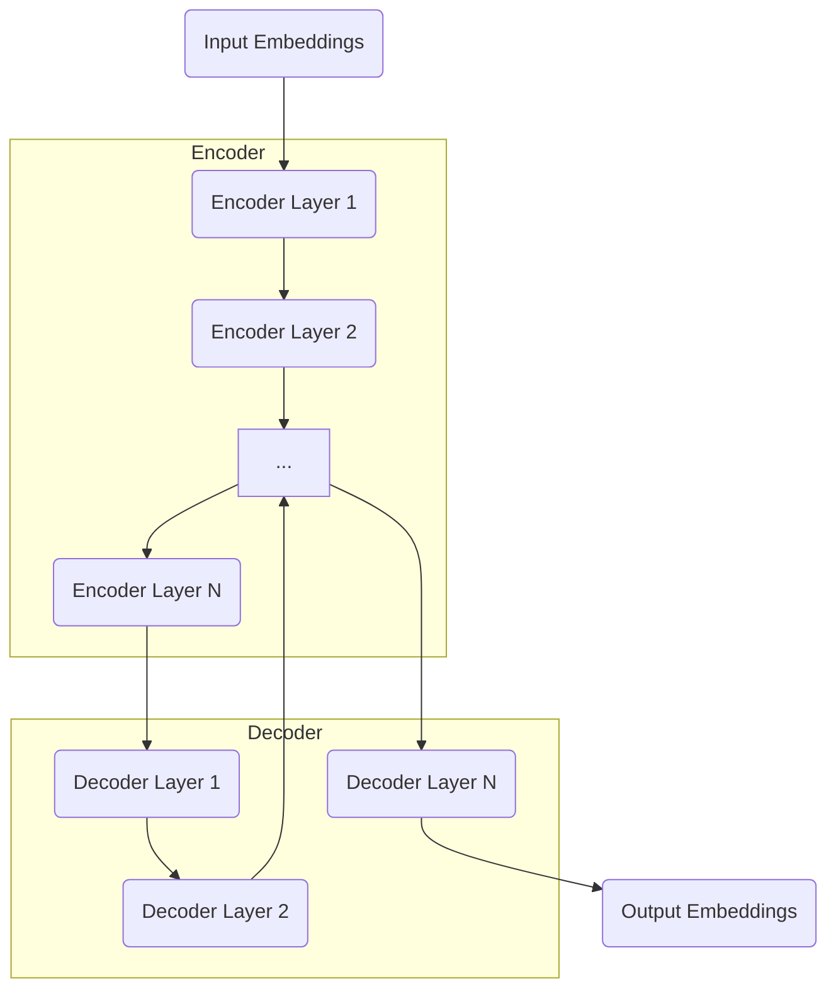

# 大语言模型应用指南：人工编程与自动编程

## 1. 背景介绍

### 1.1 人工智能的发展历程

人工智能(Artificial Intelligence, AI)是当代科技发展的一个重要领域,旨在创造出能够模拟人类智能的机器系统。自20世纪50年代AI概念被正式提出以来,经历了几个重要的发展阶段:

- 早期阶段(1950s-1960s):专家系统、博弈理论等奠基性工作
- 知识阶段(1970s-1980s):知识库、机器学习、神经网络等技术兴起 
- 统计阶段(1990s-2000s):贝叶斯方法、支持向量机等统计学习方法占主导
- 深度学习阶段(2010s-今):深度神经网络、大数据、GPU并行计算等技术突破

### 1.2 大语言模型的兴起

在深度学习阶段,以Transformer为代表的大型神经网络模型在自然语言处理(NLP)领域取得了突破性进展。大语言模型(Large Language Model, LLM)是一类通过自监督学习方式在大规模文本语料上训练而成的巨大神经网络模型,具备理解和生成自然语言的能力。

代表性的大语言模型包括:

- GPT系列(OpenAI)
- 伯特(BERT,谷歌)
- PALM(谷歌大脑)
- PanGu-Alpha(百度)
- 元语大模型(清华大学)
- ...

这些模型在多项NLP任务上展现出超越人类的卓越性能,引发了学术界和工业界的广泛关注。

### 1.3 人工编程与自动编程

传统的软件开发过程需要人工编程,即由程序员根据需求手工编写代码。这种方式存在以下一些不足:

- 编程效率低下
- 代码质量参差不齐
- 维护成本较高
- 缺乏可重用性

而自动编程(Automatic Programming)则旨在利用人工智能技术,通过某种形式的输入(如自然语言描述)自动生成可执行的代码,从而提高开发效率、降低人力成本。大语言模型的出现为自动编程带来了新的契机和可能性。

## 2. 核心概念与联系

### 2.1 大语言模型的核心能力

大语言模型的核心能力主要包括:

1. **理解能力**: 能够理解和表示输入的自然语言文本
2. **生成能力**: 能够基于上下文生成连贯、流畅的自然语言输出
3. **推理能力**: 能够进行复杂的推理和知识迁移
4. **多任务能力**: 只需微调即可适用于多种不同的NLP任务

这些能力使得大语言模型不仅可以用于传统的NLP任务(如文本分类、机器翻译等),还可以拓展到更多的应用场景,如问答系统、代码生成等。

### 2.2 大语言模型编程范式

基于大语言模型的编程范式,被称为"人工编程"(Human Programming)或"指令编程"(Instruction Programming)。其核心思想是:

1. 将编程需求用自然语言描述清楚
2. 将描述输入给大语言模型
3. 模型生成相应的代码

这种编程范式改变了传统的人机交互方式,使得人类无需掌握特定的编程语言语法,只需用自然语言表达即可完成编程任务。这在一定程度上降低了编程的门槛,提高了开发效率。

与之相对的是"自动编程"(Automatic Programming),即由AI系统自主完成整个编程过程,人类只需提供高层次的需求描述。这种范式的实现难度更高,需要AI系统具备强大的理解、推理和规划能力。

### 2.3 人工编程与自动编程的关系

人工编程和自动编程并非完全割裂,而是相辅相成的关系:

- 人工编程为自动编程提供了有价值的数据和反馈,有助于提高自动编程系统的性能
- 自动编程系统的不断进步,又将推动人工编程向更高层次发展

二者相互促进、共同发展,最终目标是实现真正的"智能编程"(Intelligent Programming),使得软件开发过程更加自动化、智能化。

## 3. 核心算法原理具体操作步骤

### 3.1 大语言模型的训练过程

大语言模型通常采用自监督学习的方式进行训练。以GPT-3为例,其训练过程包括以下几个关键步骤:

1. **数据预处理**:从互联网上收集大量的文本语料,进行去重、分词、标记化等预处理。

2. **模型初始化**:初始化一个巨大的Transformer编码器模型,包含数十亿个可训练参数。

3. **自监督训练**:
   - 采用掩码语言模型(Masked Language Modeling)任务,即给定一段文本,随机将部分单词用特殊标记[MASK]替换
   - 模型需要根据上下文,预测被掩码的单词
   - 使用最大似然估计,最小化预测的交叉熵损失

4. **迭代训练**:上述过程反复迭代数千次,使用大规模的语料和算力,直至模型收敛

通过自监督训练,模型学习到了丰富的语言知识,能够很好地理解和生成自然语言文本。

### 3.2 人工编程的流程

基于大语言模型的人工编程通常包括以下步骤:

1. **需求描述**:用自然语言清晰描述编程需求,如需要实现的功能、输入输出要求等。

2. **输入模型**:将需求描述输入给经过微调的大语言模型。

3. **代码生成**:模型根据需求描述,生成相应的代码。

4. **人工审查**:由人工检查生成代码的正确性、可读性等,必要时进行修改和优化。

5. **迭代优化**:将修改后的代码作为新的输入,重复上述过程,直至满足要求。

6. **部署运行**:将最终生成的代码部署并运行在目标环境中。

这个过程将人类的创造力和AI系统的执行力结合起来,可以显著提高编程效率。同时,每个迭代都为模型提供了新的训练数据,有助于不断提高其性能。

### 3.3 自动编程的框架

完全自动化的编程过程更加复杂,需要AI系统具备多种能力,典型的自动编程框架包括:

1. **需求理解**:理解高层次的需求描述,构建形式化的规范说明。
2. **任务分解**:将需求分解为多个子任务,确定子任务之间的逻辑关系。
3. **算法选择**:为每个子任务选择合适的算法或模型。
4. **算法组合**:将选定的算法/模型按一定方式组合,形成完整的解决方案。
5. **代码生成**:根据组合的解决方案,自动生成可执行的代码。
6. **验证评估**:对生成的代码进行验证和评估,确保符合需求。
7. **优化迭代**:根据评估反馈,优化解决方案并重新生成代码。

这一过程需要AI系统具备强大的自然语言理解、知识推理、规划调度等多方面能力,是一个极具挑战的长期目标。

## 4. 数学模型和公式详细讲解举例说明

### 4.1 Transformer模型

Transformer是大语言模型的核心网络架构,由谷歌的Vaswani等人在2017年提出。它完全基于注意力机制(Attention Mechanism)构建,不依赖于RNN或CNN等序列模型,有利于并行计算。

Transformer的基本结构如下所示:



编码器(Encoder)由多个相同的层组成,每层包含两个子层:

1. **Multi-Head Attention**:多头注意力机制,用于捕获输入序列中不同位置之间的依赖关系。
2. **Feed Forward**:前馈全连接网络,对序列的表示进行非线性变换。

解码器(Decoder)的结构类似,不过还包含一个额外的注意力子层,用于关注编码器的输出。

注意力机制是Transformer的核心,它通过计算Query、Key和Value之间的相似性,自动学习输入序列中不同位置之间的依赖关系。具体计算公式如下:

$$\begin{aligned}
\text{Attention}(Q, K, V) &= \text{softmax}\left(\frac{QK^T}{\sqrt{d_k}}\right)V \\
\text{MultiHead}(Q, K, V) &= \text{Concat}(\text{head}_1, \ldots, \text{head}_h)W^O\\
\text{where}\ \text{head}_i &= \text{Attention}(QW_i^Q, KW_i^K, VW_i^V)
\end{aligned}$$

其中$Q$、$K$、$V$分别表示Query、Key和Value;$d_k$是缩放因子;$W_i^Q$、$W_i^K$、$W_i^V$和$W^O$是可训练的投影矩阵。

Transformer架构的自注意力机制赋予了模型强大的长距离依赖建模能力,是大语言模型取得突破性进展的关键所在。

### 4.2 生成式预训练

大语言模型通常采用生成式预训练(Generative Pre-training)的方式进行训练。以GPT系列为例,核心思想是最大化语言模型的概率:

$$\begin{aligned}
\mathcal{L}_1(\mathcal{D}) &= \mathbb{E}_{x \sim \mathcal{D}}\left[\sum_{t=1}^T \log P(x_t | x_{<t}; \theta)\right] \\
&= \mathbb{E}_{x \sim \mathcal{D}}\left[\sum_{t=1}^T \log \frac{e^{h_\theta(x_{<t})^\top e(x_t)}}{\sum_{x' \in \mathcal{V}} e^{h_\theta(x_{<t})^\top e(x')}}\right]
\end{aligned}$$

其中$\mathcal{D}$表示训练语料;$x$是长度为$T$的文本序列;$x_t$是序列的第$t$个token;$h_\theta(x_{<t})$是模型根据前缀$x_{<t}$生成的隐藏状态表示;$e(\cdot)$是词嵌入查找表;$\mathcal{V}$是词表。

上式的目标是最大化生成真实序列$x$的对数似然,等价于最小化一个多分类交叉熵损失。通过自监督训练,模型学习到了生成自然语言的能力。

此外,还可以引入其他预训练目标,如下游任务的监督信号、对比学习损失等,进一步增强模型的表现。

### 4.3 提示学习

为了将大语言模型应用于特定任务,通常需要进行指令精调(Instruction Tuning)或提示学习(Prompt Learning)。

提示学习的核心思想是,将任务输入重新格式化为一个"提示"(Prompt),连同任务说明一并输入到模型中。例如,对于文本分类任务:

```
输入: 将以下文本分类为正面或负面评论:
"这家餐厅的食物很棒,环境也很赞,强烈推荐!"

提示: 这是一条<mask>评论。
```

模型需要根据上下文,预测被掩码位置的标记,从而完成分类任务。

提示学习的优点是,无需重新预训练模型,只需在现有模型上微调少量参数,即可快速适用于新任务。常见的提示方法包括:

- **手工提示**: 人工设计提示模板
- **自动提示**: 使用小的语言模型或梯度优化自动生成提示
- **示例提示**: 在提示中加入任务示例,模仿示例解决问题

提示学习大大降低了模型适用于新任务的门槛,是大语言模型广泛应用的关键技术。

## 4. 项目实践:代码实例和详细解释说明

这里我们通过一个实际的代码