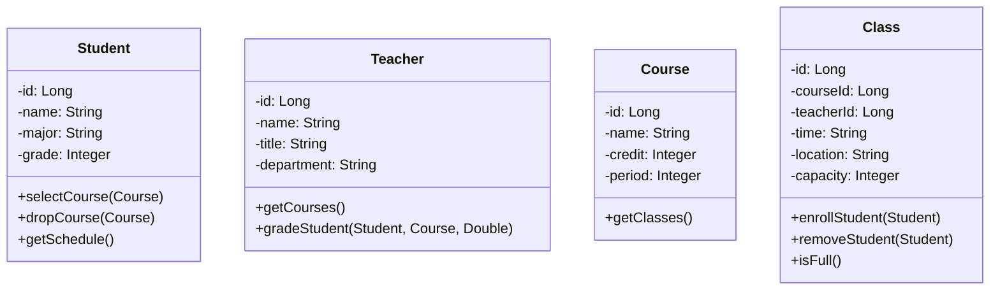

# 学生网上选课系统详细设计与具体代码实现

作者：禅与计算机程序设计艺术

## 1. 背景介绍

在现代化的教育管理中,网上选课系统已成为高校教学管理的重要组成部分。传统的人工选课方式效率低下,难以满足日益增长的教学管理需求。因此,开发一个功能完善、易于使用的学生网上选课系统具有重要意义。

本文将详细阐述学生网上选课系统的设计与实现,包括需求分析、概要设计、详细设计、数据库设计和具体代码实现。通过对系统的全面剖析,为读者提供开发类似系统的参考和指导。

### 1.1 系统目标

学生网上选课系统的主要目标如下:

1. 为学生提供便捷的选课平台,实现网上选课、退课等功能。
2. 为教务管理人员提供高效的课程管理工具,包括开设课程、安排教师等。
3. 提高教学资源的利用率,优化课程结构和教学质量。

### 1.2 用户角色

系统主要用户角色包括:

1. 学生:通过系统进行选课、退课、查询个人课表等操作。
2. 教师:通过系统查询教学安排,录入学生成绩等。
3. 教务管理员:负责课程的开设、教师的安排以及系统的维护。

### 1.3 术语定义

- 选课:学生根据教学计划和个人需求,在规定时间内选择课程的过程。
- 退课:学生在选课结束前,取消已选课程的过程。
- 教学计划:学校根据专业培养目标制定的课程安排。
- 课程表:学生选课后形成的个人课程安排。

## 2. 核心概念与联系

### 2.1 实体关系图

学生网上选课系统的核心实体包括学生、教师、课程和教学班。它们之间的关系如下:

```mermaid
erDiagram
    Student ||--o{ Course : selects
    Teacher ||--o{ Course : teaches
    Course ||--|{ Class : has
    Student ||--o{ Class : attends
```

- 学生(Student)与课程(Course)是多对多的选课关系。
- 教师(Teacher)与课程(Course)是一对多的授课关系。
- 课程(Course)与教学班(Class)是一对多的关系,每门课程可以有多个教学班。
- 学生(Student)与教学班(Class)是多对多的修读关系。

### 2.2 类图设计

根据实体关系,可以设计出以下主要类:



- Student类包含学生基本信息以及选课、退课、查询课表等方法。
- Teacher类包含教师基本信息以及获取授课列表、登记学生成绩等方法。  
- Course类包含课程基本信息以及获取教学班列表等方法。
- Class类表示教学班,包含上课时间、地点、容量等信息,以及学生的添加、删除和判断是否已满等方法。

## 3. 核心算法原理具体操作步骤

### 3.1 选课算法

选课是学生网上选课系统的核心功能,其基本步骤如下:

1. 学生登录系统,进入选课页面。
2. 系统展示可选课程列表,包括课程名称、学分、教师、上课时间等信息。
3. 学生勾选需要选修的课程,提交选课请求。
4. 系统检查学生选课是否符合条件(如是否已满、是否有时间冲突等),如果不符合则提示错误信息。
5. 如果选课条件满足,则将学生添加到对应的教学班中,并更新学生的课表。

具体的选课算法可以描述为:

```
function selectCourse(student, course)
    for each class in course.classes
        if class.isFull() then continue
        if hasConflict(student, class) then continue
        class.enrollStudent(student)
        student.addCourse(course)
        return success
    end for
    return failure
end function
```

### 3.2 退课算法

退课是选课的逆过程,其基本步骤如下:

1. 学生登录系统,进入已选课程页面。  
2. 学生勾选需要退选的课程,提交退课请求。
3. 系统从对应的教学班中删除该学生,并更新学生的课表。

具体的退课算法可以描述为:

```
function dropCourse(student, course)
    for each class in course.classes
        if class.hasStudent(student)
            class.removeStudent(student)
            student.removeCourse(course)
            return success
        end if
    end for
    return failure
end function
```

## 4. 数学模型和公式详细讲解举例说明

在选课系统中,可以使用图论模型来解决一些问题,如选课的最优化、课程安排的合理性验证等。

### 4.1 选课的最优化

假设有 $n$ 名学生和 $m$ 门课程,每名学生对每门课程都有一个选修意愿值 $a_{ij}$,表示第 $i$ 名学生对第 $j$ 门课程的选修意愿。同时每门课程 $j$ 都有一个容量限制 $c_j$,表示最多可以容纳的学生数。我们的目标是在满足课程容量限制的情况下,最大化所有学生的总体选课满意度。

这可以建模为一个整数规划问题:

$$
\begin{aligned}
\max \quad & \sum_{i=1}^n \sum_{j=1}^m a_{ij} x_{ij} \\
\text{s.t.} \quad & \sum_{i=1}^n x_{ij} \leq c_j, \forall j=1,2,\dots,m \\
& x_{ij} \in \{0,1\}, \forall i=1,2,\dots,n, j=1,2,\dots,m
\end{aligned}
$$

其中 $x_{ij}$ 是决策变量,表示第 $i$ 名学生是否选修第 $j$ 门课程。目标函数是最大化总体选课满意度,约束条件是每门课程的选课人数不超过容量,决策变量取值为 0 或 1。

这是一个典型的 0-1 整数规划问题,可以使用现成的优化求解器如 CPLEX、Gurobi 等求解。

### 4.2 课程安排的合理性验证

另一个可以用图论解决的问题是课程安排的合理性验证,即检查给定的课程安排是否存在时间冲突。

我们可以将课程安排看作一个图 $G=(V,E)$,其中节点集 $V$ 表示所有的教学班,边集 $E$ 表示两个教学班之间是否有时间冲突。如果两个教学班的上课时间重叠,则在它们之间连一条边。

于是,问题转化为判断图 $G$ 中是否存在边,即 $E$ 是否为空集。这可以通过遍历所有节点对 $(u,v)$ 并判断它们是否有时间冲突来实现,时间复杂度为 $O(|V|^2)$。

如果 $E$ 为空集,说明当前的课程安排没有时间冲突,是合理的;否则存在冲突,需要进行调整。

## 5. 项目实践：代码实例和详细解释说明

下面给出学生网上选课系统的部分核心代码实现。

### 5.1 学生选课

```java
public class StudentServiceImpl implements StudentService {
    
    @Autowired
    private StudentMapper studentMapper;
    
    @Autowired
    private CourseMapper courseMapper;
    
    @Override
    public boolean selectCourse(long studentId, long courseId) {
        // 检查学生和课程是否存在
        Student student = studentMapper.findById(studentId);
        Course course = courseMapper.findById(courseId);
        if (student == null || course == null) {
            return false;
        }
        
        // 检查课程是否已满
        if (course.isFull()) {
            return false;
        }
        
        // 检查是否有时间冲突
        for (Class clazz : course.getClasses()) {
            if (student.hasConflict(clazz)) {
                return false;
            }
        }
        
        // 选课
        for (Class clazz : course.getClasses()) {
            clazz.enrollStudent(student);
        }
        student.addCourse(course);
        
        // 更新数据库
        studentMapper.update(student);
        courseMapper.update(course);
        
        return true;
    }
}
```

这段代码实现了学生选课的功能。首先检查学生和课程是否存在,然后检查课程是否已满以及是否与学生已选课程有时间冲突。如果一切正常,则将学生添加到课程的教学班中,并更新学生的选课记录。最后更新数据库中的学生和课程信息。

### 5.2 学生退课

```java
@Override
public boolean dropCourse(long studentId, long courseId) {
    // 检查学生和课程是否存在  
    Student student = studentMapper.findById(studentId);
    Course course = courseMapper.findById(courseId);
    if (student == null || course == null) {
        return false;
    }
    
    // 检查学生是否已选该课程
    if (!student.hasCourse(course)) {
        return false;
    }
    
    // 退课
    for (Class clazz : course.getClasses()) {
        if (clazz.hasStudent(student)) {
            clazz.removeStudent(student);
        }
    }
    student.removeCourse(course);
    
    // 更新数据库
    studentMapper.update(student);
    courseMapper.update(course);
    
    return true;
}
```

这段代码实现了学生退课功能。首先检查学生和课程是否存在,然后检查学生是否已选修该课程。如果已选修,则将学生从课程的教学班中删除,并更新学生的选课记录。最后更新数据库中的学生和课程信息。

### 5.3 查询学生课表

```java
@Override
public List<Course> getStudentCourses(long studentId) {
    Student student = studentMapper.findById(studentId);
    if (student == null) {
        return Collections.emptyList();
    }
    
    return student.getCourses();
}
```

这段代码实现了查询学生课表的功能。首先根据学生 ID 查询学生对象,如果学生不存在则返回空列表;否则直接返回学生对象中保存的已选课程列表。

## 6. 实际应用场景

学生网上选课系统可以应用于各类高等院校,为学生和教务管理人员提供便捷的选课服务。具体的应用场景包括:

1. 学生选课:在选课开放期间,学生可以登录系统浏览课程信息,并根据自己的需求和课程安排进行选课。

2. 学生退课:如果学生发现所选课程不适合自己或者有时间冲突,可以在选课结束前进行退课操作。

3. 教师查课:授课教师可以通过系统查看自己所授课程的选课情况,了解每个教学班的学生名单。

4. 教务排课:教务管理人员可以使用系统进行排课操作,如开设新课程、安排教师等。

5. 领导决策:系统可以生成各类选课数据报表,为学校领导提供决策依据,用于优化课程结构和教学资源配置。

通过网上选课系统的应用,可以大大提高选课效率,减轻教务管理人员的工作负担,同时也可以为学校的教学管理提供数据支持。

## 7. 工具和资源推荐

在开发学生网上选课系统时,可以使用以下工具和资源:

1. 开发语言:Java、Python、C# 等。
2. Web框架:Spring Boot、Django、ASP.NET 等。
3. 数据库:MySQL、Oracle、SQL Server 等。
4. ORM框架:MyBatis、Hibernate、Entity Framework 等。
5. 前端框架:Vue.js、React、Angular 等。
6. 开发工具:IntelliJ IDEA、Eclipse、Visual Studio 等。
7. 版本控制:Git、SVN 等。
8. 项目管理:Jira、Redmine 等。

除了以上工具,还可以参考一些开源项目和教程,如:

- 一个基于 Spring Boot 和 Vue