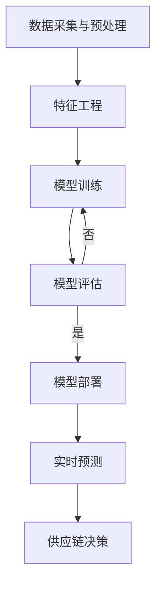
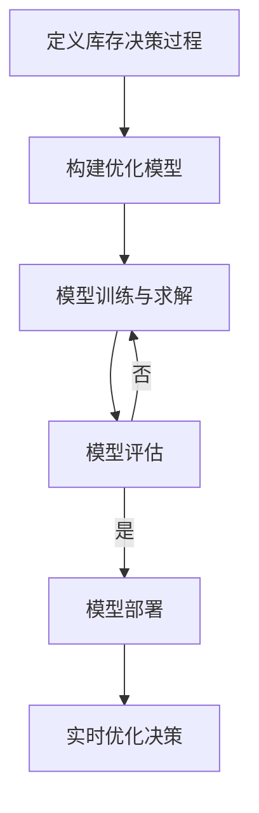
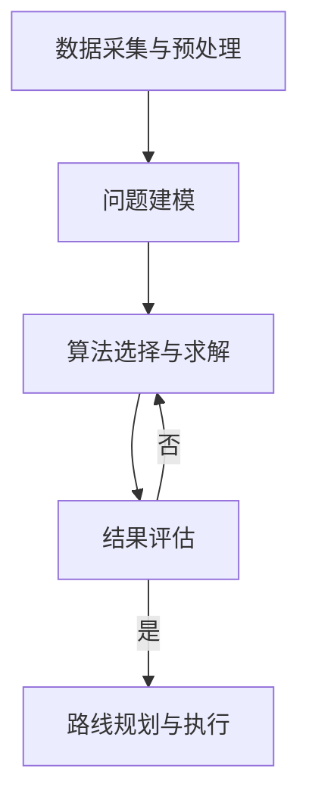

# 应用AI大模型来优化智能物流与供应链管理

## 1.背景介绍

### 1.1 物流与供应链管理的重要性

在当今快节奏的商业环境中，高效的物流与供应链管理对于企业的成功至关重要。它涉及从原材料采购到最终产品交付的整个过程,包括运输、仓储、库存管理、订单履行等多个环节。有效的物流与供应链管理可以降低运营成本、提高客户满意度、增强竞争优势。

### 1.2 物流与供应链管理面临的挑战

然而,物流与供应链管理也面临着诸多挑战,例如:

- **需求波动**:客户需求的不确定性和波动性导致供应链计划的复杂性增加。
- **全球化**:供应链网络日益分散,管理难度加大。
- **实时决策**:需要快速响应并做出实时决策以满足客户需求。
- **可持续发展**:必须考虑环境影响和社会责任。

### 1.3 AI大模型在物流与供应链管理中的作用

传统的物流与供应链管理方法往往依赖于人工经验和简化的数学模型,难以充分应对上述挑战。而人工智能(AI)大模型凭借其强大的数据处理和建模能力,为物流与供应链管理带来了新的机遇。

AI大模型可以从海量数据中发现隐藏的模式和洞察,预测需求趋势,优化资源配置,提高决策效率。它们还可以通过机器学习算法持续改进,适应不断变化的环境。

## 2.核心概念与联系  

### 2.1 AI大模型概述

AI大模型指的是具有数十亿甚至数万亿参数的大型神经网络模型。这些模型通过在大规模数据集上进行预训练,获得了广泛的知识和能力。常见的AI大模型包括:

- **GPT(Generative Pre-trained Transformer)**: 一种基于Transformer架构的大型语言模型,可用于自然语言处理任务。
- **BERT(Bidirectional Encoder Representations from Transformers)**: 另一种广泛使用的预训练语言模型。
- **Vision Transformer**: 应用于计算机视觉任务的大型视觉模型。
- **多模态模型**: 集成了文本、图像、视频等多种模态数据的统一模型。

这些AI大模型具有强大的泛化能力,可以通过微调(fine-tuning)等方法应用于下游任务。

### 2.2 物流与供应链管理中的关键概念

在探讨AI大模型在物流与供应链管理中的应用之前,我们需要了解一些关键概念:

- **需求预测**: 预测未来对产品或服务的需求量,是供应链规划的基础。
- **库存优化**: 平衡库存水平,既能满足需求又能降低存货成本。
- **运输路线优化**: 确定最佳的运输路线和模式,以降低成本和时间。
- **网络设计**: 规划供应链网络的布局,包括设施位置和运输模式。

AI大模型可以通过建模和优化这些关键概念,提高物流与供应链管理的效率和灵活性。

### 2.3 AI大模型与物流供应链管理的联系

AI大模型在物流与供应链管理中的应用可以概括为以下几个方面:

1. **预测与规划**: 利用历史数据和外部因素(如天气、经济指标等),预测未来的需求、供给和其他关键指标,为供应链规划提供依据。

2. **优化与决策**: 建立复杂的优化模型,确定最佳的库存水平、运输路线、网络布局等,提高效率和降低成本。

3. **实时监控与响应**: 持续监控供应链运行状况,快速发现异常并做出调整,提高供应链的敏捷性和弹性。

4. **自动化与智能化**: 通过自然语言处理、计算机视觉等技术,实现供应链流程的自动化和智能化,减少人工干预。

5. **可视化与决策支持**: 将复杂的供应链数据和模型输出以直观的方式呈现,为决策者提供支持。

接下来,我们将详细探讨AI大模型在物流与供应链管理中的具体应用。

## 3.核心算法原理具体操作步骤

### 3.1 需求预测

准确的需求预测是供应链规划的关键。传统的统计预测方法(如移动平均、指数平滑等)往往基于历史数据,难以捕捉复杂的模式和外部影响因素。而AI大模型可以通过深度学习技术从多源异构数据中学习,提高预测精度。

常用的需求预测算法包括:

1. **长短期记忆网络(LSTM)**: 一种循环神经网络,擅长处理序列数据,可以捕捉长期依赖关系。

2. **注意力机制(Attention)**: 通过自注意力层,模型可以自适应地关注输入序列中的关键部分,提高预测性能。

3. **外部数据融合**: 将天气、节假日、促销活动等外部数据融合到模型中,提高预测的上下文感知能力。

4. **集成学习**: 将多种模型(如LSTM、随机森林等)的预测结果进行集成,提高鲁棒性。

需求预测的具体操作步骤如下:

1. **数据采集与预处理**: 收集历史销售数据、产品元数据、外部数据(如天气、节假日等),并进行数据清洗和标准化。

2. **特征工程**: 从原始数据中提取有意义的特征,如时间特征(月份、周期等)、产品特征(类别、价格等)、外部特征(温度、降雨量等)。

3. **模型训练**: 使用LSTM、Transformer等深度学习模型,在训练数据上进行模型训练和调参,优化预测性能。

4. **模型评估**: 在保留的测试数据上评估模型性能,如均方根误差(RMSE)、平均绝对百分比误差(MAPE)等指标。根据评估结果决定是否需要重新训练模型。

5. **模型部署**: 将评估通过的模型部署到生产环境中。

6. **实时预测**: 模型可以持续接收新的数据,进行实时的需求预测。

7. **供应链决策**: 将需求预测结果输入到供应链优化模型中,作为制定库存、运输等决策的依据。

需求预测是供应链优化的基础,AI大模型可以显著提高预测精度,为后续决策提供可靠的输入。

### 3.2 库存优化

合理的库存水平对于降低成本和满足客户需求至关重要。过多的库存会导致资金占用和存储成本增加,而库存不足则可能导致缺货和客户流失。AI大模型可以通过建模和优化,帮助企业实现库存的动态平衡。

常用的库存优化算法包括:

1. **强化学习**: 将库存决策建模为马尔可夫决策过程(MDP),使用强化学习算法(如Q-Learning、策略梯度等)学习最优策略。

2. **约束优化**: 将库存成本、服务水平等目标函数和约束条件建模为优化问题,使用线性规划、混合整数规划等方法求解。

3. **多智能体强化学习**: 将供应链网络中的多个库存节点建模为多个智能体,通过协作或竞争的方式学习最优策略。

4. **模糊逻辑**: 将人类专家的经验知识表示为模糊规则,与数据驱动的模型相结合,提高决策的可解释性。

库存优化的具体操作步骤如下:

1. **定义库存决策过程**: 明确库存决策的状态空间(如库存水平、需求量等)、行动空间(如补货量)和奖惩机制(如成本、服务水平等)。

2. **构建优化模型**: 根据决策过程,建立强化学习模型(如Q-Learning)或约束优化模型(如线性规划)。

3. **模型训练与求解**: 使用历史数据或仿真数据训练强化学习模型,或者求解约束优化模型,获得最优策略或解。

4. **模型评估**: 在测试数据或仿真环境中评估模型性能,如总成本、缺货率等指标。根据评估结果决定是否需要重新训练或调整模型。

5. **模型部署**: 将评估通过的模型部署到生产环境中。

6. **实时优化决策**: 模型可以根据实时的库存水平、需求预测等输入,持续输出最优的补货决策。

通过AI大模型,企业可以实现库存的动态优化,在满足服务水平的同时降低库存成本。

### 3.3 运输路线优化

在供应链中,运输是一个重要且成本高昂的环节。合理的运输路线规划可以降低运输成本、缩短交货时间、减少碳排放。AI大模型可以通过建模和优化,帮助企业确定最佳的运输路线和模式。

常用的运输路线优化算法包括:

1. **车辆路径问题(VRP)**: 将运输问题建模为经典的VRP或其变种(如带时间窗的VRP),使用启发式算法(如蚁群算法)或精确算法(如分支定界法)求解。

2. **深度强化学习**: 将运输路线规划建模为强化学习问题,使用深度神经网络作为策略或值函数近似,通过与环境交互学习最优策略。

3. **约束优化**: 将运输成本、时间、排放等目标函数和约束条件建模为优化问题,使用线性规划、混合整数规划等方法求解。

4. **组合优化**: 将运输模式选择(如卡车、火车、航空等)与路线规划相结合,使用启发式算法或精确算法求解。

运输路线优化的具体操作步骤如下:

1. **数据采集与预处理**: 收集运输网络数据(如地图、道路信息)、车辆数据(如载重量、油耗等)、订单数据等,并进行必要的预处理。

2. **问题建模**: 根据具体场景,将运输路线优化问题建模为VRP、约束优化或强化学习问题。

3. **算法选择与求解**: 选择合适的算法(如蚁群算法、线性规划、深度强化学习等),并求解最优解或近似解。

4. **结果评估**: 在测试数据或仿真环境中评估优化结果,如总成本、总时间、总排放量等指标。根据评估结果决定是否需要调整模型或算法。

5. **路线规划与执行**: 将优化结果转化为具体的运输路线规划,并执行实际运输。

通过AI大模型的运输路线优化,企业可以显著降低运输成本,提高效率,实现可持续发展。

### 3.4 网络设计优化

供应链网络的设计对于企业的运营效率和成本控制至关重要。它包括确定设施位置(如工厂、仓库等)、运输模式(如卡车、火车等)以及它们之间的物流流向。AI大模型可以通过建模和优化,帮助企业设计出高效的供应链网络。

常用的网络设计优化算法包括:

1. **混合整数规划(MIP)**: 将设施位置、运输模式等决策变量建模为整数变量,将成本、需求覆盖等目标函数和约束条件建模为线性或非线性约束,使用MIP求解器求解。

2. **启发式算法**: 对于大规模复杂的网络设计问题,可以使用启发式算法(如遗传算法、模拟退火