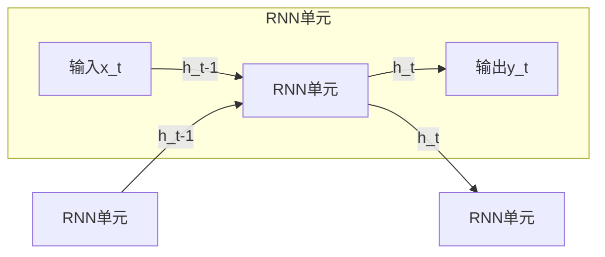
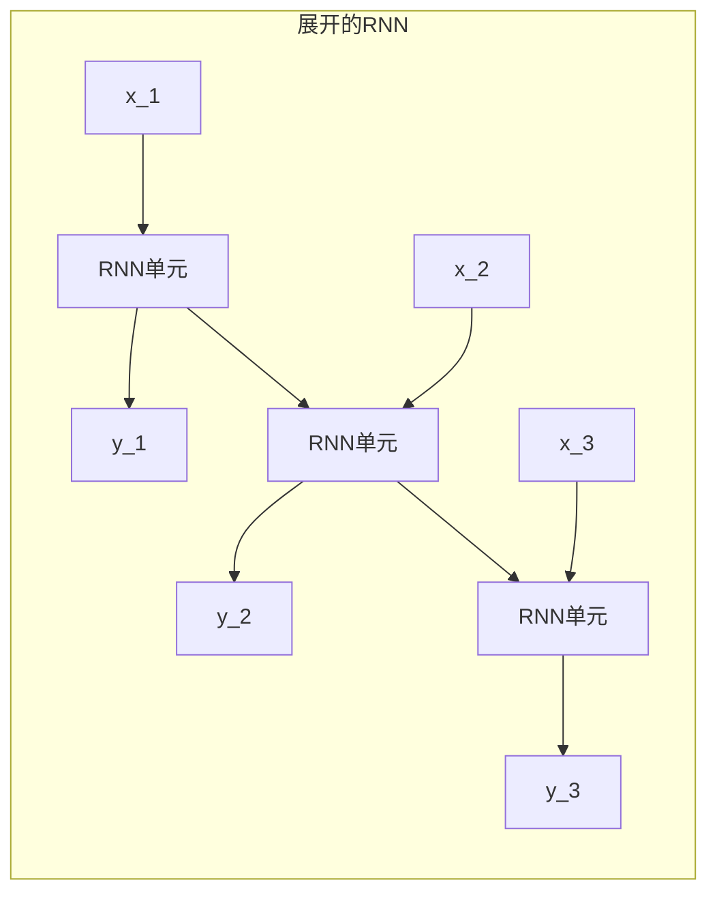

# 循环神经网络RNN原理与代码实例讲解

## 1.背景介绍

### 1.1 序列数据处理的挑战

在自然语言处理、语音识别、时间序列预测等领域,我们经常会遇到序列数据,如句子、语音信号、传感器数据等。与传统的数据不同,序列数据具有以下几个特点:

- **变长性质**: 序列长度不固定,可能很短也可能很长
- **上下文相关性**: 序列中每个位置的输出与其他位置的输入相关
- **记忆能力需求**: 需要有能力记住长期的上下文信息

传统的前馈神经网络无法很好地处理这种序列数据,因为它们对输入的长度有固定要求,并且无法捕捉序列中元素之间的长期依赖关系。

### 1.2 循环神经网络RNN的产生

为了解决序列数据处理的挑战,循环神经网络(Recurrent Neural Network, RNN)应运而生。RNN是一种对序列数据进行有效建模的神经网络,它在神经元之间引入了循环连接,使得网络具有记忆能力,能够捕捉序列中元素之间的动态时间行为和长期依赖关系。

RNN在训练过程中可以学习到一个状态向量,该向量编码了序列中之前元素的信息,并将其与当前输入元素相结合,得到当前时刻的输出。这种循环结构使得RNN可以处理任意长度的序列数据。

## 2.核心概念与联系

### 2.1 RNN的基本结构

RNN的基本结构如下图所示:



其中:

- $x_t$是当前时刻的输入
- $h_t$是当前时刻的隐藏状态向量,编码了之前序列的信息
- $y_t$是当前时刻的输出

RNN单元的计算过程可以表示为:

$$h_t = f_W(x_t, h_{t-1})$$
$$y_t = g_U(h_t)$$

其中$f_W$和$g_U$分别是两个函数,包含了网络的权重参数$W$和$U$。

通过上述循环计算,RNN可以处理任意长度的序列数据。每个时刻的输出$y_t$都依赖于当前输入$x_t$和上一时刻的隐藏状态$h_{t-1}$,从而捕捉了序列中元素之间的依赖关系。

### 2.2 RNN的展开结构

为了更好地理解RNN,我们可以将其按时间步展开,如下图所示:



在展开的RNN结构中,每个时间步都有一个RNN单元,它们共享相同的权重参数。每个单元接收当前时刻的输入$x_t$和上一时刻的隐藏状态$h_{t-1}$,计算出当前时刻的输出$y_t$和隐藏状态$h_t$,并将$h_t$传递给下一时间步的单元。

通过展开的结构,我们可以清楚地看到RNN如何捕捉序列数据中元素之间的长期依赖关系。然而,实际上RNN在捕捉长期依赖方面存在一些问题,这就导致了一些改进的RNN变体模型的出现,如LSTM和GRU等。

### 2.3 RNN的应用场景

由于RNN能够有效地处理序列数据,因此它在很多领域都有广泛的应用,例如:

- **自然语言处理**: 语音识别、机器翻译、文本生成等
- **时间序列分析**: 金融数据预测、天气预报等
- **语音信号处理**: 语音合成、语音识别等
- **视频数据处理**: 视频描述、动作识别等
- **生物信息学**: DNA序列分析、蛋白质结构预测等

RNN及其变体模型为这些领域带来了革命性的进步,大大提高了序列数据处理的性能和准确性。

## 3.核心算法原理具体操作步骤

在了解了RNN的基本结构和概念后,我们来深入探讨一下RNN的核心算法原理和具体操作步骤。

### 3.1 RNN的前向传播

RNN的前向传播过程就是按时间步展开的计算过程。具体来说,在时间步$t$,RNN单元的计算过程如下:

1. 获取当前时刻的输入$x_t$和上一时刻的隐藏状态$h_{t-1}$
2. 将$x_t$和$h_{t-1}$连接成一个向量,输入到RNN单元
3. 通过一个非线性激活函数(如tanh或ReLU),计算当前时刻的隐藏状态$h_t$
4. 将$h_t$输入到输出层,计算当前时刻的输出$y_t$
5. 将$h_t$传递给下一时间步的RNN单元

数学表达式如下:

$$h_t = \tanh(W_{hx}x_t + W_{hh}h_{t-1} + b_h)$$
$$y_t = W_{yh}h_t + b_y$$

其中:

- $W_{hx}$是输入到隐藏层的权重矩阵
- $W_{hh}$是隐藏层到隐藏层的权重矩阵
- $W_{yh}$是隐藏层到输出层的权重矩阵
- $b_h$和$b_y$分别是隐藏层和输出层的偏置项

通过上述计算,RNN可以逐步处理整个序列数据,并产生对应的输出序列。

### 3.2 RNN的反向传播

为了训练RNN模型,我们需要计算损失函数对模型参数的梯度,并使用优化算法(如SGD)来更新参数。这个过程称为反向传播。

RNN的反向传播算法是基于**反向传播through time(BPTT)** 的思想。具体来说,我们需要按时间步展开RNN,计算每个时间步的误差,并将这些误差沿时间反向传播,累加梯度并更新参数。

假设我们的损失函数为$L$,对于时间步$t$,我们可以计算$L$对$W_{hx}$、$W_{hh}$和$W_{yh}$的梯度:

$$\frac{\partial L}{\partial W_{hx}} = \sum_t \frac{\partial L}{\partial h_t}\frac{\partial h_t}{\partial W_{hx}}$$
$$\frac{\partial L}{\partial W_{hh}} = \sum_t \frac{\partial L}{\partial h_t}\frac{\partial h_t}{\partial W_{hh}}$$
$$\frac{\partial L}{\partial W_{yh}} = \sum_t \frac{\partial L}{\partial y_t}\frac{\partial y_t}{\partial W_{yh}}$$

其中,每个时间步的$\frac{\partial L}{\partial h_t}$可以通过链式法则计算得到:

$$\frac{\partial L}{\partial h_t} = \frac{\partial L}{\partial y_t}\frac{\partial y_t}{\partial h_t} + \frac{\partial L}{\partial h_{t+1}}\frac{\partial h_{t+1}}{\partial h_t}$$

这个公式体现了RNN反向传播的核心思想:当前时刻的误差不仅来自当前时刻的输出,还来自下一时刻的隐藏状态。这种时间上的反向依赖关系,使得RNN能够捕捉序列数据中元素之间的长期依赖。

通过计算得到各参数的梯度后,我们就可以使用优化算法(如SGD)来更新参数,从而使模型在训练数据上的损失函数最小化。

### 3.3 RNN的梯度消失和梯度爆炸

尽管RNN理论上能够捕捉长期依赖关系,但在实践中,它往往难以学习到很长的序列模式。这是由于RNN在反向传播过程中,存在**梯度消失**和**梯度爆炸**的问题。

**梯度消失**是指,当序列越长时,梯度值会越来越小,以至于对很远的时间步几乎没有影响。这是因为反向传播时,梯度需要通过许多乘法运算,如果权重矩阵的特征值小于1,梯度会指数级衰减。

**梯度爆炸**则是梯度值越来越大的情况,这会导致参数更新时出现NaN或无穷大的值,使模型无法收敛。

为了缓解这两个问题,一种常见的方法是使用梯度裁剪,即将梯度值限制在一个合理的范围内。另一种更有效的方法是使用RNN的改进变体,如LSTM和GRU等,它们通过特殊的门控机制,能够更好地捕捉长期依赖关系。

## 4.数学模型和公式详细讲解举例说明

在上一节中,我们介绍了RNN的核心算法原理和具体操作步骤。现在,我们将更深入地探讨RNN的数学模型和公式,并通过具体的例子来说明其中的细节。

### 4.1 RNN的基本数学模型

我们首先回顾一下RNN的基本数学模型。在时间步$t$,RNN单元的计算过程如下:

$$h_t = \tanh(W_{hx}x_t + W_{hh}h_{t-1} + b_h)$$
$$y_t = W_{yh}h_t + b_y$$

其中:

- $x_t$是当前时刻的输入
- $h_t$是当前时刻的隐藏状态向量
- $y_t$是当前时刻的输出
- $W_{hx}$、$W_{hh}$和$W_{yh}$分别是输入到隐藏层、隐藏层到隐藏层和隐藏层到输出层的权重矩阵
- $b_h$和$b_y$分别是隐藏层和输出层的偏置项

让我们通过一个具体的例子来说明这个模型。假设我们有一个简单的序列数据,包含3个时间步:

```
输入序列: [0.5, 0.1, 0.2]
目标输出: [0.7, 0.4, 0.9]
```

我们初始化RNN的参数如下:

```python
W_hx = np.array([[0.1, 0.2], [0.3, 0.4]])  # 输入到隐藏层的权重矩阵(2x2)
W_hh = np.array([[0.5, 0.6], [0.7, 0.8]])  # 隐藏层到隐藏层的权重矩阵(2x2)
W_yh = np.array([[0.1, 0.9], [0.2, 0.5]])  # 隐藏层到输出层的权重矩阵(2x2)
b_h = np.array([0.1, 0.2])                 # 隐藏层的偏置项(2x1)
b_y = np.array([0.1, 0.2])                 # 输出层的偏置项(2x1)
```

我们将隐藏状态的初始值设为0向量,即$h_0 = [0, 0]^T$。

在时间步$t=1$,RNN单元的计算过程如下:

$$h_1 = \tanh(W_{hx}x_1 + W_{hh}h_0 + b_h)$$
$$    = \tanh(\begin{bmatrix}0.1 & 0.2 \\ 0.3 & 0.4\end{bmatrix}\begin{bmatrix}0.5 \\ 0.5\end{bmatrix} + \begin{bmatrix}0.5 & 0.6 \\ 0.7 & 0.8\end{bmatrix}\begin{bmatrix}0 \\ 0\end{bmatrix} + \begin{bmatrix}0.1 \\ 0.2\end{bmatrix})$$
$$    = \tanh(\begin{bmatrix}0.15 \\ 0.35\end{bmatrix})$$
$$    = \begin{bmatrix}0.1593 \\ 0.3286\end{bmatrix}$$

$$y_1 = W_{yh}h_1 + b_y$$
$$    = \begin{bmatrix}0.1 & 0.9 \\ 0.2 &