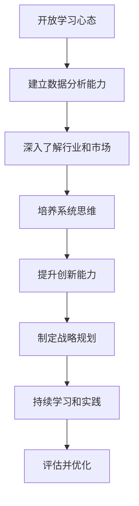

# 怎样培养敏锐的市场洞察力和商业思维

## 1.背景介绍

### 1.1 市场洞察力和商业思维的重要性

在当今瞬息万变的商业环境中，拥有敏锐的市场洞察力和商业思维是企业保持竞争力和实现可持续发展的关键因素。市场洞察力是指对市场趋势、客户需求和竞争格局的深刻理解,而商业思维则是指能够从战略层面思考和做出明智的商业决策。

- 市场洞察力可以帮助企业:
  - 预测市场趋势并抓住新的机遇
  - 深入了解客户需求并提供更好的产品和服务
  - 分析竞争对手的战略并制定有效的应对措施

- 商业思维可以帮助企业:
  - 制定明智的战略规划和决策
  - 优化资源配置,提高效率和盈利能力
  - 建立可持续的竞争优势

因此,培养敏锐的市场洞察力和商业思维对于企业的成功至关重要。

### 1.2 当前挑战和趋势

然而,在当前的商业环境中,培养市场洞察力和商业思维面临着一些挑战:

- 数据过载:企业面临着来自多个渠道的大量数据,很难从中提取有价值的洞见。
- 技术变革:新兴技术如人工智能、大数据和物联网正在重塑商业模式,需要企业具备相应的技术能力。
- 全球化:企业需要了解不同地区的文化差异和市场特点,以便制定有效的全球战略。

同时,也出现了一些有利于培养市场洞察力和商业思维的趋势:

- 数字化转型:企业越来越多地采用数字技术来优化业务流程、提高效率和改善客户体验。
-客户导向:企业开始更加重视客户体验,并将其作为制定战略和产品设计的核心考虑因素。
- 敏捷创新:企业需要采用敏捷的方法来快速响应市场变化,并不断创新以保持竞争优势。

### 1.3 本文概述

本文将探讨如何培养敏锐的市场洞察力和商业思维,内容包括:

- 市场洞察力和商业思维的核心概念
- 培养市场洞察力和商业思维的关键步骤和技巧
- 利用数据分析和人工智能等技术来提高洞察力
- 实际案例分析和最佳实践
- 未来发展趋势和挑战

通过本文,读者将获得培养市场洞察力和商业思维的实用技巧和方法,从而帮助企业在激烈的市场竞争中脱颖而出。

## 2.核心概念与联系 

### 2.1 市场洞察力

市场洞察力是指对市场趋势、客户需求、竞争格局和宏观环境等因素的深刻理解和洞见。它是企业制定有效战略和做出明智决策的基础。市场洞察力包括以下几个关键要素:

1. **市场趋势洞见**
   - 能够预测未来的市场趋势和变化
   - 了解影响市场的宏观经济、社会和技术因素
   - 把握市场机遇和潜在威胁

2. **客户洞见**
   - 深入了解客户的需求、偏好和行为模式
   - 预测客户未来的需求变化
   - 提供符合客户期望的产品和服务

3. **竞争洞见**
   - 全面分析竞争对手的战略、优势和劣势
   - 评估自身在市场中的定位和竞争力
   - 制定有效的竞争策略

4. **渠道和生态系统洞见**
   - 了解销售渠道和供应链的运作模式
   - 把握行业生态系统的演变趋势
   - 与合作伙伴建立良好的战略关系

获得市场洞察力需要企业持续收集和分析来自各种渠道的数据,并将这些数据转化为可操作的洞见。

### 2.2 商业思维

商业思维是指从战略层面思考和决策的能力,它是企业领导者和决策者必备的核心竞争力。商业思维包括以下几个关键要素:

1. **战略思维**
   - 能够制定符合企业长期发展目标的战略规划
   - 预测并评估战略决策的影响和风险
   - 根据市场变化及时调整和优化战略

2. **创新思维**
   - 敏锐地发现新的商业机遇
   - 鼓励创新思维,培养创新文化
   - 将创新理念转化为可行的商业模式

3. **系统思维**
   - 从整体和系统的角度思考问题
   - 了解企业各部门之间的相互关系和影响
   - 优化资源配置,提高整体效率

4. **财务思维**
   - 掌握财务管理和投资决策的基本原则
   - 评估商业决策的财务影响
   - 制定有利于企业盈利能力和可持续发展的策略

商业思维需要企业领导者具备广阔的视野、前瞻性的战略眼光和敏锐的洞察力,并能将这些转化为明智的商业决策。

### 2.3 市场洞察力与商业思维的关系

市场洞察力和商业思维虽然是两个不同的概念,但它们之间存在着密切的联系和相互影响。

- 市场洞察力为商业思维提供了重要的输入和依据。只有充分了解市场趋势、客户需求和竞争格局,企业才能制定出符合实际情况的战略规划和商业决策。
- 商业思维则为市场洞察力提供了战略导向。企业的战略目标和发展方向将决定它们关注哪些市场信息,并如何利用这些信息来指导业务运营。
- 两者相辅相成,共同推动企业的可持续发展。敏锐的市场洞察力有助于企业做出明智的商业决策,而出色的商业思维则能够帮助企业更好地把握市场机遇并制定有效的竞争策略。

因此,培养敏锐的市场洞察力和商业思维是企业保持竞争力的关键,两者需要同步发展和相互促进。

## 3.核心算法原理具体操作步骤

培养敏锐的市场洞察力和商业思维并非一蹴而就的过程,需要遵循一定的步骤和方法。以下是一个通用的培养流程:

### 3.1 开放学习心态

培养市场洞察力和商业思维的第一步是保持开放的学习心态。要时刻保持好奇心和求知欲,乐于接受新事物、新观点和新挑战。同时,也要有自我反省和批判性思维的能力,不断质疑现有的做法和思维模式。

### 3.2 建立数据分析能力

在当今大数据时代,掌握数据分析能力是获取市场洞察力的基础。企业需要从各种渠道收集相关数据,包括销售数据、客户反馈、社交媒体等。然后,利用数据分析工具和技术(如统计分析、数据挖掘、机器学习等)来发现隐藏的模式和趋势,从而获得有价值的洞见。

### 3.3 深入了解行业和市场

要获得真正的市场洞察力,企业需要对所处的行业和市场有深入的了解。这包括研究行业的发展历史、现状和趋势,分析竞争格局和关键驱动因素,了解监管政策和法律法规等。同时,还要密切关注宏观经济、社会和技术等外部环境的变化,因为这些都会对市场产生深远影响。

### 3.4 培养系统思维

系统思维是商业思维的重要组成部分。它要求企业从整体和系统的角度思考问题,了解各个部门之间的相互关系和影响。例如,销售部门的决策如何影响供应链和生产部门?产品设计如何影响客户体验和品牌形象?只有具备系统思维,企业才能做出全面的考虑并优化资源配置。

### 3.5 提升创新能力

在瞬息万变的商业环境中,创新是企业保持竞争力的关键。培养创新思维有助于企业发现新的商业机遇,并将创新理念转化为可行的商业模式。企业可以通过鼓励员工提出新想法、建立创新文化、开放式创新等方式来提升创新能力。

### 3.6 制定战略规划

拥有敏锐的市场洞察力和商业思维的目的是为了制定明智的战略规划。企业需要根据对市场和行业的深入了解,结合自身的优势和劣势,制定符合长期发展目标的战略规划。同时,还要评估战略决策的影响和风险,并根据市场变化及时调整和优化战略。

### 3.7 持续学习和实践

培养市场洞察力和商业思维是一个持续的过程,需要不断学习和实践。企业应该鼓励员工参加相关培训,了解最新的理论和实践;同时,也要为员工提供实践的机会,让他们将所学知识应用到实际工作中。只有通过不断的学习和实践,才能真正掌握和提高市场洞察力和商业思维。

### 3.8 评估并优化

最后一步是评估和优化。企业需要定期评估自身的市场洞察力和商业思维水平,找出不足之处并制定改进计划。同时,也要评估之前的战略决策是否取得了预期效果,并根据评估结果进行调整和优化。这是一个循环的过程,需要持续不断地评估和改进,以确保企业能够保持竞争优势。

## 4.数学模型和公式详细讲解举例说明

在培养市场洞察力和商业思维的过程中,数学模型和公式可以为我们提供有力的支持和指导。以下是一些常用的数学模型和公式,以及它们在市场分析和商业决策中的应用。

### 4.1 回归分析

回归分析是一种统计学方法,用于研究两个或多个变量之间的关系。在市场分析中,回归分析可以帮助我们了解影响销售额的关键因素,如价格、广告投入、竞争对手的活动等。

假设我们要研究价格对销售额的影响,可以使用简单线性回归模型:

$$
y = \beta_0 + \beta_1x + \epsilon
$$

其中:
- $y$ 是销售额
- $x$ 是价格
- $\beta_0$ 是常数项
- $\beta_1$ 是价格的系数,表示价格每变化一单位,销售额将变化多少
- $\epsilon$ 是随机误差项

通过对历史数据进行回归分析,我们可以估计出 $\beta_0$ 和 $\beta_1$ 的值,从而了解价格对销售额的影响程度。这种洞见可以帮助企业制定更有效的定价策略。

### 4.2 时间序列分析

时间序列分析是一种研究随时间变化的数据序列的方法,常用于预测未来趋势。在市场分析中,时间序列分析可以帮助我们预测未来的销售量、市场份额等指标。

一种常用的时间序列模型是自回归移动平均模型 (ARIMA):

$$
y_t = c + \phi_1y_{t-1} + \phi_2y_{t-2} + ... + \phi_py_{t-p} + \theta_1\epsilon_{t-1} + \theta_2\epsilon_{t-2} + ... + \theta_q\epsilon_{t-q} + \epsilon_t
$$

其中:
- $y_t$ 是时间 $t$ 的观测值
- $c$ 是常数项
- $\phi_1, \phi_2, ..., \phi_p$ 是自回归参数
- $\theta_1, \theta_2, ..., \theta_q$ 是移动平均参数
- $\epsilon_t$ 是时间 $t$ 的随机误差项

通过对历史数据进行时间序列分析,我们可以估计出模型参数