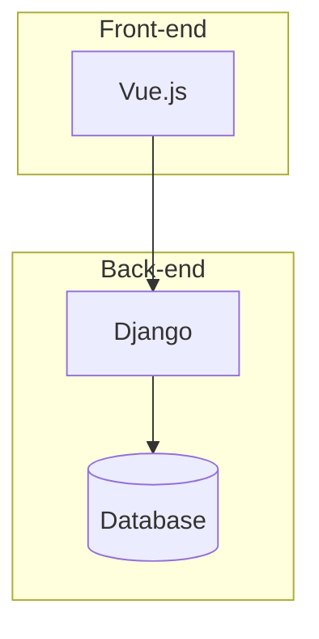

# 房屋出租出售网站详细设计与具体代码实现

## 1. 背景介绍

### 1.1 房地产行业概况

房地产行业是一个巨大的市场,影响着每个人的生活。无论是购买自住房还是投资房产,人们都需要一个可靠的平台来查找、比较和交易房屋。随着互联网的发展,房地产行业也在向线上转移。线上房地产平台为买家和卖家提供了一个高效的交易渠道,极大地提高了效率和透明度。

### 1.2 线上房地产平台的优势

相比传统的线下交易方式,线上房地产平台具有以下优势:

- **信息集中**:买家可以方便地浏览和比较不同房源的信息,而不需要亲自实地考察。
- **高效匹配**:平台可以根据用户的偏好精准匹配合适的房源,节省时间和精力。
- **透明公开**:房源信息公开透明,降低了信息不对称带来的风险。
- **交易便捷**:线上平台提供了安全、便捷的交易渠道,减少了中间环节。

### 1.3 需求分析

为了满足用户的需求,一个优秀的房地产网站应该具备以下核心功能:

- 房源信息展示:全面、准确地展示房源的详细信息,包括位置、面积、户型、价格等。
- 个性化推荐:根据用户的浏览记录和偏好,推荐合适的房源。
- 搜索和筛选:提供多维度的搜索和筛选功能,帮助用户快速找到理想房源。
- 在线交易:支持线上签约、付款等交易环节,提供安全可靠的交易保障。
- 社区互动:为用户提供评论、点评等社交功能,促进信息交流。

## 2. 核心概念与联系

### 2.1 系统架构

一个典型的房地产网站系统通常采用前后端分离的架构,包括以下几个核心模块:

- **前端模块**:提供用户界面,负责数据展示和用户交互。
- **后端模块**:处理业务逻辑,提供API接口供前端调用。
- **数据库模块**:存储房源信息、用户信息等核心数据。
- **缓存模块**:提高系统响应速度,缓存热门数据。
- **搜索模块**:实现高效的搜索和排序功能。
- **推荐模块**:根据用户行为数据,为用户推荐个性化房源。

这些模块通过良好的设计和紧密的协作,共同构建了一个高效、可靠的房地产网站系统。

### 2.2 数据模型

房地产网站的核心数据模型包括以下几个主要实体:

- **房源(House)**:描述房屋的基本信息,如位置、面积、户型、价格等。
- **用户(User)**:记录用户的个人信息和浏览记录等。
- **订单(Order)**:记录房屋交易的订单信息。
- **评论(Comment)**:用户对房源的评论和点评。

这些实体之间存在着复杂的关联关系,如一个房源可能有多个评论,一个用户可能发起多个订单等。设计合理的数据模型是系统稳定运行的基础。

## 3. 核心算法原理具体操作步骤

### 3.1 搜索算法

搜索是房地产网站的核心功能之一。一个高效的搜索算法可以极大提升用户体验。常见的搜索算法包括:

1. **倒排索引(Inverted Index)**

倒排索引是一种常用的全文搜索算法。它的核心思想是将文档中的每个单词与其所在文档的ID列表相关联,从而实现快速查找包含特定单词的文档。

具体步骤如下:

1) 对文档进行分词,得到所有单词。
2) 为每个单词创建一个倒排列表,列表中存储包含该单词的所有文档ID。
3) 查询时,将查询语句分词,获取每个单词对应的倒排列表。
4) 对所有倒排列表执行集合运算(并集或交集),得到最终结果。

2. **地理位置搜索**

对于房地产网站,地理位置搜索是一个常见需求。可以使用空间索引(如R-Tree)来加速位置查询。

具体步骤如下:

1) 将房源位置信息存储为经纬度坐标。
2) 使用R-Tree等空间索引,对坐标数据建立索引。
3) 查询时,根据用户输入的位置范围,在索引中查找满足条件的房源。

### 3.2 个性化推荐算法

个性化推荐是提升用户体验的关键手段之一。常用的推荐算法包括:

1. **协同过滤(Collaborative Filtering)**

协同过滤是一种基于用户行为的推荐算法,它的核心思想是"喜好相似的用户,对相同的物品也有相似的喜好"。

具体步骤如下:

1) 收集用户对房源的评分数据,构建用户-物品评分矩阵。
2) 计算任意两个用户之间的相似度,可以使用皮尔逊相关系数或余弦相似度等方法。
3) 对于目标用户,找到与其最相似的 K 个用户,称为 K 近邻。
4) 根据 K 近邻用户对其他房源的评分,预测目标用户对未评分房源的兴趣程度,并推荐兴趣最高的房源。

2. **基于内容的推荐(Content-based)**

基于内容的推荐算法利用房源的内容特征(如位置、面积、价格等)来推荐相似的房源。

具体步骤如下:

1) 提取每个房源的内容特征,构建特征向量。
2) 计算任意两个房源之间的相似度,可以使用余弦相似度等方法。
3) 对于目标用户,找到其历史浏览记录中最相似的房源。
4) 推荐与这些相似房源最相近的其他房源。

### 3.3 其他核心算法

除了搜索和推荐算法外,房地产网站还需要实现其他核心算法,如:

- **排序算法**:根据用户的偏好(如价格、面积等)对搜索结果进行排序,提升用户体验。
- **地理编码算法**:将地址信息转换为经纬度坐标,用于地图展示和位置搜索。
- **路径规划算法**:为用户规划最优路线,方便到达目的地实地看房。
- **价格预测算法**:根据历史数据和房源特征,预测房屋的合理价格区间。

## 4. 数学模型和公式详细讲解举例说明

### 4.1 相似度计算

在推荐算法中,计算相似度是一个关键步骤。常用的相似度计算方法包括:

1. **皮尔逊相关系数(Pearson Correlation Coefficient)**

皮尔逊相关系数用于衡量两个变量之间的线性相关程度,取值范围为 [-1, 1]。在协同过滤算法中,可以用它来计算两个用户之间的相似度。

$$r_{xy} = \frac{\sum_{i=1}^{n}(x_i - \overline{x})(y_i - \overline{y})}{\sqrt{\sum_{i=1}^{n}(x_i - \overline{x})^2}\sqrt{\sum_{i=1}^{n}(y_i - \overline{y})^2}}$$

其中 $x_i$ 和 $y_i$ 分别表示用户 x 和用户 y 对第 i 个物品的评分, $\overline{x}$ 和 $\overline{y}$ 分别表示用户 x 和用户 y 的平均评分。

2. **余弦相似度(Cosine Similarity)**

余弦相似度用于衡量两个向量之间的夹角余弦值,常用于计算文本或其他高维数据的相似度。在基于内容的推荐算法中,可以用它来计算两个房源之间的相似度。

$$\text{sim}(A, B) = \cos(\theta) = \frac{A \cdot B}{\|A\|\|B\|} = \frac{\sum_{i=1}^{n}A_iB_i}{\sqrt{\sum_{i=1}^{n}A_i^2}\sqrt{\sum_{i=1}^{n}B_i^2}}$$

其中 $A$ 和 $B$ 分别表示两个房源的特征向量, $A_i$ 和 $B_i$ 分别表示第 i 个特征的值。

### 4.2 评分预测

在协同过滤算法中,需要预测目标用户对未评分物品的兴趣程度。常用的评分预测方法包括:

1. **基于用户平均值的预测**

$$\hat{r}_{ui} = \overline{r}_u + \frac{\sum_{v \in N(u,i)}{\text{sim}(u, v)(r_{vi} - \overline{r}_v)}}{\sum_{v \in N(u,i)}{\text{sim}(u, v)}}$$

其中 $\hat{r}_{ui}$ 表示对用户 u 对物品 i 的预测评分, $\overline{r}_u$ 表示用户 u 的平均评分, $N(u, i)$ 表示与用户 u 有相似评分记录的用户集合, $\text{sim}(u, v)$ 表示用户 u 与用户 v 的相似度, $r_{vi}$ 表示用户 v 对物品 i 的评分, $\overline{r}_v$ 表示用户 v 的平均评分。

2. **基线预测(Baseline Estimates)**

基线预测是一种更加复杂的评分预测方法,它考虑了用户偏置、物品偏置和整体平均评分等因素。

$$\hat{r}_{ui} = \mu + b_u + b_i + q_i^Tp_u$$

其中 $\mu$ 表示整体平均评分, $b_u$ 表示用户 u 的偏置, $b_i$ 表示物品 i 的偏置, $q_i$ 表示物品 i 的隐式特征向量, $p_u$ 表示用户 u 的隐式特征向量。这些参数可以通过机器学习算法(如梯度下降)从历史数据中学习得到。

## 5. 项目实践:代码实例和详细解释说明

在本节中,我们将通过一个简化的房地产网站示例,展示如何使用 Python 和 Django 框架实现核心功能。

### 5.1 系统架构

我们采用典型的前后端分离架构,后端使用 Django 框架提供 API 接口,前端使用 Vue.js 框架构建用户界面。



### 5.2 数据模型

我们定义了以下几个核心模型:

```python
# models.py
from django.db import models
from django.contrib.auth.models import User

class House(models.Model):
    title = models.CharField(max_length=200)
    description = models.TextField()
    price = models.DecimalField(max_digits=10, decimal_places=2)
    area = models.FloatField()
    location = models.CharField(max_length=200)
    # 其他字段...

class Comment(models.Model):
    user = models.ForeignKey(User, on_delete=models.CASCADE)
    house = models.ForeignKey(House, on_delete=models.CASCADE, related_name='comments')
    content = models.TextField()
    rating = models.IntegerField()
    # 其他字段...

class Order(models.Model):
    user = models.ForeignKey(User, on_delete=models.CASCADE)
    house = models.ForeignKey(House, on_delete=models.CASCADE)
    price = models.DecimalField(max_digits=10, decimal_places=2)
    # 其他字段...
```

### 5.3 核心功能实现

1. **搜索功能**

我们使用 Django 自带的 ORM 实现基本的搜索功能,并使用 PostgreSQL 的全文搜索扩展 pg_trgm 提供模糊搜索能力。

```python
# views.py
from django.db.models import Q
from .models import House

def search_houses(request):
    query = request.GET.get('q', '')
    location = request.GET.get('location', '')
    min_price = request.GET.get('min_price', 0)
    max_price = request.GET.get('max_price', None)

    houses = House.objects.filter(
        Q(title__icontains=query) |
        Q(description__icontains=query) |
        Q(location__icontains=location),
        price__range=(min_price, max_price)
    ).annotate(
        similarity=TrigramSimilarity('title', query) +
                   TrigramSimilarity('