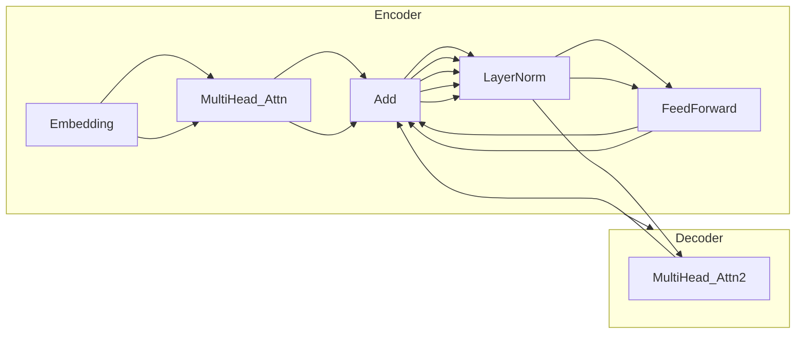

# 机器翻译在视频字幕领域的应用:观影无障碍的AI体验

## 1.背景介绍

### 1.1 视频字幕的重要性

在当今的数字时代,视频内容已经成为人们获取信息、娱乐和学习的主要渠道之一。无论是电影、电视剧、纪录片还是在线课程,字幕都扮演着至关重要的角色。它不仅为听力障碍人士提供了无障碍观影体验,还能帮助人们更好地理解不同语言和文化背景下的视频内容。

### 1.2 语言障碍的挑战

然而,语言差异一直是观众完全享受视频内容的主要障碍之一。对于那些不熟悉视频原语言的观众来说,理解视频内容往往是一个巨大的挑战。传统的字幕翻译方式存在着高昂的人工成本、效率低下以及质量参差不齐等问题,这严重阻碍了视频内容的全球传播。

### 1.3 机器翻译的崛起

随着人工智能和机器翻译技术的不断进步,自动化的视频字幕翻译成为可能。机器翻译系统能够快速、高效地将视频字幕从一种语言翻译成另一种语言,大大降低了人工翻译的成本和时间。这为观众提供了前所未有的无障碍观影体验,打破了语言的藩篱,真正实现了内容的全球化传播。

## 2.核心概念与联系

### 2.1 机器翻译的工作原理

机器翻译系统通常由三个主要组件构成:编码器(Encoder)、解码器(Decoder)和注意力机制(Attention Mechanism)。

1. **编码器(Encoder)**: 将源语言序列(如英语字幕)转换为语义向量表示。
2. **解码器(Decoder)**: 根据语义向量表示生成目标语言序列(如中文字幕)。
3. **注意力机制(Attention Mechanism)**: 帮助解码器在生成目标序列时,更好地关注和利用源序列中的相关信息。

这种基于序列到序列(Sequence-to-Sequence)的架构,使机器翻译系统能够更好地捕捉和理解语言的上下文信息,从而提高翻译质量。

### 2.2 机器翻译与视频字幕的关系

机器翻译在视频字幕领域的应用,需要解决以下几个关键问题:

1. **时间同步**: 确保翻译后的字幕与视频画面保持同步。
2. **语境理解**: 充分利用视频画面、音频和字幕上下文信息,提高翻译质量。
3. **实时性**: 对于直播视频,需要实现低延迟的实时翻译。
4. **多语种支持**: 支持多种语言之间的相互翻译,满足不同观众的需求。

通过融合视频理解、语音识别、自然语言处理等技术,机器翻译系统能够更好地服务于视频字幕翻译场景。

### 2.3 机器翻译系统的训练

为了获得高质量的翻译结果,机器翻译系统需要在大量的平行语料库(源语言和目标语言的句对)上进行训练。此外,还需要利用领域相关的数据(如电影字幕、剧本等)进行微调(Fine-tuning),使模型更好地适应特定领域的语言风格和表达方式。

通过不断的训练和优化,机器翻译系统可以逐步提高翻译质量,为观众带来更好的无障碍观影体验。

## 3.核心算法原理具体操作步骤

机器翻译在视频字幕领域的应用,通常采用基于transformer的序列到序列(Seq2Seq)模型。下面我们将详细介绍该模型的核心算法原理和具体操作步骤。

### 3.1 Transformer模型架构

Transformer是一种全新的基于注意力机制(Attention Mechanism)的序列到序列模型,它完全摒弃了传统的循环神经网络(RNN)和卷积神经网络(CNN)结构,使用了自注意力(Self-Attention)和点积注意力(Scaled Dot-Product Attention)机制来捕捉序列中的长程依赖关系。

Transformer模型主要由编码器(Encoder)和解码器(Decoder)两个部分组成,如下图所示:

1. **编码器(Encoder)**:
   - 输入embedding层: 将输入序列(如英文字幕)转换为embedding向量表示。
   - 多头自注意力层(Multi-Head Self-Attention): 捕捉输入序列中的长程依赖关系。
   - 前馈全连接层(Feed-Forward): 对序列进行非线性变换,提取更高级的特征表示。
   - 层归一化(Layer Normalization)和残差连接(Residual Connection): 用于模型优化和梯度传播。

2. **解码器(Decoder)**:
   - 输入embedding层: 将输入序列(如英文字幕)转换为embedding向量表示。
   - 掩码多头自注意力层(Masked Multi-Head Self-Attention): 防止解码器获取未来时间步的信息。
   - 多头注意力层(Multi-Head Attention): 将解码器的输出与编码器的输出进行注意力计算,获取源序列的重要信息。
   - 前馈全连接层(Feed-Forward): 对序列进行非线性变换,提取更高级的特征表示。
   - 层归一化(Layer Normalization)和残差连接(Residual Connection): 用于模型优化和梯度传播。

通过上述结构,Transformer模型能够有效地建模输入和输出序列之间的复杂依赖关系,为高质量的机器翻译提供了强有力的支持。

### 3.2 注意力机制(Attention Mechanism)

注意力机制是Transformer模型的核心,它允许模型在生成目标序列时,动态地关注源序列中的相关部分,从而提高翻译质量。Transformer中使用了两种注意力机制:

1. **缩放点积注意力(Scaled Dot-Product Attention)**

缩放点积注意力是Transformer中使用的基本注意力机制,它的计算过程如下:

$$
\text{Attention}(Q, K, V) = \text{softmax}(\frac{QK^T}{\sqrt{d_k}})V
$$

其中:
- $Q$是查询向量(Query)
- $K$是键向量(Key)
- $V$是值向量(Value)
- $d_k$是缩放因子,用于防止点积的值过大导致softmax函数的梯度较小。

通过计算查询向量与所有键向量的点积,并对结果进行softmax操作,我们可以获得一个注意力分数向量。然后,将注意力分数与值向量相乘,即可得到加权后的向量表示,作为注意力的输出。

2. **多头注意力(Multi-Head Attention)**

多头注意力机制将注意力过程从不同的表示子空间进行捕捉,并将它们的结果进行拼接,以提高注意力机制的表达能力。具体计算过程如下:

$$
\begin{aligned}
\text{MultiHead}(Q, K, V) &= \text{Concat}(\text{head}_1, \ldots, \text{head}_h)W^O \\
\text{where }  \text{head}_i &= \text{Attention}(QW_i^Q, KW_i^K, VW_i^V)
\end{aligned}
$$

其中:
- $W_i^Q, W_i^K, W_i^V$分别是查询、键和值的线性投影矩阵
- $h$是注意力头的数量

多头注意力机制能够从不同的子空间捕捉序列之间的依赖关系,提高了模型的表达能力和性能。

### 3.3 Beam Search解码

在机器翻译任务中,我们需要从模型输出的概率分布中选择最优的目标序列。一种常用的解码策略是Beam Search,它的基本思想是:在每个时间步,保留概率最高的k个候选序列(beam size),并在下一个时间步基于这k个候选序列进行扩展和剪枝,最终输出概率最高的序列作为翻译结果。

Beam Search算法的具体步骤如下:

1. 初始化beam,将起始符号`<sos>`放入beam中。
2. 对于beam中的每个候选序列:
   - 将候选序列输入解码器,获得下一个时间步的概率分布。
   - 从概率分布中选择概率最高的k个token,将它们与原始候选序列拼接,形成新的候选序列。
   - 计算新候选序列的对数概率分数(log-probability score)。
3. 将所有新的候选序列按对数概率分数排序,保留分数最高的k个作为新的beam。
4. 重复步骤2和3,直到遇到终止符号`<eos>`或达到最大长度。
5. 从beam中选择对数概率分数最高的序列作为最终的翻译结果。

通过Beam Search算法,我们可以有效地从指数级的搜索空间中找到最优的翻译结果,提高机器翻译的质量和效率。

## 4.数学模型和公式详细讲解举例说明

在机器翻译领域,有许多重要的数学模型和公式,它们为高质量的翻译提供了理论基础和技术支持。下面我们将详细介绍其中的几个核心模型和公式。

### 4.1 序列到序列(Sequence-to-Sequence)模型

序列到序列(Seq2Seq)模型是机器翻译任务中广泛使用的一种基本框架,它将翻译任务建模为将源语言序列映射到目标语言序列的过程。该模型由两个主要部分组成:编码器(Encoder)和解码器(Decoder)。

1. **编码器(Encoder)**

编码器的作用是将源语言序列$X=(x_1, x_2, \ldots, x_n)$映射为一个向量表示$c$,称为上下文向量(context vector)。常用的编码器包括循环神经网络(RNN)、长短期记忆网络(LSTM)和门控循环单元(GRU)等。

对于RNN编码器,上下文向量$c$的计算公式为:

$$
h_t = f(x_t, h_{t-1}) \\
c = h_n
$$

其中:
- $x_t$是时间步$t$的输入
- $h_t$是时间步$t$的隐藏状态
- $f$是递归函数,如RNN、LSTM或GRU
- $c$是最终的上下文向量,等于最后一个时间步的隐藏状态$h_n$

2. **解码器(Decoder)**

解码器的任务是根据上下文向量$c$和目标语言的起始符号$y_0$,生成目标语言序列$Y=(y_1, y_2, \ldots, y_m)$。解码器也常采用RNN、LSTM或GRU等递归结构。

对于条件RNN解码器,目标序列$y_t$的概率计算公式为:

$$
p(y_t | y_0, \ldots, y_{t-1}, c) = g(y_{t-1}, s_t, c)
$$

其中:
- $y_0$是目标语言的起始符号
- $s_t$是时间步$t$的解码器隐藏状态
- $g$是输出层的softmax函数

通过最大化目标序列$Y$的条件对数似然概率$\log p(Y|X)$,我们可以训练序列到序列模型的参数,从而实现高质量的机器翻译。

### 4.2 注意力机制(Attention Mechanism)

注意力机制是序列到序列模型中的一种重要改进,它允许解码器在生成目标序列时,动态地关注源序列中的不同部分,从而提高翻译质量。

在注意力机制中,解码器的隐藏状态$s_t$不仅依赖于前一个隐藏状态$s_{t-1}$和输入$y_{t-1}$,还依赖于一个上下文向量$c_t$,该向量是源序列的加权和。具体计算公式如下:

$$
\begin{aligned}
s_t &= f(s_{t-1}, y_{t-1}, c_t) \\
c_t &= \sum_{j=1}^n \alpha_{tj} h_j
\end{aligned}
$$

其中:
- $h_j$是编码器在时间步$j$的隐藏状态
- $\