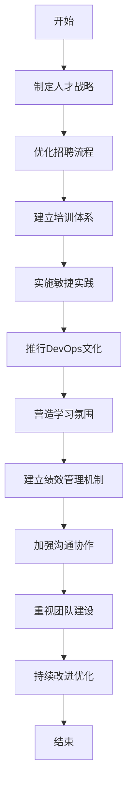

# 构建高绩效IT团队的10个关键步骤

## 1. 背景介绍

在当今快节奏的数字时代,IT团队的高绩效对于企业的成功至关重要。无论是开发创新产品、提供无缝的技术支持,还是确保系统的安全性和可靠性,高绩效IT团队都扮演着关键角色。然而,构建这样的团队并非易事,需要领导者采取明智的策略和实践。

本文将探讨构建高绩效IT团队的10个关键步骤,帮助您打造一支富有活力、高度协作、持续学习和创新的优秀团队。我们将深入探讨团队建设的各个方面,包括招聘、培训、激励机制、沟通协作、敏捷实践等,为您提供实用的指导和最佳实践。

## 2. 核心概念与联系

构建高绩效IT团队涉及多个关键概念,它们相互关联,共同影响着团队的绩效。以下是一些核心概念:

### 2.1 人才战略

人才战略是指组织为吸引、发展和留住优秀人才而制定的综合性计划。它包括招聘、培训、职业发展、薪酬福利等多个方面,旨在建立一支高素质的IT人才队伍。

### 2.2 敏捷实践

敏捷实践是一种迭代式、增量式的软件开发方法,强调团队协作、客户参与和持续交付。它包括Scrum、Kanban、极限编程(XP)等多种框架和实践,有助于提高团队的效率和响应能力。

### 2.3 DevOps文化

DevOps是一种将软件开发(Development)和运维(Operations)过程无缝集成的理念和实践。它强调开发和运维团队的紧密协作,自动化流程,持续集成和持续交付,从而加快产品上市时间,提高系统的可靠性和可维护性。

### 2.4 学习型组织

学习型组织是一种不断获取新知识、改进流程和提高绩效的组织。它鼓励团队成员持续学习,分享知识,并将学习融入到日常工作中,从而促进创新和适应变化的能力。

### 2.5 高绩效文化

高绩效文化是指一种以卓越绩效为核心价值观的组织文化。它强调责任心、主人翁意识、持续改进和结果导向,激励员工追求卓越,不断挑战自我,从而推动组织持续提升绩效。

这些核心概念相互关联,共同影响着IT团队的绩效。领导者需要将它们有机结合,制定全面的策略,才能真正构建出高绩效的IT团队。

## 3. 核心算法原理具体操作步骤

构建高绩效IT团队并非一蹴而就,而是需要遵循一系列明确的步骤和最佳实践。以下是10个关键步骤的具体操作流程:



### 3.1 制定人才战略

首先,您需要制定一个全面的人才战略,明确组织对IT人才的需求,包括所需技能、经验水平、数量等。同时,还要考虑未来的发展方向和技术趋势,以确保人才储备的可持续性。

### 3.2 优化招聘流程

基于人才战略,优化招聘流程,以吸引和识别优秀人才。这包括制定清晰的职位描述、采用多渠道招聘、设计有效的面试流程、提供有竞争力的薪酬福利等。同时,还要注重候选人的文化适合度,确保他们与团队和组织价值观相契合。

### 3.3 建立培训体系

持续培训对于提高团队技能和促进个人发展至关重要。建立一个系统的培训体系,包括新员工入职培训、技术培训、软技能培训等,帮助团队成员不断提升专业能力。同时,鼓励员工参与外部培训、会议和认证项目,扩展视野,吸收最新知识。

### 3.4 实施敏捷实践

采用敏捷实践,如Scrum、Kanban或极限编程(XP),有助于提高团队的协作效率和交付能力。敏捷实践强调迭代式开发、客户参与、自组织团队等原则,能够更好地适应需求变化,加快产品上市时间。

### 3.5 推行DevOps文化

推行DevOps文化,实现开发和运维团队的无缝协作。通过自动化流程、持续集成和持续交付,缩短产品上市周期,提高系统的可靠性和可维护性。DevOps文化还强调共享责任、透明沟通和持续学习,有助于建立高度协作的团队氛围。

### 3.6 营造学习氛围

鼓励团队成员持续学习,培养学习型组织文化。定期组织内部分享会、技术研讨会,让团队成员互相学习和交流经验。同时,提供学习资源和时间,支持员工参与外部培训和认证项目,不断提升专业能力。

### 3.7 建立绩效管理机制

制定公平、透明的绩效管理机制,明确绩效目标和评估标准。将个人绩效与团队绩效相结合,激励员工追求卓越,并为优秀表现提供合理回报。同时,建立反馈机制,让员工了解自己的表现,并获得持续改进的建议。

### 3.8 加强沟通协作

高绩效团队离不开良好的沟通协作。建立有效的沟通渠道,如每日站会、周例会、在线协作工具等,确保信息流通顺畅。培养开放、包容的沟通氛围,鼓励团队成员主动分享想法和反馈。同时,加强跨部门协作,消除信息孤岛,促进整个组织的高效运转。

### 3.9 重视团队建设

除了专业技能,团队凝聚力和协作精神同样重要。定期组织团队建设活动,如户外拓展、社交聚会等,增进成员之间的了解和信任。同时,培养共同的价值观和目标,让每个人都感受到自己是团队的一份子,从而提高士气和工作热情。

### 3.10 持续改进优化

构建高绩效IT团队是一个持续的过程,需要不断改进和优化。定期收集团队反馈,识别问题和改进机会。采用敏捷方法论,快速响应变化,持续优化流程和实践。同时,关注行业趋势和最佳实践,不断学习和创新,确保团队保持竞争力。

通过遵循这10个关键步骤,您将能够系统地构建一支高绩效的IT团队,为组织的成功奠定坚实基础。

## 4. 数学模型和公式详细讲解举例说明

在构建高绩效IT团队的过程中,数学模型和公式可以为我们提供量化分析和决策支持。以下是一些常见的数学模型和公式,以及它们在团队建设中的应用:

### 4.1 队伍规模模型

队伍规模模型(Team Size Model)旨在确定最佳团队规模,以实现最高效率和协作水平。一个著名的模型是Brooks法则,它认为随着团队规模的增加,团队的效率会呈指数级下降。

公式:

$$L = L_0 + \frac{n(n-1)}{2f}$$

其中:
- $L$ 是完成项目所需的总工作量
- $L_0$ 是一个人完成项目所需的工作量
- $n$ 是团队人数
- $f$ 是一个常数,反映了项目的可分解性和沟通开销

根据这个公式,我们可以计算出不同团队规模下的效率,从而确定最佳团队规模。

### 4.2 技能矩阵模型

技能矩阵模型(Skills Matrix Model)用于评估团队成员的技能组合,确保团队拥有所需的全部技能,并识别技能缺口。

首先,我们需要列出所有必需的技能,并为每项技能赋予权重,反映其重要性。然后,对每个团队成员进行技能评估,给出相应的技能等级。

公式:

$$S_T = \sum_{i=1}^{n} w_i \times l_i$$

其中:
- $S_T$ 是团队的总技能得分
- $n$ 是技能的总数
- $w_i$ 是第 $i$ 项技能的权重
- $l_i$ 是团队在第 $i$ 项技能上的平均等级

通过计算团队的总技能得分,并与理想得分进行比较,我们可以发现技能缺口,并采取相应措施,如招聘、培训等,以弥补这些缺口。

### 4.3 敏捷指标模型

敏捷指标模型(Agile Metrics Model)用于衡量敏捷实践的效果,包括交付速度、代码质量、客户满意度等指标。

一个常见的指标是周期时间(Cycle Time),它反映了从开始开发到交付产品所需的时间。

公式:

$$CT = \frac{\sum_{i=1}^{n} (ED_i - SD_i)}{n}$$

其中:
- $CT$ 是平均周期时间
- $n$ 是迭代的总数
- $ED_i$ 是第 $i$ 次迭代的结束日期
- $SD_i$ 是第 $i$ 次迭代的开始日期

通过持续监控和优化这些指标,我们可以不断改进敏捷实践,提高团队的交付能力和质量水平。

这些数学模型和公式为我们提供了量化分析的工具,有助于做出更加明智的决策,从而优化团队建设和管理流程。但是,它们只是辅助手段,还需要结合实际情况和经验进行综合判断。

## 5. 项目实践:代码实例和详细解释说明

在构建高绩效IT团队的过程中,实际的项目实践是不可或缺的。以下是一个基于Python的简单示例,展示了如何使用代码来支持团队协作和敏捷实践。

### 5.1 项目背景

假设我们有一个Web开发项目,需要开发一个在线商店应用程序。我们将使用Scrum框架,并采用Sprint计划和每日站会等敏捷实践。

### 5.2 Sprint计划

在每个Sprint开始时,我们需要规划待完成的工作。以下是一个简单的Sprint计划示例:

```python
# 定义产品待办事项列表
backlog = [
    "实现用户注册功能",
    "实现用户登录功能",
    "实现商品列表页面",
    "实现商品详情页面",
    "实现购物车功能",
    "实现订单结算功能"
]

# 定义Sprint长度和团队容量
sprint_length = 14  # 14天
team_capacity = 30  # 30个故事点

# 选择本次Sprint的待办事项
sprint_backlog = []
total_points = 0

for item in backlog:
    # 假设每个待办事项的故事点数已知
    points = ... 

    if total_points + points <= team_capacity:
        sprint_backlog.append(item)
        total_points += points
    else:
        break

print(f"Sprint待办事项: {', '.join(sprint_backlog)}")
```

在这个示例中,我们首先定义了产品待办事项列表(`backlog`)。然后,根据Sprint长度和团队容量(`team_capacity`)选择了本次Sprint的待办事项(`sprint_backlog`)。

### 5.3 每日站会

在每个工作日,我们会进行每日站会,让团队成员互相了解进展情况,并讨论任何阻碍或问题。以下是一个简单的每日站会示例:

```python
# 定义团队成员列表
team_members = ["Alice", "Bob", "Charlie", "David"]

# 进行每日站会
for member in team_members:
    print(f"{member}的进展:")
    
    # 团队成员报告昨天完成的工作
    yesterday_work = ... 
    print(f"- 昨天完成: {yesterday_work}")
    
    # 团队成员报告今天计划完成的工作
    today_plan = ...
    print(f"- 今天计划: {today