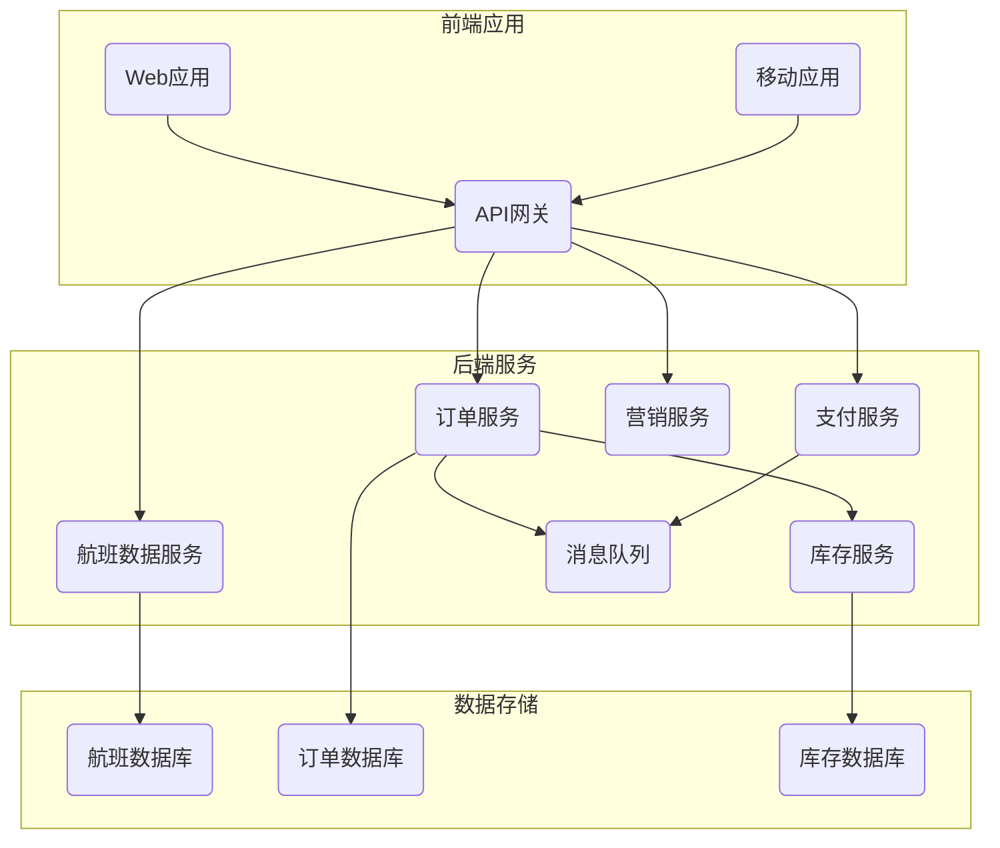

# 民航售票管理系统详细设计与具体代码实现

## 1.背景介绍

### 1.1 民航业务概述

民航业务是一个复杂的服务体系,涉及航班调度、机票预订和销售、行李运输、机场运营等多个环节。其中,机票预订和销售是整个业务链条的核心,直接关系到航空公司的收入和乘客的出行体验。

### 1.2 传统售票系统的挑战

传统的机票预订和销售系统通常采用集中式架构,所有数据都存储在中央数据库中。这种架构在并发访问量大时容易出现性能瓶颈,且系统的可扩展性和容错能力较差。此外,传统系统通常缺乏灵活的定价策略和营销机制,难以满足日益增长的个性化需求。

### 1.3 现代售票系统的需求

为解决上述挑战,现代民航售票系统需要具备以下特点:

1. 高并发处理能力,能够承载大量的在线预订和查询请求。
2. 可扩展的分布式架构,支持系统的水平扩展。
3. 高可用性和容错能力,确保系统的稳定运行。
4. 灵活的定价策略和营销机制,支持个性化定制。
5. 多渠道销售支持,包括网上预订、手机APP、传统销售渠道等。
6. 与其他系统(如航班调度、行李运输等)的无缝集成。

## 2.核心概念与联系

### 2.1 航班资源管理

航班资源管理是售票系统的基础,包括航班计划、机型信息、座位分布等数据的维护和管理。这些数据为机票定价和销售提供了依据。

### 2.2 机票定价

机票定价策略是航空公司的核心竞争力之一。定价需要综合考虑多种因素,如航班时间、舱位等级、预订时间、载客率等。动态定价和收益管理是现代定价策略的重要组成部分。

### 2.3 库存控制

库存控制负责管理每个航班的剩余座位数量,并根据预订情况动态调整库存。合理的库存控制策略可以最大化航空公司的收益。

### 2.4 订单管理

订单管理模块处理乘客的预订请求,包括订单创建、付款、改签、退票等流程。订单数据是整个系统的核心数据。

### 2.5 支付系统集成

支付系统的集成是实现在线预订和付款的关键。售票系统需要与多家支付渠道对接,并支持多种支付方式。

### 2.6 营销和促销

为刺激销售,航空公司需要制定各种营销策略和促销活动,如折扣代码、积分计划等。售票系统应当支持灵活的营销策略定义和执行。

## 3.核心算法原理具体操作步骤  

### 3.1 机票查询算法

机票查询是售票系统的一个核心功能,其算法原理如下:

1. 根据查询条件(出发地、目的地、日期等)从航班数据中筛选出符合条件的航班列表。
2. 对每个航班,查询其各个舱位的剩余座位数和对应的价格。
3. 根据营销规则,对票价进行折扣或补充计算。
4. 将结果按照价格、时间等条件排序并返回。

机票查询算法的关键在于查询效率,因为它需要在海量数据中进行复杂的条件筛选和计算。常用的优化方法包括:

- 使用索引加速查询
- 预计算并缓存中间结果
- 对查询条件进行规范化
- 在分布式环境下进行并行计算

### 3.2 订单处理算法

订单处理是一个涉及多个步骤的复杂流程,算法原理如下:

1. 验证订单信息的合法性和完整性。
2. 进行库存检查,确保所需座位数量可用。
3. 计算订单总价,包括票价、税费等。
4. 调用支付系统进行支付。
5. 支付成功后,锁定库存,创建订单记录。
6. 发送订单确认信息给乘客。

订单处理算法需要保证事务的完整性和一致性,防止出现数据不一致的情况。常用的技术包括:

- 使用事务机制确保原子性
- 采用乐观锁或悲观锁控制并发访问
- 使用消息队列实现异步处理
- 引入补偿事务机制处理失败场景

### 3.3 收益管理算法

收益管理算法旨在最大化航空公司的收益,其核心思想是根据需求变化动态调整价格和库存。算法原理如下:

1. 预测未来的需求模式,包括高峰期、淡季等。
2. 根据需求模式和当前库存情况,调整每个舱位的定价策略。
3. 动态控制每个舱位的库存上限,实现溢价销售。
4. 持续监控市场反应,及时调整策略。

收益管理算法通常采用机器学习和优化算法,如线性规划、强化学习等。算法的关键在于准确预测需求,并快速作出反应。

## 4.数学模型和公式详细讲解举例说明

### 4.1 需求预测模型

准确预测未来的需求是收益管理的基础。常用的需求预测模型包括:

1. **时间序列模型**

时间序列模型假设需求遵循某种周期性规律,可以用历史数据拟合出未来的需求曲线。常用的时间序列模型有移动平均(Moving Average)模型、指数平滑(Exponential Smoothing)模型、ARIMA模型等。

设$y_t$为第$t$时刻的需求量,移动平均模型可表示为:

$$y_t = \frac{1}{n}\sum_{i=1}^{n}y_{t-i}$$

其中$n$为平均窗口大小。

2. **回归模型**

回归模型通过对历史数据的特征(如日期、价格等)建模,预测未来需求。常用的回归模型有线性回归、逻辑回归等。

假设需求$y$与特征$x_1,x_2,...,x_n$存在线性关系,线性回归模型为:

$$y = \beta_0 + \beta_1x_1 + \beta_2x_2 + ... + \beta_nx_n$$

其中$\beta_i$为回归系数,可通过最小二乘法等方式估计。

3. **机器学习模型**

除了传统的统计模型,一些更复杂的机器学习模型也被广泛应用于需求预测,如神经网络、决策树等。这些模型能够自动提取数据中的非线性关系和复杂模式。

以神经网络为例,其模型可表示为:

$$y = f(x_1,x_2,...,x_n;W,b)$$

其中$f$是一个由权重$W$和偏置$b$参数化的非线性函数,可通过训练数据学习得到。

### 4.2 定价优化模型

在预测需求的基础上,我们需要制定最优的定价策略以最大化收益。这通常可以建模为一个约束优化问题。

设航班的总收益为$R$,单位票价为$p$,对应的需求为$D(p)$,成本为$C$,则收益最大化问题可表示为:

$$\max_{p} R = pD(p) - C$$
$$s.t.  p_{min} \leq p \leq p_{max}$$

其中$p_{min}$和$p_{max}$分别为票价的下限和上限。

需求函数$D(p)$可以由上述需求预测模型得到,成本$C$则需要考虑各种运营成本。这是一个单变量优化问题,可以通过数值计算等方法求解。

在实际应用中,我们还需要考虑多个舱位等级、载客率等约束条件,问题将变得更加复杂。这时可以使用线性规划、非线性规划等优化算法求解。

### 4.3 库存控制模型

合理的库存控制对于最大化收益至关重要。假设一个航班有$n$个舱位等级,第$i$个舱位的现有库存为$x_i$,对应的预测需求为$D_i(p_i)$,其中$p_i$为该舱位的价格,则我们希望确定每个舱位的最佳库存分配$x_i^*$,使得总收益最大化:

$$\max_{x_1,x_2,...,x_n} \sum_{i=1}^{n}p_iD_i(p_i)$$
$$s.t. \sum_{i=1}^{n}x_i = C$$
$$0 \leq x_i \leq D_i(p_i)$$

其中$C$为航班的总座位数。这是一个整数规划问题,可以使用对应的求解算法(如分支定界法)求解。

在动态调整库存时,我们还需要考虑已售出的库存情况,并根据实时需求预测调整库存分配策略。

## 4.项目实践:代码实例和详细解释说明

为了更好地理解上述算法和模型的实现,我们将以一个基于Python的民航售票系统示例项目为例,解释其中的关键代码。

### 4.1 系统架构

我们采用基于微服务的分布式架构,将系统划分为多个服务,如航班数据服务、订单服务、支付服务等。服务之间通过RESTful API进行通信,使用消息队列实现异步处理。系统架构如下图所示:



### 4.2 航班数据服务

航班数据服务负责维护和查询航班信息,包括航班计划、机型信息、座位分布等。我们使用Flask框架构建RESTful API,并使用SQLAlchemy与数据库交互。

```python
from flask import Flask, jsonify
from flask_sqlalchemy import SQLAlchemy

app = Flask(__name__)
app.config['SQLALCHEMY_DATABASE_URI'] = 'sqlite:///flights.db'
db = SQLAlchemy(app)

class Flight(db.Model):
    id = db.Column(db.Integer, primary_key=True)
    number = db.Column(db.String(10), nullable=False)
    departure = db.Column(db.String(3), nullable=False)
    arrival = db.Column(db.String(3), nullable=False)
    ...

@app.route('/flights', methods=['GET'])
def get_flights():
    filters = {
        'departure': request.args.get('dep'),
        'arrival': request.args.get('arr'),
        'date': request.args.get('date')
    }
    flights = Flight.query.filter_by(**filters).all()
    return jsonify([flight.to_dict() for flight in flights])
```

上述代码定义了一个`Flight`模型,并提供了一个`/flights`端点用于查询航班信息。查询条件通过URL参数传递,我们使用SQLAlchemy的查询API进行数据过滤。

### 4.3 订单服务

订单服务负责处理乘客的预订请求,包括订单创建、付款、改签、退票等流程。我们使用Flask框架构建RESTful API,并使用SQLAlchemy与数据库交互。

```python
from flask import Flask, jsonify, request
from flask_sqlalchemy import SQLAlchemy

app = Flask(__name__)
app.config['SQLALCHEMY_DATABASE_URI'] = 'sqlite:///orders.db'
db = SQLAlchemy(app)

class Order(db.Model):
    id = db.Column(db.Integer, primary_key=True)
    flight_id = db.Column(db.Integer, nullable=False)
    passenger_name = db.Column(db.String(100), nullable=False)
    ...

@app.route('/orders', methods=['POST'])
def create_order():
    data = request.get_json()
    flight_id = data['flight_id']
    passenger_name = data['passenger_name']
    
    # 检查库存
    inventory = check_inventory(flight_id)
    if not inventory:
        return jsonify({'error': 'No seats available'}), 400
    
    # 计算票价
    price = calculate_price(flight_id)
    
    # 创建订单
    order = Order(flight_id=flight_id, passenger_name=passenger_name, price=price)
    db.session.add(order)
    db.session.commit()
    
    # 发送支付请求
    payment_result = send_payment_request(order.id, price)