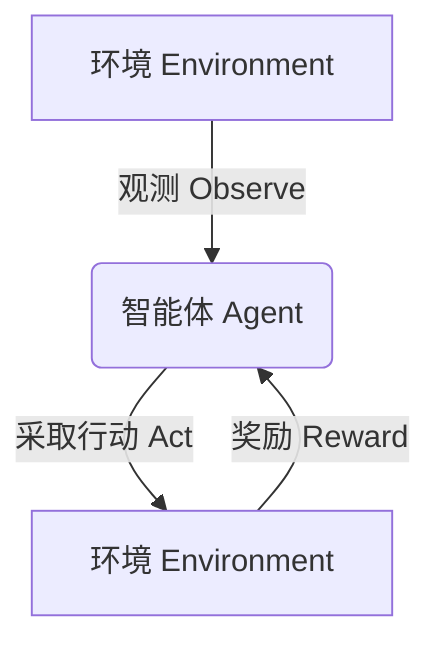
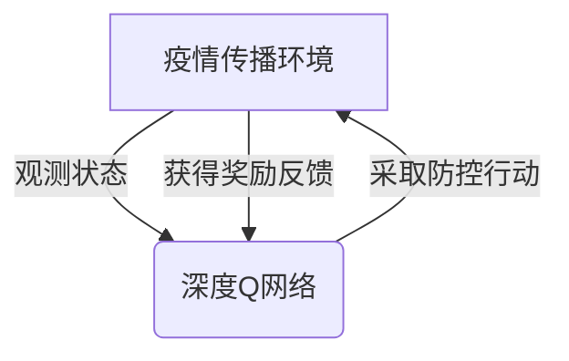

# 深度 Q-learning：在疫情预测中的应用

## 1. 背景介绍

### 1.1 疫情预测的重要性

在当前全球化的世界中,传染病的蔓延已经成为一个严重的公共卫生问题和社会挑战。准确预测疫情的发展趋势对于制定有效的防控策略、优化资源配置和减轻疫情带来的负面影响至关重要。传统的疫情预测方法通常依赖于统计模型和经验公式,但这些方法往往难以捕捉复杂疫情传播过程中的非线性动态和不确定性。

### 1.2 人工智能在疫情预测中的应用

随着人工智能技术的不断发展,特别是深度学习和强化学习等方法的兴起,为疫情预测提供了新的解决方案。深度学习能够从海量数据中自动提取特征,捕捉复杂的非线性映射关系;而强化学习则可以通过与环境的交互来学习最优策略,应对不确定的动态环境。将两者相结合,即深度强化学习(Deep Reinforcement Learning),为解决疫情预测这一复杂问题提供了有力工具。

### 1.3 Q-learning 算法简介

Q-learning 是强化学习中的一种经典算法,它通过估计状态-行为对的长期回报(Q值),来学习最优策略。与其他强化学习算法相比,Q-learning 具有无模型(Model-free)、离线(Off-policy)的特点,能够处理连续状态和行为空间,并且收敛性能良好。将 Q-learning 与深度神经网络相结合,即深度 Q-learning(Deep Q-Learning),可以显著提高其处理复杂问题的能力。

## 2. 核心概念与联系

### 2.1 强化学习概述

强化学习(Reinforcement Learning)是机器学习的一个重要分支,它研究如何基于环境反馈来学习最优策略,以最大化长期累积奖励。强化学习系统通常由四个核心组件组成:

- 环境(Environment):系统所处的外部世界,包含各种状态。
- 智能体(Agent):在环境中采取行动的决策实体。
- 状态(State):描述环境的instantaneous情况。
- 奖励(Reward):环境对智能体行为的评价反馈。

智能体与环境进行交互,观测当前状态,采取行动,然后获得新的状态和奖励。目标是学习一个策略(Policy),使长期累积奖励最大化。

### 2.2 Q-learning 工作原理

Q-learning 算法的核心思想是估计状态-行为对的长期回报值,即 Q 值函数:

$$Q(s, a) = \mathbb{E}\left[r_t + \gamma r_{t+1} + \gamma^2 r_{t+2} + \cdots | s_t = s, a_t = a, \pi\right]$$

其中 $r_t$ 表示时刻 $t$ 获得的即时奖励, $\gamma \in [0, 1)$ 是折扣因子, $\pi$ 是策略。Q-learning 通过迭代更新来不断改进 Q 值估计:

$$Q(s_t, a_t) \leftarrow Q(s_t, a_t) + \alpha \left[r_t + \gamma \max_{a'} Q(s_{t+1}, a') - Q(s_t, a_t)\right]$$

其中 $\alpha$ 是学习率。通过不断探索和利用,最终 Q 值函数可以收敛到最优值,对应的策略就是最优策略。

### 2.3 深度 Q 网络(DQN)

传统的 Q-learning 算法使用表格或者简单的函数拟合器来估计 Q 值,难以处理高维连续的状态空间。深度 Q 网络(Deep Q-Network, DQN)将深度神经网络引入 Q-learning,用于逼近 Q 值函数:

$$Q(s, a; \theta) \approx Q^*(s, a)$$

其中 $\theta$ 表示神经网络的参数。在训练过程中,通过最小化损失函数:

$$L(\theta) = \mathbb{E}_{(s, a, r, s')}\left[\left(r + \gamma \max_{a'} Q(s', a'; \theta^-) - Q(s, a; \theta)\right)^2\right]$$

来不断更新网络参数 $\theta$, 使得 $Q(s, a; \theta)$ 逼近真实的 Q 值函数。DQN 算法通过经验回放(Experience Replay)和目标网络(Target Network)等技巧,显著提高了训练稳定性和性能。

### 2.4 深度 Q-learning 在疫情预测中的应用

将深度 Q-learning 应用于疫情预测,可以将疫情传播过程建模为一个马尔可夫决策过程(Markov Decision Process, MDP):

- 状态(State):描述疫情在不同地区的传播情况,如确诊人数、治愈人数等。
- 行为(Action):采取的防控措施,如隔离、检测、限制人员流动等。
- 奖励(Reward):根据防控目标设计,如最小化确诊人数、最大化治愈人数等。

智能体(Agent)即疫情预测和决策系统,通过与环境(真实疫情传播过程)交互,学习最优的防控策略,从而实现疫情的有效控制。

## 3. 核心算法原理具体操作步骤

深度 Q-learning 算法的具体操作步骤如下:

1. **初始化**
   - 初始化深度 Q 网络,包括评估网络(评估 Q 值)和目标网络(生成目标 Q 值)。
   - 初始化经验回放池(Experience Replay Buffer),用于存储过往的状态转移样本。

2. **观测初始状态**
   - 从环境中获取初始状态 $s_0$。

3. **选择并执行行动**
   - 根据当前状态 $s_t$,通过 $\epsilon$-贪婪策略从评估网络输出的 Q 值中选择行动 $a_t$。
   - 在环境中执行行动 $a_t$,获得新状态 $s_{t+1}$ 和即时奖励 $r_t$。
   - 将 $(s_t, a_t, r_t, s_{t+1})$ 存入经验回放池。

4. **采样并学习**
   - 从经验回放池中随机采样一个批次的状态转移样本 $(s, a, r, s')$。
   - 计算目标 Q 值:
     $$y = r + \gamma \max_{a'} Q(s', a'; \theta^-)$$
     其中 $\theta^-$ 为目标网络的参数。
   - 计算评估网络输出的 Q 值: $Q(s, a; \theta)$。
   - 最小化损失函数:
     $$L(\theta) = \mathbb{E}_{(s, a, r, s')}\left[\left(y - Q(s, a; \theta)\right)^2\right]$$
     通过梯度下降法更新评估网络参数 $\theta$。

5. **目标网络更新**
   - 每隔一定步数,将评估网络的参数 $\theta$ 复制到目标网络,即 $\theta^- \leftarrow \theta$。

6. **回到步骤 3**,直到达到终止条件。

通过不断地与环境交互、学习和更新网络参数,深度 Q 网络最终可以逼近最优的 Q 值函数,对应的策略就是最优防控策略。

## 4. 数学模型和公式详细讲解举例说明

### 4.1 马尔可夫决策过程(MDP)

马尔可夫决策过程(Markov Decision Process, MDP)是强化学习中的一种基本形式化框架,用于描述一个完全可观测的、随机的、离散时间的决策过程。MDP 由以下五个要素组成:

- 状态集合 $\mathcal{S}$: 环境所有可能的状态的集合。
- 行为集合 $\mathcal{A}$: 智能体可以采取的所有行动的集合。
- 转移概率 $\mathcal{P}_{ss'}^a = \Pr(s_{t+1} = s' | s_t = s, a_t = a)$: 在状态 $s$ 下采取行动 $a$ 后,转移到状态 $s'$ 的概率。
- 奖励函数 $\mathcal{R}_s^a = \mathbb{E}[r_{t+1} | s_t = s, a_t = a]$: 在状态 $s$ 下采取行动 $a$ 后获得的期望奖励。
- 折扣因子 $\gamma \in [0, 1)$: 用于权衡即时奖励和未来奖励的重要性。

在 MDP 中,智能体的目标是学习一个策略 $\pi: \mathcal{S} \rightarrow \mathcal{A}$,使得期望的累积折扣奖励最大化:

$$J(\pi) = \mathbb{E}_\pi\left[\sum_{t=0}^\infty \gamma^t r_{t+1}\right]$$

### 4.2 Q-learning 算法推导

Q-learning 算法的核心思想是估计状态-行为对的长期回报值,即 Q 值函数:

$$Q(s, a) = \mathbb{E}\left[r_t + \gamma r_{t+1} + \gamma^2 r_{t+2} + \cdots | s_t = s, a_t = a, \pi\right]$$

根据 Bellman 方程,Q 值函数可以写成:

$$Q(s, a) = \mathbb{E}_{s'}\left[r + \gamma \max_{a'} Q(s', a') | s, a\right]$$

其中 $r$ 是在状态 $s$ 下采取行动 $a$ 后获得的即时奖励,期望是对所有可能的下一状态 $s'$ 计算的。

Q-learning 算法通过迭代更新来不断改进 Q 值估计:

$$Q(s_t, a_t) \leftarrow Q(s_t, a_t) + \alpha \left[r_t + \gamma \max_{a'} Q(s_{t+1}, a') - Q(s_t, a_t)\right]$$

其中 $\alpha$ 是学习率。通过不断探索和利用,最终 Q 值函数可以收敛到最优值,对应的策略就是最优策略。

### 4.3 深度 Q 网络(DQN)

传统的 Q-learning 算法使用表格或者简单的函数拟合器来估计 Q 值,难以处理高维连续的状态空间。深度 Q 网络(Deep Q-Network, DQN)将深度神经网络引入 Q-learning,用于逼近 Q 值函数:

$$Q(s, a; \theta) \approx Q^*(s, a)$$

其中 $\theta$ 表示神经网络的参数。在训练过程中,通过最小化损失函数:

$$L(\theta) = \mathbb{E}_{(s, a, r, s')}\left[\left(r + \gamma \max_{a'} Q(s', a'; \theta^-) - Q(s, a; \theta)\right)^2\right]$$

来不断更新网络参数 $\theta$, 使得 $Q(s, a; \theta)$ 逼近真实的 Q 值函数。其中 $\theta^-$ 表示目标网络的参数,用于提高训练稳定性。

### 4.4 DQN 算法举例说明

假设我们要构建一个深度 Q 网络来控制一个简单的机器人导航任务。机器人的状态 $s$ 由它在二维平面上的位置 $(x, y)$ 和目标位置 $(x_g, y_g)$ 组成,即 $s = (x, y, x_g, y_g)$。机器人可以采取四种行动 $a \in \{上, 下, 左, 右\}$,每次移动一个单位距离。奖励函数设计为:当机器人到达目标位置时,获得正奖励 $+1$;否则获得负奖励 $-0.1$,以鼓励机器人尽快到达目标。

我们可以使用一个深度神经网络来逼近 Q 值函数 $Q(s, a; \theta)$,网络输入为状态 $s$,输出为四个 Q 值,分别对应四种行动。在训练过程中,我们从经验回放池中采样状态转移样本 $(s, a, r, s')$,计算目标 Q 值:

$$y = r + \gamma \max_{a'} Q(s', a'; \theta^-)$$

然后最小化损失函数:

$$L(\theta) = \mathbb{E}