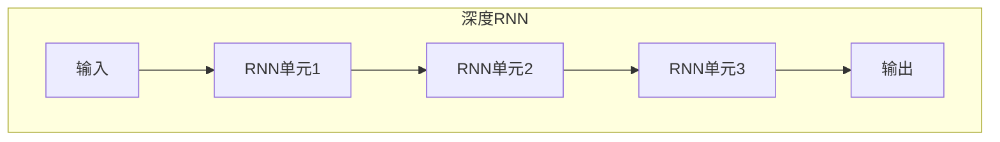
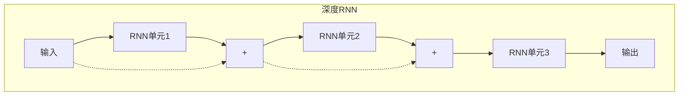
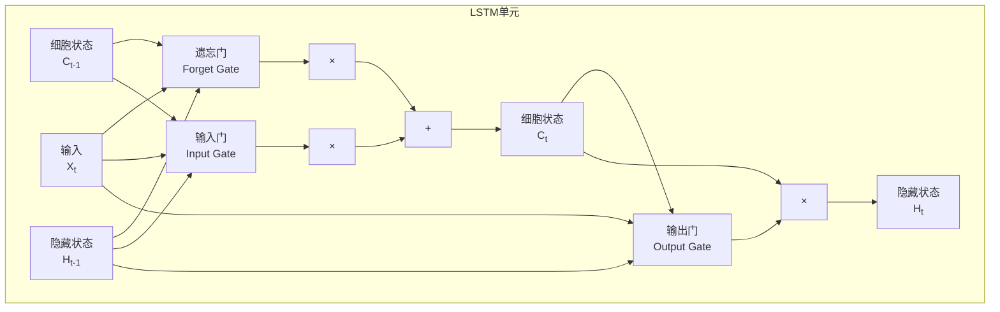
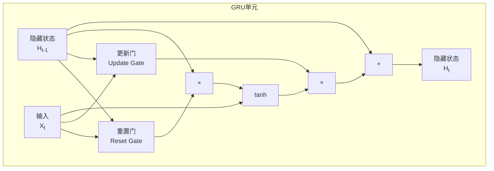

# 深度RNN：构建更强大的时间序列模型

## 1.背景介绍

### 1.1 时间序列数据的重要性

在当今数据驱动的世界中，时间序列数据无处不在。从金融市场的股票价格和外汇汇率,到天气预报、语音识别、机器翻译等,时间序列数据都扮演着关键角色。准确分析和预测这些数据对于各行业的决策制定至关重要。

### 1.2 传统时间序列模型的局限性

传统的时间序列分析方法,如ARIMA(自回归移动平均)模型、指数平滑等,在处理线性数据时表现不错,但对于非线性、高维、长期依赖等复杂时间序列数据就力有未逮了。

### 1.3 循环神经网络(RNN)的优势

循环神经网络(Recurrent Neural Network, RNN)是一种专门为处理序列数据而设计的神经网络模型。它通过内部的循环机制来捕捉数据中的时间动态行为,从而更好地学习序列数据的内在规律。RNN在语音识别、自然语言处理、时间序列预测等领域展现出了强大的能力。

### 1.4 深度RNN的兴起

然而,标准的RNN在捕捉长期依赖方面存在着一些障碍。为了解决这个问题,深度RNN(Deep RNN)应运而生,它通过堆叠多层RNN单元来增强网络的表达能力,从而更好地建模复杂的时间序列数据。

## 2.核心概念与联系

### 2.1 循环神经网络(RNN)

RNN是一种特殊的神经网络,它在隐藏层之间引入了循环连接,使得网络能够捕捉序列数据中的动态行为。与传统的前馈神经网络不同,RNN在处理序列时会保留前一时间步的状态,并与当前输入进行组合,从而学习到序列数据的时间模式。

#### 2.1.1 RNN的计算过程

在时间步 $t$, RNN的隐藏状态 $h_t$ 由上一时间步的隐藏状态 $h_{t-1}$ 和当前输入 $x_t$ 计算得到:

$$h_t = \tanh(W_{hh}h_{t-1} + W_{xh}x_t + b_h)$$

其中, $W_{hh}$ 和 $W_{xh}$ 分别是隐藏层和输入层的权重矩阵, $b_h$ 是隐藏层的偏置项。

最终的输出 $y_t$ 由隐藏状态 $h_t$ 和输出层的权重矩阵 $W_{hy}$ 计算得到:

$$y_t = W_{hy}h_t + b_y$$

通过不断迭代这个过程,RNN就能够学习到序列数据的内在模式。

#### 2.1.2 RNN在实践中的挑战

尽管RNN在理论上能够学习任意长度的序列模式,但在实践中它往往难以捕捉长期依赖关系,这是由于梯度消失或爆炸问题的存在。为了缓解这个问题,研究人员提出了一些改进的RNN变体,如LSTM(Long Short-Term Memory)和GRU(Gated Recurrent Unit),它们通过引入门控机制来更好地捕捉长期依赖关系。

### 2.2 深度RNN

深度RNN(Deep RNN)是指将多个RNN单元沿深度方向堆叠的网络结构。与单层RNN相比,深度RNN具有更强的表达能力,能够更好地捕捉输入序列中的复杂模式。

#### 2.2.1 深度RNN的结构

深度RNN通常由多个RNN单元沿深度方向堆叠而成。每一层RNN单元的输出将作为下一层的输入,从而形成一个层级结构。最后一层RNN单元的输出将被用于预测或其他任务。

通过这种层级结构,深度RNN能够在不同的层次上捕捉输入序列的不同特征,从而提高模型的表达能力。

#### 2.2.2 残差连接

为了缓解深度RNN中可能出现的梯度消失或爆炸问题,通常会采用残差连接(Residual Connection)的技术。残差连接允许输入直接传递到后面的层,从而使梯度更容易流动,提高了模型的训练效率。

通过残差连接,深度RNN能够更好地捕捉长期依赖关系,同时也提高了模型的训练稳定性。

## 3.核心算法原理具体操作步骤 

### 3.1 LSTM(Long Short-Term Memory)

LSTM是一种改进的RNN变体,它通过引入门控机制来解决标准RNN中的梯度消失或爆炸问题,从而更好地捕捉长期依赖关系。

#### 3.1.1 LSTM单元的结构

LSTM单元由一个细胞状态(Cell State)和三个门控单元(Forget Gate、Input Gate、Output Gate)组成。

- 遗忘门(Forget Gate)决定了细胞状态中哪些信息需要被遗忘。
- 输入门(Input Gate)决定了新的输入信息中哪些需要被更新到细胞状态中。
- 输出门(Output Gate)根据细胞状态和当前输入,决定输出什么信息到隐藏状态中。

通过这种门控机制,LSTM能够更好地捕捉长期依赖关系,从而克服了标准RNN的缺陷。

#### 3.1.2 LSTM的计算过程

假设在时间步 $t$, LSTM单元的输入为 $x_t$, 上一时间步的隐藏状态为 $h_{t-1}$, 上一时间步的细胞状态为 $c_{t-1}$, 则LSTM单元的计算过程如下:

1. 遗忘门:

$$f_t = \sigma(W_f \cdot [h_{t-1}, x_t] + b_f)$$

2. 输入门: 

$$i_t = \sigma(W_i \cdot [h_{t-1}, x_t] + b_i)$$
$$\tilde{c}_t = \tanh(W_c \cdot [h_{t-1}, x_t] + b_c)$$

3. 更新细胞状态:

$$c_t = f_t \odot c_{t-1} + i_t \odot \tilde{c}_t$$

4. 输出门:

$$o_t = \sigma(W_o \cdot [h_{t-1}, x_t] + b_o)$$
$$h_t = o_t \odot \tanh(c_t)$$

其中, $\sigma$ 是sigmoid激活函数, $\odot$ 表示元素wise乘积运算, $W$ 和 $b$ 分别是权重矩阵和偏置向量。

通过上述计算过程,LSTM能够根据当前输入和上一时间步的状态,决定保留、遗忘和更新哪些信息,从而更好地捕捉长期依赖关系。

### 3.2 GRU(Gated Recurrent Unit)

GRU是另一种改进的RNN变体,它相比LSTM结构更加简洁,计算量也更小,但在很多任务上表现与LSTM相当。

#### 3.2.1 GRU单元的结构 

GRU单元由两个门控单元(重置门Reset Gate和更新门Update Gate)组成。

- 重置门(Reset Gate)决定了在计算新的候选隐藏状态时,需要忽略掉上一时间步的哪些信息。
- 更新门(Update Gate)决定了需要将新的候选隐藏状态与上一时间步的隐藏状态按照何种比例进行组合。

相比LSTM,GRU的结构更加简单,计算量也更小,但在很多任务上表现与LSTM相当。

#### 3.2.2 GRU的计算过程

假设在时间步 $t$, GRU单元的输入为 $x_t$, 上一时间步的隐藏状态为 $h_{t-1}$, 则GRU单元的计算过程如下:

1. 重置门:

$$r_t = \sigma(W_r \cdot [h_{t-1}, x_t] + b_r)$$

2. 更新门:

$$z_t = \sigma(W_z \cdot [h_{t-1}, x_t] + b_z)$$

3. 候选隐藏状态:

$$\tilde{h}_t = \tanh(W_h \cdot [r_t \odot h_{t-1}, x_t] + b_h)$$

4. 更新隐藏状态:

$$h_t = (1 - z_t) \odot h_{t-1} + z_t \odot \tilde{h}_t$$

其中, $\sigma$ 是sigmoid激活函数, $\odot$ 表示元素wise乘积运算, $W$ 和 $b$ 分别是权重矩阵和偏置向量。

通过上述计算过程,GRU能够根据当前输入和上一时间步的状态,决定保留、更新哪些信息,从而捕捉长期依赖关系。

## 4.数学模型和公式详细讲解举例说明

在本节中,我们将详细讲解深度RNN中涉及的一些重要数学模型和公式,并通过具体例子来加深理解。

### 4.1 反向传播算法(BPTT)

反向传播算法(Backpropagation Through Time, BPTT)是训练RNN模型的核心算法。它通过计算损失函数关于每个权重的梯度,并使用梯度下降法来更新权重,从而最小化损失函数。

#### 4.1.1 BPTT算法原理

对于一个长度为 $T$ 的序列,我们可以将RNN展开为一个计算图,其中每个时间步对应一个RNN单元。我们定义损失函数为:

$$\mathcal{L} = \sum_{t=1}^{T} \mathcal{L}_t$$

其中, $\mathcal{L}_t$ 是时间步 $t$ 的损失。

我们需要计算 $\frac{\partial \mathcal{L}}{\partial W}$ 和 $\frac{\partial \mathcal{L}}{\partial b}$, 即损失函数关于权重矩阵 $W$ 和偏置向量 $b$ 的梯度。根据链式法则,我们有:

$$\frac{\partial \mathcal{L}}{\partial W} = \sum_{t=1}^{T} \frac{\partial \mathcal{L}_t}{\partial W}$$
$$\frac{\partial \mathcal{L}}{\partial b} = \sum_{t=1}^{T} \frac{\partial \mathcal{L}_t}{\partial b}$$

对于每个时间步 $t$, 我们可以使用反