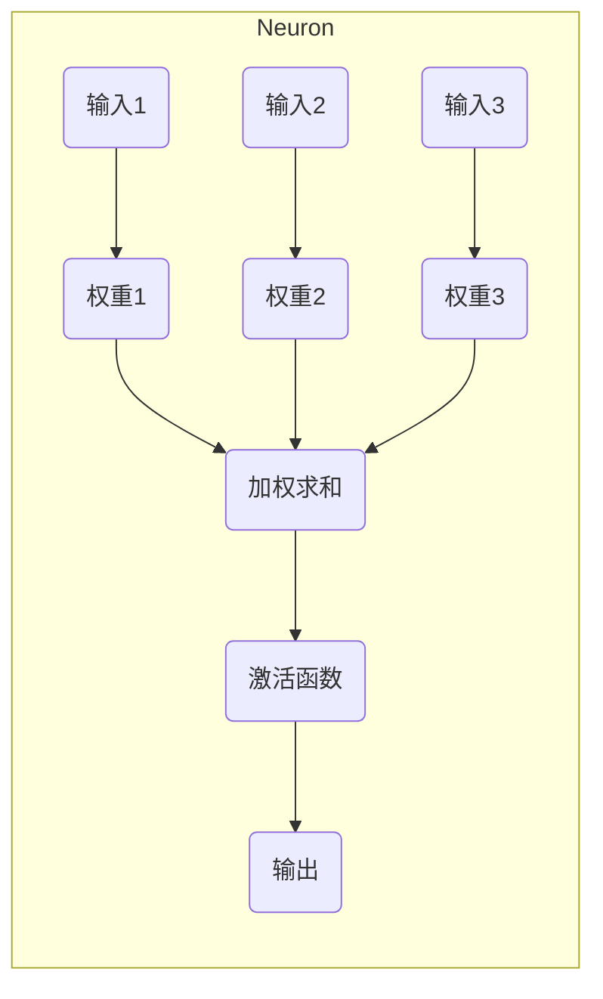
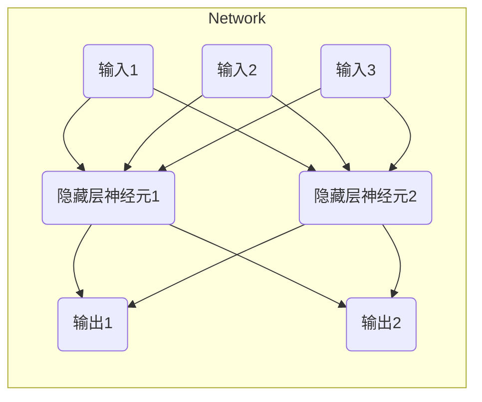

# 深度学习 原理与代码实例讲解

## 1.背景介绍

### 1.1 什么是深度学习?

深度学习(Deep Learning)是机器学习的一个新兴热点领域,是一种基于对数据进行表示学习的方法。它模仿人脑神经网络结构和功能,通过多层非线性变换对数据进行特征提取和模式分析。深度学习能够自动学习数据的高层次抽象特征,解决了传统机器学习算法需要人工设计特征的瓶颈。

### 1.2 深度学习的发展历程

深度学习的理论基础可以追溯到20世纪60年代提出的人工神经网络,但由于计算能力和训练数据的限制,很长一段时间里并未取得实质性突破。21世纪初,受益于大数据时代海量数据的积累、GPU并行计算能力的飞速提升,以及一些新的训练技术和模型的提出,深度学习开始在语音识别、计算机视觉等领域展现出超越传统方法的优异性能,掀起了一股深度学习的热潮。

### 1.3 深度学习的优势

相比传统的机器学习算法,深度学习具有以下优势:

1. 自动学习数据特征,无需人工设计特征
2. 端到端的模型训练,简化了流程
3. 层次化的特征学习,能捕捉数据的深层次抽象模式
4. 在大数据场景下发挥强大的模型容量
5. 通用性强,可广泛应用于多个领域

## 2.核心概念与联系

### 2.1 神经网络

神经网络(Neural Network)是深度学习的核心模型,它借鉴了生物神经系统的结构和工作原理。一个神经网络由大量互连的节点(神经元)组成,每个节点接收来自前一层的输入信号,经过加权求和和非线性激活函数的处理后,将输出传递到下一层。

神经网络的基本单元是人工神经元,如下图所示:

多个神经元按层次组织成神经网络,形成输入层、隐藏层和输出层,如下所示:

通过对网络进行训练,可以学习到将输入映射到输出的复杂函数,从而实现各种任务,如分类、回归、序列生成等。

### 2.2 深度学习中的核心概念

1. **前馈神经网络(Feedforward Neural Network,FNN)**: 信息只从输入层单向传播到输出层,是最基本的神经网络结构。
2. **卷积神经网络(Convolutional Neural Network,CNN)**: 在图像、视频等领域表现出色,能自动学习局部特征。
3. **循环神经网络(Recurrent Neural Network,RNN)**: 擅长处理序列数据,在自然语言处理等领域应用广泛。
4. **长短期记忆网络(Long Short-Term Memory,LSTM)**: 改进的RNN,能够更好地捕捉长期依赖关系。
5. **注意力机制(Attention Mechanism)**: 赋予网络专注于输入数据的不同部分的能力,显著提高了性能。

这些核心概念密切相关,构成了深度学习的理论基础和主要模型框架。

## 3.核心算法原理具体操作步骤

在深度学习中,训练神经网络模型是一个关键的过程。这里以经典的反向传播(Backpropagation)算法为例,介绍其核心原理和操作步骤。

### 3.1 反向传播算法简介

反向传播算法是一种用于训练多层神经网络的监督学习算法。它通过计算损失函数关于网络权重的梯度,并沿着梯度的反方向更新权重,从而最小化损失函数,使网络输出逼近期望输出。

### 3.2 反向传播算法步骤

反向传播算法主要包括以下步骤:

1. **前向传播(Forward Propagation)**

   将输入数据传递到输出层,计算每一层的输出值。设输入为$X$,权重为$W$,偏置为$b$,激活函数为$\sigma$,则:

   $$
   Z^{(l)} = W^{(l)}A^{(l-1)} + b^{(l)} \\
   A^{(l)} = \sigma(Z^{(l)})
   $$

   其中$Z^{(l)}$为第$l$层的加权输入,$ A^{(l)}$为第$l$层的激活输出。

2. **计算损失函数(Loss Function)**

   比较输出层的实际输出$A^{(n_l)}$与期望输出$Y$的差异,计算损失函数$\mathcal{L}$,如交叉熵损失:

   $$
   \mathcal{L}(A^{(n_l)}, Y) = -\sum_i [y_i \log a_i^{(n_l)} + (1-y_i) \log (1-a_i^{(n_l)})]
   $$

3. **反向传播(Backpropagation)**

   从输出层开始,沿网络方向逆向计算每层权重的梯度,实现链式法则:

   $$
   \frac{\partial \mathcal{L}}{\partial W^{(l)}} = \frac{\partial \mathcal{L}}{\partial Z^{(l)}} \frac{\partial Z^{(l)}}{\partial W^{(l)}} = \delta^{(l)} A^{(l-1)^T}
   $$

   其中$\delta^{(l)}$为第$l$层的误差项,根据下一层的误差项$\delta^{(l+1)}$计算得到:

   $$
   \delta^{(l)} = ((W^{(l+1)})^T \delta^{(l+1)}) \odot \sigma'(Z^{(l)})
   $$

4. **权重更新(Weight Update)**

   使用优化算法(如梯度下降)沿梯度方向更新网络权重:

   $$
   W^{(l)} \leftarrow W^{(l)} - \eta \frac{\partial \mathcal{L}}{\partial W^{(l)}}
   $$

   其中$\eta$为学习率,控制更新步长。

5. **重复迭代**

   重复上述过程,不断更新权重,直到损失函数收敛或达到停止条件。

通过反向传播算法,神经网络可以自动调整内部参数,从而学习到将输入映射到输出的最优函数近似。

## 4.数学模型和公式详细讲解举例说明

在深度学习中,数学模型和公式扮演着至关重要的角色。这里将详细讲解一些核心的数学概念和公式,并结合实例进行说明。

### 4.1 激活函数

激活函数是神经网络中的一个关键组成部分,它引入了非线性,使网络能够学习复杂的映射关系。常用的激活函数包括:

1. **Sigmoid函数**

   $$
   \sigma(x) = \frac{1}{1 + e^{-x}}
   $$

   Sigmoid函数将输入值映射到(0,1)范围内,常用于二分类任务的输出层。但由于存在梯度消失问题,在隐藏层使用时需谨慎。

2. **Tanh函数**

   $$
   \tanh(x) = \frac{e^x - e^{-x}}{e^x + e^{-x}}
   $$

   Tanh函数的输出范围在(-1,1)之间,比Sigmoid函数收敛速度更快,梯度更稳定。

3. **ReLU函数**

   $$
   \text{ReLU}(x) = \max(0, x)
   $$

   ReLU(整流线性单元)是最常用的激活函数之一,它只保留正值部分,使得网络更加稀疏,加速了收敛。但也可能出现神经元"死亡"的情况。

   例如,在一个简单的二分类问题中,我们可以使用Sigmoid激活函数构建一个单层神经网络:

   $$
   \hat{y} = \sigma(w^Tx + b)
   $$

   其中$x$为输入特征向量,$w$和$b$分别为权重和偏置参数,输出$\hat{y}$即为预测的二分类概率。

### 4.2 损失函数

损失函数(Loss Function)用于衡量模型预测值与真实值之间的差异,是优化模型的驱动力。常用的损失函数包括:

1. **均方误差(Mean Squared Error, MSE)**: 适用于回归问题,计算预测值与真实值之差的平方的期望。

   $$
   \mathcal{L}_\text{MSE}(\hat{y}, y) = \frac{1}{n} \sum_{i=1}^n (\hat{y}_i - y_i)^2
   $$

2. **交叉熵损失(Cross-Entropy Loss)**: 适用于分类问题,计算预测概率与真实标签之间的交叉熵。

   $$
   \mathcal{L}_\text{CE}(\hat{y}, y) = -\frac{1}{n} \sum_{i=1}^n \Big[y_i \log \hat{y}_i + (1 - y_i) \log (1 - \hat{y}_i)\Big]
   $$

   对于多分类问题,交叉熵损失可写为:

   $$
   \mathcal{L}_\text{CE}(\hat{\mathbf{y}}, \mathbf{y}) = -\sum_{i=1}^n \sum_{j=1}^c y_{ij} \log \hat{y}_{ij}
   $$

   其中$c$为类别数。

   例如,在一个二分类问题中,如果样本真实标签为1,预测概率为0.6,则交叉熵损失为:

   $$
   \mathcal{L}_\text{CE}(0.6, 1) = -\log 0.6 = 0.51
   $$

### 4.3 优化算法

为了最小化损失函数,我们需要使用优化算法来更新网络参数。常用的优化算法包括:

1. **梯度下降(Gradient Descent)**

   梯度下降是最基本的优化算法,根据损失函数关于参数的梯度,沿梯度的反方向更新参数:

   $$
   \theta \leftarrow \theta - \eta \nabla_\theta \mathcal{L}(\theta)
   $$

   其中$\eta$为学习率,控制更新步长。

2. **随机梯度下降(Stochastic Gradient Descent, SGD)**

   SGD是梯度下降的一种变体,每次更新只使用一个样本(或一个小批量样本)计算梯度,计算量小,但收敛过程波动较大。

3. **动量优化(Momentum Optimization)**

   动量优化在SGD的基础上,引入了一个"动量"项,使得参数更新方向不仅考虑当前梯度,还考虑了之前的更新方向,有助于加速收敛并跳出局部最优。

   $$
   \begin{aligned}
   v_t &= \gamma v_{t-1} + \eta \nabla_\theta \mathcal{L}(\theta_t) \\
   \theta_t &= \theta_{t-1} - v_t
   \end{aligned}
   $$

   其中$\gamma$为动量系数,控制过去梯度的影响程度。

4. **自适应学习率优化算法(Adaptive Learning Rate Optimization)**

   这类算法(如AdaGrad、RMSProp、Adam等)通过自适应调整每个参数的学习率,可以更好地处理梯度稀疏或梯度变化剧烈的情况,提高收敛效率。

通过合理选择损失函数和优化算法,可以有效训练神经网络模型,提高其性能。

## 4.项目实践:代码实例和详细解释说明

为了加深对深度学习原理的理解,我们将通过一个实际项目案例,使用Python和PyTorch框架构建一个简单的前馈神经网络,并在MNIST手写数字识别任务上进行训练和