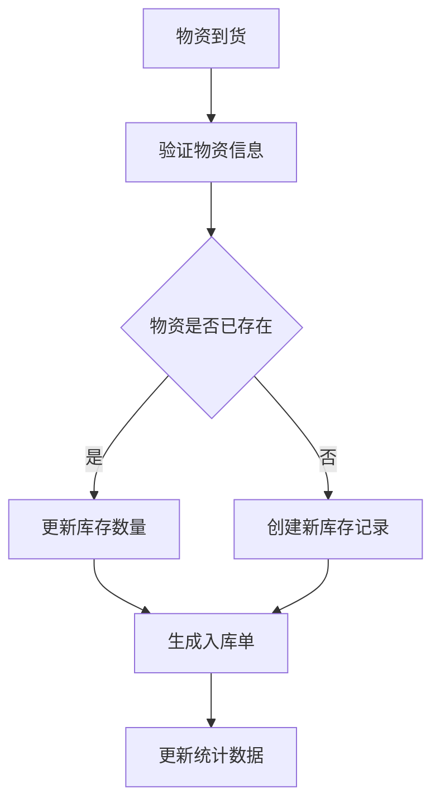
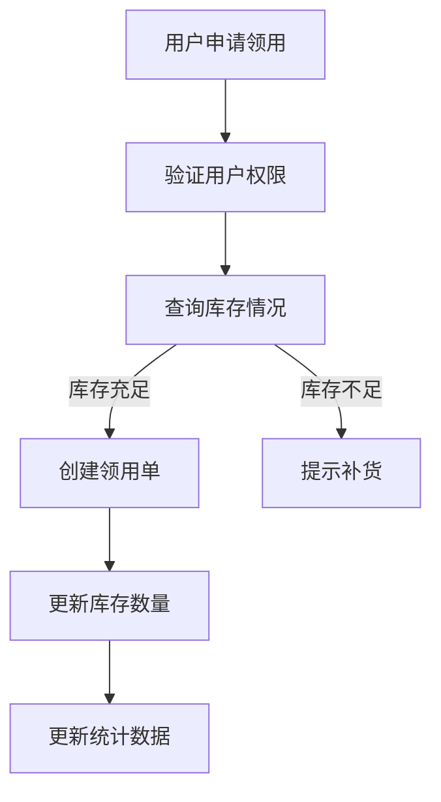
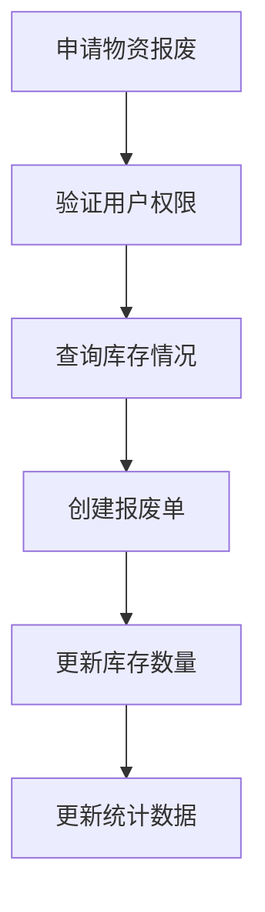
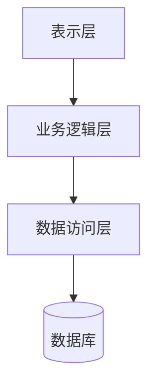

# 物资管理系统设计与实现

## 1. 背景介绍

### 1.1 物资管理的重要性

在任何组织或企业中，物资管理都扮演着至关重要的角色。有效的物资管理不仅可以确保物资的合理分配和利用,还能够降低运营成本、提高效率,并为组织带来更大的竞争优势。随着业务规模的不断扩大,传统的手工管理方式已经无法满足现代化管理的需求,因此开发一套高效、可靠的物资管理系统变得势在必行。

### 1.2 系统目标

本文旨在设计并实现一个全面的物资管理系统,该系统应当具备以下核心功能:

- 物资入库管理
- 物资库存管理
- 物资领用管理
- 物资报废管理
- 供应商管理
- 物资分类管理
- 统计报表生成

通过该系统,管理人员可以全面掌握物资的流向,实现物资的精细化管理,从而提高资源利用率,降低运营成本。

## 2. 核心概念与联系

### 2.1 物资分类

为了便于管理,系统需要对物资进行合理的分类。常见的分类方式包括:

- 按用途分类(办公用品、生产原材料等)
- 按价值分类(高价值物资、低价值物资)
- 按存储条件分类(常温存储、冷藏存储等)

物资分类的设计直接关系到系统的使用体验和管理效率,因此需要根据实际情况进行合理规划。

### 2.2 物资流转

物资在系统中的流转路径包括:入库、库存、领用、报废等环节。每个环节都需要对应的操作界面和数据记录,以确保物资流转的可追溯性和透明度。

### 2.3 供应商管理

供应商是物资来源的重要渠道,系统需要提供供应商信息的录入和维护功能,以便于物资采购和供应商评估。

### 2.4 权限管理

不同的用户在系统中拥有不同的操作权限,如物资管理员可以进行物资入库、出库等操作,而普通员工仅能查看库存信息。合理的权限设置可以保证系统的安全性和数据的完整性。

## 3. 核心算法原理具体操作步骤

### 3.1 物资入库算法

当新的物资到货时,需要执行入库操作。入库算法的主要步骤如下:

1. 验证物资信息(名称、规格、数量等)
2. 查询物资是否已存在于库存中
   - 若存在,则更新库存数量
   - 若不存在,则创建新的库存记录
3. 生成入库单,记录入库批次、供应商等信息
4. 更新相关统计数据(总入库量、供应商交易额等)



### 3.2 物资领用算法

当用户需要领用物资时,需要执行领用操作。领用算法的主要步骤如下:

1. 验证用户权限
2. 查询所需物资的库存情况
   - 若库存充足,则继续执行
   - 若库存不足,则提示补货
3. 创建领用单,记录领用人、领用数量等信息
4. 更新物资库存数量
5. 更新相关统计数据(总领用量等)



### 3.3 物资报废算法

对于过期、损坏或者滞销的物资,需要执行报废操作。报废算法的主要步骤如下:

1. 验证用户权限
2. 查询所需报废物资的库存情况
3. 创建报废单,记录报废原因、数量等信息
4. 更新物资库存数量
5. 更新相关统计数据(总报废量等)



## 4. 数学模型和公式详细讲解举例说明

在物资管理系统中,我们需要对一些关键指标进行量化和建模,以便于更好地评估和优化物资管理策略。

### 4.1 物资库存周转率

库存周转率是衡量物资管理效率的重要指标,它反映了物资从购入到消耗的速度。库存周转率越高,说明物资的流转效率越高,资金的占用时间越短。

库存周转率的计算公式如下:

$$
库存周转率 = \frac{销售成本}{平均库存}
$$

其中,销售成本指一定时期内领用或销售的物资成本总额;平均库存则可通过期初库存和期末库存的算术平均值计算得到。

例如,某企业上年度的销售成本为500万元,期初库存为100万元,期末库存为150万元,则该企业的库存周转率为:

$$
库存周转率 = \frac{500}{\frac{100+150}{2}} = 5
$$

这说明该企业的物资在一年内周转了5次,库存管理效率较高。

### 4.2 经济订货量模型

在物资采购过程中,我们需要权衡订货成本和库存成本,以确定最佳的订货量。经济订货量(Economic Order Quantity, EOQ)模型可以帮助我们找到在给定条件下最小化总成本的订货量。

EOQ模型的基本公式为:

$$
EOQ = \sqrt{\frac{2DC}{H}}
$$

其中,D为年度需求量,C为每次订货的固定成本,H为每单位物资的年度库存持有成本。

假设某物资的年度需求量为10000件,每次订货的固定成本为500元,每件物资的年度库存持有成本为2元,则经济订货量为:

$$
EOQ = \sqrt{\frac{2 \times 10000 \times 500}{2}} = 1000
$$

因此,最佳的订货量为1000件。

通过合理应用经济订货量模型,企业可以有效控制采购成本和库存成本,提高物资管理效率。

## 5. 项目实践:代码实例和详细解释说明

在本节中,我们将通过一个基于Java的简单示例,演示如何实现物资管理系统的核心功能。

### 5.1 系统架构

我们采用经典的三层架构设计,包括表示层(UI)、业务逻辑层和数据访问层。



- 表示层:提供用户界面,接收用户输入并显示操作结果。
- 业务逻辑层:实现系统的核心业务逻辑,如物资入库、出库、查询等功能。
- 数据访问层:负责与数据库进行交互,执行数据持久化操作。

### 5.2 核心类设计

#### 5.2.1 物资类(Item)

```java
public class Item {
    private String name; // 物资名称
    private String category; // 物资分类
    private double unitPrice; // 单价
    private int quantity; // 库存数量

    // 构造函数、getter和setter方法
    // ...
}
```

#### 5.2.2 物资管理类(ItemManager)

```java
public class ItemManager {
    private List<Item> itemList; // 物资列表
    private Map<String, Supplier> supplierMap; // 供应商映射

    public void addItem(Item item, int quantity, Supplier supplier) {
        // 实现物资入库逻辑
    }

    public void removeItem(String itemName, int quantity) {
        // 实现物资出库逻辑
    }

    public List<Item> searchItems(String keyword) {
        // 实现物资查询逻辑
    }

    // 其他方法...
}
```

#### 5.2.3 供应商类(Supplier)

```java
public class Supplier {
    private String name; // 供应商名称
    private String contact; // 联系方式

    // 构造函数、getter和setter方法
    // ...
}
```

### 5.3 示例代码

以下是一段示例代码,演示了如何使用上述类实现物资入库和查询功能。

```java
// 创建供应商对象
Supplier supplier1 = new Supplier("供应商A", "contact@supplier.com");
Supplier supplier2 = new Supplier("供应商B", "sales@supplier.com");

// 创建物资管理对象
ItemManager itemManager = new ItemManager();
itemManager.supplierMap.put(supplier1.getName(), supplier1);
itemManager.supplierMap.put(supplier2.getName(), supplier2);

// 物资入库
Item item1 = new Item("笔记本电脑", "电子产品", 5000.0);
itemManager.addItem(item1, 100, supplier1);

Item item2 = new Item("打印纸", "办公用品", 20.0);
itemManager.addItem(item2, 500, supplier2);

// 查询物资
List<Item> searchResults = itemManager.searchItems("电脑");
for (Item item : searchResults) {
    System.out.println(item.getName() + " 库存数量: " + item.getQuantity());
}
```

输出结果:

```
笔记本电脑 库存数量: 100
```

以上代码仅为示例,在实际开发中还需要考虑异常处理、事务管理、并发控制等问题,以确保系统的健壮性和可靠性。

## 6. 实际应用场景

物资管理系统在各个领域都有广泛的应用,包括但不限于:

- 制造业:管理生产原材料、半成品和产成品
- 零售业:管理商品库存,控制进销存
- 医疗卫生:管理药品、医疗器械等物资
- 教育机构:管理教学设备、办公用品等
- 政府机构:管理办公用品、车辆等物资

无论是大型企业还是中小机构,物资管理系统都可以帮助它们实现物资的高效管控,降低运营成本,提高管理水平。

## 7. 工具和资源推荐

在开发物资管理系统的过程中,我们可以利用一些优秀的工具和资源,以提高开发效率和系统质量。

### 7.1 开发工具

- IDE: IntelliJ IDEA、Eclipse等集成开发环境
- 版本控制: Git、SVN等版本控制工具
- 构建工具: Maven、Gradle等构建自动化工具
- 测试框架: JUnit、Mockito等单元测试框架
- 持续集成: Jenkins、Travis CI等持续集成工具

### 7.2 技术资源

- 官方文档: Java SE文档、Spring文档等官方技术文档
- 开源项目: Apache Commons、Guava等优秀开源项目
- 技术博客: JavaWorld、ImportNew等技术博客
- 在线社区: Stack Overflow、GitHub等技术交流社区

利用这些工具和资源,可以帮助我们更好地掌握相关技术,提高开发效率,并保持与时俱进。

## 8. 总结:未来发展趋势与挑战

### 8.1 发展趋势

未来,物资管理系统将朝着以下方向发展:

1. **智能化管理**:利用人工智能、大数据等技术,实现物资需求预测、自动补货等智能化管理功能。

2. **移动化**:随着移动互联网的普及,物资管理系统需要提供移动端应用,支持移动设备上的物资查询、审批等操作。

3. **云端部署**:借助云计算技术,物资管理系统可以实现云端部署,提高系统的可扩展性和灵活性。

4. **物联网集成**:将物资管理系统与物联网设备(如RFID、条码扫描器等)集成,实现物资的自动识别和追踪。

5. **供应链协同**:物资管理系统需要与供应商、物流商等上下游环节进行无缝集成,实现供应链的协同管理。

### 8.2 挑战

在物资管理系统的发展过程中,我们也面临一些挑战:

1. **数据安全**:如何保护物资数据的完整性和隐私性,防止数据泄露和被恶意篡改。

2