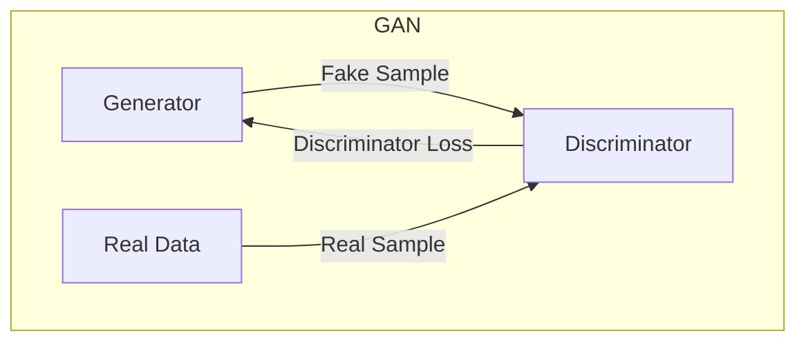
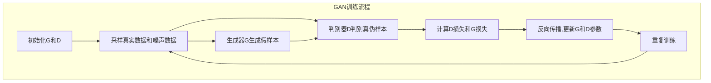

# 生成式对抗网络(GAN)原理与代码实战案例讲解

## 1.背景介绍

### 1.1 人工智能发展历程

人工智能(Artificial Intelligence, AI)是当代科技发展的热点领域之一。自20世纪50年代AI概念被正式提出以来,经历了几个重要的发展阶段。

- **第一次AI春天(1956-1974年)**: 专家系统、机器学习等理论和方法被提出,AI研究热潮兴起。
- **第一次AI寒冬(1974-1980年)**: 由于理论局限和计算能力不足,AI研究遭遇瓶颈期。
- **第二次AI春天(1980-1987年)**: 专家系统在一些领域取得成功应用,推动了AI的复兴。
- **第二次AI寒冬(1987-1993年)**: 专家系统面临发展瓶颈,AI再次陷入低谷。
- **第三次AI春天(1993至今)**: 机器学习、深度学习等新理论和算法不断涌现,大数据、云计算等新技术为AI提供了强大算力支持,AI进入全面爆发期。

### 1.2 深度学习的兴起

深度学习(Deep Learning)是机器学习的一个新的领域,模拟人脑的神经网络结构和信息传递规则,通过在大量数据上训练,自动学习数据特征模式,用以执行检测、分类等智能任务。

- **2006年**: 受限玻尔兹曼机(Restricted Boltzmann Machines, RBM)算法被提出,为训练深度神经网络铺平道路。
- **2012年**: 基于卷积神经网络(Convolutional Neural Networks, CNN)的AlexNet在ImageNet大赛中大获全胜,掀起了深度学习在计算机视觉领域的浪潮。
- **2014年**: Google的Word2Vec模型在自然语言处理领域取得突破,深度学习开始在多个领域大放异彩。
- **2016年**: AlphaGo战胜人类顶尖棋手,标志着深度学习在人工智能领域达到了一个新的里程碑。

### 1.3 生成式对抗网络(GAN)的提出

2014年,伊恩·古德费勒(Ian Goodfellow)等人在著名论文《Generative Adversarial Networks》中首次提出了生成式对抗网络(Generative Adversarial Networks, GAN)模型,开创了深度学习生成模型的新时代。

GAN模型通过生成网络(Generator)和判别网络(Discriminator)之间的对抗训练,使生成网络能够生成逼真的数据样本,并使判别网络能够有效区分真实样本和生成样本。这种全新的生成模型思路,为图像、语音、文本等领域的生成任务带来了革命性的突破。

## 2.核心概念与联系

### 2.1 生成模型与判别模型

- **生成模型(Generative Model)**: 学习训练数据的概率分布,能够生成新的似真实数据样本。常见的生成模型有高斯混合模型、隐马尔可夫模型等。
- **判别模型(Discriminative Model)**: 直接学习决策函数或条件概率模型,对给定的输入数据进行分类或回归。常见的判别模型有逻辑回归、支持向量机、决策树等。

生成模型和判别模型在机器学习中扮演着不同的角色,前者着眼于学习数据分布,后者则关注于预测和分类。GAN巧妙地将二者结合,通过对抗训练实现了强大的生成能力。

### 2.2 生成式对抗网络(GAN)工作原理

GAN由两个神经网络模型组成:生成器(Generator)和判别器(Discriminator)。

- **生成器(Generator)**: 它从服从某种潜在分布(如高斯分布或均匀分布)的噪声变量中生成样本,尽量使生成的样本接近真实数据分布。
- **判别器(Discriminator)**: 它接收真实样本或生成样本作为输入,并输出一个概率分数,尽量区分出输入的是真实样本还是生成样本。

生成器和判别器相互对抗,生成器希望生成的样本能够愚弄判别器,而判别器则努力区分生成样本和真实样本。在这个动态博弈过程中,双方的能力不断提高,直至生成器生成的样本极其逼真,判别器很难分辨真伪。

### 2.3 生成式对抗网络的数学原理

GAN的目标是在生成器G和判别器D的博弈过程中,找到一个Nash均衡解,使得:

1. 对于给定的生成分布 $p_g$, 判别器D的损失函数最小化
2. 生成分布 $p_g$ 与真实数据分布 $p_{data}$ 的分布差异最小

具体来说,GAN的损失函数可以表示为:

$$\min\limits_G \max\limits_D V(D,G) = \mathbb{E}_{x\sim p_{data}(x)}[\log D(x)] + \mathbb{E}_{z\sim p_z(z)}[\log (1-D(G(z)))]$$

其中:
- $G(z)$ 表示生成器根据噪声变量 $z$ 生成的样本
- $D(x)$ 表示判别器对输入样本 $x$ 为真实样本的概率打分

通过交替优化生成器G和判别器D的目标函数,可以找到一个Nash均衡解,使得生成分布 $p_g$ 最终收敛到真实数据分布 $p_{data}$。

### 2.4 GAN与其他生成模型的区别

与传统生成模型(如高斯混合模型、隐马尔可夫模型等)相比,GAN具有以下优势:

1. **无需显式建模**: GAN无需对数据分布进行显式建模,而是通过对抗训练直接学习数据分布。
2. **生成质量高**: GAN生成的样本质量往往优于传统生成模型,能够捕捉到数据的更多细节特征。
3. **泛化能力强**: GAN在训练数据较少的情况下,也能生成高质量的样本,具有较强的泛化能力。
4. **多样性好**: GAN生成的样本具有较好的多样性,不会过度集中在训练数据的某些模式上。

然而,GAN也存在一些需要解决的挑战,如训练过程不稳定、模式坍缩、评估指标缺乏等,这些都是GAN未来需要继续改进和完善的方向。

## 3.核心算法原理具体操作步骤

### 3.1 GAN训练流程

GAN的训练过程可以概括为以下几个步骤:

1. **初始化生成器和判别器**: 根据所选神经网络结构,初始化生成器G和判别器D的参数。
2. **采样真实数据和噪声数据**: 从真实数据集中采样一个批次的真实样本,同时从噪声分布(如高斯分布或均匀分布)中采样一个批次的噪声数据。
3. **生成器生成假样本**: 生成器G将噪声数据输入,生成一批假样本。
4. **判别器判别真伪样本**: 将真实样本和生成的假样本混合,输入到判别器D,得到对每个样本为真实样本的概率打分。
5. **计算判别器损失和生成器损失**: 根据判别器的输出概率和样本真伪标签,计算判别器损失和生成器损失。
6. **反向传播和参数更新**: 对判别器D和生成器G分别进行反向传播,更新各自的参数,使得判别器能够更好地分辨真伪样本,生成器能够生成更加逼真的样本。
7. **重复训练**: 重复上述步骤,进行多轮迭代训练,直至达到收敛条件。

### 3.2 生成器和判别器网络结构

生成器G和判别器D的网络结构设计对GAN的性能有着重要影响。常见的网络结构包括:

- **生成器G**:
  - 全连接网络(FCN): 适用于生成简单数据,如手写数字等。
  - 卷积网络(CNN): 适用于生成图像等高维数据。
  - 循环网络(RNN): 适用于生成序列数据,如文本、语音等。
  - 注意力机制(Attention): 提高生成质量,捕捉长程依赖关系。

- **判别器D**:
  - 全连接网络(FCN): 适用于判别简单数据。
  - 卷积网络(CNN): 适用于判别图像等高维数据。
  - 其他判别模型: 如支持向量机(SVM)、决策树等。

不同的应用场景需要选择合适的网络结构,以平衡模型复杂度和性能。同时,也可以结合其他技术(如批归一化、残差连接等)来提升GAN的训练稳定性和生成质量。

### 3.3 GAN训练技巧

训练GAN是一个具有挑战性的过程,需要注意以下几点:

1. **初始化策略**: 合理的参数初始化有助于提高训练稳定性,常用的方法包括Xavier初始化、He初始化等。
2. **优化算法选择**: 除了常用的SGD优化器,也可以尝试其他优化算法,如Adam、RMSProp等,帮助加快收敛速度。
3. **损失函数设计**: 传统的交叉熵损失函数可能导致梯度饱和问题,可以尝试其他损失函数,如Wasserstein损失、最小二乘损失等。
4. **正则化技术**: 添加正则化项(如梯度惩罚、噪声正则化等)有助于避免模式坍缩和提高样本多样性。
5. **训练技巧**: 如标签平滑、特征匹配、历史均值等技巧可以提高训练稳定性和生成质量。
6. **超参数调优**: 学习率、批量大小、网络深度等超参数的合理设置对模型性能有重要影响。

通过不断探索和实践,掌握各种训练技巧,有助于提高GAN的性能表现。

## 4.数学模型和公式详细讲解举例说明

### 4.1 原始GAN损失函数

GAN的原始损失函数由Ian Goodfellow等人在2014年的论文中提出,基于最小化判别器D和生成器G之间的Jensen-Shannon(JS)散度。具体表达式如下:

$$\min\limits_G \max\limits_D V(D,G) = \mathbb{E}_{x\sim p_{data}(x)}[\log D(x)] + \mathbb{E}_{z\sim p_z(z)}[\log (1-D(G(z)))]$$

其中:
- $p_{data}(x)$ 表示真实数据分布
- $p_z(z)$ 表示噪声变量的分布,通常为高斯分布或均匀分布
- $G(z)$ 表示生成器根据噪声变量 $z$ 生成的样本
- $D(x)$ 表示判别器对输入样本 $x$ 为真实样本的概率打分

这个损失函数可以看作是一个两人零和博弈:
- 判别器D希望最大化 $\mathbb{E}_{x\sim p_{data}(x)}[\log D(x)]$, 即将真实样本的概率打分最大化
- 判别器D同时希望最小化 $\mathbb{E}_{z\sim p_z(z)}[\log (1-D(G(z)))]$, 即将生成样本的概率打分最小化
- 生成器G则希望最小化 $\mathbb{E}_{z\sim p_z(z)}[\log (1-D(G(z)))]$, 即使生成样本的概率打分最大化,从而"欺骗"判别器

通过交替优化生成器G和判别器D,可以达到一个Nash均衡,使得生成分布 $p_g$ 最终收敛到真实数据分布 $p_{data}$。

然而,原始GAN损失函数存在一些缺陷,如训练不稳定、梯度饱和等,因此后续研究提出了