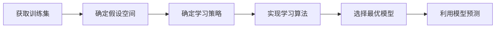

# 监督学习 原理与代码实例讲解

作者：禅与计算机程序设计艺术

## 1.背景介绍

### 1.1 什么是机器学习
机器学习是一门多领域交叉学科，涉及概率论、统计学、逼近论、凸分析、算法复杂度理论等多门学科。机器学习理论主要是设计和分析一些让计算机可以自动"学习"的算法。机器学习算法是一类从数据中自动分析获得规律,并利用规律对未知数据进行预测的算法。因为学习算法中涉及了大量的统计学理论,机器学习与推断统计学联系尤为密切,也被称为统计学习理论。

### 1.2 机器学习的分类
根据学习策略的不同,机器学习主要分为以下四类:

- 监督学习(Supervised Learning): 从标注数据中学习预测模型的机器学习问题。分类和回归是监督学习的主要任务。
- 无监督学习(Unsupervised Learning): 从无标注数据中学习预测模型的机器学习问题。聚类、降维、密度估计是无监督学习的主要任务。
- 半监督学习(Semi-supervised Learning): 通过少量标注数据和大量无标注数据学习预测模型的机器学习问题。
- 强化学习(Reinforcement Learning): 智能系统在与环境的连续互动中学习最优行为策略,以获得最大奖赏的机器学习问题。

本文将重点介绍监督学习的原理和常见算法。

### 1.3 监督学习的应用场景
监督学习在工业界有着广泛的应用,主要应用场景包括:

- 图像分类:将图像划分到预定义的类别中。如人脸识别、目标检测等。
- 语音识别:将语音信号转换为相应的文本。
- 自然语言处理:机器翻译、情感分析、文本分类等。
- 医疗诊断:根据症状和各项指标预测疾病。
- 金融风控:根据用户的各项属性预测其违约、欺诈等风险。
- 推荐系统:根据用户的历史行为给出个性化推荐。

## 2.核心概念与联系

### 2.1 基本概念

#### 2.1.1 样本空间
样本空间(Sample Space)通常用 $\mathcal{X}$ 表示,它是一个集合,其中的每个元素 $x$ 称为一个示例(Instance)或特征向量(Feature Vector)。

#### 2.1.2 标记空间
标记空间(Label Space)通常用 $\mathcal{Y}$ 表示。在二分类问题中, $\mathcal{Y}=\{-1,+1\}$ 或 $\{0,1\}$;在多分类问题中, $\mathcal{Y}=\{1,2,\cdots,K\}$;在回归问题中, $\mathcal{Y}=\mathbb{R}$。

#### 2.1.3 假设空间
假设空间(Hypothesis Space)通常用 $\mathcal{H}$ 表示,它是所有可能的决策函数(Decision Function)或预测函数(Predictor)的集合。

### 2.2 监督学习的形式化定义
给定训练数据集 $D=\{(x_1,y_1),(x_2,y_2),\cdots,(x_m,y_m)\}$,其中 $x_i \in \mathcal{X}$ 为输入示例, $y_i \in \mathcal{Y}$ 为 $x_i$ 的标记,监督学习的目标是学习一个模型 $h:\mathcal{X} \rightarrow \mathcal{Y}$,使得 $h(x)$ 与 $y$ 尽可能接近。

### 2.3 监督学习的基本流程
监督学习的基本流程如下:

1. 获取一个有标注的训练集;
2. 确定包含所有可能的模型的假设空间,即学习模型的集合;
3. 确定模型选择的准则,即学习的策略;
4. 实现求解最优模型的算法,即学习的算法;
5. 通过学习方法选择最优的模型;
6. 利用学习的最优模型对新数据进行预测或分类。

## 3.核心算法原理具体操作步骤

### 3.1 线性回归

#### 3.1.1 模型定义
给定数据集 $D=\{(x_1,y_1),(x_2,y_2),\cdots,(x_m,y_m)\}$,其中 $x_i \in \mathbb{R}^n, y_i \in \mathbb{R}$。线性回归试图学得一个线性模型:

$$h(x)=w^Tx+b$$

使得 $h(x_i)$ 与 $y_i$ 尽可能接近。

#### 3.1.2 策略-最小二乘法
基于均方误差最小化来进行模型求解的方法称为"最小二乘法"。均方误差是回归任务中最常用的性能度量。

$$\min_{w,b} \frac{1}{m} \sum_{i=1}^{m}(h(x_i)-y_i)^2$$

#### 3.1.3 求解-正规方程
令上式对 $w,b$ 的导数为0,得到 $w,b$ 的闭式解,称为正规方程(Normal Equation):

$$w^*=(X^TX)^{-1}X^Ty$$

其中 $X \in \mathbb{R}^{m \times (n+1)}$,每一行对应一个示例,第一列全为1,表示偏置项。

### 3.2 逻辑回归

#### 3.2.1 模型定义
给定数据集 $D=\{(x_1,y_1),(x_2,y_2),\cdots,(x_m,y_m)\}$,其中 $x_i \in \mathbb{R}^n, y_i \in \{0,1\}$。逻辑回归试图学得一个条件概率分布 $P(Y=1|x)$,将其表示为参数化的 sigmoid 函数形式:

$$P(Y=1|x)=\frac{1}{1+\exp(-w^Tx)}$$

#### 3.2.2 策略-极大似然估计
通过极大化似然函数来估计模型参数,等价于最小化逻辑损失(Logistic Loss):

$$\min_{w} \sum_{i=1}^{m} [-y_i\log(\sigma(w^Tx_i))-(1-y_i)\log(1-\sigma(w^Tx_i))]$$

其中 $\sigma(z)=\frac{1}{1+\exp(-z)}$ 为 sigmoid 函数。

#### 3.2.3 求解-梯度下降法
逻辑损失是关于 $w$ 的高阶可导连续凸函数,根据凸优化理论,经典的梯度下降法可收敛到全局最优解。

$$w:=w-\alpha \sum_{i=1}^{m} (\sigma(w^Tx_i)-y_i)x_i$$

其中 $\alpha$ 为学习率。

### 3.3 支持向量机

#### 3.3.1 模型定义
给定数据集 $D=\{(x_1,y_1),(x_2,y_2),\cdots,(x_m,y_m)\}$,其中 $x_i \in \mathbb{R}^n, y_i \in \{-1,+1\}$。支持向量机试图寻找一个超平面:

$$w^Tx+b=0$$

能将不同类别的样本分开,并且间隔最大化。

#### 3.3.2 策略-结构风险最小化
支持向量机的学习策略是最小化以下结构风险函数:

$$\min_{w,b} \frac{1}{2}\|w\|^2 + C\sum_{i=1}^{m}\max(0, 1-y_i(w^Tx_i+b))$$

其中第一项是模型复杂度,第二项是经验风险,权衡因子 $C>0$。

#### 3.3.3 求解-序列最小最优化
上式是一个二次规划问题,可以通过序列最小最优化(SMO)算法高效求解。SMO算法的基本思路是:如果所有变量的解都满足此最优化问题的KKT条件,那么这个最优化问题的解就得到了。

### 3.4 决策树

#### 3.4.1 模型定义
决策树由结点(Node)和有向边(Directed Edge)组成。结点分为内部结点(Internal Node)和叶结点(Leaf Node)。内部结点表示一个特征或属性,叶结点表示一个类。

#### 3.4.2 策略-正则化的极大似然
决策树学习的损失函数可以定义为正则化的极大似然损失:

$$\min_{\Theta} \sum_{i=1}^{m} L(y_i, \hat{y}_i) + \lambda |\Theta|$$

其中 $\Theta$ 为决策树, $\hat{y}_i$ 为 $x_i$ 在决策树上的预测值, $L$ 为损失函数, $\lambda |\Theta|$ 为正则化项, $\lambda$ 控制复杂度。

#### 3.4.3 求解-特征选择+剪枝
通过递归地选择最优特征,并根据该特征对训练数据进行分割,构建决策树。通过剪枝避免过拟合。常用的特征选择准则有信息增益、信息增益比和基尼指数等。

## 4.数学模型和公式详细讲解举例说明

### 4.1 线性回归的最小二乘法
在3.1节中我们给出了线性回归模型的定义:

$$h(x)=w^Tx+b$$

以及基于均方误差最小化的损失函数:

$$\min_{w,b} \frac{1}{m} \sum_{i=1}^{m}(h(x_i)-y_i)^2$$

现在我们来推导闭式解。将 $h(x)$ 代入损失函数:

$$\min_{w,b} \frac{1}{m} \sum_{i=1}^{m}(w^Tx_i+b-y_i)^2$$

为了方便,我们把 $b$ 看作 $w_0$,同时给每个 $x_i$ 增加一个为1的维度,相当于:

$$\min_{w} \frac{1}{m} \sum_{i=1}^{m}(w^Tx_i-y_i)^2$$

其中 $x_i \in \mathbb{R}^{n+1}, w \in \mathbb{R}^{n+1}$。
令 $X=[x_1,x_2,\cdots,x_m]^T, y=[y_1,y_2,\cdots,y_m]^T$,则损失函数写成矩阵形式为:

$$\min_{w} \frac{1}{m} \|Xw-y\|^2$$

令损失函数对 $w$ 的导数为0:

$$\frac{\partial}{\partial w} \frac{1}{m} \|Xw-y\|^2 = \frac{2}{m} X^T(Xw-y) = 0$$

整理可得:

$$(X^TX)w=X^Ty$$

若 $X^TX$ 可逆,则:

$$w^*=(X^TX)^{-1}X^Ty$$

这就是线性回归的最小二乘解,也称为正规方程。

### 4.2 逻辑回归的极大似然估计
在3.2节中我们给出了逻辑回归模型的定义:

$$P(Y=1|x)=\frac{1}{1+\exp(-w^Tx)}$$

以及基于极大似然估计的损失函数:

$$\min_{w} \sum_{i=1}^{m} [-y_i\log(\sigma(w^Tx_i))-(1-y_i)\log(1-\sigma(w^Tx_i))]$$

其中 $\sigma(z)=\frac{1}{1+\exp(-z)}$ 为 sigmoid 函数。现在我们来推导这个损失函数。
对于给定的 $x_i$,逻辑回归模型认为 $y_i$ 服从伯努利分布:

$$P(y_i|x_i;w)=[\sigma(w^Tx_i)]^{y_i}[1-\sigma(w^Tx_i)]^{1-y_i}$$

其似然函数为:

$$L(w)=\prod_{i=1}^{m} P(y_i|x_i;w)=\prod_{i=1}^{m} [\sigma(w^Tx_i)]^{y_i}[1-\sigma(w^Tx_i)]^{1-y_i}$$

对数似然函数为:

$$\log L(w)=\sum_{i=1}^{m} [y_i\log(\sigma(w^Tx_i))+(1-y_i)\log(1-\sigma(w^Tx_i))]$$

最大化 $\log L(w)$ 等价于最小化 $-\log L(w)$,即