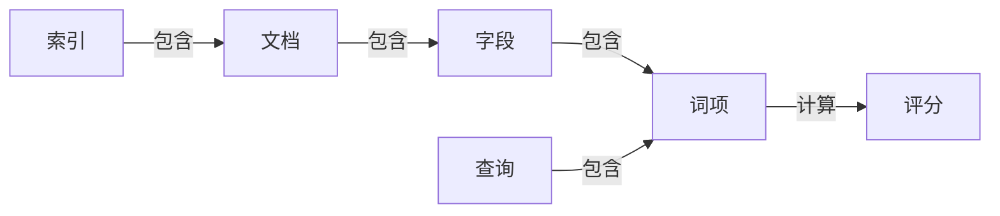

## 1.背景介绍

在信息爆炸的时代，如何快速、准确地找到所需信息是一项巨大的挑战。全文搜索引擎在这方面发挥了重要作用，它能够从海量数据中快速找到与查询语句相关的文档。在众多全文搜索引擎中，Lucene以其强大的功能、优秀的性能和灵活的扩展性，成为了Java全文搜索引擎的王者。

## 2.核心概念与联系

Lucene是一个由Apache Software Foundation开发的开源全文搜索引擎库，它提供了一整套用于全文检索和搜索的API。Lucene的核心概念包括索引、文档、字段、词项、查询和评分等。

- **索引**：Lucene使用倒排索引来存储数据，这使得它能够快速地找到包含特定词项的文档。
- **文档**：在Lucene中，文档是搜索的基本单位。每个文档都由一系列的字段组成。
- **字段**：字段是文档的一个属性，如标题、作者、内容等。
- **词项**：词项是字段中的一个词或短语。
- **查询**：查询是用户提供的搜索条件，它由一个或多个词项组成。
- **评分**：评分是Lucene对查询结果的排序机制。它根据词项在文档中的频率、文档的长度等因素，计算出每个文档与查询的匹配程度。

这些核心概念之间的关系可以用以下的Mermaid流程图来表示：

## 3.核心算法原理具体操作步骤

Lucene的核心算法包括索引构建和查询处理两部分。

### 3.1 索引构建

索引构建主要包括文档处理、分词、索引创建和优化等步骤。

1. **文档处理**：将原始数据转换为Lucene可以处理的文档格式。每个文档都由一系列的字段组成，每个字段包含一个名称和一个值。
2