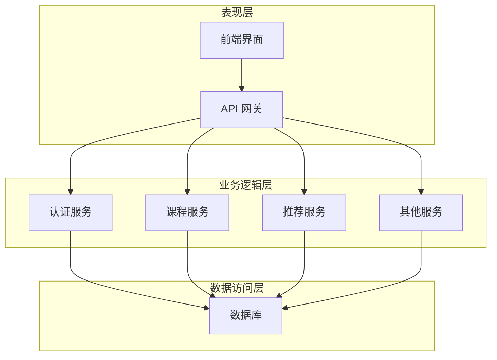

# 精品课程网站详细设计与具体代码实现

## 1.背景介绍

### 1.1 在线教育的兴起

随着互联网技术的快速发展和普及,在线教育行业近年来蓬勃发展。传统的教育模式受到时间和地点的限制,而在线教育则打破了这些束缚,为学习者提供了更加灵活便捷的学习方式。无论是职业培训、学位教育还是兴趣爱好培养,在线教育都展现出了巨大的潜力和市场需求。

### 1.2 精品课程平台的重要性

在这一大潮流中,精品在线课程平台应运而生。这些平台汇聚了来自世界各地的优秀教师资源,提供高质量的视频课程、互动练习、讨论区等功能,为学习者构建了一个完整的学习生态系统。精品课程平台不仅能满足用户多元化的学习需求,还能促进知识的传播和分享,为教育事业的发展贡献力量。

## 2.核心概念与联系  

### 2.1 核心概念解析

- **课程(Course)**: 指特定主题或学科的系统化教学内容,通常包括视频、课件、测验、作业等多种形式的学习资源。
- **课程目录(Course Catalog)**: 课程的层级结构,将课程划分为不同的章节和小节,方便学习者系统学习。  
- **用户(User)**: 使用平台的个人或机构,可分为学习者(Learner)、教师(Instructor)、管理员(Admin)等角色。
- **学习路径(Learning Path)**: 根据学习目标和先决知识为用户量身定制的课程组合方案。
- **评分系统(Rating System)**: 允许用户为课程打分并发表评论,以评价课程质量。
- **讨论区(Discussion Forum)**: 为用户提供交流平台,讨论课程相关内容,分享学习心得。

### 2.2 核心概念之间的关系

这些核心概念相互关联,构成了精品课程平台的基本框架:

- 课程是平台的核心资源,通过课程目录的组织形成系统化的知识体系。
- 用户可以浏览、购买并学习感兴趣的课程,按照学习路径的指引有序地完成学习任务。
- 评分系统和讨论区为用户提供了参与、互动和反馈的渠道,有助于提高课程质量和用户体验。
- 平台通过分析用户行为数据,优化课程内容、推荐个性化学习路径,形成闭环的生态系统。

## 3.核心算法原理具体操作步骤

### 3.1 个性化推荐算法

精品课程平台的个性化推荐算法是其核心竞争力之一,能够根据用户的兴趣爱好、学习历史等数据,为其推荐最合适的课程和学习路径。常用的推荐算法包括:

1. **协同过滤算法(Collaborative Filtering)**

   - 基于用户:找到与目标用户有相似兴趣爱好的其他用户,并推荐这些用户喜欢的课程。
   - 基于项目:找到与目标课程相似的其他课程,并推荐给对目标课程感兴趣的用户。

2. **基于内容的推荐(Content-based Recommendation)**

   - 分析目标用户过去喜欢的课程内容特征(如主题、难度等),推荐具有相似特征的课程。

算法步骤:

```python
# 协同过滤算法(基于用户)
def user_based_cf(dataset, user, k=5):
    # 计算用户之间的相似度
    similarities = {}
    for other in dataset:
        if other != user:
            similarities[other] = cosine_similarity(dataset[user], dataset[other])
    
    # 获取最相似的K个用户
    similar_users = sorted(similarities.items(), key=lambda x: x[1], reverse=True)[:k]
    
    # 计算推荐分数
    recommendations = {}
    for similar in similar_users:
        user = similar[0]
        for course in dataset[user]:
            if course not in dataset[user]:
                score = similarities[user] * dataset[user][course]
                recommendations[course] = recommendations.get(course, 0) + score
    
    # 按推荐分数排序
    recommendations = sorted(recommendations.items(), key=lambda x: x[1], reverse=True)
    
    return recommendations
```

### 3.2 学习路径规划算法

学习路径规划算法能够根据用户的已有知识水平和学习目标,为其量身定制合理的课程组合和学习顺序,确保学习效率最大化。常用算法包括:

1. **拓扑排序算法(Topological Sorting)**

   - 将课程及其先决条件建模为有向无环图(DAG)。
   - 通过拓扑排序确定课程的合理学习顺序。

2. **动态规划算法(Dynamic Programming)**

   - 将学习路径规划问题分解为多个子问题。
   - 通过递推求解每个子问题的最优解,最终得到整体最优解。

算法步骤:

```python
# 拓扑排序算法
def topological_sort(graph):
    # 统计每个节点的入度
    in_degrees = {node: 0 for node in graph}
    for node in graph:
        for neighbor in graph[node]:
            in_degrees[neighbor] += 1
    
    # 初始化拓扑序列和队列
    topo_order = []
    queue = [node for node in in_degrees if in_degrees[node] == 0]
    
    # 遍历图
    while queue:
        node = queue.pop(0)
        topo_order.append(node)
        for neighbor in graph[node]:
            in_degrees[neighbor] -= 1
            if in_degrees[neighbor] == 0:
                queue.append(neighbor)
    
    # 检查是否存在环
    if any(in_degrees[node] != 0 for node in in_degrees):
        raise ValueError("Graph contains a cycle")
    
    return topo_order
```

## 4.数学模型和公式详细讲解举例说明

### 4.1 相似度计算

在推荐算法中,计算用户或项目之间的相似度是一个关键步骤。常用的相似度计算方法包括:

1. **欧几里得距离(Euclidean Distance)**

   $$
   d(x, y) = \sqrt{\sum_{i=1}^{n}(x_i - y_i)^2}
   $$

   其中 $x$ 和 $y$ 是 $n$ 维向量,表示用户或项目的特征向量。距离越小,相似度越高。

2. **余弦相似度(Cosine Similarity)**

   $$
   \text{sim}(x, y) = \frac{x \cdot y}{\|x\| \|y\|} = \frac{\sum_{i=1}^{n}x_iy_i}{\sqrt{\sum_{i=1}^{n}x_i^2}\sqrt{\sum_{i=1}^{n}y_i^2}}
   $$

   余弦相似度计算两个向量的夹角余弦值,范围在 $[-1, 1]$ 之间。值越大,相似度越高。

3. **皮尔逊相关系数(Pearson Correlation Coefficient)**

   $$
   r_{xy} = \frac{\sum_{i=1}^{n}(x_i - \bar{x})(y_i - \bar{y})}{\sqrt{\sum_{i=1}^{n}(x_i - \bar{x})^2\sum_{i=1}^{n}(y_i - \bar{y})^2}}
   $$

   其中 $\bar{x}$ 和 $\bar{y}$ 分别表示 $x$ 和 $y$ 的均值。相关系数范围在 $[-1, 1]$ 之间,绝对值越大,相似度越高。

### 4.2 推荐系统评估指标

为了评估推荐系统的性能,常用的评估指标包括:

1. **准确率(Accuracy)**

   推荐系统预测正确的比例,用于评估系统的整体准确性。

   $$
   \text{Accuracy} = \frac{\text{TP} + \text{TN}}{\text{TP} + \text{TN} + \text{FP} + \text{FN}}
   $$

2. **精确率(Precision)和召回率(Recall)**

   精确率衡量推荐列表中相关项目的比例,召回率衡量系统能够推荐出所有相关项目的比例。二者需要权衡取舍。

   $$
   \text{Precision} = \frac{\text{TP}}{\text{TP} + \text{FP}}
   $$

   $$
   \text{Recall} = \frac{\text{TP}}{\text{TP} + \text{FN}}
   $$

3. **F1 Score**

   F1 Score 是精确率和召回率的调和平均值,综合考虑了两者。

   $$
   \text{F1} = 2 \times \frac{\text{Precision} \times \text{Recall}}{\text{Precision} + \text{Recall}}
   $$

其中 TP、TN、FP、FN 分别表示真正例、真反例、假正例和假反例的数量。

## 5.项目实践:代码实例和详细解释说明

### 5.1 系统架构设计

精品课程网站采用经典的三层架构设计,包括:

1. **表现层(Presentation Layer)**
   - 负责与用户交互,渲染网页界面。
   - 使用 HTML、CSS 和 JavaScript 等前端技术实现。

2. **业务逻辑层(Business Logic Layer)**
   - 处理核心业务逻辑,如用户认证、课程管理、推荐算法等。
   - 通常采用服务器端语言(如 Python、Java)实现。

3. **数据访问层(Data Access Layer)**
   - 负责与数据库进行交互,执行数据查询、插入、更新和删除操作。
   - 使用 ORM 框架(如 Django ORM、SQLAlchemy)或直接编写 SQL 语句。



### 5.2 用户认证模块

用户认证模块负责处理用户注册、登录、密码重置等功能。以下是一个基于 Django 框架和 Django REST 框架实现的示例:

```python
# models.py
from django.contrib.auth.models import AbstractUser

class User(AbstractUser):
    pass

# serializers.py
from rest_framework import serializers
from .models import User

class UserSerializer(serializers.ModelSerializer):
    class Meta:
        model = User
        fields = ('username', 'email', 'password')

# views.py
from rest_framework import generics
from .models import User
from .serializers import UserSerializer

class RegisterView(generics.CreateAPIView):
    queryset = User.objects.all()
    serializer_class = UserSerializer

# urls.py
from django.urls import path
from . import views

urlpatterns = [
    path('register/', views.RegisterView.as_view(), name='register'),
    # 其他 URL 路由
]
```

### 5.3 课程管理模块

课程管理模块负责处理课程的创建、更新、删除、查询等操作。以下是一个使用 Django ORM 实现的示例:

```python
# models.py
from django.db import models

class Course(models.Model):
    title = models.CharField(max_length=200)
    description = models.TextField()
    instructor = models.ForeignKey(User, on_delete=models.CASCADE, related_name='courses')
    created_at = models.DateTimeField(auto_now_add=True)
    updated_at = models.DateTimeField(auto_now=True)

class Lesson(models.Model):
    title = models.CharField(max_length=200)
    course = models.ForeignKey(Course, on_delete=models.CASCADE, related_name='lessons')
    video_url = models.URLField()
    order = models.PositiveIntegerField()

# views.py
from rest_framework import viewsets
from .models import Course, Lesson
from .serializers import CourseSerializer, LessonSerializer

class CourseViewSet(viewsets.ModelViewSet):
    queryset = Course.objects.all()
    serializer_class = CourseSerializer

class LessonViewSet(viewsets.ModelViewSet):
    queryset = Lesson.objects.all()
    serializer_class = LessonSerializer
```

### 5.4 推荐引擎模块

推荐引擎模块实现了个性化推荐算法,为用户推荐合适的课程和学习路径。以下是一个使用 Python 和 Surprise 库实现基于协同过滤的示例:

```python
import pandas as pd
from surprise import Reader, Dataset, SVD

# 加载数据
ratings = pd.read_csv('ratings.csv')

# 创建 Reader 对象
reader = Reader(rating_scale=(1, 5))

# 构建数据集
data = Dataset.load_from_df(ratings[['user_id', 'course_id', 'rating']], reader)

# 拆分数据集
trainset = data.build_full_trainset()

# 训练模