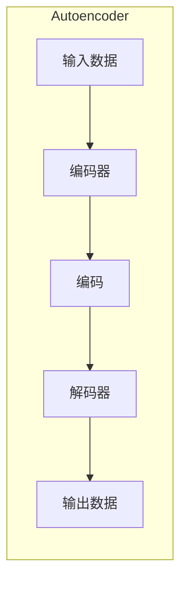

# 自动编码器 (Autoencoder) 原理与代码实例讲解

## 1.背景介绍

### 1.1 什么是自动编码器？

自动编码器(Autoencoder)是一种无监督学习的人工神经网络,旨在学习高维数据的紧凑表示。它通过将输入数据压缩成较低维度的编码表示,然后再从该编码重构出与原始输入尽可能接近的输出。这种学习数据内在特征的能力使自动编码器在降维、特征提取、去噪等领域有着广泛应用。

### 1.2 自动编码器的发展历程

自动编码器最早可追溯到20世纪80年代,当时被用于降维和特征提取。近年来,随着深度学习的兴起,自动编码器也进入了一个新的发展阶段。研究人员提出了各种变体,如稀疏自动编码器、变分自动编码器等,显著扩展了其应用范围。

### 1.3 自动编码器的优势

相比其他无监督学习算法,自动编码器具有以下优势:

- 端到端的无监督学习方式,无需人工设计特征
- 可学习数据的内在结构和模式
- 具有泛化能力,适用于各种数据类型(图像、文本等)
- 可用于降噪、数据压缩和生成等多种任务

## 2.核心概念与联系

### 2.1 自动编码器的基本结构

自动编码器由两部分组成:编码器(Encoder)和解码器(Decoder)。编码器将高维输入数据压缩为低维编码表示,而解码器则尝试从该编码中重构出原始输入数据。



### 2.2 编码器和解码器

编码器和解码器通常由人工神经网络构成,例如多层感知器或卷积神经网络。

- 编码器将输入数据 $x$ 映射到隐藏编码 $h=f(x)$,其中 $f$ 为编码函数。
- 解码器将隐藏编码 $h$ 映射回重构输出 $r=g(h)$,其中 $g$ 为解码函数。

编码器和解码器的结构可以是对称的,也可以是不对称的,这取决于具体任务和数据。

### 2.3 损失函数和训练

自动编码器的训练目标是最小化输入数据 $x$ 与重构输出 $r$ 之间的差异,通常使用均方误差或交叉熵作为损失函数:

$$J(x,r)=L(x,g(f(x)))$$

其中 $L$ 为损失函数。通过反向传播算法优化编码器和解码器的参数,使损失函数最小化。

### 2.4 降维和特征提取

由于隐藏编码的维度通常低于输入数据,自动编码器可以将高维数据映射到低维空间,从而实现降维和特征提取。隐藏编码捕获了输入数据的最重要特征,可用于下游任务如分类或聚类。

### 2.5 自动编码器的变体

根据不同的约束条件和损失函数,自动编码器衍生出了多种变体:

- 稀疏自动编码器:通过 $L_1$ 正则化实现编码的稀疏性
- 变分自动编码器:将隐藏编码建模为概率分布
- 去噪自动编码器:学习从带噪输入中重构原始数据
- 卷积自动编码器:利用卷积神经网络处理图像等结构化数据

不同变体针对不同任务和数据类型进行了优化,扩展了自动编码器的应用范围。

## 3.核心算法原理具体操作步骤  

### 3.1 基本自动编码器算法步骤

1. **初始化编码器和解码器网络**:通常使用全连接或卷积神经网络构建编码器和解码器,并随机初始化网络权重。

2. **输入数据并编码**:将输入数据 $x$ 输入编码器网络,获得隐藏编码 $h=f(x)$。

3. **解码重构输出**:将隐藏编码 $h$ 输入解码器网络,获得重构输出 $r=g(h)$。

4. **计算重构损失**:计算输入数据 $x$ 与重构输出 $r$ 之间的差异,通常使用均方误差或交叉熵作为损失函数 $J(x,r)$。

5. **反向传播和优化**:使用梯度下降等优化算法,反向传播计算损失函数关于编码器和解码器参数的梯度,并更新参数以最小化损失函数。

6. **重复训练**:重复步骤2-5,直到损失函数收敛或达到最大迭代次数。

在训练过程中,自动编码器会学习到输入数据的紧凑表示(隐藏编码),并能够从该编码中重构出与原始输入接近的输出。

### 3.2 自动编码器的正则化

为了防止自动编码器简单地学习恒等映射,通常需要对隐藏编码施加约束或正则化,例如:

- **稀疏约束**:通过 $L_1$ 正则化使隐藏编码稀疏,只激活少数神经元。
- **去噪约束**:在输入数据中加入噪声,迫使自动编码器学习鲁棒的特征表示。
- **对比散度损失**:最小化输入数据与重构输出的统计差异,而不仅仅是像素差异。

正则化可以提高自动编码器学习到的特征表示的质量和泛化能力。

### 3.3 自动编码器的优化技巧

为了加速训练收敛并获得更好的性能,可以采用以下优化技巧:

- **批量标准化**:对每一层的输入进行标准化,加速收敛并提高泛化能力。
- **梯度裁剪**:限制梯度范围,避免梯度爆炸或梯度消失问题。
- **学习率调度**:动态调整学习率,在训练早期使用较大学习率,后期逐渐减小。
- **预训练**:先对编码器或解码器进行无监督预训练,再进行端到端的微调。

这些技巧可以显著提高自动编码器的训练效率和性能。

## 4.数学模型和公式详细讲解举例说明

### 4.1 自动编码器的数学表示

给定输入数据 $\mathbf{x} \in \mathbb{R}^{n}$,自动编码器的编码器和解码器可以表示为:

$$\mathbf{h} = f(\mathbf{x}) = \sigma(\mathbf{W}_\text{enc}\mathbf{x} + \mathbf{b}_\text{enc})$$
$$\mathbf{r} = g(\mathbf{h}) = \sigma(\mathbf{W}_\text{dec}\mathbf{h} + \mathbf{b}_\text{dec})$$

其中:
- $\mathbf{h} \in \mathbb{R}^{m}$ 是隐藏编码,维度 $m$ 通常小于输入维度 $n$
- $f$ 和 $g$ 分别是编码器和解码器的函数,通常为多层感知器或卷积网络
- $\mathbf{W}_\text{enc}$、$\mathbf{b}_\text{enc}$、$\mathbf{W}_\text{dec}$、$\mathbf{b}_\text{dec}$ 是网络的可训练参数
- $\sigma$ 是非线性激活函数,如 ReLU 或 Sigmoid

自动编码器的目标是最小化输入 $\mathbf{x}$ 与重构输出 $\mathbf{r}$ 之间的重构损失 $\mathcal{L}(\mathbf{x}, \mathbf{r})$,例如均方误差:

$$\mathcal{L}(\mathbf{x}, \mathbf{r}) = \|\mathbf{x} - \mathbf{r}\|_2^2 = \|\mathbf{x} - g(f(\mathbf{x}))\|_2^2$$

通过梯度下降等优化算法,自动编码器可以学习到最小化重构损失的编码器和解码器参数。

### 4.2 稀疏自动编码器

稀疏自动编码器通过在损失函数中加入 $L_1$ 正则化项,鼓励隐藏编码 $\mathbf{h}$ 具有稀疏性,即大部分元素接近于零。其损失函数为:

$$\mathcal{L}(\mathbf{x}, \mathbf{r}) = \|\mathbf{x} - \mathbf{r}\|_2^2 + \lambda\|\mathbf{h}\|_1$$

其中 $\lambda$ 是正则化系数,控制稀疏性的程度。稀疏编码可以提取出输入数据的最显著特征,有利于降维和特征提取。

### 4.3 变分自动编码器

变分自动编码器(Variational Autoencoder, VAE)将隐藏编码 $\mathbf{h}$ 建模为概率分布,而不是确定性向量。编码器输出均值 $\boldsymbol{\mu}$ 和方差 $\boldsymbol{\sigma}^2$,表示编码的概率分布 $q(\mathbf{h}|\mathbf{x})$:

$$\begin{aligned}
\boldsymbol{\mu}, \boldsymbol{\sigma}^2 &= f(\mathbf{x}) \\
\mathbf{h} &\sim \mathcal{N}(\boldsymbol{\mu}, \boldsymbol{\sigma}^2\mathbf{I})
\end{aligned}$$

VAE的损失函数包括重构损失和KL散度项,用于约束编码分布 $q(\mathbf{h}|\mathbf{x})$ 接近于先验分布 $p(\mathbf{h})$,通常为标准正态分布:

$$\mathcal{L}(\mathbf{x}, \mathbf{r}) = \|\mathbf{x} - \mathbf{r}\|_2^2 + \lambda D_\text{KL}(q(\mathbf{h}|\mathbf{x})\|p(\mathbf{h}))$$

VAE可以生成新的数据样本,并具有更强的泛化能力。

### 4.4 去噪自动编码器

去噪自动编码器(Denoising Autoencoder, DAE)在训练时,将带噪输入 $\tilde{\mathbf{x}}$ 输入编码器,目标是从该噪声输入中重构出原始干净输入 $\mathbf{x}$:

$$\tilde{\mathbf{x}} = \mathbf{x} + \boldsymbol{\epsilon}, \quad \mathbf{r} = g(f(\tilde{\mathbf{x}}))$$
$$\mathcal{L}(\mathbf{x}, \mathbf{r}) = \|\mathbf{x} - \mathbf{r}\|_2^2$$

其中 $\boldsymbol{\epsilon}$ 是加性噪声,如高斯噪声或掩码噪声。通过学习从噪声数据中重构原始输入,DAE可以捕获输入数据的鲁棒特征,提高泛化能力和抗噪性。

这些变体通过引入不同的约束和损失函数,赋予了自动编码器更强的表示学习能力,适用于更多任务和数据类型。

## 4.项目实践:代码实例和详细解释说明

以下是使用PyTorch实现基本自动编码器的代码示例,用于对MNIST手写数字图像进行无监督学习和降维。

### 4.1 导入所需库

```python
import torch
import torch.nn as nn
import torchvision
import matplotlib.pyplot as plt
```

### 4.2 定义自动编码器模型

```python
class Autoencoder(nn.Module):
    def __init__(self):
        super(Autoencoder, self).__init__()
        
        # 编码器
        self.encoder = nn.Sequential(
            nn.Linear(28 * 28, 256),
            nn.ReLU(),
            nn.Linear(256, 64),
            nn.ReLU(),
            nn.Linear(64, 16)  # 编码维度为16
        )
        
        # 解码器
        self.decoder = nn.Sequential(
            nn.Linear(16, 64),
            nn.ReLU(),
            nn.Linear(64, 256),
            nn.ReLU(),
            nn.Linear(256, 28 * 28),
            nn.Sigmoid()  # 输出像素值在[0, 1]范围内
        )

    def forward(self, x):
        encoded = self.encoder(x)
        decoded = self.decoder(encoded)
        return encoded, decoded
```

该模型由一个编码器和一个解码器组成,编码器将 $28 \times 28$ 的输入图像编码为16维的隐藏编码,解码器则尝试从该