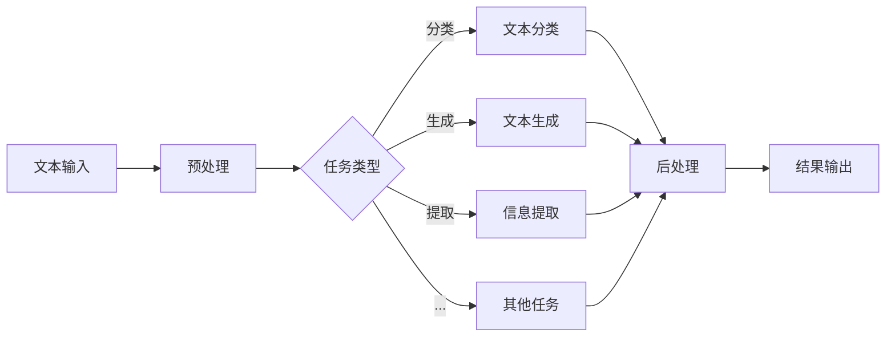
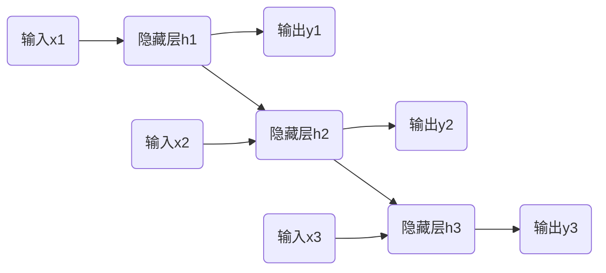

# 自然语言处理(NLP)原理与代码实战案例讲解

## 1.背景介绍

### 1.1 什么是自然语言处理(NLP)

自然语言处理(Natural Language Processing, NLP)是人工智能和语言学的交叉领域,旨在使计算机能够理解和生成人类可理解的自然语言。它涉及多个子领域,包括计算语言学、计算机科学、人工智能、数学和心理语言学等。NLP的目标是开发能够"理解"和"生成"人类语言的技术。

### 1.2 NLP的重要性和应用

随着人工智能技术的快速发展,NLP已经广泛应用于各个领域,例如:

- 智能助手(Siri、Alexa等)
- 机器翻译
- 文本分类和情感分析
- 问答系统
- 文本摘要
- 自动写作
- 语音识别
- ...

NLP技术的突破不仅能提高人机交互的自然性和智能化水平,还能极大提高信息处理的效率,对推动人工智能的发展至关重要。

### 1.3 NLP的挑战

尽管NLP取得了长足进步,但仍面临诸多挑战:

- 语言的复杂性和多样性
- 语义歧义和语境理解
- 缺乏大规模高质量数据集
- 需要强大的计算能力
- ...

## 2.核心概念与联系

### 2.1 NLP基本任务

NLP主要包括以下几个基本任务:

- **词法分析**:将文本流分割为词元(tokens)
- **句法分析**:确定词元在句子中的语法关系
- **语义分析**:理解文本的实际含义
- **语音识别**:将语音信号转录为文本
- **文本生成**:根据某些输入自动生成自然语言文本

这些基本任务相互关联,构成了NLP的基础。

### 2.2 NLP处理流程

NLP系统通常遵循以下处理流程:



1. **预处理**:标记化、分词、去除停用词等
2. **任务类型**:根据具体需求确定NLP任务
3. **核心处理**:使用各种模型和算法完成任务
4. **后处理**:结果格式化、错误修正等
5. **输出结果**

### 2.3 主流NLP模型

常见的NLP模型包括:

- **统计模型**:N-gram、隐马尔可夫、最大熵等
- **规则模型**:基于规则的系统
- **神经网络模型**:Word2Vec、RNN、LSTM、Transformer等

近年来,基于深度学习的神经网络模型在NLP任务中取得了卓越的成绩,成为主流方向。

## 3.核心算法原理具体操作步骤  

### 3.1 Word2Vec

Word2Vec是一种高效的词嵌入(Word Embedding)模型,可将单词映射到一个固定长度的稠密向量空间,使得语义相似的单词在向量空间中彼此靠近。它的核心思想是使用浅层神经网络对大规模语料库进行训练,学习词向量表示。

Word2Vec主要包括两种模型:连续词袋模型(CBOW)和Skip-Gram模型。

#### 3.1.1 CBOW模型

CBOW模型的目标是根据源单词的上下文(即前后单词的词向量之和或均值),来预测源单词本身。


1. 将上下文单词的词向量相加,作为输入
2. 通过隐藏层映射到投影空间
3. 输出层使用softmax预测源单词概率

#### 3.1.2 Skip-Gram模型  

与CBOW相反,Skip-Gram模型的目标是根据源单词,预测它的上下文单词。


1. 将源单词的词向量作为输入
2. 通过隐藏层映射到投影空间  
3. 输出层使用softmax预测上下文单词概率

两种模型都使用负采样和层序softmax等技术提高训练效率。

### 3.2 递归神经网络(RNN)

递归神经网络(Recurrent Neural Network, RNN)是一种对序列数据建模的有力工具,广泛应用于NLP任务中。RNN的核心思想是在隐藏层中引入状态向量,将当前输入与前一时间步的状态向量相结合,捕获序列数据的动态行为。

$$
h_t = f_W(x_t, h_{t-1})
$$

其中$h_t$是时间步t的隐藏状态,$x_t$是时间步t的输入,$f_W$是基于权重矩阵W的非线性函数。

#### 3.2.1 RNN的前向传播



1. 时间步t=1,计算$h_1 = f_W(x_1, h_0)$,其中$h_0$是初始状态
2. 时间步t=2,计算$h_2 = f_W(x_2, h_1)$
3. 时间步t=3,计算$h_3 = f_W(x_3, h_2)$
4. ...

#### 3.2.2 RNN的反向传播

通过反向传播算法,可以计算损失函数关于每个权重的梯度,并使用优化算法(如SGD)更新权重。

#### 3.2.3 RNN的变种

标准RNN存在梯度消失/爆炸问题,因此衍生出了LSTM和GRU等变种,通过引入门控机制来缓解梯度问题。

### 3.3 Transformer

Transformer是一种全新的基于注意力机制的序列到序列模型,不再依赖RNN的递归操作,而是通过自注意力机制直接对输入序列建模。它极大地提高了并行计算能力,在机器翻译、文本生成等任务上取得了卓越成绩。

#### 3.3.1 Transformer编码器

Transformer编码器由多个相同的层组成,每层包含两个子层:多头自注意力机制和前馈神经网络。


1. **输入嵌入**:将输入token映射到嵌入向量
2. **多头自注意力**:允许每个单词注意力集中在输入序列的不同位置
3. **前馈网络**:两层全连接前馈网络,对每个位置的表示进行处理
4. **Add & Norm**:残差连接和层归一化,促进梯度传播

#### 3.3.2 Transformer解码器

解码器与编码器结构类似,但增加了一个注意力子层,用于关注编码器的输出。


1. **掩码多头自注意力**:防止关注后续位置的单词
2. **编码器-解码器注意力**:关注编码器输出的不同位置

Transformer的自注意力机制赋予了模型强大的长期依赖捕捉能力,使其在序列到序列任务上取得了突破性进展。

## 4.数学模型和公式详细讲解举例说明

### 4.1 词嵌入(Word Embedding)

词嵌入是将单词映射到一个连续的向量空间中,使得语义相似的单词在向量空间中彼此靠近。这种分布式表示捕捉了单词在语料库中的语义和语法信息。

常见的词嵌入方法包括Word2Vec、GloVe等。以Word2Vec的Skip-Gram模型为例:

给定一个长度为T的句子序列$\{w_1, w_2, ..., w_T\}$,目标是最大化目标函数:

$$J = \frac{1}{T}\sum_{t=1}^{T}\sum_{-c \leq j \leq c, j \neq 0} \log P(w_{t+j}|w_t)$$

其中c是上下文窗口大小,P是基于softmax的条件概率:

$$P(w_O|w_I) = \frac{\exp(v_{w_O}^{\top}v_{w_I})}{\sum_{w=1}^{V}\exp(v_w^{\top}v_{w_I})}$$

$v_w$和$v_{w_I}$分别是输出单词$w_O$和输入单词$w_I$的词向量表示。通过最大化目标函数,可以学习到词向量,使语义相似的单词具有相近的向量表示。

### 4.2 注意力机制(Attention Mechanism)

注意力机制是序列数据建模的关键技术,它允许模型在编码解码时动态地关注输入序列的不同部分,捕捉长期依赖关系。

#### 4.2.1 加性注意力(Additive Attention)

加性注意力通过一个单层前馈神经网络计算注意力权重:

$$
\begin{aligned}
e_{ij} &= \mathbf{v}_a^\top \tanh(\mathbf{W}_a\mathbf{s}_i + \mathbf{U}_a\mathbf{h}_j) \\
\alpha_{ij} &= \frac{\exp(e_{ij})}{\sum_k \exp(e_{ik})}
\end{aligned}
$$

其中$\mathbf{s}_i$是解码器隐藏状态,$\mathbf{h}_j$是编码器隐藏状态,$\mathbf{v}_a$、$\mathbf{W}_a$和$\mathbf{U}_a$是可学习的权重矩阵。

加性注意力的缺点是计算代价较高,无法完全并行化。

#### 4.2.2 缩放点积注意力(Scaled Dot-Product Attention)

Transformer使用的是缩放点积注意力,计算效率更高:

$$
\begin{aligned}
\operatorname{Attention}(Q, K, V) &= \operatorname{softmax}\left(\frac{QK^\top}{\sqrt{d_k}}\right)V \\
\alpha_{ij} &= \frac{\exp(s_{ij})}{\sum_k \exp(s_{ik})}, \quad s_{ij} = \frac{q_i^\top k_j}{\sqrt{d_k}}
\end{aligned}
$$

其中$Q$、$K$、$V$分别是查询(Query)、键(Key)和值(Value)的packed表示,$d_k$是缩放因子,用于防止点积过大导致softmax饱和。

缩放点积注意力可以高效并行计算,是Transformer的核心组件之一。

### 4.3 Transformer位置编码(Positional Encoding)

由于Transformer没有使用RNN或CNN捕捉序列顺序信息,因此需要一些额外的位置信息。Transformer使用的是正弦位置编码:

$$
\begin{aligned}
\mathrm{PE}_{(pos, 2i)} &= \sin\left(pos / 10000^{2i / d_\text{model}}\right) \\
\mathrm{PE}_{(pos, 2i+1)} &= \cos\left(pos / 10000^{2i / d_\text{model}}\right)
\end{aligned}
$$

其中$pos$是位置索引,$i$是维度索引。这些正弦编码可以很好地编码位置信息,并具有一些有用的数学性质。

位置编码将被加到输入的嵌入向量中,使Transformer能够有效地关注序列的位置信息。

## 5.项目实践:代码实例和详细解释说明

本节将通过实例代码,详细讲解如何使用Python和PyTorch实现NLP中的一些核心模型和算法。

### 5.1 Word2Vec实现

```python
import torch
import