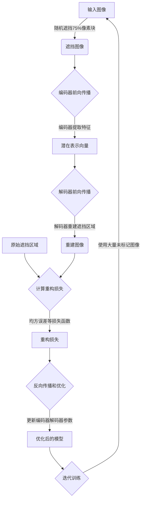

# 解读MAE源代码:架构与实现细节

## 1.背景介绍

### 1.1 什么是MAE?

MAE(Masked Autoencoders)是一种新型的自监督学习方法,由Meta AI研究院于2021年提出。它属于自编码器(Autoencoder)的一种变体,旨在通过掩码机制和重构任务来学习高质量的视觉表示。与传统自编码器不同,MAE采用了一种新颖的编码方式,即在输入图像上随机遮挡一部分像素块(通常为75%),然后训练模型重建被遮挡的部分。

MAE的核心思想是利用大量未标记的图像数据,通过自监督的方式学习通用的视觉表示,从而避免了昂贵的人工标注成本。同时,相比于其他自监督方法(如对比学习),MAE具有更高的计算效率和更简单的优化目标。

### 1.2 MAE的重要性

MAE的提出为计算机视觉领域带来了全新的视角和发展机遇。它展示了自监督学习在视觉表示学习中的巨大潜力,为各种下游视觉任务(如图像分类、目标检测等)提供了强大的通用表示能力。

此外,MAE还具有以下重要意义:

- 降低了预训练视觉模型的计算成本,使之更加高效环保。
- 为自监督学习提供了一种新的范式,激发了相关研究的热潮。
- 为迁移学习提供了新的思路,有助于知识迁移和模型压缩。
- 为解决小数据集问题提供了新的解决方案。

### 1.3 本文内容概览

本文将深入解读MAE的源代码,剖析其核心架构和实现细节。我们将从以下几个方面进行全面探讨:

- MAE的核心概念和基本原理
- 编码器-解码器架构和注意力机制
- 遮挡策略和重构损失函数
- 数学模型和公式推导
- 关键代码模块分析
- 训练技巧和优化策略
- 应用实践和效果评估
- 未来发展趋势和挑战

通过对MAE源代码的深入解读,读者将全面掌握这一创新自监督学习方法的本质,并能更好地将其应用于实际问题。让我们一起开启探索之旅!

## 2.核心概念与联系  

### 2.1 自监督学习与自编码器

在深入探讨MAE之前,我们需要先了解自监督学习(Self-Supervised Learning)和自编码器(Autoencoder)的基本概念。

**自监督学习**是一种无需人工标注的机器学习范式。它利用原始数据本身的某些属性或结构,自动构建监督信号,从而实现模型的自我训练。常见的自监督学习方法包括:

- 重构任务(如自编码器)
- 对比学习(Contrastive Learning)
- 伪标签(Pseudo-Labeling)
- 语义相关性(Semantic Relatedness)

**自编码器**是自监督学习中最经典的一种重构模型。它由编码器(Encoder)和解码器(Decoder)两部分组成。编码器将输入数据(如图像)映射到潜在空间的一个紧凑表示,而解码器则试图从这个潜在表示重建原始输入。通过最小化输入与重建之间的差异,自编码器可以学习到输入数据的有效表示。

传统自编码器的主要缺陷是容易学习到平凡或冗余的表示,因为直接复制输入是一种很简单的重构策略。为了解决这个问题,研究人员提出了各种变体,如加入噪声(Denoising Autoencoder)、施加稀疏约束(Sparse Autoencoder)等,以引导模型学习更加丰富的表示。

MAE正是基于这一思路,通过引入掩码机制和特殊的重构目标,成功避免了平凡解的出现,从而学习到高质量的视觉表示。

### 2.2 MAE的核心思想

MAE的核心思想可以总结为以下三个方面:

1. **掩码机制(Masking Strategy)**

   与传统自编码器不同,MAE在输入图像上随机遮挡大量像素块(通常75%),只保留少量可见的像素块。这种掩码策略迫使模型充分利用剩余的可见部分,从而学习到更加丰富和鲁棒的视觉表示。

2. **自监督重构任务(Self-Supervised Reconstruction Task)**

   MAE的训练目标是重建被遮挡的像素块,而不是像传统自编码器那样重建整个输入图像。这一重构任务更加具有挑战性,需要模型捕捉输入图像的语义和结构信息,而不能简单地复制像素值。

3. **编码器-解码器架构(Encoder-Decoder Architecture)**

   MAE采用编码器-解码器架构,其中编码器将可见的像素块编码为潜在表示,而解码器则从该潜在表示重建被遮挡的像素块。这一架构使得模型可以高效地处理大量遮挡,同时保留了自编码器的基本结构。

通过上述三个核心思想的融合,MAE成功地避免了传统自编码器存在的缺陷,从而学习到更加有效和通用的视觉表示。这些表示不仅可以直接应用于下游视觉任务,还可以用于模型初始化、知识迁移等场景。

## 3.核心算法原理具体操作步骤

### 3.1 MAE算法流程概览

MAE算法的整体流程可以概括为以下几个主要步骤:

1. **输入图像遮挡(Image Masking)**
   - 对输入图像进行随机遮挡,通常遮挡75%的像素块。

2. **编码器前向传播(Encoder Forward Pass)**
   - 将剩余的可见像素块输入编码器。
   - 编码器输出一个压缩的潜在表示向量。

3. **解码器前向传播(Decoder Forward Pass)** 
   - 将编码器的输出作为解码器的输入。
   - 解码器试图重建被遮挡的像素块。

4. **重构损失计算(Reconstruction Loss Computation)**
   - 计算重建的像素块与原始遮挡区域的像素差异。
   - 常用的损失函数是均方误差(MSE)或均方根误差(RMSE)。

5. **反向传播和优化(Backpropagation and Optimization)**
   - 根据重构损失,计算梯度并反向传播。
   - 使用优化器(如Adam)更新编码器和解码器的参数。

6. **迭代训练(Iterative Training)**
   - 重复上述步骤,使用大量未标记图像数据进行训练。
   - 直至模型收敛或达到预期表现。

通过上述自监督的训练过程,MAE可以学习到输入图像的高质量视觉表示,这些表示可用于下游任务或者初始化其他视觉模型。

### 3.2 关键步骤详解

接下来,我们将对MAE算法的几个关键步骤进行更加详细的解释。

#### 3.2.1 输入图像遮挡策略

MAE采用了一种特殊的遮挡策略,即在输入图像上随机遮挡大量像素块。这种策略有以下几个关键点:

1. **遮挡比例**
   通常情况下,MAE会遮挡输入图像的75%像素块。这一比例是经过大量实验得出的最佳值,能够在信息保留和重构难度之间达到平衡。

2. **遮挡方式**
   MAE采用了分块遮挡(Block-wise Masking)的策略,即将图像划分为若干个像素块,然后随机选择部分块进行遮挡。这种方式相比于随机遮挡单个像素,能够更好地保留局部结构信息。

3. **遮挡顺序**
   为了保证每个像素块在训练过程中被遮挡和重构的机会均等,MAE会对遮挡顺序进行随机化处理。这有助于避免模型对某些特定区域的过度拟合。

4. **遮挡形状**
   虽然通常采用矩形块遮挡,但MAE也支持其他形状(如随机区域遮挡)。不同的遮挡形状可能会对模型的表现产生一定影响。

合理的遮挡策略是MAE取得良好表现的关键因素之一。它不仅增加了重构任务的难度,还保留了足够的信息用于学习视觉表示。

#### 3.2.2 编码器-解码器架构

MAE采用了典型的编码器-解码器架构,其中编码器将可见像素块编码为潜在表示,而解码器则从该表示重建被遮挡的像素块。

**编码器(Encoder)**的主要作用是提取输入图像的视觉特征,并将其映射到一个紧凑的潜在空间。常见的编码器结构包括:

- 卷积神经网络(CNN)
- 转置卷积(Transposed Convolutions)
- 注意力机制(Attention Mechanisms)
- 变换器(Transformers)

编码器的设计需要权衡表示能力和计算效率。通常情况下,MAE会采用更深更宽的编码器,以获得更强的表示能力。

**解码器(Decoder)**的任务是从编码器输出的潜在表示中重建被遮挡的像素块。解码器的结构通常与编码器对称,但操作方向相反。常见的解码器结构包括:

- 转置卷积(Transposed Convolutions)
- 上采样(Upsampling)
- 注意力机制(Attention Mechanisms)

解码器的设计需要考虑重构质量和计算效率。一些技巧(如注意力机制)可以帮助解码器更好地利用编码器的表示,从而提高重构质量。

编码器和解码器的具体实现细节会在后续章节中详细探讨。

#### 3.2.3 重构损失函数

重构损失函数(Reconstruction Loss)是MAE算法的核心优化目标。它用于衡量重建的像素块与原始遮挡区域之间的差异,并作为模型参数更新的依据。

MAE中常用的重构损失函数包括:

1. **均方误差(Mean Squared Error, MSE)损失**

   $$\mathcal{L}_{MSE} = \frac{1}{N}\sum_{i=1}^{N}(x_i - \hat{x}_i)^2$$

   其中$x_i$是原始遮挡区域的像素值,$\hat{x}_i$是重建的像素值,N是遮挡区域的像素数量。

2. **均方根误差(Root Mean Squared Error, RMSE)损失**

   $$\mathcal{L}_{RMSE} = \sqrt{\frac{1}{N}\sum_{i=1}^{N}(x_i - \hat{x}_i)^2}$$

   RMSE损失相比MSE损失对于异常值更加敏感,可以一定程度上缓解像素值过大或过小的情况。

除了上述基于像素值的损失函数,MAE也可以使用其他损失函数,如感知损失(Perceptual Loss)等。这些损失函数可以引导模型学习到更加丰富和语义化的表示。

在实际应用中,损失函数的选择需要根据具体任务和数据分布进行权衡。合理的损失函数设计对于MAE的训练效果至关重要。

### 3.3 算法流程图

为了更好地理解MAE算法的整体流程,我们使用Mermaid绘制了一个流程图:

上述流程图清晰地展示了MAE算法的主要步骤及其内在逻辑。通过反复迭代这一过程,MAE可以不断优化编码器和解码器的参数,从而学习到高质量的视觉表示。

## 4.数学模型和公式详细讲解举例说明

在上一节中,我们已经介绍了MAE算法的核心步