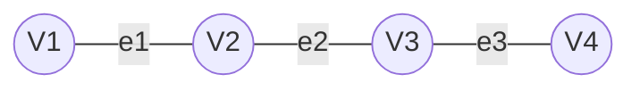
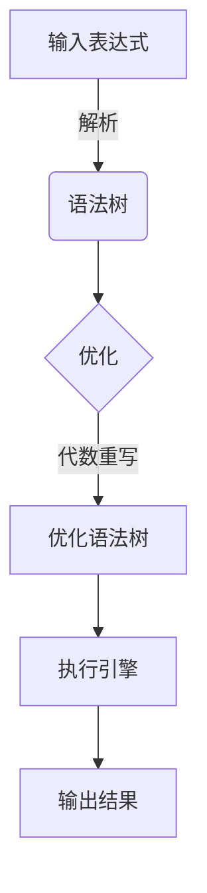

# 运算符与表达式：实现图数据的计算与处理

## 1.背景介绍

### 1.1 图数据的重要性

在当今数据密集型世界中,图数据结构正日益成为表示和处理复杂关系数据的重要工具。从社交网络到生物信息学,从金融交易到物联网,图数据无处不在。它们能够自然地捕捉实体之间的多种关联关系,并支持高效的查询、分析和可视化。

### 1.2 图数据处理的挑战

然而,由于图数据的复杂拓扑结构和大规模性,对其进行高效计算和处理却面临着诸多挑战:

- 数据规模大,存储和查询效率低下
- 复杂的图算法实现困难
- 缺少统一的图数据处理框架

### 1.3 运算符与表达式的重要性

为了有效应对上述挑战,运算符与表达式在图数据处理中扮演着关键角色。通过将复杂的图计算抽象为一系列基本运算符和表达式,我们可以:

- 提高计算效率
- 降低实现复杂度
- 实现跨平台的图计算

## 2.核心概念与联系  

### 2.1 图的数据结构

在深入探讨运算符和表达式之前,我们先回顾一下图的基本数据结构。图 $G=(V,E)$ 由一组顶点(节点) $V$ 和一组边 $E$ 组成,每条边 $e=(u,v) \in E$ 将一对顶点 $u,v \in V$ 相连。



根据边是否带有方向,图可分为无向图和有向图。此外,如果顶点或边附带其他属性,则称为属性图。

### 2.2 运算符的概念

运算符是对一个或多个操作数执行特定操作的结构。在图数据处理中,基本的运算符包括:

- 顶点运算符:对图的顶点执行转换,如过滤、映射等
- 边运算符:对图的边执行转换,如添加、删除等  
- 结构运算符:改变图的整体拓扑结构,如连通分量、图核等

通过将这些基本运算符组合并嵌套,我们可以构建出复杂的图计算表达式。

### 2.3 表达式的概念

表达式是由一序列运算符按特定模式组合而成的复合结构,用于描述和执行复杂的图计算任务。例如,计算图的PageRank值可表示为:

```
PageRank = IterativeComputation(
                 SumNeighbors(
                   MapValues(Multiply(ConstantValue(0.85),
                     Divide(ConstantValue(1.0), DegreeComputation())))))
```

通过将复杂的图计算抽象为一系列表达式,我们可以实现高效、可扩展和可移植的图处理。

## 3.核心算法原理具体操作步骤

### 3.1 表达式求值器

为了高效执行图计算表达式,我们需要一个表达式求值器(Expression Evaluator)。它的主要工作原理如下:



1. **解析(Parsing)**: 将输入的表达式字符串解析为抽象语法树(AST)的数据结构。
2. **优化(Optimization)**: 通过代数重写等优化技术,在不改变语义的前提下,对语法树进行等价变换,以提高执行效率。
3. **执行(Execution)**: 遍历优化后的语法树,依次计算每个节点,并产生最终结果。

### 3.2 基本运算符实现

我们来看一些常见的基本运算符是如何实现的:

**VertexMap**

```python
def VertexMap(g, func):
    """对每个顶点应用func函数"""
    for v in g.vertices:
        new_v = func(v)
        yield new_v
```

**EdgeMap**

```python
def EdgeMap(g, func):
    """对每条边应用func函数"""
    for e in g.edges:
        new_e = func(e) 
        yield new_e
```

**StructureComputation**

```python
def ConnectedComponents(g):
    """计算图的连通分量"""
    visited = {}
    components = []
    for v in g.vertices:
        if v not in visited:
            component = []
            queue = [v]
            while queue:
                cur = queue.pop(0)
                if cur not in visited:
                    visited[cur] = True
                    component.append(cur)
                    queue.extend(g.neighbors(cur))
            components.append(component)
    return components
```

### 3.3 表达式组合

通过将基本运算符组合并嵌套,我们可以构建出复杂的图计算表达式。以PageRank为例:

```python
def PageRank(g, damping_factor=0.85, max_iterations=100):
    num_vertices = g.num_vertices()
    
    # 初始化PageRank值
    pr_values = {v: 1.0/num_vertices for v in g.vertices}
    
    for iter in range(max_iterations):
        new_pr_values = {}
        for v in g.vertices:
            new_pr_values[v] = (1 - damping_factor) / num_vertices
            new_pr_values[v] += damping_factor * sum(
                pr_values[u] / g.out_degree(u)
                for u in g.in_neighbors(v))
        
        pr_values = new_pr_values
        
    return pr_values
```

这个表达式可以分解为:

```
PageRank = IterativeComputation(
                 SumNeighbors(
                   MapValues(Multiply(ConstantValue(0.85),
                     Divide(ConstantValue(1.0), DegreeComputation())))))
```

其中 `IterativeComputation`、`SumNeighbors`、`MapValues`、`Multiply`、`ConstantValue`、`Divide` 和 `DegreeComputation` 都是基本运算符。

## 4.数学模型和公式详细讲解举例说明

在图数据处理中,许多算法和模型都基于数学理论。让我们通过具体例子来深入探讨一些重要的数学模型和公式。

### 4.1 矩阵表示

图可以用邻接矩阵 $A$ 来表示,其中 $A_{ij}$ 表示从顶点 $i$ 到顶点 $j$ 是否存在边。对于无权无向图:

$$
A_{ij}=\begin{cases}
1, &\text{if }(i,j)\in E\\
0, &\text{otherwise}
\end{cases}
$$

有向图和加权图的邻接矩阵定义类似。利用矩阵,我们可以高效实现诸如图遍历、连通性等基本运算。

例如,计算图的连通分量数可以通过矩阵的特征值:

$$
k = \text{rank}(A-\lambda I)
$$

其中 $\lambda$ 为最大特征值, $k$ 为连通分量数。

### 4.2 谱理论

谱理论是研究矩阵特征值和特征向量的数学分支,在图数据分析中有着广泛应用。例如,PageRank算法可以用谱理论来描述:

$$
\begin{aligned}
\text{Let } & M = \alpha P + (1-\alpha)E \\
\text{Then } & \pi = \pi M
\end{aligned}
$$

其中 $P$ 为转移概率矩阵, $E$ 为全1矩阵, $\alpha$ 为阻尼系数, $\pi$ 为稳态概率向量(即PageRank值)。

通过求解这个特征向量方程,我们可以得到网页的PageRank值。

### 4.3 随机游走

随机游走(Random Walk)是研究图数据的另一重要数学工具。许多算法如节点重要性、异常检测等都基于随机游走模型。

令 $p_t(i,j)$ 表示在时刻 $t$ 从节点 $i$ 游走到节点 $j$ 的概率,则对于无向图,其状态转移方程为:

$$
p_{t+1}(i,j) = \sum_{k\in N(i)} \frac{1}{\text{deg}(k)} p_t(k,j)
$$

其中 $N(i)$ 为节点 $i$ 的邻居集,deg(k)为节点k的度数。

通过求解这个方程的稳态分布,我们可以得到图中节点的重要性排序。

### 4.4 图卷积网络

近年来,图卷积网络(Graph Convolutional Network,GCN)作为一种新型深度学习模型,在图数据处理中得到了广泛关注和应用。GCN的核心思想是在图上进行卷积操作,并学习节点的表示向量。

在GCN中,节点 $v_i$ 的表示向量 $h_i^{(l+1)}$ 由其邻居节点的表示向量 $h_j^{(l)}$ 以及自身特征 $x_i$ 计算得到:

$$
h_i^{(l+1)} = \sigma\left(\sum_{j\in\mathcal{N}(i)\cup\{i\}} \frac{1}{\sqrt{|\mathcal{N}(i)||N(j)|}}h_j^{(l)}W^{(l)}\right)
$$

其中 $\mathcal{N}(i)$ 为节点 $i$ 的邻居集, $W^{(l)}$ 为可训练参数。通过端到端的训练,GCN可以自动学习节点的高阶结构特征,并应用于节点分类、链接预测等任务。

## 5.项目实践:代码实例和详细解释说明

为了帮助读者更好地理解和实践图数据处理,我们将介绍一个基于Python的图计算框架GrapeUnion,并给出具体的代码示例。

### 5.1 GrapeUnion简介

[GrapeUnion](https://github.com/alibaba/GraphScope/tree/main/python/graphscope/grapeunion) 是一个基于运算符和表达式的图计算框架,由阿里巴巴开源,可高效执行各种图计算任务。

它的主要特点包括:

- 声明式编程范式,用户只需描述计算逻辑
- 基于运算符和表达式的抽象,易于构建复杂算法
- 自动并行化和优化,提高计算效率
- 支持多种存储和计算引擎,可扩展性强

### 5.2 安装和导入

```python
# 安装GrapeUnion
!pip install graphscope-grapeunion

# 导入相关模块
import graphscope
import grapeunion as gu
import grapeunion.data as gd
```

### 5.3 图的加载和创建

```python
# 从文件加载图
graph = gu.load_from_file("data/email_graph.csv", 
                          src_label='src', 
                          dst_label='dst', 
                          graph_type='directed')

# 或者从NumPy数组创建图
import numpy as np
edges = np.array([[0, 1], [1, 2], [2, 3], [3, 0]])
graph = gu.graph_frame(edges, 'DYNAMIC')
```

### 5.4 基本运算符示例

**VertexMap**

```python
# 对每个节点值加1
new_graph = graph.VertexMap(lambda x: x + 1)
```

**EdgeMap**

```python 
# 对每条边的属性值加10
new_graph = graph.EdgeMap(lambda x: x['weight'] + 10)
```

**StructureComputation**

```python
# 计算图的连通分量
components = graph.ConnectedComponents()
```

### 5.5 表达式执行示例

我们来实现一个基于随机游走的节点重要性算法:

```python
# 定义随机游走运算符
def RandomWalk(graph, max_steps=10):
    steps = 0
    node_importance = gu.NodeData(graph, init_value=1.0)
    while steps < max_steps:
        node_importance = graph.SumNeighbors(node_importance, 
                                             gu.EdgeDirection.IN)
        steps += 1
    return node_importance

# 构建表达式并执行
node_importance = RandomWalk(graph, max_steps=20)
print(node_importance.fetch())
```

### 5.6 性能优化

GrapeUnion提供了多种优化策略,如数据划分、索引、缓存等,可显著提高计算效率:

```python
# 使用有效的数据划分
graph = graph.partition(num_partitions=8)

# 创建索引以加速查询
graph = graph.create_index(gu.ImmutableEdgecutPartitioner())

# 使用缓存避免重复计算
graph.cache()
```

通过这些优化,我们可以充分利用现代硬件的并行计算能力,实现高性能的图数据处理。

## 6.实际应用