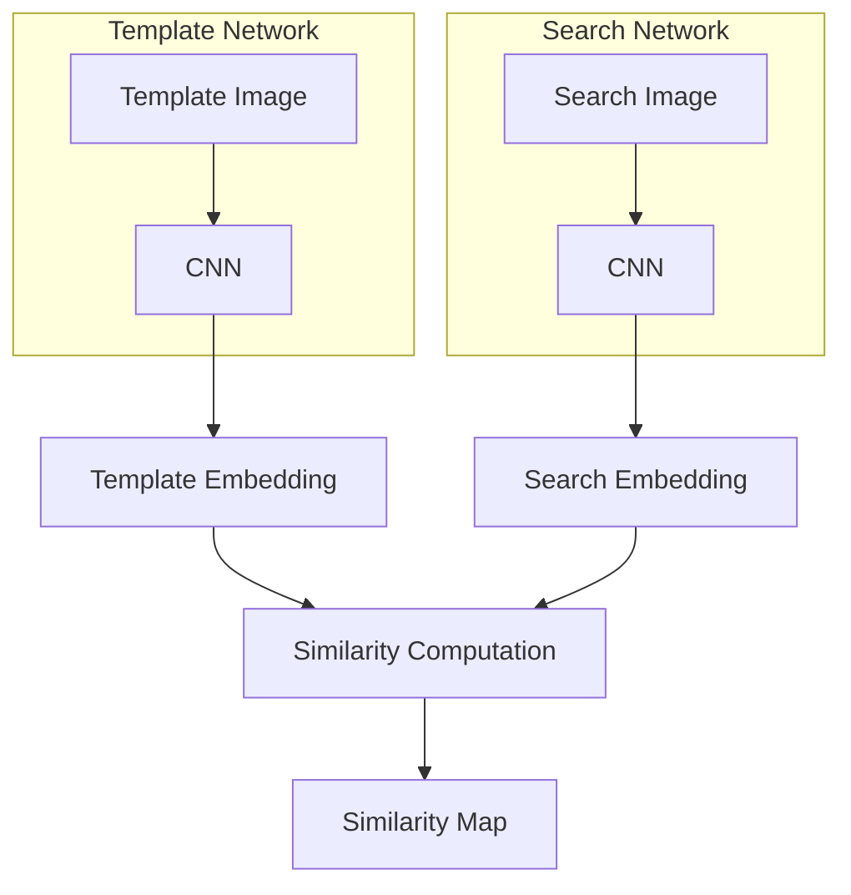

# 🏃Siamese网络：孪生网络的跟踪艺术

## 1.背景介绍

### 1.1 什么是Siamese网络?

Siamese网络(Siamese Network)是一种特殊的神经网络架构,它由两个或多个相同的子网络组成,这些子网络共享相同的权重和结构。Siamese网络的核心思想是学习一种有效的相似性度量,从而能够比较输入数据之间的相似程度。

Siamese网络最初被提出用于签名验证和图像识别等任务,近年来在计算机视觉、自然语言处理、推荐系统等多个领域得到了广泛应用。其中,在计算机视觉领域,Siamese网络被广泛用于目标跟踪、人脸识别、图像检索等任务。

### 1.2 目标跟踪的重要性

目标跟踪是计算机视觉中一个经典且具有挑战性的问题。它的目标是在连续视频帧中自动定位并跟踪感兴趣的目标对象。准确的目标跟踪技术在许多领域都有重要应用,例如:

- 视频监控系统:跟踪可疑目标或行为
- 人机交互:手势识别和人体姿态估计
- 自动驾驶:行人和车辆检测与跟踪
- 增强现实:实时目标定位和跟踪
- 运动分析:体育赛事中运动员和球员的跟踪

目标跟踪算法需要具备鲁棒性,能够应对目标形状变化、遮挡、光照变化、背景杂波等各种复杂情况。传统的目标跟踪算法主要基于手工设计的特征,而近年来,基于深度学习的目标跟踪算法取得了令人瞩目的进展,其中Siamese网络扮演着重要角色。

## 2.核心概念与联系

### 2.1 Siamese网络的核心思想

Siamese网络的核心思想是学习一个有效的相似性度量函数,用于测量两个输入之间的相似程度。这种相似性度量函数通常被称为嵌入函数(Embedding Function),它将原始的高维输入数据映射到一个低维的嵌入空间中。

在嵌入空间中,相似的输入对应的嵌入向量彼此靠近,而不相似的输入对应的嵌入向量相距较远。通过这种方式,Siamese网络能够自动学习输入数据的语义相似性,而无需手工设计复杂的特征。

Siamese网络的基本架构由两个相同的子网络组成,每个子网络都接受一个输入,并将其映射到嵌入空间中。然后,两个嵌入向量之间的距离被计算出来,作为相似性度量的输出。在训练过程中,网络会根据输入对是否相似来调整权重,使得相似的输入对对应的嵌入向量距离较近,而不相似的输入对对应的嵌入向量距离较远。

### 2.2 Siamese网络在目标跟踪中的应用

在目标跟踪任务中,Siamese网络被用于学习一个有效的相似性度量函数,以比较目标模板和搜索区域之间的相似程度。具体来说,Siamese网络包含两个子网络:

1. **模板网络(Template Network)**: 接受目标模板作为输入,并将其映射到嵌入空间中,得到目标模板的嵌入向量。
2. **搜索网络(Search Network)**: 接受搜索区域作为输入,并将其映射到嵌入空间中,得到搜索区域的嵌入特征图。

然后,目标模板的嵌入向量与搜索区域的嵌入特征图进行逐元素相似性计算(如内积或相关操作),得到一个相似性分数图。相似性分数图中的峰值位置就对应着目标在搜索区域中的位置。

通过这种方式,Siamese网络能够在线性时间内计算出目标与搜索区域之间的相似性分数图,从而实现高效的目标跟踪。与传统的相关滤波器(Correlation Filter)方法相比,Siamese网络能够端到端地学习出更有区分能力的特征表示,从而获得更好的跟踪性能。

## 3.核心算法原理具体操作步骤

### 3.1 Siamese网络的基本架构

Siamese网络由两个相同的子网络组成,每个子网络都是一个深度卷积神经网络(CNN)。这两个子网络共享相同的权重和架构,因此被称为"孪生"网络。

具体来说,Siamese网络的架构如下所示:

1. **Template Network**:
   - 输入: 目标模板图像 `T`
   - 网络: 深度卷积神经网络 `TN`
   - 输出: 目标模板的嵌入向量 `TE`

2. **Search Network**:
   - 输入: 搜索区域图像 `S`
   - 网络: 与Template Network相同的深度卷积神经网络 `SN` (共享权重)
   - 输出: 搜索区域的嵌入特征图 `SE`

3. **相似性计算(Similarity Computation)**:
   - 输入: 目标模板的嵌入向量 `TE` 和搜索区域的嵌入特征图 `SE`
   - 操作: 通常使用内积或相关操作计算相似性分数图 `SM`
   - 输出: 相似性分数图 `SM`

相似性分数图 `SM` 中的峰值位置就对应着目标在搜索区域中的位置。通过在连续的视频帧中重复这个过程,就可以实现目标的持续跟踪。

### 3.2 Siamese网络的训练

Siamese网络的训练过程包括以下几个关键步骤:

1. **数据准备**:
   - 收集大量的视频序列,并从中采样目标模板和搜索区域的图像对
   - 为每个图像对标注是否属于同一目标的二值标签

2. **对比损失函数(Contrastive Loss)**:
   - 定义一个对比损失函数,用于度量网络输出的相似性分数与真实标签之间的差异
   - 常用的对比损失函数包括对比损失(Contrastive Loss)和三元组损失(Triplet Loss)

3. **端到端训练**:
   - 将两个子网络连接起来,构成一个端到端的Siamese网络
   - 使用标注好的图像对作为输入,通过反向传播算法优化网络权重
   - 目标是使得相似的图像对对应的嵌入向量距离较近,而不相似的图像对对应的嵌入向量距离较远

4. **数据增强**:
   - 为了提高网络的泛化能力,通常会对训练数据进行数据增强
   - 常用的数据增强方法包括旋转、平移、缩放、高斯噪声等

通过上述步骤,Siamese网络能够学习到一个有效的相似性度量函数,从而实现准确的目标跟踪。

## 4.数学模型和公式详细讲解举例说明

### 4.1 Siamese网络的数学表示

我们可以将Siamese网络的数学表示形式化为:

$$
\begin{aligned}
    \phi_T &= f_T(T; \theta_T) \\
    \phi_S &= f_S(S; \theta_S) \\
    s &= g(\phi_T, \phi_S)
\end{aligned}
$$

其中:

- $T$ 和 $S$ 分别表示目标模板图像和搜索区域图像
- $f_T$ 和 $f_S$ 是两个共享权重的嵌入函数(即子网络),参数为 $\theta_T$ 和 $\theta_S$
- $\phi_T$ 和 $\phi_S$ 分别是目标模板和搜索区域的嵌入向量
- $g$ 是相似性度量函数,用于计算两个嵌入向量之间的相似性分数 $s$

在实际应用中,我们希望相似的图像对 $(T, S)$ 对应的相似性分数 $s$ 较大,而不相似的图像对对应的相似性分数 $s$ 较小。

### 4.2 对比损失函数(Contrastive Loss)

对比损失函数是Siamese网络中常用的一种损失函数,它可以定义为:

$$
L(T, S, y) = (1 - y) \frac{1}{2} D^2 + y \frac{1}{2} \max(0, m - D)^2
$$

其中:

- $y \in \{0, 1\}$ 是图像对 $(T, S)$ 的标签,表示它们是否属于同一目标
- $D = \|\phi_T - \phi_S\|_2$ 是两个嵌入向量之间的欧几里得距离
- $m$ 是一个超参数,称为边界距离(Margin),用于控制不同类别之间嵌入向量的最小距离

对比损失函数的目标是:

- 当 $y = 1$ 时,即图像对属于同一目标,则最小化 $D^2$,使得嵌入向量彼此靠近
- 当 $y = 0$ 时,即图像对不属于同一目标,则最大化 $\max(0, m - D)^2$,使得嵌入向量之间的距离至少为 $m$

通过优化对比损失函数,Siamese网络可以学习到一个有效的相似性度量,从而实现准确的目标跟踪。

### 4.3 三元组损失函数(Triplet Loss)

三元组损失函数是另一种常用的损失函数,它可以定义为:

$$
L(T_a, T_p, T_n) = \max(0, \|\phi_{T_a} - \phi_{T_p}\|_2^2 - \|\phi_{T_a} - \phi_{T_n}\|_2^2 + m)
$$

其中:

- $T_a$ 是锚点(Anchor)图像,表示目标模板
- $T_p$ 是正例(Positive)图像,表示与锚点属于同一目标
- $T_n$ 是负例(Negative)图像,表示与锚点不属于同一目标
- $\phi_{T_a}$, $\phi_{T_p}$, $\phi_{T_n}$ 分别是锚点、正例和负例的嵌入向量
- $m$ 是一个超参数,称为边界距离(Margin),用于控制不同类别之间嵌入向量的最小距离

三元组损失函数的目标是:

- 最小化锚点与正例之间的嵌入向量距离 $\|\phi_{T_a} - \phi_{T_p}\|_2^2$
- 最大化锚点与负例之间的嵌入向量距离 $\|\phi_{T_a} - \phi_{T_n}\|_2^2$
- 确保锚点与正例之间的距离比锚点与负例之间的距离小至少 $m$

通过优化三元组损失函数,Siamese网络可以学习到一个有效的相似性度量,从而实现准确的目标跟踪。

### 4.4 相似性度量函数

在Siamese网络中,相似性度量函数 $g$ 用于计算目标模板的嵌入向量 $\phi_T$ 和搜索区域的嵌入特征图 $\phi_S$ 之间的相似性分数图。常用的相似性度量函数包括:

1. **内积(Dot Product)**:

   $$
   s(x, y) = \phi_T^\top \phi_S(x, y)
   $$

   其中 $x$, $y$ 是搜索区域中的空间坐标,$(x, y)$ 处的相似性分数等于目标模板的嵌入向量 $\phi_T$ 与搜索区域的嵌入特征图 $\phi_S(x, y)$ 在该位置的内积。

2. **相关操作(Correlation Operation)**:

   $$
   s(x, y) = \sum_{u, v} \phi_T(u, v) \phi_S(x + u, y + v)
   $$

   这是一种类似于卷积操作的相关操作,将目标模板的嵌入特征图 $\phi_T$ 与搜索区域的嵌入特征图 $\phi_S$ 进行相关计算,得到相似性分数图 $s$。

3. **核相关操作(Kernel Correlation Operation)**:

   $$
   s(x, y) = \sum_{u, v} k(u, v) \phi_T(u,