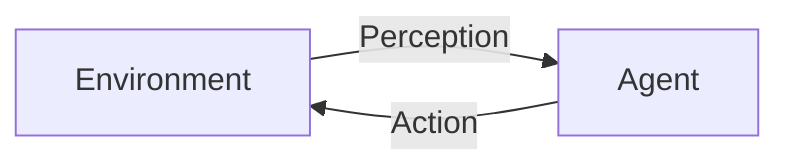

# AI Agent: AI的下一个风口 具身智能研究的挑战与机遇

## 1.背景介绍

### 1.1 人工智能的发展历程

人工智能(AI)是当代科技发展的重要驱动力,自20世纪50年代诞生以来,已经经历了多个发展阶段。最初的AI系统主要集中在游戏、逻辑推理和专家系统等领域。随后,机器学习和深度学习的兴起,使AI在计算机视觉、自然语言处理等领域取得了长足进展。

### 1.2 AI发展的新阶段:具身智能

尽管AI已经在许多领域取得了令人瞩目的成就,但大多数现有AI系统仍然是"非具身"的,即它们缺乏与现实世界环境交互的能力。具身智能(Embodied AI)旨在赋予AI系统身体和感知能力,使其能够像人类一样与物理世界进行自然交互。

具身智能代表了AI发展的新阶段,它将AI系统从虚拟世界带入现实世界,使其能够感知、学习、推理和行动。这种新型AI系统被称为AI Agent,具有广阔的应用前景,有望推动智能系统在机器人、自动驾驶、智能家居等领域的落地应用。

### 1.3 具身智能的挑战

尽管具身智能前景广阔,但其研究和应用也面临着诸多挑战:

- 感知能力:AI Agent需要具备多模态感知能力,能够融合视觉、听觉、触觉等多种信息源。
- 决策与控制:在复杂动态环境中,AI Agent需要具备先进的决策和控制能力。
- 交互与协作:AI Agent需要能够与人类和其他智能体自然高效地交互协作。
- 安全与可解释性:确保AI Agent行为的安全性和可解释性至关重要。

本文将着重探讨具身智能研究中的核心概念、算法原理、关键技术,并分析其应用场景、发展趋势和面临的挑战。

## 2.核心概念与联系

### 2.1 智能体与环境

具身智能系统由两个核心组成部分:智能体(Agent)和环境(Environment)。智能体是指具有感知、决策和行动能力的实体,而环境则是智能体存在和运作的外部世界。

智能体通过感知器(Sensors)获取环境信息,并通过执行器(Actuators)对环境产生影响。智能体和环境之间的交互过程如下所示:

智能体的目标是基于感知到的环境状态,选择最优的行动序列,以最大化预期的长期回报(Reward)。这个过程可以形式化为马尔可夫决策过程(Markov Decision Process, MDP):

$$
\langle S, A, P, R, \gamma \rangle
$$

其中:
- $S$是环境的状态空间
- $A$是智能体可执行的行动空间
- $P(s'|s,a)$是状态转移概率,表示在状态$s$执行行动$a$后,转移到状态$s'$的概率
- $R(s,a)$是即时回报函数,表示在状态$s$执行行动$a$获得的即时回报
- $\gamma \in [0,1)$是折现因子,用于权衡即时回报和长期回报的重要性

智能体的目标是找到一个策略(Policy)$\pi: S \rightarrow A$,使得期望的累积折现回报$\sum_{t=0}^\infty \gamma^t R(s_t, a_t)$最大化,其中$s_t$和$a_t$分别是第$t$个时间步的状态和行动。

### 2.2 感知与表征学习

感知是智能体与环境交互的基础。具身智能系统需要具备多模态感知能力,如视觉、听觉、触觉等,并将这些异构信息融合形成统一的环境表征。

表征学习(Representation Learning)旨在从原始感知数据中自动学习出高层次的特征表示,这些特征能够捕捉输入数据的关键信息,并对智能体的决策和控制有指导意义。常用的表征学习方法包括自编码器(Autoencoder)、生成对抗网络(Generative Adversarial Network, GAN)等。

### 2.3 决策与控制

决策与控制是智能体的核心功能,旨在基于感知到的环境状态,选择最优的行动序列以完成任务目标。常用的决策与控制方法包括:

- 强化学习(Reinforcement Learning):基于试错与奖惩机制,通过与环境的交互来学习最优策略。
- 规划算法(Planning Algorithms):基于已知的环境模型,通过搜索或优化方法计算出最优行动序列。
- 控制理论(Control Theory):借鉴经典控制理论,设计反馈控制器来控制智能体行为。

### 2.4 交互与协作

在许多实际应用场景中,智能体需要与人类或其他智能体进行交互与协作。这需要智能体具备自然交互能力、协作决策能力和任务分配能力等。常用的交互与协作方法包括多智能体系统(Multi-Agent Systems)、人机交互(Human-Robot Interaction)等。

## 3.核心算法原理具体操作步骤

### 3.1 强化学习算法

强化学习是具身智能系统中最广泛使用的决策与控制算法,其核心思想是通过与环境的交互,不断试错并根据反馈奖惩信号来优化策略。

#### 3.1.1 Q-Learning算法

Q-Learning是一种基于价值函数(Value Function)的强化学习算法,其目标是学习出一个最优的行动价值函数$Q^*(s,a)$,表示在状态$s$执行行动$a$后,可获得的最大期望累积回报。

Q-Learning算法的具体步骤如下:

1. 初始化Q表格$Q(s,a)$,对所有状态-行动对赋予任意初值。
2. 对每个Episode:
    - 初始化起始状态$s_0$
    - 对每个时间步$t$:
        - 根据$\epsilon$-贪婪策略选择行动$a_t$
        - 执行行动$a_t$,观测到新状态$s_{t+1}$和即时回报$r_t$
        - 更新Q值:$Q(s_t,a_t) \leftarrow Q(s_t,a_t) + \alpha [r_t + \gamma \max_{a'} Q(s_{t+1},a') - Q(s_t,a_t)]$
        - $s_t \leftarrow s_{t+1}$
    - 直到Episode结束

其中$\alpha$是学习率,$\gamma$是折现因子,$\epsilon$是探索率,用于权衡exploitation和exploration。

#### 3.1.2 Deep Q-Network (DQN)

传统的Q-Learning算法存在一些缺陷,如无法处理高维状态空间、收敛慢等。Deep Q-Network (DQN)通过将深度神经网络引入Q-Learning,可以有效解决这些问题。

DQN算法的核心思想是使用一个深度神经网络$Q(s,a;\theta)$来逼近真实的Q函数,其中$\theta$是网络参数。训练过程如下:

1. 初始化replay buffer $D$
2. 初始化网络参数$\theta$
3. 对每个Episode:
    - 初始化起始状态$s_0$
    - 对每个时间步$t$:
        - 根据$\epsilon$-贪婪策略选择行动$a_t = \max_a Q(s_t,a;\theta)$
        - 执行行动$a_t$,观测到新状态$s_{t+1}$和即时回报$r_t$
        - 存储转换$(s_t,a_t,r_t,s_{t+1})$到replay buffer $D$中
        - 从$D$中采样一个小批量数据$(s_j,a_j,r_j,s_{j+1})$
        - 计算目标Q值:$y_j = r_j + \gamma \max_{a'} Q(s_{j+1},a';\theta^-)$
        - 优化网络参数$\theta$,使得$\sum_j (y_j - Q(s_j,a_j;\theta))^2$最小化
        - 每隔一定步骤同步$\theta^- \leftarrow \theta$
    - 直到Episode结束

DQN算法引入了经验回放(Experience Replay)和目标网络(Target Network)等技术,大大提高了算法的稳定性和收敛性。

### 3.2 策略优化算法

除了基于价值函数的算法,强化学习还有一类基于策略优化的算法,其目标是直接学习出最优策略$\pi^*(a|s)$,表示在状态$s$下执行行动$a$的概率。

#### 3.2.1 REINFORCE算法

REINFORCE算法是一种基于策略梯度的强化学习算法,其核心思想是通过梯度上升,不断调整策略参数$\theta$,使得期望回报$J(\theta) = \mathbb{E}_{\pi_\theta}[\sum_t r_t]$最大化。

具体步骤如下:

1. 初始化策略参数$\theta$
2. 对每个Episode:
    - 根据当前策略$\pi_\theta$执行一个Episode,获得状态序列$\{s_t\}$、行动序列$\{a_t\}$和回报序列$\{r_t\}$
    - 计算Episode的折现累积回报:$G_t = \sum_{t'=t}^\infty \gamma^{t'-t} r_{t'}$
    - 更新策略参数:$\theta \leftarrow \theta + \alpha \sum_t \nabla_\theta \log \pi_\theta(a_t|s_t) G_t$

其中$\alpha$是学习率。REINFORCE算法通过最大化期望回报来优化策略参数,但存在高方差问题,收敛较慢。

#### 3.2.2 Proximal Policy Optimization (PPO)

Proximal Policy Optimization (PPO)是一种新型的策略优化算法,其设计思想是在每次策略更新时,限制新旧策略之间的差异,从而保证训练过程的稳定性和可靠性。

PPO算法的目标函数如下:

$$
J^{CLIP}(\theta) = \hat{\mathbb{E}}_t \left[ \min \left( r_t(\theta) \hat{A}_t, \text{clip}(r_t(\theta), 1-\epsilon, 1+\epsilon) \hat{A}_t \right) \right]
$$

其中:
- $r_t(\theta) = \frac{\pi_\theta(a_t|s_t)}{\pi_{\theta_{old}}(a_t|s_t)}$是重要性采样比率
- $\hat{A}_t$是优势估计(Advantage Estimation),表示执行行动$a_t$相对于平均而言,获得的额外回报
- $\epsilon$是一个超参数,用于限制策略更新的幅度

PPO算法通过引入裁剪(Clipping)机制,限制了策略更新的幅度,从而提高了训练的稳定性和样本利用效率。

### 3.3 规划与控制算法

除了强化学习算法,规划与控制算法也是具身智能系统中常用的决策与控制方法。这些算法通常需要已知环境模型,并基于搜索或优化技术计算出最优行动序列。

#### 3.3.1 A*搜索算法

A*算法是一种广泛使用的启发式搜索算法,常用于路径规划等问题。其核心思想是在搜索过程中,综合考虑已走过的实际路径代价和估计的剩余路径代价,从而有效减少搜索空间。

A*算法的具体步骤如下:

1. 初始化OPEN表(优先队列)和CLOSED表(已探索节点集合)
2. 将起始节点加入OPEN表,估价函数值设为$f(start) = g(start) + h(start)$
3. 重复以下步骤:
    - 从OPEN表中取出估价函数值$f$最小的节点$n$
    - 如果$n$是目标节点,返回路径
    - 将$n$从OPEN表移到CLOSED表
    - 对$n$的每个邻居节点$m$:
        - 如果$m$在CLOSED表中,忽略
        - 计算$m$的估价函数值$f(m) = g(m) + h(m)$
        - 如果$m$不在OPEN表中或$f(m) < f_{old}(m)$,将$m$加入OPEN表,并更新其父节点为$n$
4. 如果OPEN表为空,说明无解,返回失败

其中$g(n)$是从起始节点到$n$的实际路径代价,$h(n)$是从$n$到目标节点的估计剩余代价(启发函数)。A*算法的关键在于设计一个合