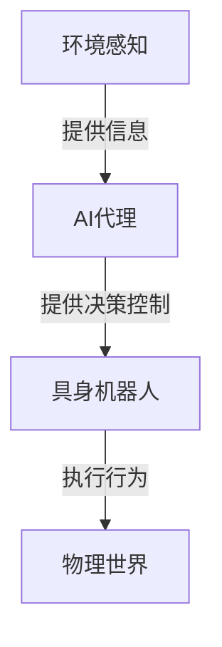
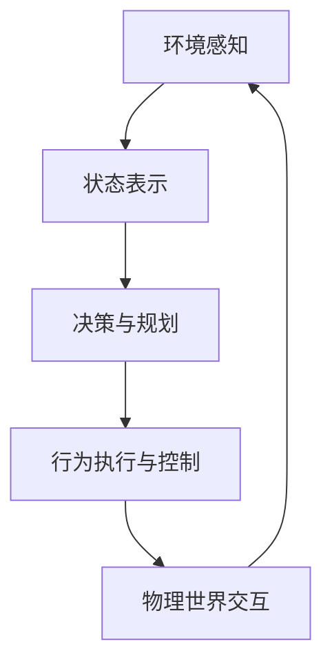

# AI Agent: AI的下一个风口 具身机器人的发展趋势

## 1.背景介绍

### 1.1 人工智能的发展历程

人工智能(Artificial Intelligence, AI)是当代科技发展的核心领域之一,它的发展历程可以追溯到20世纪50年代。在过去的几十年里,AI取得了长足的进步,尤其是近年来机器学习和深度学习技术的飞速发展,使得AI在图像识别、自然语言处理、决策系统等领域取得了突破性的成就。

### 1.2 AI代理的兴起

随着AI技术的不断成熟,AI代理(AI Agent)的概念应运而生。AI代理是指具有一定自主性、可以感知环境、做出决策并执行行为的人工智能系统。它们可以被视为人类的智能助手,在各个领域发挥着越来越重要的作用。

### 1.3 具身机器人的重要性

尽管传统的AI代理已经取得了令人瞩目的成就,但它们大多局限于虚拟世界或软件系统中。为了更好地服务于现实世界,AI代理需要与物理环境进行交互,这就需要具身机器人(Embodied AI)的支持。具身机器人是指拥有物理形态、能够感知和操作物理世界的机器人系统,它们将AI技术与机器人技术相结合,为AI代理提供了在现实世界中运行的载体。

## 2.核心概念与联系

### 2.1 AI代理的定义

AI代理是一种具有自主性的智能系统,它可以通过感知器(Sensors)获取环境信息,并基于这些信息做出决策,选择执行相应的行为(Actions)。AI代理的目标是最大化某种预定义的效用函数(Utility Function),以实现特定的任务。

### 2.2 具身机器人的构成

具身机器人通常由以下几个核心组件构成:

1. **机器人硬件平台**: 包括机械结构、传感器、执行器等物理部件,用于与外部环境进行交互。
2. **感知系统**: 通过各种传感器(如视觉、听觉、触觉等)获取环境信息。
3. **决策和控制系统**: 基于感知信息做出决策,并控制机器人的行为。这个系统通常由AI算法驱动。
4. **通信和网络系统**: 用于机器人与外部系统(如云端服务器)进行通信和协作。

具身机器人将AI代理的决策与物理世界的交互相结合,使AI代理能够在真实环境中执行任务。

### 2.3 AI代理与具身机器人的关系

AI代理和具身机器人是相辅相成的关系。AI代理提供了智能决策和控制的能力,而具身机器人则为AI代理提供了与物理世界交互的接口和载体。通过将二者结合,我们可以构建出能够在现实世界中自主运行、执行复杂任务的智能系统。

该关系可以用下面的Mermaid流程图来描述:



## 3.核心算法原理具体操作步骤

### 3.1 感知与状态表示

具身机器人的第一步是通过各种传感器获取环境信息,并将这些信息转换为内部状态表示(State Representation)。常见的状态表示方法包括:

1. **特征向量(Feature Vector)**: 将环境信息编码为一个固定长度的数值向量。
2. **图像/视频帧**: 直接使用来自相机的图像或视频帧作为状态表示。
3. **点云数据**: 利用激光雷达或深度相机获取的三维点云数据来表示环境。

### 3.2 决策与规划

获取状态表示后,具身机器人需要基于当前状态做出决策,选择执行何种行为。这个过程通常由AI算法驱动,常见的算法包括:

1. **强化学习(Reinforcement Learning)**: 通过试错和奖惩机制,学习一个策略(Policy),指导机器人在不同状态下采取何种行为,以最大化累积奖励。
2. **规划算法(Planning Algorithms)**: 基于环境模型和目标状态,通过搜索或优化等方法,计算出一系列行为序列,指导机器人达成目标。
3. **机器学习模型(Machine Learning Models)**: 训练一个机器学习模型(如深度神经网络),直接从状态到行为进行端到端的映射。

### 3.3 行为执行与控制

一旦决策出要执行的行为,具身机器人就需要通过执行器(如电机、机械臂等)将这些行为转化为物理世界的动作。在这个过程中,需要进行精确的运动规划和控制,以确保机器人能够安全、高效地完成任务。常见的控制算法包括:

1. **PID控制(PID Control)**: 一种经典的反馈控制算法,广泛应用于机器人的位置、速度等控制。
2. **轨迹优化(Trajectory Optimization)**: 通过优化方法计算出满足各种约束条件的最优运动轨迹。
3. **模型预测控制(Model Predictive Control)**: 基于系统模型和约束条件,在一个滚动时间窗口内进行优化,获得最优控制序列。

### 3.4 闭环反馈与学习

具身机器人的运行是一个闭环过程。在执行行为后,机器人需要通过传感器获取新的环境反馈,更新内部状态表示,并基于新状态进行下一步决策和控制。在这个过程中,机器人可以不断学习和优化自己的策略,以提高任务执行的效率和质量。

该过程可以用下面的Mermaid流程图来描述:



## 4.数学模型和公式详细讲解举例说明

### 4.1 马尔可夫决策过程(MDP)

马尔可夫决策过程(Markov Decision Process, MDP)是强化学习和决策理论中的一个重要数学模型。它可以用一个五元组 $\langle S, A, P, R, \gamma \rangle$ 来表示:

- $S$ 是状态集合
- $A$ 是行为集合
- $P(s'|s,a)$ 是状态转移概率,表示在状态 $s$ 下执行行为 $a$ 后,转移到状态 $s'$ 的概率
- $R(s,a,s')$ 是奖励函数,表示在状态 $s$ 下执行行为 $a$ 后,转移到状态 $s'$ 所获得的奖励
- $\gamma \in [0,1]$ 是折现因子,用于权衡即时奖励和长期奖励的重要性

在 MDP 中,我们的目标是找到一个策略 $\pi: S \rightarrow A$,使得期望累积奖励 $G_t = \sum_{k=0}^{\infty} \gamma^k R_{t+k+1}$ 最大化。

### 4.2 Q-Learning算法

Q-Learning 是一种著名的基于模型无关的强化学习算法,它可以直接从环境交互中学习最优策略,而无需事先了解环境的转移概率和奖励函数。

Q-Learning 算法的核心是学习一个 Q 函数 $Q(s,a)$,表示在状态 $s$ 下执行行为 $a$ 后,可以获得的最大期望累积奖励。Q 函数的更新规则如下:

$$Q(s_t,a_t) \leftarrow Q(s_t,a_t) + \alpha \left[ r_{t+1} + \gamma \max_{a}Q(s_{t+1},a) - Q(s_t,a_t) \right]$$

其中 $\alpha$ 是学习率,控制着每次更新的步长。

在具身机器人中,我们可以使用深度神经网络来近似 Q 函数,这种方法被称为深度 Q 网络(Deep Q-Network, DQN)。DQN 算法通过经验回放(Experience Replay)和目标网络(Target Network)等技巧,提高了训练的稳定性和效率。

### 4.3 轨迹优化

轨迹优化是一种常见的运动规划和控制方法,它通过优化技术来计算出满足各种约束条件的最优运动轨迹。

假设我们希望机器人从初始状态 $x_0$ 到达目标状态 $x_T$,并且需要满足一些约束条件(如避障、动力学约束等)。我们可以将这个问题建模为一个优化问题:

$$\begin{aligned}
\min_{x(t),u(t)} & \quad J(x(t),u(t)) \\
\text{s.t.} & \quad \dot{x}(t) = f(x(t),u(t)) \\
& \quad g(x(t),u(t)) \leq 0 \\
& \quad x(0) = x_0, \quad x(T) = x_T
\end{aligned}$$

其中:

- $x(t)$ 是机器人的状态轨迹
- $u(t)$ 是控制输入
- $J(x(t),u(t))$ 是代价函数,用于评估轨迹的优劣
- $f(x(t),u(t))$ 是机器人的动力学模型
- $g(x(t),u(t))$ 表示各种约束条件

通过求解这个优化问题,我们可以获得最优的状态轨迹 $x^*(t)$ 和控制输入 $u^*(t)$,从而指导机器人的运动。

### 4.4 模型预测控制(MPC)

模型预测控制(Model Predictive Control, MPC)是一种基于模型的优化控制方法,它在一个滚动时间窗口内进行优化,获得最优控制序列。

MPC 算法的工作流程如下:

1. 获取当前状态 $x_0$
2. 在时间窗口 $[0, T]$ 内,求解下面的优化问题:

$$\begin{aligned}
\min_{u(t)} & \quad J(x(t),u(t)) \\
\text{s.t.} & \quad \dot{x}(t) = f(x(t),u(t)) \\
& \quad g(x(t),u(t)) \leq 0 \\
& \quad x(0) = x_0
\end{aligned}$$

获得最优控制序列 $u^*(t), t \in [0, T]$

3. 执行控制序列的第一个控制输入 $u^*(0)$
4. 获取新的状态 $x_1$,将时间窗口滚动到 $[1, T+1]$,重复步骤 2-4

MPC 算法的优点在于它可以显式地处理各种约束条件,并且具有反馈校正的能力,能够适应环境的变化。它在机器人控制、工业控制等领域有着广泛的应用。

## 5.项目实践: 代码实例和详细解释说明

为了更好地理解具身机器人的工作原理,我们来看一个基于 Python 和 ROS (Robot Operating System) 的实际项目实例。

在这个项目中,我们将使用一个模拟的机器人环境,目标是训练一个强化学习智能体,使机器人能够自主导航并到达指定的目标位置。

### 5.1 环境设置

我们首先需要导入必要的库和模块:

```python
import rospy
import numpy as np
from gym import spaces
from geometry_msgs.msg import Twist
from sensor_msgs.msg import LaserScan
from robot_env import RobotEnv
```

其中 `RobotEnv` 是一个自定义的环境类,它封装了机器人与模拟器的交互接口。

接下来,我们定义机器人的状态空间和行为空间:

```python
class RobotAgent:
    def __init__(self):
        # 状态空间: 激光雷达数据 + 目标位置
        self.observation_space = spaces.Box(low=0, high=10, shape=(24+2,))
        # 行为空间: 线速度和角速度
        self.action_space = spaces.Box(low=-1.0, high=1.0, shape=(2,))
        self.env = RobotEnv()
        self.state = None
```

### 5.2 强化学习算法

在这个例子中,我们将使用 Deep Q-Network (DQN) 算法来训练智能体。我们首先定义 Q 网络:

```python
import torch
import torch.nn as nn

class QNetwork(nn.Module):
    def __init__(self, state_dim, action_dim):
        super(QNetwork, self).__init__()
        self.fc1 = nn.Linear(state_dim, 64