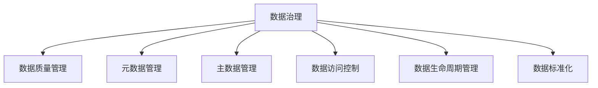
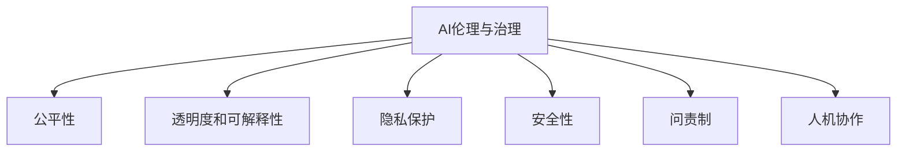
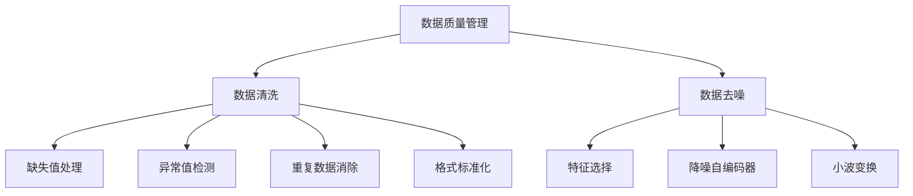
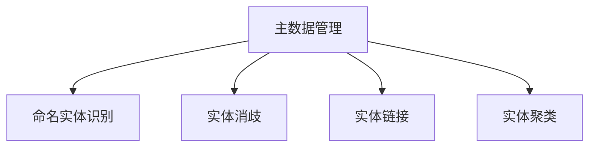
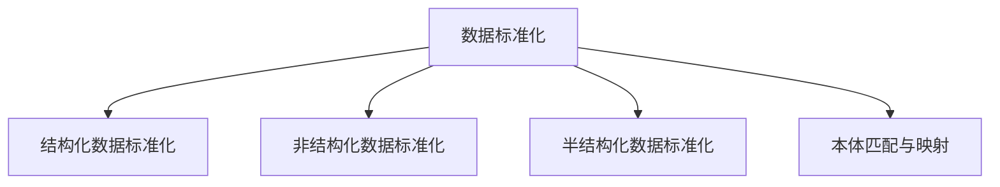

# AI Agent: AI的下一个风口 数据治理与社会伦理

## 1.背景介绍

### 1.1 人工智能的崛起

人工智能(AI)技术在过去几年里经历了飞速发展,深度学习算法的突破性进展推动了计算机视觉、自然语言处理、语音识别等领域取得了令人瞩目的成就。AI系统逐渐渗透到了我们生活的方方面面,为我们带来了诸多便利,同时也引发了一些争议和质疑。

### 1.2 数据是新时代的石油

在AI系统的训练和部署过程中,大量高质量的数据是必不可少的燃料。训练数据的质量和数量直接决定了AI模型的性能表现。然而,现实世界中的数据通常存在噪音、偏差、隐私等问题,如何对数据进行高效的管理和治理,确保AI系统的安全可靠运行,成为了一个亟待解决的挑战。

### 1.3 AI系统的社会影响

除了数据质量之外,AI系统在实际应用中也面临着诸多社会伦理问题,如算法公平性、透明度、可解释性等。AI系统的决策过程常常是一个黑箱操作,缺乏可解释性,可能会导致歧视和不公平对待。此外,AI系统的滥用也可能对个人隐私、社会稳定等造成威胁。因此,如何在开发AI系统的同时,兼顾社会伦理,实现人工智能的可持续发展,是一个需要科技界和社会各界共同面对的重大课题。

## 2.核心概念与联系

### 2.1 数据治理

数据治理(Data Governance)是指制定政策、流程和标准,以确保数据的可用性、完整性、安全性和可靠性。它包括以下几个关键方面:

1. **数据质量管理** 通过数据清洗、去噪、标准化等手段,提高数据质量,消除数据中的偏差和噪音。

2. **元数据管理** 元数据描述了数据的结构、语义和来源,有助于数据的组织和理解。

3. **主数据管理** 主数据是指企业内部的核心数据资产,如客户信息、产品信息等,需要对其进行集中管理和维护。

4. **数据访问控制** 通过身份认证、授权和审计等机制,保护数据的安全性和隐私性。

5. **数据生命周期管理** 从数据采集、存储、处理到销毁的全过程管理。

6. **数据标准化** 制定数据标准和规范,实现数据的一致性和互操作性。

数据治理为AI系统提供了高质量、安全可靠的数据基础,是AI系统健康发展的关键支撑。

### 2.2 AI伦理与治理

AI伦理关注AI系统在开发和应用过程中所涉及的道德、法律和社会影响问题,旨在确保AI的发展符合人类价值观。主要包括以下几个方面:

1. **公平性** 确保AI系统在决策时不会产生基于年龄、性别、种族等因素的歧视。

2. **透明度和可解释性** AI系统的决策过程应当对人类可解释,避免"黑箱"操作。

3. **隐私保护** 保护个人数据隐私,防止AI系统被滥用。

4. **安全性** 确保AI系统的稳定性和可控性,防止出现意外后果。

5. **问责制** 明确AI系统开发者和使用者的责任和义务。

6. **人机协作** 探索人工智能与人类的协作模式,实现互补和协同。

AI伦理为AI系统的发展设置了道德底线和原则约束,与数据治理共同构建了AI系统的可信基础。

### 2.3 数据治理与AI伦理的关联

数据治理和AI伦理虽然侧重点不同,但存在紧密联系:

- 高质量的数据是实现公平、透明和可解释AI系统的前提条件。
- 数据访问控制和隐私保护是AI伦理中隐私保护的重要一环。
- 数据生命周期管理有助于追溯AI系统决策的源头,实现问责制。
- 标准化的数据格式有利于人机协作和互操作性。

因此,数据治理和AI伦理应当相互配合、相辅相成,共同推动人工智能的健康、可持续发展。

## 3.核心算法原理具体操作步骤

### 3.1 数据质量管理算法

#### 3.1.1 数据清洗

数据清洗是指从原始数据中识别和修正或移除不正确、不完整、不相关或不一致的数据记录。常用的数据清洗算法包括:

1. **缺失值处理**
    - 删除缺失值记录
    - 使用均值/中位数/众数等统计量填充缺失值
    - 构建机器学习模型预测缺失值

2. **异常值检测**
    - 基于统计量(3σ原则)
    - 基于隔离森林等无监督算法
    - 基于有监督分类算法(SVM等)

3. **重复数据消除**
    - 基于键值的精确匹配
    - 基于相似度的模糊匹配(编辑距离等)

4. **格式标准化**
    - 规则匹配和正则表达式
    - 自然语言处理技术(分词、词性标注等)

#### 3.1.2 数据去噪

数据去噪是指从原始数据中去除无关或干扰性的数据,以提高数据质量和模型性能。常用的数据去噪算法包括:

1. **特征选择**
    - 过滤式方法(卡方检验、互信息等)
    - 包裹式方法(递归特征消除等)
    - 嵌入式方法(Lasso回归等)

2. **降噪自编码器**
    - 利用自编码器网络从噪声数据中重建原始数据

3. **小波变换**
    - 将信号分解为不同尺度的小波系数,去除高频噪声分量

算法的选择需要结合具体的数据特征和应用场景,并根据实际效果进行评估和调优。

### 3.2 主数据管理算法

主数据管理的核心是实体识别和实体解析,即从海量数据中识别出关键实体(如人物、组织、地点等),并将相关信息整合到同一个实体下。常用的算法包括:

1. **命名实体识别(NER)**
    - 基于规则的方法
    - 基于统计模型的方法(HMM、CRF等)
    - 基于深度学习的方法(Bi-LSTM+CRF等)

2. **实体消歧**
    - 基于上下文相似度(TF-IDF、Word2Vec等)
    - 基于知识库查询
    - 基于图模型(PageRank等)

3. **实体链接**
    - 先验概率模型(贝叶斯等)
    - 基于相似度的链接预测
    - 基于知识图谱的链接预测

4. **实体聚类**
    - 基于距离的聚类(K-Means等)
    - 基于密度的聚类(DBSCAN等)
    - 基于图的聚类(Markov聚类等)

通过以上算法,可以从海量异构数据中提取出高质量的主数据,为AI系统提供可靠的知识源。

### 3.3 数据标准化算法

数据标准化是指将数据转换为统一的格式或结构,以提高数据的一致性和互操作性。常用的数据标准化算法包括:

1. **结构化数据标准化**
    - 模式匹配和规则转换
    - 基于树编辑距离的模式学习
    - 基于深度学习的结构化预测

2. **非结构化数据标准化**
    - 基于规则的方法(正则表达式等)
    - 基于统计模型的方法(HMM、CRF等)
    - 基于深度学习的序列到序列模型(Transformer等)

3. **半结构化数据标准化**
    - 基于树或图的结构化转换
    - 基于统计模型的标记预测
    - 基于深度学习的树或图嵌入模型

4. **本体匹配与映射**
    - 基于实例的匹配
    - 基于结构的匹配
    - 基于语义的匹配

通过数据标准化,可以实现数据资产在不同系统和应用之间的无缝集成和共享,提高数据资产的利用率。

## 4.数学模型和公式详细讲解举例说明

### 4.1 数据质量评估指标

评估数据质量是数据治理的重要环节,常用的数据质量评估指标包括:

1. **完整性**

完整性反映了数据记录的完整程度,可用以下公式计算:

$$
完整性 = 1 - \frac{缺失值记录数}{总记录数}
$$

2. **准确性**

准确性反映了数据记录的正确程度,可通过人工标注的方式评估:

$$
准确性 = \frac{正确记录数}{总记录数}
$$

3. **一致性**

一致性反映了数据记录之间的一致程度,可用信息熵的方式度量:

$$
一致性 = 1 - \frac{H(X)}{H_{max}}
$$

其中$H(X)$为数据$X$的信息熵,$H_{max}$为最大可能的信息熵。

4. **唯一性**

唯一性反映了数据记录的唯一性程度,可用以下公式计算:

$$
唯一性 = 1 - \frac{重复记录数}{总记录数}
$$

5. **时效性**

时效性反映了数据的实时更新程度,可用以下公式计算:

$$
时效性 = 1 - \frac{过期记录数}{总记录数}
$$

通过定量评估数据质量,可以发现数据中存在的问题,并针对性地采取相应的数据质量改进措施。

### 4.2 实体链接算法

实体链接是主数据管理的核心任务之一,其目标是将文本中的实体mention与知识库中的实体entry正确关联。常用的实体链接算法包括:

1. **先验概率模型**

先验概率模型基于贝叶斯公式,计算mention与entry之间的关联概率:

$$
P(e|m) = \frac{P(m|e)P(e)}{P(m)}
$$

其中$P(e)$是entry $e$的先验概率,$P(m|e)$是mention $m$产生于entry $e$的条件概率,$P(m)$是mention $m$的边缘概率。

2. **基于相似度的链接预测**

该方法计算mention与entry之间的相似度,将mention链接到最相似的entry上:

$$
\hat{e} = \arg\max_{e \in \mathcal{E}} \text{sim}(m, e)
$$

其中$\mathcal{E}$是所有候选entry的集合,sim是mention与entry之间的相似度函数,可以是字符串相似度、语义相似度等。

3. **基于知识图谱的链接预测**

该方法利用知识图谱中的结构信息进行链接预测,常用的算法包括路径排序算法(Path Ranking Algorithm)等