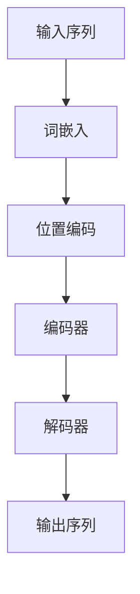

# AI LLM人工智能大模型介绍：走向智能的下一步

## 1. 背景介绍

### 1.1 人工智能的发展历程

人工智能(Artificial Intelligence, AI)作为一门跨学科的技术,自20世纪50年代问世以来,经历了几个重要的发展阶段。早期的人工智能系统主要基于规则和逻辑推理,但受到知识获取、表示和处理能力的限制。随着机器学习和神经网络技术的兴起,数据驱动的人工智能模型取得了长足进步,在计算机视觉、自然语言处理等领域展现出卓越的性能。

### 1.2 大规模语言模型(LLM)的崛起  

近年来,benefiting from海量数据、算力提升和新算法突破,大规模语言模型(Large Language Model, LLM)成为人工智能领域的一股重要力量。LLM通过在大规模语料库上进行自监督预训练,学习捕捉文本中丰富的语义和上下文信息,从而获得强大的语言理解和生成能力。

### 1.3 LLM的重要意义

LLM不仅在自然语言处理任务上表现出色,更为重要的是它们展现出跨领域的通用能力,可应用于各种下游任务。LLM被视为通往通用人工智能(Artificial General Intelligence, AGI)的一个关键里程碑,引发了学术界和产业界的广泛关注。本文将全面介绍LLM的核心概念、关键技术、应用场景和未来发展趋势,为读者揭示这一革命性技术的本质。

## 2. 核心概念与联系

### 2.1 自注意力机制(Self-Attention)

#### 2.1.1 注意力机制的本质
注意力机制是LLM的核心基础,它模仿人类认知过程中选择性关注重点信息的机制。在处理序列数据时,注意力机制能够自适应地捕捉输入序列中不同位置的元素之间的长程依赖关系,从而更好地建模上下文语义。

#### 2.1.2 自注意力机制的工作原理
自注意力机制将输入序列中的每个元素映射为一个查询(Query)向量、一个键(Key)向量和一个值(Value)向量。然后,通过计算查询向量与所有键向量的相似性得分(注意力分数),对值向量进行加权求和,生成该位置元素的注意力表示。该过程可表示为:

$$\mathrm{Attention}(Q, K, V) = \mathrm{softmax}(\frac{QK^T}{\sqrt{d_k}})V$$

其中$Q$、$K$、$V$分别表示查询、键和值矩阵,$d_k$是缩放因子,用于防止内积值过大导致梯度消失。

自注意力机制能够并行计算序列中所有元素的注意力表示,充分利用现代硬件的并行计算能力,是LLM高效建模的关键所在。

### 2.2 transformer架构

#### 2.2.1 transformer的基本结构
Transformer是第一个完全基于自注意力机制的序列模型,由编码器(Encoder)和解码器(Decoder)两个子模块组成。编码器将输入序列映射为上下文表示,解码器则基于编码器的输出和前缀(前文)生成目标序列。

#### 2.2.2 多头注意力机制
为了捕捉不同的注意力模式,Transformer采用了多头注意力(Multi-Head Attention)机制,将注意力计算过程分成多个并行的"头"。每个头关注输入序列的不同子空间表示,最终将所有头的注意力表示拼接起来,捕捉全面的依赖信息。

#### 2.2.3 位置编码
由于自注意力机制没有显式地编码序列的位置信息,Transformer引入了位置编码(Positional Encoding)来赋予每个元素位置信息。常见的位置编码方式包括正弦曲线编码和可学习的嵌入向量。

#### 2.2.4 残差连接和层归一化
为了更好地训练深层transformer模型,引入了残差连接(Residual Connection)和层归一化(Layer Normalization)机制。残差连接有助于梯度传播,缓解了深层网络的梯度消失问题;层归一化则通过归一化中间层输出的均值和方差,加快了模型收敛并提高了泛化性能。

### 2.3 transformer语言模型

#### 2.3.1 自编码语言模型
基于Transformer的语言模型主要分为自编码语言模型(Auto-Encoding LM)和自回归语言模型(Auto-Regressive LM)两种。自编码语言模型通过掩码机制从输入序列中随机遮蔽部分词元,并以这些被遮蔽的词元作为监督信号,训练模型重建原始序列。这种方式允许模型并行处理序列,提高了训练效率。

#### 2.3.2 自回归语言模型
自回归语言模型则是以生成式的方式,基于前缀(前文)逐个预测序列中的下一个词元。虽然训练时间成本较高,但自回归模型能够更好地捕捉上下文语义,生成质量往往更好。GPT系列模型就是基于这种范式训练的。

#### 2.3.3 预训练与微调
无论是自编码还是自回归模型,都采用了预训练与微调(Pre-training and Fine-tuning)的范式。在预训练阶段,模型在大规模无标注语料库上进行自监督训练,学习通用的语言表示;在微调阶段,则将预训练模型在有标注的下游任务数据上进行进一步调整,使模型适应特定的任务。

## 3. 核心算法原理具体操作步骤

### 3.1 transformer模型训练

#### 3.1.1 数据预处理
- 文本分词:将原始文本序列分割成词元(token)序列
- 构建词表:统计语料库中所有词元,构建词表(vocabulary)
- 数值化:将词元映射为对应的数值ID
- 填充和截断:将序列填充或截断到固定长度

#### 3.1.2 模型输入构造
- 添加特殊词元:在序列首尾添加特殊的起止符[BOS]和[EOS]
- 位置编码:为每个词元赋予位置信息
- 注意力遮蔽:对解码器自注意力施加三角形遮蔽,保证每个位置只能关注之前的位置

#### 3.1.3 前向计算
- 词嵌入:将输入词元ID映射为对应的词向量表示
- 编码器:输入序列通过编码器的多层self-attention和前馈网络编码
- 解码器:在编码器输出的基础上,解码器预测序列中的下一个词元

#### 3.1.4 损失计算与优化
- 交叉熵损失:以ground-truth序列为监督,计算预测序列与真实序列的交叉熵损失
- 梯度更新:基于损失函数,对模型参数进行反向传播求导并更新参数

### 3.2 transformer模型推理

#### 3.2.1 文本生成
- 输入前缀:给定一个文本前缀(prompt),例如"总统是..."
- 自回归生成:基于前缀,模型自回归地预测下一个最可能的词元
- 解码策略:贪婪解码、beam search、top-k/top-p采样等策略生成文本
- 终止条件:当生成[EOS]结束符或达到最大长度时停止生成

#### 3.2.2 其他下游任务
- 分类任务:在序列首尾添加特定标记,将序列作为输入进行分类
- 问答任务:将问题和文本拼接作为输入,模型生成答案序列
- 序列到序列:编码器输入源序列,解码器生成目标序列(如机器翻译)

## 4. 数学模型和公式详细讲解举例说明

### 4.1 transformer模型结构

transformer模型的基本结构如下所示:



编码器(Encoder)和解码器(Decoder)都由多个相同的层组成,每一层都包含两个子层:多头自注意力机制(Multi-Head Attention)和前馈全连接网络(Feed-Forward Network)。

#### 4.1.1 多头自注意力机制

多头自注意力机制的计算过程如下:

1. 线性投影:将输入$X$分别投影到查询(Query)、键(Key)和值(Value)空间,得到$Q$、$K$、$V$。

$$Q = XW_Q,\ K = XW_K,\ V = XW_V$$

其中$W_Q$、$W_K$、$W_V$为可学习的投影矩阵。

2. 计算注意力分数:通过点乘计算查询$Q$与所有键$K$的相似性得分,并对分数进行缩放和softmax归一化,得到注意力权重$\alpha$。

$$\alpha = \mathrm{softmax}(\frac{QK^T}{\sqrt{d_k}})$$

其中$d_k$为缩放因子,用于防止内积值过大导致梯度消失。

3. 加权求和:将注意力权重$\alpha$与值$V$相乘并求和,得到注意力输出$Z$。

$$Z = \alpha V$$

4. 多头合并:将$h$个注意力头的输出$Z_1,...,Z_h$拼接在一起,并经过线性投影得到最终的多头注意力输出。

$$\mathrm{MultiHead}(Q, K, V) = \mathrm{Concat}(Z_1,...,Z_h)W_O$$

其中$W_O$为可学习的投影矩阵。

多头注意力机制能够同时关注输入序列中不同的子空间表示,捕捉全面的依赖信息。

#### 4.1.2 前馈全连接网络

前馈全连接网络由两个线性变换和一个ReLU激活函数组成:

$$\mathrm{FFN}(x) = \max(0, xW_1 + b_1)W_2 + b_2$$

其中$W_1$、$W_2$、$b_1$、$b_2$为可学习的参数。前馈网络可以为每个位置的表示增加非线性变换,提高模型的表达能力。

#### 4.1.3 残差连接和层归一化

为了更好地训练深层transformer模型,在每个子层后都引入了残差连接和层归一化:

$$\mathrm{LayerNorm}(x + \mathrm{Sublayer}(x))$$

残差连接有助于梯度传播,缓解了深层网络的梯度消失问题;层归一化则通过归一化中间层输出的均值和方差,加快了模型收敛并提高了泛化性能。

### 4.2 transformer语言模型训练目标

对于自编码语言模型,训练目标是最大化被掩码词元的条件概率:

$$\mathcal{L}_1 = -\mathbb{E}_{x}\left[\sum_{i\in\mathcal{M}}\log P(x_i|x_{\backslash i})\right]$$

其中$\mathcal{M}$表示被掩码的词元位置集合,$x_{\backslash i}$表示除去$x_i$的其余词元。

对于自回归语言模型,训练目标是最大化序列的条件概率:

$$\mathcal{L}_2 = -\mathbb{E}_{x}\left[\sum_{i=1}^n\log P(x_i|x_{<i})\right]$$

其中$x_{<i}$表示序列$x$中位置$i$之前的所有词元。

在实践中,通常会采用掩码语言模型(Masked Language Model)和下一句预测(Next Sentence Prediction)两个辅助目标联合训练,以提高模型的泛化性能。

## 4. 项目实践:代码实例和详细解释说明

以下是一个使用PyTorch实现的简化版transformer模型示例,用于序列到序列的机器翻译任务。

```python
import torch
import torch.nn as nn

class TransformerEncoder(nn.Module):
    def __init__(self, dim_model, num_heads, dim_ff, num_layers):
        super().__init__()
        self.layers = nn.ModuleList([EncoderLayer(dim_model, num_heads, dim_ff) for _ in range(num_layers)])

    def forward(self, x, src_mask=None):
        for layer in self.layers:
            x = layer(x, src_mask)
        return x

class EncoderLayer(nn.Module):
    def __init__(self, dim_model, num_heads, dim_ff):
        super().__init__()
        self.self_attn = MultiHeadAttention(dim_model, num_heads)