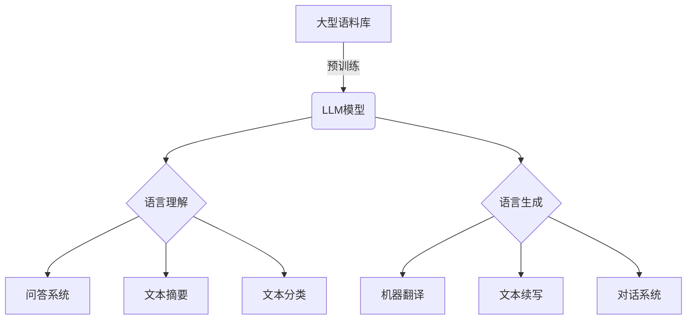
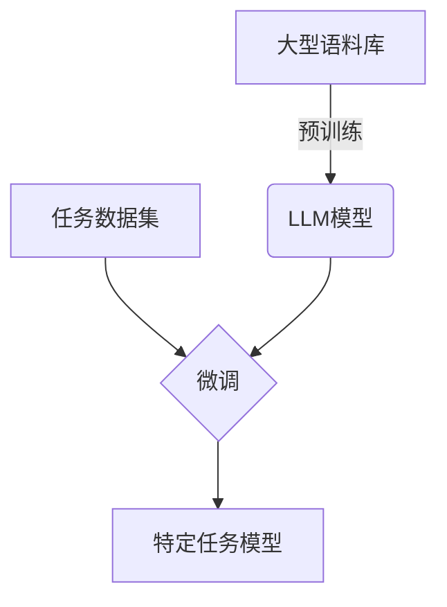
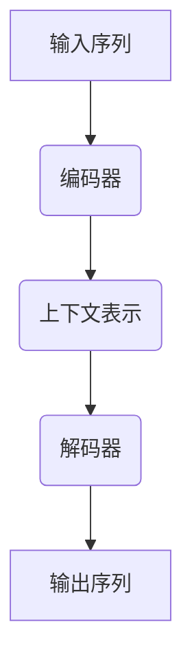

# AI LLM在遗传学研究中的新方法

## 1.背景介绍

### 1.1 遗传学研究的重要性

遗传学是一门研究生物遗传规律和遗传机制的科学,是现代生命科学的基础。它不仅对于揭示生命的奥秘、探索生物的进化历程具有重要意义,而且在医学、农业、环境保护等诸多领域也有着广泛的应用前景。

随着高通量测序技术的不断发展,生物数据的积累呈指数级增长,为遗传学研究提供了前所未有的机遇。然而,海量的生物数据也给传统的数据分析方法带来了巨大挑战。如何高效地从这些庞大的数据中提取有价值的信息,成为摆在科研工作者面前的一个紧迫课题。

### 1.2 人工智能在遗传学中的应用

人工智能(AI)技术,尤其是深度学习等机器学习算法,已经在图像识别、自然语言处理等领域取得了卓越的成就。近年来,AI技术也开始在生物信息学领域发挥作用,为遗传学研究注入新的活力。

大型语言模型(LLM)是当前AI领域的一个热门方向。LLM通过对大量自然语言数据进行预训练,学习语言的内在规律和知识表示,从而获得强大的语言理解和生成能力。一些知名的LLM模型,如GPT-3、PaLM、ChatGPT等,已经展现出令人惊叹的性能,在多个领域获得了广泛应用。

## 2.核心概念与联系  

### 2.1 大型语言模型(LLM)

大型语言模型(LLM)是一种基于自然语言处理(NLP)技术的深度学习模型。它通过对海量自然语言数据(如网页、书籍、新闻等)进行预训练,学习语言的语法、语义和上下文信息,从而获得强大的语言理解和生成能力。

LLM的核心思想是利用自注意力机制(Self-Attention)和变换器(Transformer)架构,有效地捕捉输入序列中的长程依赖关系,从而更好地理解和生成自然语言。通过增加模型规模(参数数量)和训练数据量,LLM可以显著提高语言理解和生成的质量。



### 2.2 LLM在遗传学中的应用场景

在遗传学研究中,LLM可以发挥重要作用:

1. **生物文献挖掘**: LLM能够高效地从大量生物医学文献中提取关键信息,如基因、蛋白质、疾病等实体及其关系,为后续的数据分析奠定基础。

2. **知识库构建**: 利用LLM从非结构化文本中提取知识,并将其组织成结构化的知识库,为研究人员提供有价值的知识资源。

3. **问答系统**: 基于LLM构建生物医学领域的问答系统,帮助研究人员快速获取所需的专业知识。

4. **实验设计优化**: LLM可以分析历史实验数据,提供实验设计的优化建议,提高实验效率。

5. **结果解释**: LLM能够根据实验结果,生成自然语言的解释性文本,帮助研究人员更好地理解实验结果的含义。

## 3.核心算法原理具体操作步骤

### 3.1 LLM的训练过程

LLM的训练过程可以分为两个阶段:预训练(Pre-training)和微调(Fine-tuning)。

#### 3.1.1 预训练

预训练阶段的目标是让LLM模型从大量的自然语言数据中学习通用的语言知识。常见的预训练目标包括:

1. **蒙特卡罗(Masked LM, MLM)**: 随机掩蔽输入序列中的一些词,要求模型预测被掩蔽的词。

2. **下一句预测(Next Sentence Prediction, NSP)**: 判断两个句子是否为连续的句子对。

3. **因果语言建模(Causal LM)**: 给定前文,预测下一个词或句子。

以GPT模型为例,其预训练过程使用了因果语言建模目标。训练数据是大量的自然语言文本,如书籍、网页等。模型通过最小化输入文本的交叉熵损失,学习生成下一个词或句子的概率分布。

预训练过程通常需要大量计算资源,耗时很长。但预训练一次后,得到的模型可以在多个下游任务中进行微调和迁移学习,从而节省了大量的计算开销。

#### 3.1.2 微调

微调阶段的目标是将通用的LLM模型进一步专门化到特定的下游任务上,如文本分类、机器翻译等。

微调过程中,LLM模型的大部分参数被冻结,只对最后几层的参数进行训练。针对目标任务的标注数据被用于训练,通过最小化任务相关的损失函数,模型可以学习到特定任务的知识。

以BERT模型为例,在问答任务的微调过程中,输入是一个问题和上下文段落对,标签是答案在段落中的起止位置。模型需要最小化预测的答案位置与真实位置之间的损失。

微调通常只需要较少的计算资源和标注数据,但可以显著提高LLM在特定任务上的性能表现。



### 3.2 LLM在遗传学中的应用流程

将LLM应用于遗传学研究的一般流程如下:

1. **数据收集**: 从公开的生物医学文献数据库(如PubMed)中收集大量相关文献。

2. **数据预处理**: 对文献数据进行必要的清洗和格式化,构建适合LLM模型输入的语料库。

3. **LLM预训练**: 在通用语料库上预训练LLM模型,获得通用的语言表示能力。

4. **任务数据标注**: 针对特定的遗传学任务(如基因关系抽取、疾病知识库构建等),准备少量的高质量标注数据。

5. **LLM微调**: 在标注数据上对LLM模型进行微调,使其专门化到目标任务。

6. **模型评估**: 在保留的测试集上评估微调后模型的性能表现。

7. **模型部署**: 将训练好的LLM模型集成到实际的应用系统中,为遗传学研究提供智能化支持。

8. **持续改进**: 根据模型在实际应用中的表现,不断优化和迭代LLM模型。

该流程可以循环进行,持续提高LLM在遗传学领域的应用效果。

## 4.数学模型和公式详细讲解举例说明

### 4.1 自注意力机制(Self-Attention)

自注意力机制是LLM中的核心组件之一,它能够有效地捕捉输入序列中的长程依赖关系,从而更好地理解和生成自然语言。

给定一个输入序列 $X = (x_1, x_2, \dots, x_n)$,自注意力机制首先计算每个元素 $x_i$ 与所有其他元素之间的相似性得分:

$$
e_{ij} = \frac{(x_iW^Q)(x_jW^K)^T}{\sqrt{d_k}}
$$

其中, $W^Q$ 和 $W^K$ 分别是查询(Query)和键(Key)的线性投影矩阵, $d_k$ 是缩放因子,用于防止点积的值过大导致梯度饱和。

相似性得分 $e_{ij}$ 反映了 $x_i$ 和 $x_j$ 之间的关联程度。通过对得分进行 softmax 归一化,可以得到注意力权重:

$$
\alpha_{ij} = \frac{e^{e_{ij}}}{\sum_{k=1}^n e^{e_{ik}}}
$$

注意力权重 $\alpha_{ij}$ 表示 $x_i$ 对 $x_j$ 的注意力分布。

最后,将注意力权重与值(Value)向量 $x_jW^V$ 相乘并求和,即可得到 $x_i$ 的注意力表示:

$$
\text{Attention}(x_i) = \sum_{j=1}^n \alpha_{ij}(x_jW^V)
$$

自注意力机制能够自适应地为每个元素分配注意力权重,从而更好地捕捉序列中的重要信息。

### 4.2 变换器(Transformer)架构

变换器是LLM中常用的序列到序列(Seq2Seq)模型架构,它完全基于自注意力机制,避免了传统循环神经网络(RNN)的缺陷。

变换器由编码器(Encoder)和解码器(Decoder)两部分组成。编码器将输入序列映射为上下文表示,解码器则基于上下文表示生成目标序列。



编码器和解码器都由多个相同的层组成,每层包含以下子层:

1. **多头自注意力(Multi-Head Attention)**: 将自注意力机制并行运行多次,捕捉不同的依赖关系模式。

2. **前馈网络(Feed-Forward Network)**: 对每个位置的表示进行非线性变换,提供位置ewise的特征交互。

3. **残差连接(Residual Connection)**: 将输入和子层的输出相加,有助于梯度传播和模型优化。

4. **层归一化(Layer Normalization)**: 对每个子层的输出进行归一化,加速收敛并提高模型稳定性。

变换器架构完全基于注意力机制,避免了RNN的梯度消失问题,能够更好地并行计算,从而提高了训练效率。同时,多头注意力和残差连接等技术也进一步增强了模型的表示能力。

变换器架构在机器翻译、语言模型等多个NLP任务中表现出色,也是当前主流LLM模型(如GPT、BERT等)的核心架构。

## 5.项目实践:代码实例和详细解释说明

在这一部分,我们将通过一个实际的代码示例,演示如何使用 Hugging Face 的 Transformers 库对 LLM 模型进行微调,并将其应用于基因关系抽取任务。

### 5.1 任务介绍

基因关系抽取是生物文献挖掘的一个重要任务,旨在从生物医学文献中自动识别出基因/蛋白质实体及其关系。这对于构建基因调控网络、揭示生物学机制等研究具有重要意义。

我们将使用 Hugging Face 提供的 PubMedQA 数据集,该数据集包含了大量标注的 PubMed 摘要和基因/蛋白质实体及其关系。我们的目标是微调一个 LLM 模型,使其能够从给定的文本中准确抽取出基因/蛋白质实体及其关系。

### 5.2 代码示例

```python
from transformers import AutoTokenizer, AutoModelForTokenClassification
from transformers import TrainingArguments, Trainer
from datasets import load_dataset

# 加载数据集
dataset = load_dataset("huggingface/PubMedQA")

# 加载预训练模型和分词器
model_name = "microsoft/BiomedNLP-PubMedBERT-base-uncased-abstract-fulltext"
tokenizer = AutoTokenizer.from_pretrained(model_name)
model = AutoModelForTokenClassification.from_pretrained(model_name, num_labels=7)

# 定义训练参数
args = TrainingArguments(
    output_dir="./results",
    evaluation_strategy="epoch",
    learning_rate=2e-5,
    per_device_train_batch_size=16,
    per_device_eval_batch_size=16,
    num_train_epochs=3,
    weight_decay=0.01,
)

# 定义数据预处理函数
def tokenize_and_align_labels(examples):
    tokenized_inputs = tokenizer(examples["text"], truncation=True, is_split_into_words=True)
    labels = []
    