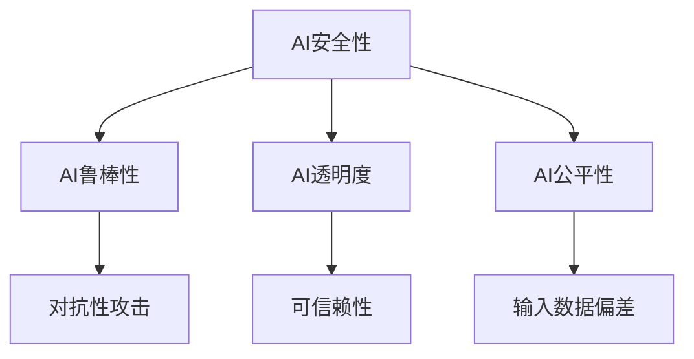

## 1.背景介绍

在人工智能（AI）的发展过程中，AI安全性已经成为了一个不可忽视的重要议题。AI安全性指的是在设计和实现AI系统时，确保其按照预期的方式运行，并防止可能的恶意使用。这个领域的研究包括了如何防止AI系统被黑客攻击，如何防止AI系统在学习过程中发生偏差，以及如何确保AI系统的决策过程是透明和可解释的。

## 2.核心概念与联系

AI安全性的核心概念包括AI鲁棒性、AI透明度和AI公平性。

1. AI鲁棒性：AI系统在面对各种各样的输入时，都能够给出正确的输出，而不会被恶意输入所欺骗。例如，对抗性攻击就是一种威胁AI鲁棒性的方式。

2. AI透明度：AI系统的决策过程是可以被人类理解和解释的。这是确保AI系统的可信赖性的关键。

3. AI公平性：AI系统在做出决策时，不会因为输入数据的偏差而产生不公平的结果。

这三个概念之间存在着密切的联系。例如，如果一个AI系统的鲁棒性不强，那么它的决策过程就可能被恶意输入影响，从而影响到AI系统的公平性。同样，如果一个AI系统的决策过程不透明，那么我们就无法判断这个AI系统是否公平。



## 3.核心算法原理具体操作步骤

在AI安全性的研究中，我们常常需要通过设计特殊的算法来保证AI系统的鲁棒性、透明度和公平性。下面，我将以保证AI鲁棒性为例，介绍一种常用的方法：对抗性训练。

对抗性训练的步骤如下：

1. 生成对抗性样本：对于一个已经训练好的AI模型，我们可以通过添加一些小的扰动到输入数据，使得AI模型的输出发生错误。

2. 使用对抗性样本进行训练：将生成的对抗性样本和原始的训练数据一起，用来训练AI模型。

3. 重复上述步骤，直到AI模型的鲁棒性达到满意的程度。

## 4.数学模型和公式详细讲解举例说明

对抗性训练的数学模型可以表示为以下的优化问题：

$$
\min_{\theta} \mathbb{E}_{(x,y)\sim D}[\max_{\delta\in S} L(f_\theta(x+\delta), y)]
$$

其中，$\theta$表示AI模型的参数，$D$表示数据分布，$S$表示允许的扰动集合，$L$表示损失函数，$f_\theta$表示由参数$\theta$定义的AI模型。

这个优化问题的意思是，我们希望找到一组参数$\theta$，使得对于数据分布$D$中的每一个样本$(x,y)$，即使在最坏的扰动$\delta$下，AI模型的预测误差也能够最小。

## 5.项目实践：代码实例和详细解释说明

下面，我将通过一个简单的例子来演示如何进行对抗性训练。在这个例子中，我们将使用Python的`pytorch`库来实现对抗性训练。

```python
import torch
import torch.nn as nn
import torch.optim as optim

# 定义AI模型
model = nn.Sequential(
    nn.Linear(28*28, 256),
    nn.ReLU(),
    nn.Linear(256, 10)
)

# 定义损失函数
criterion = nn.CrossEntropyLoss()

# 定义优化器
optimizer = optim.Adam(model.parameters())

# 对抗性训练
for epoch in range(10):
    for x, y in dataloader:
        # 生成对抗性样本
        x_adv = x + 0.01 * torch.sign(x.grad)
        
        # 使用对抗性样本进行训练
        optimizer.zero_grad()
        y_pred = model(x_adv)
        loss = criterion(y_pred, y)
        loss.backward()
        optimizer.step()
```

在这段代码中，我们首先定义了一个简单的AI模型，然后定义了交叉熵损失函数和Adam优化器。在对抗性训练的过程中，我们首先生成对抗性样本，然后使用对抗性样本来更新AI模型的参数。

## 6.实际应用场景

AI安全性的研究在很多领域都有着广泛的应用。例如，在自动驾驶领域，我们需要确保AI系统不会被恶意的输入所欺骗，从而做出错误的决策。在金融领域，我们需要确保AI系统在做出贷款决策时，不会因为输入数据的偏差而产生不公平的结果。在医疗领域，我们需要确保AI系统的决策过程是透明的，以便医生和患者能够理解AI系统的决策依据。

## 7.工具和资源推荐

在AI安全性的研究中，有很多优秀的工具和资源可以帮助我们更好地理解和实现AI安全性。例如，`cleverhans`库提供了一系列的工具来生成对抗性样本和进行对抗性训练。`fairlearn`库提供了一系列的工具来评估和改善AI系统的公平性。`lime`和`shap`库提供了一系列的工具来解释AI系统的决策过程。

## 8.总结：未来发展趋势与挑战

随着AI技术的快速发展，AI安全性的研究将会面临更多的挑战。例如，如何防止更复杂的对抗性攻击，如何确保更复杂的AI系统的透明度，以及如何处理更复杂的数据偏差问题。但是，我相信，只要我们继续深入研究，我们就一定能够找到解决这些问题的方法。

## 9.附录：常见问题与解答

1. 问题：为什么需要进行对抗性训练？

   答：对抗性训练可以提高AI系统的鲁棒性，使其在面对恶意输入时，仍能够给出正确的输出。

2. 问题：如何生成对抗性样本？

   答：一种常见的方法是，对于一个已经训练好的AI模型，我们可以通过添加一些小的扰动到输入数据，使得AI模型的输出发生错误。

3. 问题：如何评估AI系统的公平性？

   答：一种常见的方法是，通过统计AI系统在不同群体（如不同性别、不同年龄、不同种族等）的预测结果，来评估AI系统是否存在不公平的现象。

作者：禅与计算机程序设计艺术 / Zen and the Art of Computer Programming