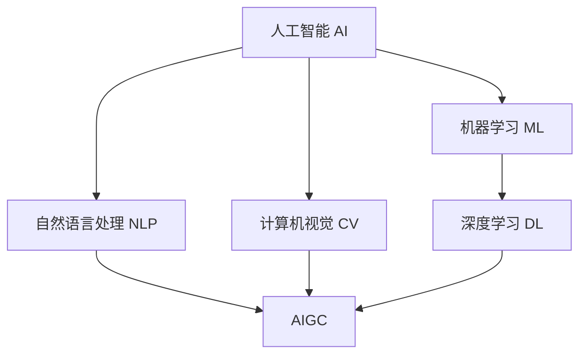

# AIGC从入门到实战：AIGC 带来职场新范式，让 AI 帮你干活，你可以做更多有价值的事

## 1.背景介绍

人工智能生成内容(AIGC)是近年来人工智能领域最热门的研究方向之一。随着大语言模型(LLMs)、扩散模型等AI技术的突破性进展,AIGC在文本、图像、音频、视频等多模态内容生成方面展现出了惊人的能力。从OpenAI的ChatGPT、DALL-E到Midjourney、Stable Diffusion,再到最近的Claude、文心一言等,一系列AIGC应用的出现正在深刻改变我们的工作和生活方式。

AIGC不仅能提高内容创作的效率,更重要的是它正在催生全新的商业模式和就业岗位。随着AIGC工具的不断普及,未来每个人都有机会成为内容创作者,AI助手将成为知识工作者的得力助手。我们即将迎来人机协作的新时代,AIGC将帮助我们从繁琐的重复性工作中解放出来,让我们有更多时间和精力去做更有价值和创造力的事情。

本文将从AIGC的核心概念出发,深入剖析其背后的关键技术,并通过项目实践详细讲解如何利用AIGC工具提升工作效率。同时展望AIGC在各行各业的应用前景,以及未来可能面临的机遇与挑战。相信通过本文的学习,你一定能掌握AIGC的实战技能,让AI成为你职场进阶的"秘密武器"。

## 2.核心概念与联系
### 2.1 人工智能(AI)
人工智能是计算机科学的一个分支,旨在开发能够模仿人类智能行为的计算机系统。AI系统通过机器学习算法,从大量数据中自主学习和提取模式,从而获得感知、推理、决策等智能能力。

### 2.2 机器学习(ML)
机器学习是实现AI的主要方法,通过设计高效的学习算法,使计算机系统能够自动从数据中学习规律,不断优化和完善自身的性能。常见的机器学习算法包括监督学习、无监督学习、强化学习等。

### 2.3 深度学习(DL) 
深度学习是机器学习的一个重要分支,基于人工神经网络(ANN)结构,通过多层非线性变换对输入数据进行特征提取和抽象。深度学习模型通过端到端的学习方式,自动从海量复杂数据中学习高层次特征表示。

### 2.4 自然语言处理(NLP)
自然语言处理是AI的一个重要应用领域,旨在赋予计算机理解、生成和处理人类语言的能力。NLP涉及语法分析、语义理解、文本分类、机器翻译、信息抽取、文本生成等一系列技术。

### 2.5 计算机视觉(CV)
计算机视觉是AI的另一个重要分支,致力于开发能够从图像和视频中提取语义信息的计算机系统。CV涵盖图像分类、目标检测、语义分割、人脸识别等多个研究方向。

### 2.6 AIGC
AIGC是上述AI技术在内容生成领域的集大成者。它综合运用了NLP、CV、语音识别等多模态AI技术,实现了文本、图像、音频、视频等多种形式内容的自动生成。AIGC的内核是大规模预训练语言模型和生成式对抗网络。

### 核心概念关系图

## 3.核心算法原理具体操作步骤
### 3.1 Transformer 
Transformer是AIGC的核心基础模型,采用了全注意力机制和自回归的架构。与传统的RNN、CNN等模型相比,Transformer在处理长序列数据时具有并行计算和捕捉长距离依赖的优势。

Transformer的编码器由多层自注意力层和前馈神经网络组成,用于将输入序列映射为隐藏状态表示。解码器同样由多层自注意力层、编码-解码注意力层和前馈神经网络组成,用于根据编码器的输出和之前的预测结果,自回归地生成目标序列。

Transformer的具体操作步骤如下:
1. 输入嵌入:将离散的输入符号转换为连续的向量表示。
2. 位置编码:在嵌入向量中加入表征位置信息的位置向量。
3. 多头自注意力:通过缩放点积计算Query、Key、Value的注意力权重,捕捉序列内和序列间的依赖关系。 
4. 残差连接和层归一化:对自注意力的输出进行短接连接并做层归一化,缓解梯度消失问题。
5. 前馈神经网络:通过两层全连接网络对自注意力的输出进行非线性变换。
6. 最终输出:重复步骤3-5多次,得到Transformer编码器/解码器的最终输出表示。

### 3.2 GPT
GPT(Generative Pre-trained Transformer)是基于Transformer解码器的大规模语言模型,通过自回归的方式进行文本生成。GPT在超大规模语料上进行预训练,学习到了丰富的语言知识和世界知识。

GPT的训练分为两个阶段:预训练和微调。预训练阶段通过自回归语言建模任务,最大化下一个词的条件概率,从而学习通用的语言表示。微调阶段在特定任务的小样本数据上进行监督学习,使模型适应下游任务。

GPT的生成过程如下:
1. 输入提示:给定一个文本提示作为生成的起点。
2. 自回归解码:根据当前的输入,预测下一个最可能的词,并将其加入到生成的序列中。
3. 重复步骤2:不断重复自回归解码,直到达到预设的最大长度或遇到终止符。
4. 采样策略:在每一步选择下一个词时,可以采用贪心搜索、束搜索、随机采样等策略,平衡生成的质量和多样性。

### 3.3 扩散模型
扩散模型是一种基于马尔可夫链的生成式模型,通过迭代的去噪过程实现从随机噪声生成高质量图像。扩散模型由前向噪声过程和后向去噪过程组成。

前向过程通过逐步添加高斯噪声,将真实数据分布转换为易于采样的先验分布。后向过程通过学习一系列去噪器,逐步还原出真实数据分布。去噪器可以用条件卷积神经网络或Transformer实现。

扩散模型的生成步骤如下:
1. 随机采样:从标准高斯分布中采样一个随机噪声向量作为初始状态。
2. 迭代去噪:在每一步用对应的去噪器预测噪声分量,并从当前状态中减去预测的噪声,得到去噪后的中间状态。
3. 重复步骤2:不断重复去噪过程,直到达到预设的去噪步数。
4. 最终输出:将最后一步的去噪结果作为生成的图像。

扩散模型能够生成高分辨率、高保真度的图像,且具有较强的可控性。通过引入条件信息(如文本描述),扩散模型还可以实现跨模态的图文生成。

## 4.数学模型和公式详细讲解举例说明
### 4.1 Transformer的注意力机制
Transformer的核心是自注意力机制,通过计算Query、Key、Value三个矩阵的相似度,得到注意力权重,实现序列内和序列间的信息聚合。

假设输入序列的嵌入表示为 $X \in \mathbb{R}^{n \times d}$,其中 $n$ 是序列长度, $d$ 是嵌入维度。自注意力的计算过程如下:

$$
\begin{aligned}
Q &= XW_Q \\
K &= XW_K \\
V &= XW_V \\
A &= \text{softmax}(\frac{QK^T}{\sqrt{d_k}})V
\end{aligned}
$$

其中, $W_Q, W_K, W_V \in \mathbb{R}^{d \times d_k}$ 是可学习的参数矩阵, $d_k$ 是注意力的维度。 $A \in \mathbb{R}^{n \times d_v}$ 是注意力聚合后的输出表示。

举例说明,假设输入序列为"I love AI",嵌入维度 $d=6$,注意力维度 $d_k=3$。经过自注意力计算后,每个位置的表示都融合了其他位置的信息,捕捉到了单词之间的依赖关系,如"love"和"AI"的关联性。

### 4.2 GPT的语言模型
GPT采用自回归的语言模型来估计文本序列的概率分布。给定一个长度为 $n$ 的文本序列 $x=(x_1,\dots,x_n)$,GPT的目标是最大化该序列的对数似然概率:

$$
\log p(x) = \sum_{i=1}^n \log p(x_i|x_{<i})
$$

其中, $p(x_i|x_{<i})$ 表示在给定前 $i-1$ 个词的条件下,第 $i$ 个词 $x_i$ 的条件概率。GPT通过Transformer解码器来建模这个条件概率:

$$
p(x_i|x_{<i}) = \text{softmax}(h_i W_e + b_e)
$$

其中, $h_i \in \mathbb{R}^d$ 是解码器在第 $i$ 步的输出表示, $W_e \in \mathbb{R}^{d \times |V|}$ 是词嵌入矩阵, $b_e \in \mathbb{R}^{|V|}$ 是偏置项, $|V|$ 是词表大小。

举例说明,假设GPT在训练过程中遇到了文本序列"I love AI because it is fascinating",通过最大化该序列的对数似然概率,GPT学习到了"love"后面接"AI"、"AI"后面接"because"等语言模式,从而掌握了自然语言的规律。

### 4.3 扩散模型的去噪过程
扩散模型通过迭代的去噪过程,将随机噪声逐步还原为真实数据。假设真实数据分布为 $q(x)$,噪声分布为 $\mathcal{N}(0,I)$,扩散过程为 $T$ 步。前向噪声过程可以表示为:

$$
q(x_t|x_{t-1}) = \mathcal{N}(x_t; \sqrt{1-\beta_t} x_{t-1}, \beta_t I)
$$

其中, $\beta_t \in (0,1)$ 是噪声系数,控制每一步添加噪声的强度。后向去噪过程可以表示为:

$$
p_\theta(x_{t-1}|x_t) = \mathcal{N}(x_{t-1}; \mu_\theta(x_t,t), \sigma_\theta(x_t,t)^2 I)
$$

其中, $\mu_\theta(x_t,t)$ 和 $\sigma_\theta(x_t,t)$ 是去噪器网络 $\epsilon_\theta(x_t,t)$ 预测的均值和标准差。去噪器的目标是最小化以下损失函数:

$$
L_\text{simple} = \mathbb{E}_{t,x_0,\epsilon} \left[ \| \epsilon - \epsilon_\theta(\sqrt{\bar{\alpha}_t} x_0 + \sqrt{1-\bar{\alpha}_t} \epsilon, t) \|^2 \right]
$$

其中, $\bar{\alpha}_t = \prod_{s=1}^t (1-\beta_s)$。

举例说明,假设我们要生成一张 $256 \times 256$ 的猫咪图像。首先从高斯噪声开始,然后通过 $T=1000$ 步的去噪过程,每一步去噪器根据当前的噪声状态预测噪声分量,并从中减去噪声,最终得到一张逼真的猫咪图像。

## 5.项目实践：代码实例和详细解释说明
下面我们通过一个文本生成的项目实例,演示如何使用GPT模型的API接