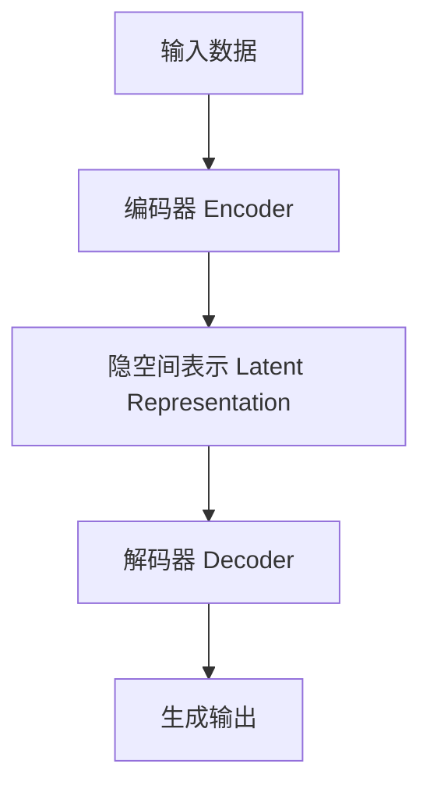

# AIGC从入门到实战：AIGC 的发展历程

## 1.背景介绍
### 1.1 人工智能的起源与发展
#### 1.1.1 图灵测试与人工智能的诞生
#### 1.1.2 人工智能的三次浪潮
#### 1.1.3 深度学习的崛起

### 1.2 AIGC的定义与内涵  
#### 1.2.1 AIGC的概念界定
#### 1.2.2 AIGC与传统AI的区别
#### 1.2.3 AIGC的应用前景

## 2.核心概念与联系
### 2.1 AIGC的核心概念
#### 2.1.1 生成式对抗网络(GAN)
#### 2.1.2 变分自编码器(VAE) 
#### 2.1.3 扩散模型(Diffusion Model)

### 2.2 AIGC的技术架构
#### 2.2.1 编码器-解码器结构
#### 2.2.2 注意力机制与Transformer
#### 2.2.3 AIGC技术架构的演进

## 3.核心算法原理具体操作步骤
### 3.1 GAN的训练过程
#### 3.1.1 生成器与判别器的博弈
#### 3.1.2 损失函数的设计
#### 3.1.3 GAN的训练技巧

### 3.2 VAE的原理与推断过程  
#### 3.2.1 基于变分推断的生成模型
#### 3.2.2 重参数化技巧
#### 3.2.3 VAE的损失函数

### 3.3 扩散模型的生成过程
#### 3.3.1 前向扩散过程
#### 3.3.2 逆向采样过程 
#### 3.3.3 加速扩散模型采样

## 4.数学模型和公式详细讲解举例说明
### 4.1 GAN的数学模型
#### 4.1.1 生成器与判别器的目标函数
$$ \min_{G} \max_{D} V(D,G) = \mathbb{E}_{x \sim p_{data}(x)}[\log D(x)] + \mathbb{E}_{z \sim p_z(z)}[\log (1-D(G(z)))] $$
#### 4.1.2 纳什均衡与优化过程
#### 4.1.3 不同GAN变体的目标函数

### 4.2 VAE的数学模型
#### 4.2.1 变分下界(ELBO)的推导
$$ \log p(x) \geq \mathbb{E}_{q_\phi(z|x)}[\log p_\theta(x|z)] - D_{KL}(q_\phi(z|x) || p(z)) $$
#### 4.2.2 重参数化技巧的数学解释
#### 4.2.3 VAE在不同任务中的损失函数设计

### 4.3 扩散模型的数学原理
#### 4.3.1 马尔可夫链与扩散过程
#### 4.3.2 逆向采样的条件概率计算
$$ p_\theta(x_{t-1}|x_t) = \mathcal{N}(x_{t-1}; \mu_\theta(x_t, t), \Sigma_\theta(x_t, t)) $$
#### 4.3.3 连续时间扩散模型的数学推导

## 5.项目实践：代码实例和详细解释说明
### 5.1 基于GAN的人脸生成
#### 5.1.1 数据集准备与预处理
#### 5.1.2 DCGAN的PyTorch实现
#### 5.1.3 训练过程与生成效果分析

### 5.2 基于VAE的图像重构
#### 5.2.1 卷积VAE的网络结构设计  
#### 5.2.2 VAE的TensorFlow实现
#### 5.2.3 隐空间插值与条件生成

### 5.3 文本到图像生成的扩散模型
#### 5.3.1 CLIP与文本编码器
#### 5.3.2 Stable Diffusion的代码实现
#### 5.3.3 prompt engineering与图像生成实例

## 6.实际应用场景
### 6.1 AIGC在计算机视觉中的应用
#### 6.1.1 图像生成与编辑
#### 6.1.2 视频生成与预测
#### 6.1.3 3D重建与新视角合成

### 6.2 AIGC在自然语言处理中的应用 
#### 6.2.1 文本生成与对话系统
#### 6.2.2 机器翻译与文本风格迁移
#### 6.2.3 知识图谱与问答系统

### 6.3 AIGC在跨模态学习中的应用
#### 6.3.1 文本-图像跨模态生成
#### 6.3.2 语音-视频跨模态合成
#### 6.3.3 多模态预训练模型

## 7.工具和资源推荐
### 7.1 AIGC相关的开源框架
#### 7.1.1 PyTorch与TorchVision
#### 7.1.2 TensorFlow与Keras
#### 7.1.3 Jax与Flax

### 7.2 AIGC相关的预训练模型
#### 7.2.1 BigGAN与StyleGAN
#### 7.2.2 DALL-E与Stable Diffusion
#### 7.2.3 GPT-3与PaLM

### 7.3 AIGC相关的数据集资源
#### 7.3.1 ImageNet与CIFAR
#### 7.3.2 COCO与Visual Genome
#### 7.3.3 WMT与BookCorpus

## 8.总结：未来发展趋势与挑战
### 8.1 AIGC技术的发展趋势 
#### 8.1.1 大规模预训练模型的普及
#### 8.1.2 多模态融合与跨模态迁移
#### 8.1.3 可解释性与可控性的提升

### 8.2 AIGC面临的挑战
#### 8.2.1 数据偏差与公平性问题
#### 8.2.2 版权与伦理道德风险
#### 8.2.3 计算资源与环境成本

### 8.3 AIGC的未来展望
#### 8.3.1 AIGC与元宇宙的结合
#### 8.3.2 AIGC在科研与教育中的应用
#### 8.3.3 AIGC助力创意产业发展

## 9.附录：常见问题与解答
### 9.1 AIGC模型的评估指标有哪些？
### 9.2 如何平衡AIGC模型的多样性和忠实度？
### 9.3 AIGC生成的内容是否有版权归属？
### 9.4 面对AIGC的发展,从业者应该如何提升自己？
### 9.5 AIGC技术在应用落地时有哪些注意事项？

作者：禅与计算机程序设计艺术 / Zen and the Art of Computer Programming