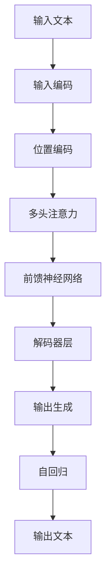
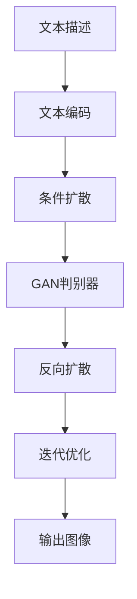

# AIGC从入门到实战：ChatGPT+Midjourney，绘出中国古风意境之美

## 1.背景介绍

### 1.1 AIGC的兴起

人工智能生成内容(AIGC)近年来迅速崛起,引领了创意行业的新浪潮。AIGC技术通过深度学习算法,能够生成逼真的文本、图像、视频和音频等多种形式的内容。其中,ChatGPT和Midjourney分别在自然语言处理和图像生成领域获得了巨大成功,成为AIGC的杰出代表。

### 1.2 ChatGPT:强大的语言模型

ChatGPT是OpenAI开发的一种基于Transformer架构的大型语言模型,拥有惊人的文本生成和理解能力。它可以回答各种问题、撰写文章、编写代码等,展现出接近人类的语言交互水平。ChatGPT的出现,不仅极大提高了自然语言处理的性能,也为各行业的智能应用带来了新的可能性。

### 1.3 Midjourney:创意无界的AI绘画

Midjourney是一款基于人工智能的图像生成工具,能够根据文本描述生成逼真的图像。它采用了最先进的扩散模型和生成对抗网络(GAN)技术,可以捕捉文字描述的细微语义,并将其转化为视觉艺术作品。Midjourney的出现,为艺术创作带来了全新的可能性,让普通用户也能轻松实现绘画梦想。

### 1.4 中国古风意境:艺术与科技的融合

中国古风意境源远流长,蕴含着丰富的文化内涵和审美情趣。通过将ChatGPT和Midjourney这两大AIGC技术相结合,我们可以尝试用全新的方式诠释中国古风意境,探索艺术与科技融合的无限可能。

## 2.核心概念与联系

### 2.1 自然语言处理(NLP)

自然语言处理是人工智能的一个重要分支,旨在使计算机能够理解和生成人类语言。ChatGPT正是基于NLP技术,通过深度学习模型来捕捉语言的语义和上下文信息,从而实现高质量的文本生成和理解。

NLP的核心概念包括:

- **词嵌入(Word Embedding)**: 将单词映射到高维向量空间,以捕捉单词之间的语义关系。
- **序列模型(Sequence Model)**: 处理序列数据(如文本)的模型,如循环神经网络(RNN)和Transformer。
- **注意力机制(Attention Mechanism)**: 帮助模型关注输入序列中的关键部分,提高了长期依赖的建模能力。
- **语言模型(Language Model)**: 学习语言的概率分布,用于生成自然语言文本。

ChatGPT采用了Transformer的序列到序列(Seq2Seq)架构,通过自回归(Autoregressive)方式生成文本,展现出卓越的语言生成能力。

### 2.2 计算机视觉(CV)

计算机视觉是人工智能的另一个重要分支,旨在使计算机能够理解和处理数字图像或视频。Midjourney正是基于CV技术,通过生成对抗网络(GAN)和扩散模型等深度学习模型,将文本描述转化为逼真的图像。

CV的核心概念包括:

- **卷积神经网络(CNN)**: 用于图像识别和特征提取的深度学习模型。
- **生成对抗网络(GAN)**: 由生成器和判别器组成,用于生成逼真的图像或视频。
- **扩散模型(Diffusion Model)**: 通过逆向扩散过程生成高质量图像的新型模型。
- **注意力机制(Attention Mechanism)**: 帮助模型关注图像中的关键区域,提高了对象检测和图像描述的性能。

Midjourney采用了扩散模型和GAN的融合架构,能够根据文本描述生成高质量的图像,展现出令人惊叹的创意能力。

### 2.3 AIGC:NLP与CV的融合

AIGC技术正是将自然语言处理(NLP)和计算机视觉(CV)两大领域紧密结合,实现了文本到图像的无缝转换。通过语言模型捕捉文本语义,再由生成模型将其转化为图像,AIGC为创意表达开辟了全新的可能性。

ChatGPT和Midjourney的结合,正是AIGC技术的典范。用户可以通过ChatGPT输入文本描述,Midjourney则会根据描述生成相应的图像,实现了"以文生图"的创意过程。这种交互方式打破了传统艺术创作的界限,让每个人都能通过语言表达自己的想象,并将其视觉化。

AIGC技术的发展,必将推动艺术创作和内容生产领域发生深刻变革,为人类的创意活动带来无限可能。

## 3.核心算法原理具体操作步骤

### 3.1 ChatGPT:Transformer自回归语言模型

ChatGPT的核心是一种基于Transformer架构的自回归(Autoregressive)语言模型,能够根据给定的文本上下文生成连贯的后续文本。其具体操作步骤如下:

1. **输入编码**:将输入文本序列转换为词嵌入向量序列。
2. **位置编码**:为每个词嵌入向量添加位置信息,以保持序列的位置关系。
3. **多头注意力**:通过自注意力机制,捕捉输入序列中词与词之间的关系。
4. **前馈神经网络**:对注意力输出进行非线性变换,提取更高级的特征表示。
5. **解码器层**:重复执行3和4步骤,生成输出序列的词嵌入表示。
6. **输出生成**:根据输出词嵌入,通过softmax层预测下一个词的概率分布。
7. **自回归**:将预测的词作为输入,重复上述步骤生成后续文本。

通过自回归的方式,ChatGPT能够根据上下文信息逐步生成连贯的文本,展现出了出色的语言生成能力。



### 3.2 Midjourney:扩散模型与GAN相结合

Midjourney采用了扩散模型和生成对抗网络(GAN)相结合的架构,能够根据文本描述生成逼真的图像。其具体操作步骤如下:

1. **文本编码**:将输入的文本描述转换为语义向量表示。
2. **条件扩散**:在扩散过程中,将语义向量作为条件,引导噪声图像逐步去噪。
3. **GAN判别器**:使用GAN的判别器评估生成图像的质量和真实性。
4. **反向扩散**:根据判别器的反馈,调整扩散过程,生成更逼真的图像。
5. **迭代优化**:重复执行2-4步骤,不断优化生成图像的质量。
6. **输出图像**:当达到预期质量时,输出最终的生成图像。

通过将扩散模型和GAN相结合,Midjourney能够根据文本描述生成高质量的图像,展现出了令人惊叹的创意能力。



## 4.数学模型和公式详细讲解举例说明

### 4.1 Transformer自注意力机制

Transformer模型中的自注意力机制是实现长期依赖建模的关键。它允许输入序列中的每个词都能够关注到其他词,捕捉全局的语义关系。自注意力的计算过程可以用以下公式表示:

$$
\begin{aligned}
\text{Attention}(Q, K, V) &= \text{softmax}\left(\frac{QK^T}{\sqrt{d_k}}\right)V \\
\text{MultiHead}(Q, K, V) &= \text{Concat}(\text{head}_1, \ldots, \text{head}_h)W^O\\
\text{where}\  \text{head}_i &= \text{Attention}(QW_i^Q, KW_i^K, VW_i^V)
\end{aligned}
$$

其中:

- $Q$、$K$、$V$分别表示查询(Query)、键(Key)和值(Value)向量。
- $d_k$是缩放因子,用于防止点积的值过大导致softmax饱和。
- $W_i^Q$、$W_i^K$、$W_i^V$和$W^O$是可学习的线性变换矩阵。

多头注意力机制通过并行计算多个注意力头,能够从不同的子空间捕捉不同的语义关系,提高了模型的表达能力。

以一个简单的例子来说明自注意力机制:

假设输入序列为"今天天气很好,我们去郊游吧"。在计算第三个词"很"的注意力时,模型会关注到"天气"这个关键词,从而能够正确捕捉"很好"这个语义。同时,它也会关注到"我们"和"去郊游"等词,建立整个句子的语义关联。通过自注意力机制,Transformer能够更好地理解和生成自然语言。

### 4.2 GAN生成对抗网络

生成对抗网络(GAN)是一种用于生成式建模的深度学习架构,由生成器和判别器两个神经网络组成。生成器的目标是生成逼真的样本,而判别器则试图区分生成的样本和真实样本。两个网络相互对抗,最终达到一种动态平衡,使生成器能够生成高质量的样本。GAN的目标函数可以表示为:

$$
\begin{aligned}
\min_G \max_D V(D, G) &= \mathbb{E}_{x \sim p_{\text{data}}(x)}[\log D(x)] + \mathbb{E}_{z \sim p_z(z)}[\log(1 - D(G(z)))]\\
&= \mathbb{E}_{x \sim p_{\text{data}}(x)}[\log D(x)] + \mathbb{E}_{x \sim p_g(x)}[\log(1 - D(x))]
\end{aligned}
$$

其中:

- $G$是生成器网络,将噪声向量$z$映射到样本空间。
- $D$是判别器网络,试图区分真实样本$x$和生成样本$G(z)$。
- $p_{\text{data}}(x)$是真实数据分布,而$p_g(x)$是生成器的数据分布。

在训练过程中,生成器和判别器通过最小化相应的损失函数进行对抗式学习,最终达到一种纳什均衡,使生成器能够生成逼真的样本。

GAN在图像生成领域取得了巨大成功,但也存在训练不稳定、模式坍塌等问题。因此,Midjourney采用了扩散模型与GAN相结合的架构,以提高生成图像的质量和多样性。

## 5.项目实践:代码实例和详细解释说明

为了更好地理解AIGC技术的实现原理,我们将通过一个实际项目来演示如何使用ChatGPT和Midjourney生成中国古风意境图像。

### 5.1 准备工作

1. **安装Midjourney Discord Bot**:Midjourney目前以Discord机器人的形式提供服务,因此我们需要先在Discord上加入Midjourney官方服务器。

2. **获取ChatGPT API密钥**:如果需要在自己的应用程序中集成ChatGPT,可以从OpenAI官网申请API密钥。

3. **选择开发环境**:本示例使用Python作为开发语言,并利用相关库与ChatGPT API和Midjourney Bot进行交互。

### 5.2 与ChatGPT交互

我们首先通过ChatGPT生成一段描述中国古风意境的文本,作为Midjourney生成图像的输入。以下是Python代码示例:

```python
import openai

# 设置OpenAI API密钥
openai.api_key = "your_openai_api_key"

# 定义提示
prompt = "请生成一段描述中国古风意境的文本,包括山水、建筑、人物等元素。"

# 调用ChatGPT API生成文本
response = openai.Completion.create(
    engine="