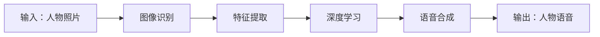

## 1.背景介绍

在这个数字化的时代，人们已经习惯了通过照片来记录生活的点滴。然而，随着技术的发展，人们开始期待更多。如果我们可以通过AI技术，让照片中的人物“说话”，那将会是怎样的体验呢？这就是我们今天要探讨的议题：AI生成人物语音（AIGC）。

## 2.核心概念与联系

AIGC是一种借助深度学习技术，通过人物的照片生成其可能的语音的技术。主要涉及到的技术包括图像识别、语音合成和深度学习等。



## 3.核心算法原理具体操作步骤

AIGC的核心算法主要分为三个步骤：图像识别、特征提取和语音合成。

首先，通过图像识别技术，我们可以从照片中提取出人物的面部特征。这一步通常使用的是卷积神经网络（CNN）。

然后，我们需要将这些面部特征转化为语音特征。这一步的关键是建立一个有效的映射模型，将面部特征映射到语音特征空间。我们通常使用深度学习模型，如自编码器或者变分自编码器来实现这一步。

最后，我们使用语音合成技术，如语音编码器-解码器（Vocoder）来生成人物的语音。

## 4.数学模型和公式详细讲解举例说明

在AIGC中，我们需要使用数学模型来描述和实现上述的算法步骤。这里以自编码器为例，进行详细的讲解。

自编码器是一种神经网络，其结构包括一个编码器和一个解码器。编码器将输入的面部特征编码为一个隐藏层，解码器则将隐藏层解码为语音特征。

编码器的数学模型可以表示为：

$$
h = f(Wx + b)
$$

其中，$x$ 是输入的面部特征，$W$ 和 $b$ 是编码器的权重和偏置，$f$ 是激活函数，$h$ 是隐藏层。

解码器的数学模型可以表示为：

$$
y = g(Vh + c)
$$

其中，$h$ 是隐藏层，$V$ 和 $c$ 是解码器的权重和偏置，$g$ 是激活函数，$y$ 是输出的语音特征。

在训练过程中，我们需要最小化输入特征和输出特征之间的差异，即最小化损失函数：

$$
L = ||x - y||^2
$$

## 5.项目实践：代码实例和详细解释说明

这一部分，我们将通过一个简单的项目实例来展示如何实现AIGC。为了简化问题，我们假设已经有了一个预训练的面部特征提取模型和一个语音合成模型，我们只需要实现特征映射部分。

这里我们使用PyTorch框架来实现。首先，我们定义自编码器的结构。

```python
import torch
import torch.nn as nn

class Autoencoder(nn.Module):
    def __init__(self):
        super(Autoencoder, self).__init__()
        self.encoder = nn.Sequential(
            nn.Linear(2048, 1024),
            nn.ReLU(True),
            nn.Linear(1024, 512),
            nn.ReLU(True))
        self.decoder = nn.Sequential(
            nn.Linear(512, 1024),
            nn.ReLU(True),
            nn.Linear(1024, 2048),
            nn.ReLU(True))

    def forward(self, x):
        x = self.encoder(x)
        x = self.decoder(x)
        return x
```

然后，我们定义训练函数。

```python
def train(model, data_loader, criterion, optimizer, num_epochs):
    for epoch in range(num_epochs):
        for data in data_loader:
            img, _ = data
            img = img.view(img.size(0), -1)
            img = Variable(img)
            # ===================forward=====================
            output = model(img)
            loss = criterion(output, img)
            # ===================backward====================
            optimizer.zero_grad()
            loss.backward()
            optimizer.step()
        # ===================log========================
        print('epoch [{}/{}], loss:{:.4f}'.format(epoch+1, num_epochs, loss.data))
```

在这个代码中，我们首先定义了自编码器的结构，然后定义了训练函数。在训练函数中，我们使用了均方误差作为损失函数，使用了Adam优化器。

## 6.实际应用场景

AIGC有很多潜在的应用场景。例如，在娱乐领域，我们可以使用AIGC来为动画人物生成语音。在安全领域，我们可以使用AIGC来辅助人脸识别，提高识别的准确性。在教育领域，我们可以使用AIGC来为历史人物生成语音，使历史更加生动。

## 7.工具和资源推荐

如果你对AIGC感兴趣，这里有一些推荐的工具和资源：

- 工具：PyTorch是一款非常适合深度学习的开源工具，它具有丰富的功能和良好的社区支持。
- 资源：Deep Learning by Ian Goodfellow, Yoshua Bengio and Aaron Courville是一本非常好的深度学习入门书籍，其中详细介绍了自编码器等多种神经网络模型。

## 8.总结：未来发展趋势与挑战

AIGC是一个非常有前景的研究方向，它有很多潜在的应用场景。然而，AIGC也面临着一些挑战，例如如何提高语音的自然性和可信度，如何处理多样性和复杂性等。

## 9.附录：常见问题与解答

1. **问：AIGC是什么？**
   答：AIGC是AI生成人物语音的简称，它是一种借助深度学习技术，通过人物的照片生成其可能的语音的技术。

2. **问：AIGC的核心算法是什么？**
   答：AIGC的核心算法主要包括图像识别、特征提取和语音合成。

3. **问：AIGC有哪些应用场景？**
   答：AIGC有很多潜在的应用场景，例如在娱乐、安全和教育领域。

4. **问：AIGC面临哪些挑战？**
   答：AIGC面临的挑战主要包括如何提高语音的自然性和可信度，如何处理多样性和复杂性等。

作者：禅与计算机程序设计艺术 / Zen and the Art of Computer Programming