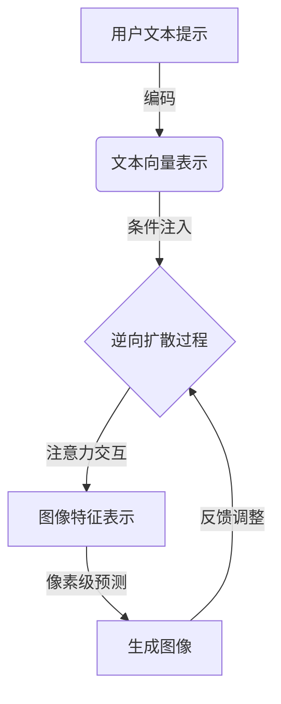

# AIGC从入门到实战：变化：活用Midjourney，你也能成为神笔马良

## 1.背景介绍

### 1.1 人工智能生成内容(AIGC)的兴起

在过去的几年里,人工智能生成内容(AIGC)技术取得了长足的进步,成为了科技界备受关注的热门话题。AIGC指的是利用人工智能算法自动生成文本、图像、音频、视频等多种形式的内容。这项技术的兴起,为内容创作带来了全新的可能性,也对传统的内容生产方式带来了前所未有的冲击。

### 1.2 AIGC图像生成技术的发展历程

在AIGC的多个领域中,图像生成技术发展最为迅猛。早期的图像生成模型如VAE(Variational Autoencoder)、GAN(Generative Adversarial Network)等,虽然取得了一定的进展,但生成的图像质量和多样性仍然有待提高。

2022年,AIGC图像生成技术取得了重大突破,出现了一系列革命性的新模型,如Stable Diffusion、DALL-E 2、Midjourney等。这些模型采用了全新的架构设计和训练方法,生成的图像在分辨率、细节、多样性等方面都有了质的飞跃,令人叹为观止。

### 1.3 Midjourney:图像生成的"黑马"

在这些新兴AIGC图像生成模型中,Midjourney无疑是最亮眼的"黑马"。它是一款基于Stable Diffusion的AI绘画工具,由一家独立的人工智能研究实验室开发。尽管起步较晚,但Midjourney凭借出色的图像质量和创意性,在短时间内就赢得了大量用户的青睐,成为了图像生成领域的佼佼者。

Midjourney的成功,很大程度上归功于它强大的文本到图像生成能力。用户只需输入一个简单的文本提示,Midjourney就能根据提示生成令人惊艳的图像,实现了"以画代码"的梦想。这种全新的创作方式,极大地降低了绘画的门槛,让每个人都能释放无穷的创造力。

本文将全面解析Midjourney的核心技术原理,并提供实战指南,帮助读者从入门到精通,活用这一革命性的AIGC工具,在图像创作的浪潮中勇立潮头。

## 2.核心概念与联系

### 2.1 生成式对抗网络(GAN)

要理解Midjourney的工作原理,我们首先需要了解生成式对抗网络(GAN)这一核心概念。GAN是一种由两个神经网络组成的架构,包括一个生成器(Generator)和一个判别器(Discriminator)。

生成器的任务是从随机噪声中生成逼真的数据样本(如图像),而判别器则需要判断生成的样本是真实数据还是伪造的。两个网络相互对抗,生成器努力生成更逼真的样本来迷惑判别器,而判别器则努力提高辨别能力。在这个过程中,生成器和判别器都会不断改进,最终达到一个平衡状态,生成器能够生成高度逼真的数据样本。

GAN架构在图像生成、语音合成等领域取得了巨大成功,但也存在一些缺陷,如训练不稳定、模式坍塌等。Midjourney采用了一种改进的GAN变体——扩散模型(Diffusion Model),以克服这些问题。

### 2.2 扩散模型(Diffusion Model)

扩散模型是一种全新的生成模型范式,它通过学习一个逆向扩散过程来生成高质量的数据样本。扩散过程是一个将数据(如图像)逐步破坏的噪声添加过程,而逆向扩散则是从纯噪声中重建原始数据的过程。

扩散模型的训练过程包括两个阶段:

1. 正向扩散过程:向原始数据中添加越来越多的噪声,直到完全破坏数据。
2. 逆向扩散过程:从纯噪声开始,通过一系列去噪步骤,逐步重建原始数据。

通过学习这个逆向过程,扩散模型能够从任意噪声分布中生成新的、高质量的数据样本。与GAN相比,扩散模型具有训练更加稳定、避免模式坍塌等优势,因此被广泛应用于图像、音频、视频等领域的生成任务。

Midjourney正是基于扩散模型的理念,通过文本提示来指导逆向扩散过程,从而生成符合用户意图的图像。

### 2.3 文本到图像生成(Text-to-Image Generation)

文本到图像生成是指根据用户输入的文本描述,生成相应的图像。这是一项极具挑战的任务,需要模型能够理解自然语言的语义,并将其映射到视觉表征上。

Midjourney采用了一种被称为"提示引导"(Prompt Guiding)的技术来实现文本到图像的生成。在逆向扩散过程中,模型会将用户输入的文本提示编码为一个向量,并将其作为条件引导图像生成的过程。通过这种方式,模型能够捕捉文本提示中蕴含的语义信息,并将其反映在生成的图像中。

除了文本提示,Midjourney还支持其他形式的条件引导,如参考图像、插画风格等,使得生成的图像更加个性化和多样化。

### 2.4 注意力机制(Attention Mechanism)

注意力机制是近年来在自然语言处理和计算机视觉领域广泛应用的一种技术,它能够让模型更好地捕捉输入数据中的长期依赖关系。

在Midjourney中,注意力机制被用于编码文本提示和图像特征,以及在逆向扩散过程中的跨步骤信息传递。通过注意力机制,模型能够更好地理解文本提示的语义,并在生成图像时关注到最关键的视觉元素。

此外,注意力机制还能够帮助模型捕捉图像中的长程空间依赖关系,从而生成更加连贯、细节丰富的图像。

## 3.核心算法原理具体操作步骤

### 3.1 扩散模型的正向过程

扩散模型的正向过程是一个将原始数据(如图像)逐步破坏的噪声添加过程。具体步骤如下:

1. 初始化一个纯净的数据样本 $x_0$,通常是一个图像。

2. 对于每个时间步 $t=1,2,...,T$:
   a. 从一个已知的噪声分布 $q(x_t|x_{t-1})$ 中采样一个噪声张量 $\epsilon_t$。
   b. 根据转移函数 $x_t = \sqrt{\alpha_t}x_{t-1} + \sqrt{1-\alpha_t}\epsilon_t$ 计算 $x_t$,其中 $\alpha_t$ 是一个预定义的方差系数。

3. 重复步骤2,直到 $t=T$,此时 $x_T$ 就是一个纯噪声张量,原始数据已被完全破坏。

整个正向过程可以用下面的公式表示:

$$
q(x_{1:T}|x_0) = \prod_{t=1}^T q(x_t|x_{t-1})
$$

其中 $q(x_t|x_{t-1})$ 是已知的噪声分布,用于在每个时间步添加噪声。

### 3.2 扩散模型的逆向过程

逆向过程是从纯噪声开始,通过一系列去噪步骤,逐步重建原始数据的过程。具体步骤如下:

1. 初始化一个纯噪声张量 $x_T$。

2. 对于每个时间步 $t=T,T-1,...,1$:
   a. 使用编码器网络 $e_\theta$ 从 $x_t$ 中提取特征表示 $e_t = e_\theta(x_t, t)$。
   b. 使用预测网络 $p_\phi$ 根据特征表示 $e_t$ 和条件 $y$ (如文本提示)预测去噪方向 $\epsilon_\theta(x_t, t, y)$。
   c. 根据转移函数 $x_{t-1} = \frac{1}{\sqrt{\alpha_t}}(x_t - \sqrt{1-\alpha_t}\epsilon_\theta(x_t, t, y))$ 计算 $x_{t-1}$。

3. 重复步骤2,直到 $t=1$,此时 $x_0$ 就是重建的原始数据。

整个逆向过程可以用下面的公式表示:

$$
p_\theta(x_{0:T}|y) = p(x_T)\prod_{t=1}^T p_\theta(x_{t-1}|x_t, y)
$$

其中 $p_\theta(x_{t-1}|x_t, y)$ 是由编码器网络 $e_\theta$ 和预测网络 $p_\phi$ 共同参数化的条件概率分布,用于从噪声中重建原始数据。

通过学习这个逆向过程,扩散模型能够从任意噪声分布中生成新的、高质量的数据样本,并且可以通过条件 $y$ (如文本提示)来控制生成的内容。

### 3.3 Midjourney的文本到图像生成流程

Midjourney将扩散模型和注意力机制相结合,实现了强大的文本到图像生成能力。其核心流程如下:

1. **文本编码**:用户输入的文本提示首先被编码为一个向量表示,通常使用Transformer等注意力模型。

2. **条件注入**:在逆向扩散过程的每个时间步,文本向量都会被注入到模型中,作为条件引导图像生成。

3. **注意力交互**:通过跨注意力层,模型可以捕捉文本和图像特征之间的相互作用,更好地理解文本语义并将其映射到视觉表征上。

4. **像素级预测**:在每个时间步,模型会预测当前噪声图像到下一个清晰图像的转移,通过逐步去噪最终生成符合文本描述的图像。

5. **反馈调整**:生成的图像会被送回模型,用于进一步优化文本理解和图像生成,形成一个闭环过程。

这个流程的核心在于注意力机制和条件引导,使得模型能够充分利用文本提示的语义信息,并将其融入到图像生成的每个环节中,从而生成高质量、高度相关的图像。

## 4.数学模型和公式详细讲解举例说明

### 4.1 扩散模型的数学表达

扩散模型的数学表达是建立在一个马尔可夫链上的。我们定义一个从 $x_0$ 到 $x_T$ 的马尔可夫链,其中 $x_T$ 是一个纯噪声张量,而 $x_0$ 是我们想要生成的原始数据。

正向扩散过程可以表示为:

$$
q(x_{1:T}|x_0) = \prod_{t=1}^T q(x_t|x_{t-1})
$$

其中 $q(x_t|x_{t-1})$ 是一个已知的高斯噪声分布,用于在每个时间步添加噪声。具体来说,它可以写成:

$$
q(x_t|x_{t-1}) = \mathcal{N}(x_t; \sqrt{\alpha_t}x_{t-1}, (1-\alpha_t)\mathbf{I})
$$

其中 $\alpha_t$ 是一个预定义的方差系数,控制了每个时间步添加的噪声量。

相应地,逆向过程可以表示为:

$$
p_\theta(x_{0:T}|y) = p(x_T)\prod_{t=1}^T p_\theta(x_{t-1}|x_t, y)
$$

其中 $p_\theta(x_{t-1}|x_t, y)$ 是一个由神经网络参数化的条件概率分布,用于从噪声 $x_t$ 和条件 $y$ (如文本提示)中重建 $x_{t-1}$。

具体来说,我们可以将 $p_\theta(x_{t-1}|x_t, y)$ 参数化为一个高斯分布:

$$
p_\theta