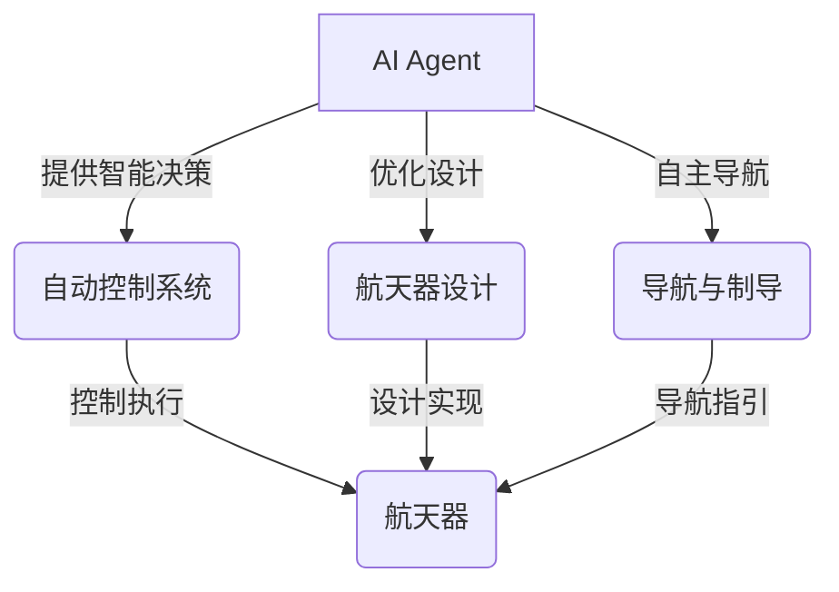
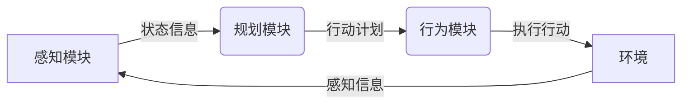
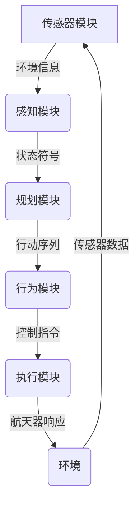

# AI人工智能 Agent：在航天领域中的应用

## 1.背景介绍

### 1.1 航天领域的重要性

航天领域是人类探索宇宙、推进科技进步的重要领域。它不仅涉及航天器的设计、制造和发射,还包括卫星通信、遥感探测、航天医学等多个方面。航天技术的发展对于提高生活质量、促进经济发展、保障国家安全等都有着重要意义。

### 1.2 人工智能在航天领域的作用

传统的航天系统主要依赖人工操作和预先编程的算法,但随着任务复杂度的增加和实时决策需求的提高,人工智能(AI)技术在航天领域的应用变得越来越重要。AI可以提供智能决策支持、自主控制、故障诊断等功能,提高航天系统的智能化水平。

### 1.3 AI Agent的概念

AI Agent是一种具有自主性、响应性、主动性和持续时间概念的软件实体。它能够感知环境,并根据预定目标做出理性决策和行为。AI Agent在航天领域可以扮演多种角色,如自主导航、故障诊断、任务规划等,提高航天系统的智能化水平。

## 2.核心概念与联系

### 2.1 AI Agent的核心概念

#### 2.1.1 理性

理性是AI Agent的核心概念之一。理性代表了Agent能够根据当前状态和目标做出合理的行为决策。在航天领域,理性决策对于确保任务安全、提高效率至关重要。

#### 2.1.2 自主性

自主性意味着AI Agent能够独立地感知环境、规划行动并执行,而不需要人工干预。在航天任务中,自主性可以减轻地面控制的工作负担,提高响应速度。

#### 2.1.3 反应性

反应性指的是AI Agent能够及时地对环境变化做出响应。在航天环境中,反应性对于处理突发情况、避免危险至关重要。

#### 2.1.4 主动性

主动性意味着AI Agent不仅被动响应环境,还能主动规划和执行行动以实现目标。在航天任务中,主动性可以提高效率、发现新的解决方案。

### 2.2 AI Agent与其他航天技术的联系

AI Agent与其他航天技术密切相关,如自动控制、航天器设计、导航与制导等。它们共同构建了智能化的航天系统。



## 3.核心算法原理具体操作步骤

### 3.1 AI Agent的体系结构

AI Agent通常采用由感知、规划、行为三个主要模块组成的体系结构。



1. **感知模块**负责从环境中获取相关信息,如传感器数据、任务状态等,并对这些信息进行处理和解释,输出代表当前状态的符号。
2. **规划模块**根据感知模块提供的状态符号、Agent的目标以及可用的行动集合,运行决策算法计算出最优行动序列。
3. **行为模块**执行规划模块给出的行动序列,并将执行的效果反馈给环境。

### 3.2 典型决策算法

AI Agent的规划模块通常采用搜索算法、规划算法等技术来生成行动序列。

#### 3.2.1 状态空间搜索算法

状态空间搜索算法将问题建模为一个状态空间,其中包含初始状态、目标状态以及能够将一个状态转换为另一状态的运算符(行动)集合。算法在状态空间中搜索一条从初始状态到目标状态的路径(行动序列)。常用的搜索算法包括:

- **A*算法**: 采用启发式函数估计到目标状态的代价,以获得更好的搜索效率。
- **实时A*算法(Real-Time A*)**: 针对动态环境进行在线规划和重新规划。

#### 3.2.2 自动规划算法

自动规划算法将问题建模为一个规划域,包含初始状态、目标状态、行动模型等。算法自动构造出能够从初始状态达到目标状态的行动序列。常用算法包括:

- **经典规划算法**(如状态空间搜索、图规划算法等)
- **启发式搜索规划算法**(如FF、LAMA等)
- **时间规划算法**(如时间初级网络等)

#### 3.2.3 强化学习算法

强化学习算法通过与环境的交互,学习出在给定状态下执行哪些行动能获得最大的累积奖励。这种方法不需要明确建模环境动力学,可以处理复杂的决策问题。常用算法包括:

- **Q-Learning**
- **深度Q网络(DQN)**
- **策略梯度算法**

### 3.3 算法在航天领域的应用

不同的算法适用于不同的航天任务场景:

- **航天器自主导航**: 可采用A*、RRT*等搜索算法进行航线规划。
- **航天器故障诊断**: 可采用基于模型的诊断算法或机器学习算法。  
- **航天器调度**: 可采用约束满足技术、启发式搜索等规划算法。
- **航天器控制**: 可采用强化学习、最优控制等算法。

## 4.数学模型和公式详细讲解举例说明

### 4.1 马尔可夫决策过程(MDP)

马尔可夫决策过程是许多强化学习和规划算法的数学基础模型。一个MDP可以用一个五元组 $\langle\mathcal{S}, \mathcal{A}, \mathcal{P}, \mathcal{R}, \gamma\rangle$ 来表示:

- $\mathcal{S}$ 是有限的状态集合
- $\mathcal{A}$ 是有限的行动集合
- $\mathcal{P}$ 是状态转移概率函数,定义为 $\mathcal{P}_{ss'}^a = \Pr(s_{t+1}=s'|s_t=s,a_t=a)$
- $\mathcal{R}$ 是奖励函数,定义为 $\mathcal{R}_s^a = \mathbb{E}[r_{t+1}|s_t=s,a_t=a]$  
- $\gamma \in [0, 1)$ 是折现因子

目标是找到一个策略 $\pi: \mathcal{S} \rightarrow \mathcal{A}$,使得期望的累积折现奖励最大:

$$\max_\pi \mathbb{E}_\pi \left[ \sum_{t=0}^\infty \gamma^t r_{t+1} \right]$$

许多强化学习算法都是在求解这个最优化问题。

### 4.2 Q-Learning算法

Q-Learning是一种常用的无模型强化学习算法,它直接学习状态-行动对的价值函数 $Q(s, a)$,而不需要了解环境的转移概率和奖励函数。算法按照下式迭代更新 $Q$ 值:

$$Q(s_t, a_t) \leftarrow Q(s_t, a_t) + \alpha \left[ r_{t+1} + \gamma \max_{a} Q(s_{t+1}, a) - Q(s_t, a_t) \right]$$

其中 $\alpha$ 是学习率。通过不断与环境交互并更新 $Q$ 值,最终可以得到最优的 $Q^*$ 函数,对应的贪婪策略就是最优策略。

Q-Learning在许多航天任务中都有应用,如航天器故障诊断、航线规划等。以下是一个应用Q-Learning进行航线规划的简单示例:

```python
import numpy as np

# 定义环境的状态空间和行动空间
states = [(x, y) for x in range(5) for y in range(5)]  # 5x5的二维网格
actions = [(-1, 0), (1, 0), (0, -1), (0, 1)]  # 上下左右四个动作

# 初始化Q表格
Q = np.zeros((len(states), len(actions)))

# 设置学习参数
alpha = 0.1  # 学习率
gamma = 0.9  # 折现因子
episodes = 1000  # 训练回合数

# 训练循环
for episode in range(episodes):
    start = (0, 0)  # 起点
    end = (4, 4)  # 终点
    state = start
    while state != end:
        action_idx = np.argmax(Q[states.index(state)])  # 贪婪选择行动
        action = actions[action_idx]
        next_state = (state[0] + action[0], state[1] + action[1])  # 执行行动
        reward = -1  # 步长惩罚
        if next_state == end:
            reward = 100  # 到达终点奖励
        Q[states.index(state)][action_idx] += alpha * (
            reward + gamma * np.max(Q[states.index(next_state)]) - Q[states.index(state)][action_idx]
        )
        state = next_state

# 输出最优路径
path = [end]
state = end
while state != start:
    action_idx = np.argmax(Q[states.index(state)])
    action = actions[action_idx]
    state = (state[0] - action[0], state[1] - action[1])
    path.append(state)
print(path[::-1])
```

上述代码使用Q-Learning算法求解了一个5x5的网格导航问题,最终输出了从起点到终点的最优路径。

## 5.项目实践：代码实例和详细解释说明

在这一节,我们将通过一个实际的航天器自主导航项目,展示如何将AI Agent技术应用于实践中。

### 5.1 项目概述

本项目的目标是开发一个AI Agent,能够为航天器自主规划出一条安全、高效的飞行路径,并实时对路径进行调整以避开障碍物和其他危险情况。

### 5.2 系统架构

整个系统采用模块化设计,主要包括以下几个模块:



1. **传感器模块**: 接收来自各种传感器(雷达、相机等)的原始数据。
2. **感知模块**: 对传感器数据进行处理,构建出环境的符号化表示(状态)。
3. **规划模块**: 基于感知模块输出的状态,运行决策算法计算出最优的行动序列。
4. **行为模块**: 将规划模块的行动序列转换为可执行的控制指令。
5. **执行模块**: 执行控制指令,驱动航天器的运动。

### 5.3 关键算法

在规划模块中,我们采用了 **RRT* (Rapidly-exploring Random Trees)** 算法进行航线规划。RRT*是一种高效的采样式路径规划算法,能够快速探索高维空间并找到近似最优解。

RRT*算法的核心思想是incrementally构建一棵随机树,使其覆盖整个空间。具体步骤如下:

1. 初始化树 $T$,只包含起点 $x_{init}$
2. 在有效空间中随机采样一个点 $x_{rand}$
3. 在树 $T$ 中找到距离 $x_{rand}$ 最近的节点 $x_{nearest}$
4. 从 $x_{nearest}$ 朝 $x_{rand}$ 方向延伸一小步,得到新节点 $x_{new}$
5. 如果 $x_{new}$ 是可行的(不与障碍物相交),将其加入树 $T$
6. 尝试通过重连接操作来优化树上的路径
7. 重复步骤2-6,直到找到到达目标点的路径或达到最大迭代次数

为了提高RRT*的性能,我们还引入了以下几种优化策略:

- **Informed sampling**: 根据目标点的位置引导采样,使采样点更集中在有效区域。
- **Rewiring**: 在加入新节点时,检查是否可以通过重连接操作来缩短已有路径。
- **Parallelization**: 利用GPU并行计算加速最近邻搜索等计算密集型操作。

### 5